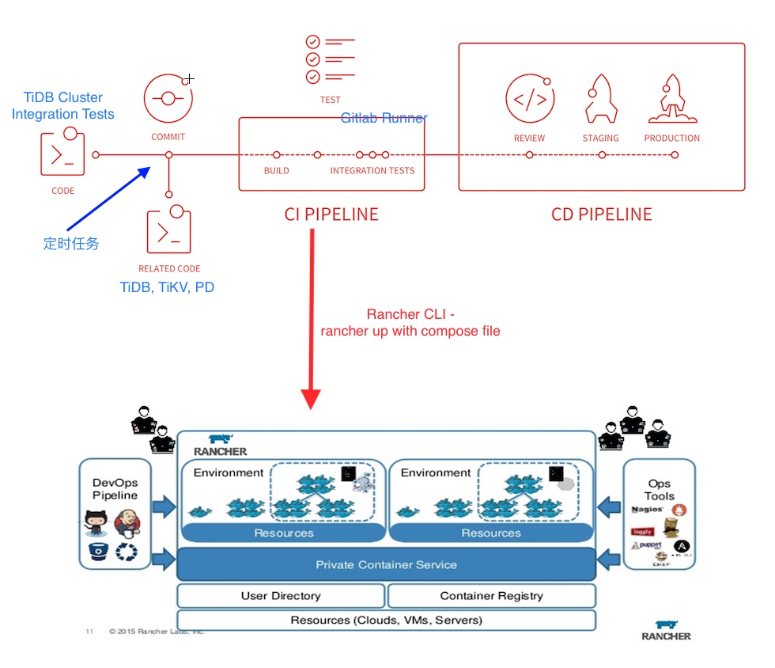
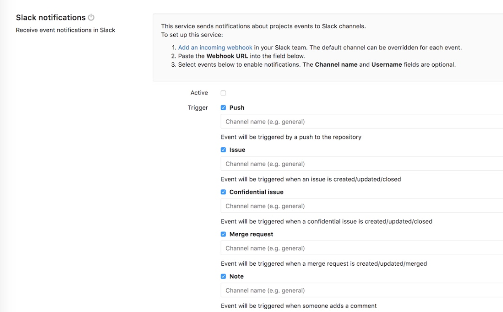
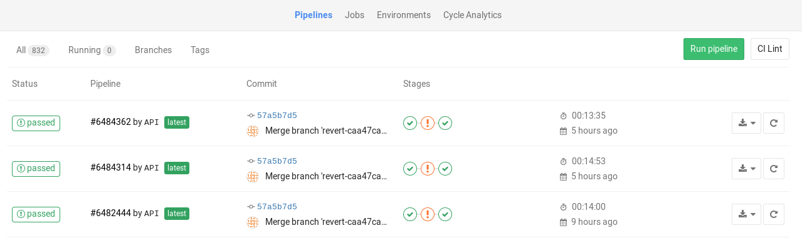
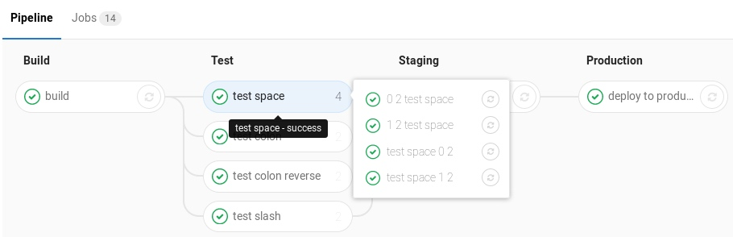

### 背景 & 系统目标：

在分布式系统的开发中，分布式系统的测试一直是个头疼的事。我们想构建一个稳定性测试的自动化平台，包含前后端。开发会不断地提交集成测试的用例，一个具体用例背后包括很多部分，比如说：

- 集群拓扑（N tidb + M tikv + O pd)
- tidb 的代码版本
- 测试的代码或脚本，执行 cmd
- 跑多长时间
- 异常定义

若干个集成测试用例按照一定周期将自动化地启动很多 tidb 集群分别来跑 case，如果 run pass 会自动触发 release 流程，并输出一个 web report。如果跑异常要能通知 slack 给开发，并且保留现场。

同时有一些 case 会要求对 tidb 集群注入一些干扰，比如随机杀进程，调整系统时间，网络延迟、隔离，IO 干扰 等等


### 方案：
本方案基于 Gitlab CI（+Runner）作为 CI/CD 的框架，它是代码提交，触发构建 Pipeline，执行 test case job和根据测试结果来打包部署或者发送失败Slack Notification给特定channel；同时使用 Rancher （Cattle/k8s）是分布式系统容器编排的框架，它作为并发执行的多个测试用例中所使用的tidb集群的运行环境。简单图片如下：
本系统包括：Gitlab CI Server/+ Gitlab Runner (shell)，Rancher Cluster(management node, agent nodes)。

PS：其中 Gitlab CI 可以替换我 Drone.io, circleCI，jenkins 等方案。Rancher Compose 可以替换为 k8s kubectl 具体实施调度和编排




重点流程如下：

- 1 Related Project 有代码提交时候，调用 API 告知集成测试代码仓库(integrated-test-repo)执行CI/CD 具体参见[Triggering pipelines through the API](https://docs.gitlab.com/ee/ci/triggers/README.html#ci-job-token)
- 2 同样，定时脚本根据时间也调用 trigger pipeline API，告知
- 3 Gitlab CI 根据集成测试代码仓库的 .gitlab-ci.yml 文件中描述的执行多个 test job (link: )，用于group和并行执行多个[](https://docs.gitlab.com/ee/ci/pipelines.html#grouping-similar-jobs-in-the-pipeline-graph)，具体测试任务细节见下面分析。
- 4 如果 ci pipeline中有job成功会执行进一步的stage（CD pipeline），具体执行的report可以参见，gitlab ci 本身status page。或者通过 test 工具生成html等web report，挂载为 reporter 容器volume 下用于查阅 ，如果失败相关的信息，在test工具中结合 gitlab ci 的slack整合[Slack Notifications Service](https://gitlab.com/gitlab-org/gitlab-ce/blob/master/doc/user/project/integrations/slack.md)

细节如下：

通过 API 触发 Pipeline 如下： `POST /projects/:id/trigger/pipeline` The required parameters are the trigger's token and the Git ref on which the trigger will be performed. Valid refs are the branch and the tag. The :id of a project can be found by querying the API or by visiting the Pipelines settings page which provides self-explanatory examples.




同时我们的测试用例的代码仓库如下：


```sh
- compose/
	- docker-compose.yml
	- rancher-compose.yml
- tests/
	- functions/
	- perf/
	- resistance/
		- case-node-shutdown // 示例代码如下
- helpers/
	- test-utilities
	- chaos/
	- orchestration[rancher, swarm, k8s]
.gitlab-ci.yml
```


具体 test job：
在该 Job 中有 setup/teardown 调用 Rancher CLI up命令「通过生成的token 和 API」，根据代码仓库中提供的 compose yml文件（描述了服务部署分发情况）来拉起测试环境所需 的TiDB 集群，和 rancher rm/scale 等命令在测试用例中动态调整TiDB集群服务中具体节点的容器实例数量等。
在具体测试回归中脚本验证后，有问题通过assert来断言，同时把之前 rancher up 启动的stack具体容器和端口信息打印到标准输入输出。

```js

describe("resilient - node shutdown", ()=>{
	before(()=>{
		// shell to invoke helper/rancher up
		// set stakc-name <normalized-test-case-name+timestamp>
	});

	it('should work as expect', ()=>{
		// chaos monkey to kill process/container, network emulate
	});

	after(()=>{
		// shell to clean up rancher stacks ♻️
	});
});
```

其中helpers如下:

- test-utitles，封装测试脚本语言的test库，Todo：整个集群的性能？「脚本采集机器指标，来判断延迟发布任务等」rancher集群的stats？

- rancher 系类，封装 rancher cli 提供的完善命令，提供tidb集群部署，关停清理和保留问题现场（Stack，Container级别）。

		rancher-log -> capture stack aggregationed logs
		rancher-up -> 根据compose描述启动service stack「tidb 集群」，并且设置name<normalized-test-case-name+timestamp>
		rancher-scale/rm - 删减节点等操作container
		rancher-inspect 查看具体服务，容器，主机的环境，端口等信息
		其他包括：active/deactive等。

- chaoes 脚本来模拟网络隔离，网络中断等操作，来辅助实施 resilient 验证，参考如下 [pumba - chaos testing and network emulation tool for Docker](http://blog.terranillius.com/post/pumba_docker_chaos_testing/)，原理大概是通过通过 daemon socket to connect，同时使用 docker api 来操作网络和容器相关的. 同时需要关注 k8s 或者 rancher cattle 等network plugin等（overlay网络等）








Trigger：
1 当TiDB，TiKV 等源代码代码仓库有提交，并且在本身multi-stage ci 完成基本的单元测试后，提供 webhook 告知tidb集群测试仓库（告知repo_name, author, commit_id ）开始运行集成测试 「project pipeline: Cross-project CI dependencies triggered via API, particularly for micro-services, but also for complicated build dependencies: e.g. api -> front-end, ce/ee -> omnibus.」
2 测试仓库本身有代码提交，开始运行CI
3 周期型的集成测试，如果每天运行

CI Runner：
该部分由代码仓库中的多个test case描述，每个test case可以并发执行。test case 一般before, after 包括根据compose文件拉起该次集成测试的环境（集群），在成功或失败时候分别消除该stack或保留该stack 做为现场，通过slack告知特定开发者（多container active，可以被attach shell，让开发者进入现场调试等）。


关于并发 job 任务的控制：
1 控制 runner 的数量(设置gitlab runner的concurrent为false，同时启动按照预期数量的同一 tag的runner注册到Gitlab CI 上)
2 job 本身不控制，控制job具体的执行（通过test utilities 来检查 rancher 的stats来pending queue）


后续和优化：

Todo: 当集成测试失败后，如何反向通知会 tidb, tikv 等related project的commit提交失败？
当周边项目有commit，触发CI后，具体job内容为curl api让测试仓库执行集成测试，如果有问题此时异步通知callback告知测试运行的状态？


Reference：
GitLab Runner is the open source project that is used to run your jobs and send the results back to GitLab. It is used in conjunction with GitLab CI, the open-source continuous integration service included with GitLab that coordinates the jobs. Todo monitor 监控runner

Exectuor：shell
Jobs：https://docs.gitlab.com/ee/ci/pipelines.html
register runner to gitlab ci（tags） https://docs.gitlab.com/runner/register/index.html

Gitlab CI：
特点
Parallel builds: GitLab CI splits builds over multiple machines, for fast execution.
Pipeline: you can define multiple jobs per stage and you can trigger other builds.
