两天的会议中，先后听了十几篇分享，参加的议题主要集中在“高可用架构”，“云服务架构探索”，“架构演进从0到100”等专场，也参加了诸如“证券极速交易系统关键技术分析以及架构实践”，“QQ Hybrid的演进”，“Twitter从支撑千万到万亿级索引的搜索引擎架构演化” 等其他专场的感兴趣话题。同时，最后一晚参加了“架构师之路夜谈”，收获颇丰。这次和以往不同的事，除了务实的业务细节和技术干货外，也包含了设计妥协和一步步演进推进的过程（算是实施的艺术）这的确是架构师的日常关键工作，而不仅仅是技术点的最优。

PS：由于冲突，没有听到58沈剑的分享（之前已经关注他的公众号，系统易读的文章分享 - 微信号名称：架构师之路）
PPS：PPT 地址

PPT合集已出炉！现提供百度网盘和Github两种方式：

- 1. 百度网盘链接: https://pan.baidu.com/s/1hsukUDQ 密码: diw2
- 2. ArchSummit GitHub已创建，链接为：https://github.com/Geekbang/ArchSummit/tree/master/bj2016，PPT仍在陆续上传中，敬请等待并star哟

下面是我这两天参加的topic的具体schedule了。

2016年12月02日
1-《Lessons in Internet scale stream processing @Linkedln》-Kartik Paramasivam
2-《Architecting for the Cloud in Creating One Engineering System at Microsoft》-Sam Guckenheimer
3-《天猫双11容量规划演进》-蒋江伟
4-《京东数据中心网络的高可用架构》-王大泳
5-《大规模下的存储解决方案和迁移实例分析》
6-《滴滴的高可用建设之路》-许令波
7-《证券极速交易系统关键技术分析以及架构实践》-刘鑫

2016年12月03日
1-《构建高效的私有云平台：今日头条私有云架构设计》-夏绪宏
2-《利用 Apache Helix 构建高可用和易伸缩的大规模分布式数据云系统》
3-《QQ Hybrid的演进》-涂强
5-《云数据库架构演进和实践》-余锋
6-《Go微服务架构的基石
7-《外卖的背后：饿了么基础构架从0到1的演进》-兰建刚

2016年12月03日 - 夜谈
《系统架构师的修炼》白山合伙人兼工程副总裁 丛磊
《从草根到优秀架构师的奋斗》同程旅游首席架构师 EGO会员 王晓波
《代码之外，架构师在做什么》环信首席架构师&IM事业部技术总监 梁宇鹏（一乐）
《圆桌活动问答》 崔宝秋

## 1 Lessons in Internet scale stream processing @Linkedln
### agenda

架构模式，允许我们使用Apache Kafka，Apache Samza，Brooklin，Databus和其他一些数据系统进行大规模流处理。

- intro
- typical architecture for data processing
- data ingestion
- stream processing
- future

### data ingestion

数据采集，其中分析了现有采集中间件的优劣（Kafka，EventHub，Kinesis， Pub-Sub 等），给出了 cost based comparison（对于1TB a day、100 Billion messages/day 和 5000 partitions 截点使用云服务提供的还是自己搭建），最后给出了自家的数据采集和消费量（1.2 Trillion Messages, 350TB, 峰值 16 million messages/second，data consumed/day: 1.3PB）

lessons from running kafka @ scale
- machines/disk will die almost day (need auto-healing - Kafka Cruise Control)
- take good care of zookeeper （5 node zookeepers clusters on SSD）
- monitoring will always reveal problems (Burrow Kafka Monitor)
- dealing with multi-tenancy (quotas/rate limiting is critical to SAL

#### steam processing

流式计算领域：

流式计算要解决的问题：

- performance!! (I/O 处理，如读数据，临时内存，写结果)
- stability
- support for a variety of input sources
- generating accurate results
- reprocessing

对于性能，引入 embedded database（RocksDB，来 reading adjunct data 「使用 Brooklin 从 db load/sync 到 RocksDB」，lazily flushed for durability 中间临时数据到 Kafka compacted topic

SAMZA 支持 Async I/O, incremental checkpoints

stability，backpressure
support for variety of souces，通过 Brokolnn 引入

reprocessing，为什么重新消费（因为业务逻辑更改和软件bug
case study: title standardizer 
更新你的title，到 member databases(espresso) - profile updates(brooklin) - > Samaza(title-standardizer) -< machine learning model - kafka
offline processing

Batch processing in SAMZA

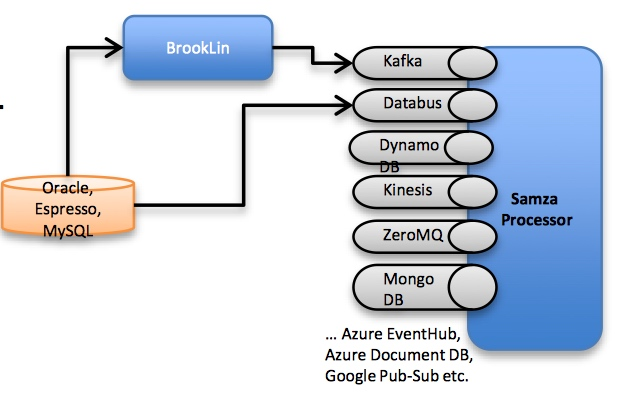

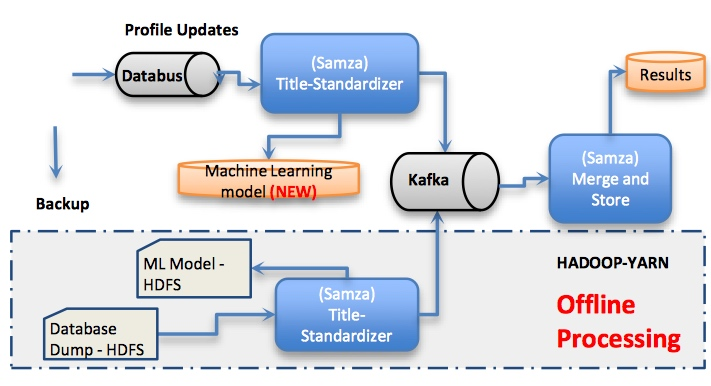

## 2 Architecting for the Cloud in Creating One Engineering System at Microsoft

讲微软全球研发团队在构建统一工程体系过程中云端架构设计转型的一些实践。
如全面支持DevOps的开发方法，以更好的支持Azure与其他云平台产品的开发节奏，基本上是老树新花

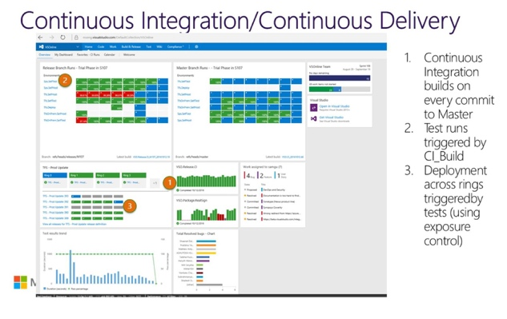

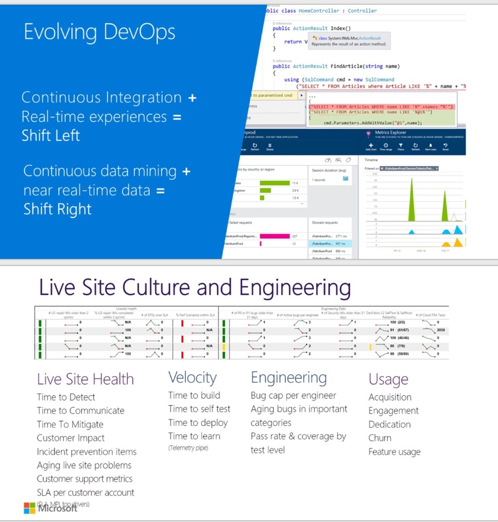

## 3 天猫双11容量规划演进

容量规划，当业务发展飞快，新促销活动不断上线，对你的服务容量提出了挑战。什么系统，什么时候，需要多少服务器：系统预估容量 / 系统单机能力 = 服务器数量

传统思路：以点到面覆盖所有系统（系统的木桶原理-短板，分层评估-如应用层，服务层，存储层。每层都有各自的特点）

搭建压测平台（使用线上流量压测线上应用，通过压测模型去模拟复制流量，同时要监控和采集）
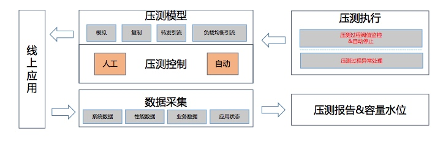

PS：之前阿里有自己的压测团队，然后这套平台开发完后他们就被解散了

场景化的容量评估（不同的场景活动会触发不同的业务流程，它们背后对应的服务也是不一样的，所以需要场景化评估才准确，全链路压测工具来更加精确的进行容量评估（通过工具不断弥补

PS：阿里在整个技术架构上保持了一定的统一性，使得容量规划（不只是容量规划等技术）可以被很快进行平台化，各个业务都可以使用（受益于Java 体系的

通过资源隔离拉平各个系统所需的最小资源。
 
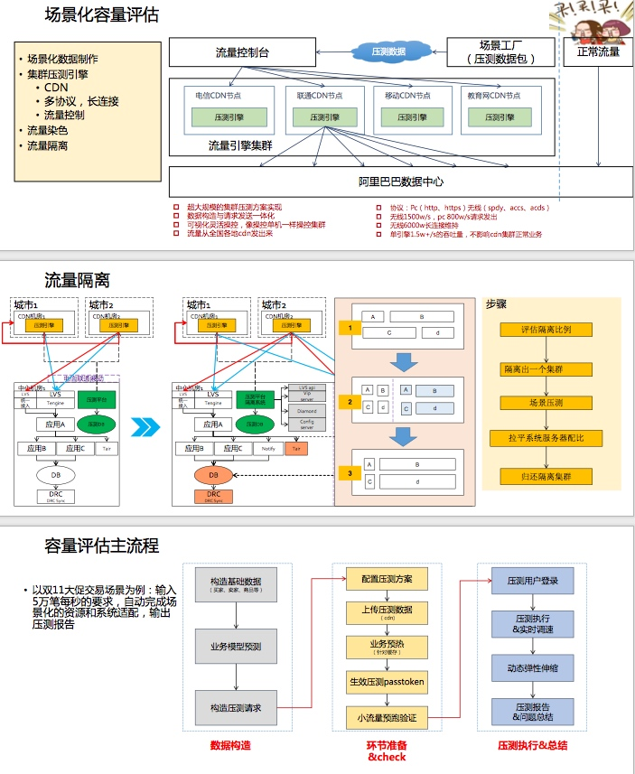

## 4 京东数据中心网络的高可用架构

- 京东网络概括

- 网络架构设计
- 高可用的网络

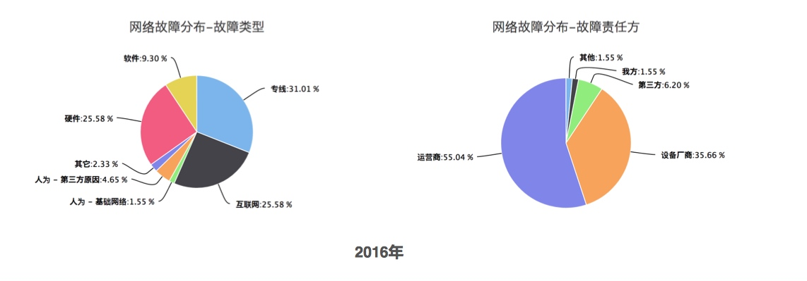

回答一个问题“现在你们的网络有没有问题”

## 5 大规模下的存储解决方案和迁移实例分析

	•	需求和策略
		◦	application arcitect (每个产品组有infra的小组去做优化，桥接基础优化组)
		◦	cost, data recovery, agile to change 
	•	storage system
		◦	tao(mysql+memcache) - the power of the graph (tao, mysql 的分布式和一致性的- region, cluster, 加上memcache 去加速) - 问题（贵，短时间对object建connection-锁住shard使得其他人没法用）
		◦	memory based system(不同大陆region的问题)
		◦	RocksDB(对SSD做了很多优化，k-v的，单机版的)
		◦	HIVE（类似BigTable Google, data warehouse, 数据压缩比高columns不像其他基于行压缩如特定列性别male这种就压缩很高，没real time read/write，bridge for backup->存分析的每天db的snapshot）
		◦	Scribe（aggregate logging system, high fan in/throughput, put data on aggregated hdfs）, 写本地的daemon，）
	•	designs
		◦	Laser(based RocksDB+Hive) - optimized for read (write daily new data in Hive with Scribe, hive pipeline 导出新数据到RocksDB with repl)
		◦	ZippyDB
		◦	结合两者设计（分离不同的组件，通过不同场景下的需求区分来需求）
	•	compare+lessons

## 6 滴滴的高可用建设实践
一．关于我

二．难点与挑战
滴滴的乘客、司机模型是一个动态匹配的过程。订单的流转也比较复杂。业务模型复杂导致了稳定性建设的难度。

业务开发的快速迭代，导致滴滴的技术栈一直没有统一掉，所以导致系统开发语言非常多样

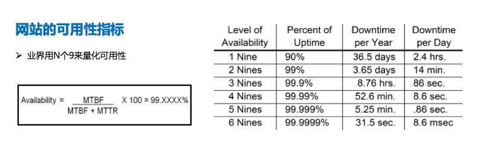

高速公路上换轮子（技术栈不统一，基础设施建设如机房网络网关DNS等。业务耦合不敢删代码越加越多

三． 高可用体系化建设思路
• 压测体系、管控体系、监控体系、恢复体系和度量体系建设

规范建设：
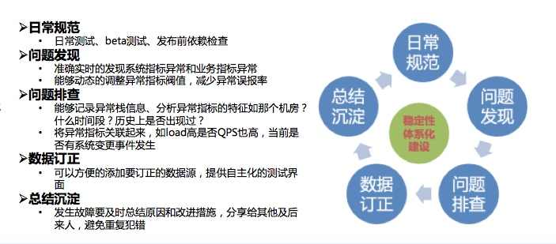

工具建设：

组织建设：
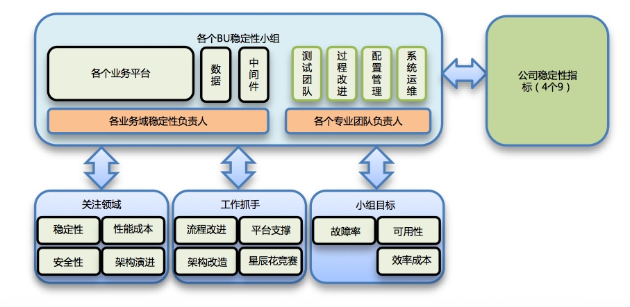

四．全链路压测、服务治理等在滴滴场景下技术方案设计实践介绍

又黑了下Php（之前的老系统，现在慢慢迁移到Go，长连接需要inrouter去实现，RPC框架DiSF）

### 全平台压测：
思路（通过trace传递标识识别流量，中间件等通过标记将流量导入到影子表中隔离测试数据。通过发压工具，状态流转等

- 隔离：通过路由测试请求到影子表，物理隔离存储。缓存key替换避免冲突collapse，conflict等
- 真实：用线上高峰时期的数据量，保留特征和属性
- 完整：替换规则要统一，便于前后关联并且分析

### 服务治理

管控体系：开关平台

监控体系：数据链路监控： trace，metrics

五．踩过的坑以及经验教训和总结

一些教训：

- 勇于尝试，充分测试，熟悉线上环境，从事故中学习
- 应用等级划分，故障等级划分，故障review/action，故障责任追究等

## 7 证券极速交易系统

  1.介绍量化交易特点、策略、交易需求以及市场状态；
 
  #### 特点
 
  量化交易是指借助现代统计学和数学的方法，利用计算机技术来进行 交易的证券投资方式。从庞大的历史数据中海选能带来超额收益的多种“大概率” 事件以制定策略，用数量模型验证及固化这些规律和策略，然后严格 执行已固化的策略来指导投资。
 
  （概率 - 把小概率频繁交易放大概念（目前最赚钱的），定量套利，策略固化-避免情绪化除非是bugs，交易期间不要改动但是后面可以review自己策略
 
  #### 方式
 
  - 择股：以股票基本面因子为主，选取投资股票池，替代公墓基金
 
  - 择时：选取合适的时间买入或卖出，以市场状态因子、技术分析因子为主，市场博弈行为，具备冲击性极高收益的能力
 
  - 市场中性：对冲，现货股指市场，未来期权将是市场中性的利器（

  - 套利交易：在市场的非理性波 动中寻找存在的价差，并利用价差获取收益、甚至是无风 险收益。比拼技术系统能力，而数学模型固定（ETF套利、期权套利、期现 套利、分级基金套利、可转债套利 - 分级B溢价机会等
 
  PS：国内绝大部分的量化交易都是赚钱的，因为韭菜太多了。。。海外不是，因为各个机构间的博弈
 

量化交易市场基础环境日益改善

- 深交所V5Binary流式交易、行情接口，上交所FAST行情接口
- 适宜于量化交易、对冲交易的交易产品越来越多
- 国内空间巨大（个位数占比，相比于现货及衍生品市场交易以量化交易为主（交易占比超过70%）

   
  2.介绍证券市场整体交易架构和拓扑，以及市场各个参与者的交易系统 ；
  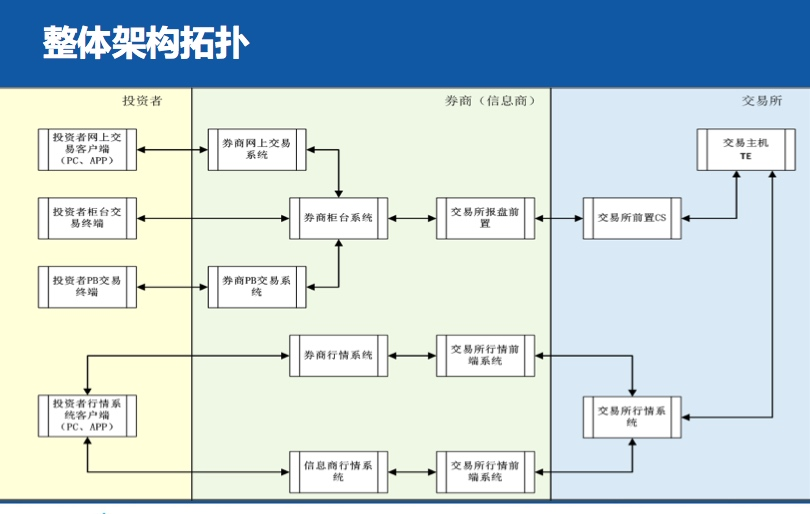

投资者交易系统
- 机构 （网上交易客户端，PB 交易-API和客户端，柜台直接交易
- 个人 （网上交易客户端，App

券商交易系统

- 网上交易系统
- PB交易系统（primary broker）

券商柜台

- 集中柜台（对接交易所，中登，存管银行，投保等。提交接口给网上交易系统等 - 恒生或金证的，最核心的系统。对券商来说不太好更换这块
- 极速柜台 

交易所交易系统

- 交易报盘前置系统（前置部署在券商的，内部，对接交易通信前置系统（CS）。外部，上交所，SQL Server数据库；深交所，V5协议接口 Binary 流式（是上交所40-50倍性能提升）
- 交易通信前置系统 （应用网关路由。交易单元（PBU、席位号）、流速权、联通圈）- 通过流控防止被交易压库

交易主机系统

分Set交易，多个交易主机，分别对应不同Set的交易，股票代码区分
Cluster模式，同一个Set双主机构成集群
同城主备实时同步交易模式

  3.量化交易对证券公司交易系统技术需求的理解和分析；
 
  

  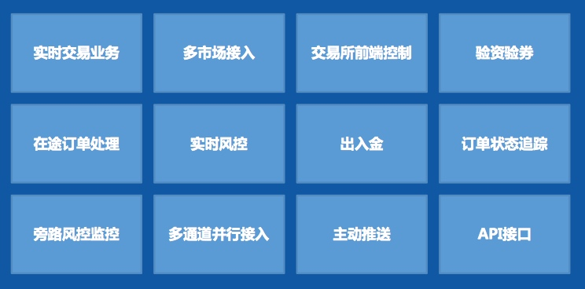

  4.极速交易系统关键技术和架构设计；
  

系统指标

1
随着今日头条业务的高速发展，对基础设施的要求越来越高，已有的研发模式和效率越来越不能满足业务快速发展的需要，TCE私有云PaaS平台应运而生。平台基于Kubernetes构建，结合今日头条的研发模式，融合微服务的理念，构建一套高效的研发、运维计算平台。本演讲分享今日头条在私有云PaaS的架构设计，技术选型等方面的的思路和经验。
演讲提纲：
  1.公有云vs私有云，符合自己需要的云；
  2.头条私有云的构架设计；
  3.遇到的问题及未来的规划；
听众收益：
  1.私有云平台的设计和实现思路；
  2.私有云构建相关技术进展分析。

2
Apache Helix是一个通用的分布式集群资源管理和调度框架，它能被用作构建各种高可用和易伸缩的分布式数据存储和服务系统。 夏磊博士将与大家分享Helix的设计和工作原理，并实例分析Helix如何帮助构建LinkedIn的各类大数据系统， 如LinkedIn的分布式NoSQL数据库Espresso，以及LinkedIn开发的高性能的数据抓取系统Databus等。
演讲提纲：
  1. Helix的设计思想和工作原理；
  2. 快速构建高可用的分布式大数据存储和支持系统；
  3. 构建用户友好和易伸缩的大数据服务云。
听众受益：
  1.分布式大数据系统设计；
  2.弹性大数据云构建案例分析。

## 3 QQHybrid的演进

### 静态直出+离线预推
优化1： 点击将要进入网页前，launch WebView同时，发起页面请求 - 而不是等到WebView发起（客户端改造）
优化2：offlineCache 客户端的，页面暂存（通过OfflineServer）
优化3：可能数据版本多（导致页面打开后闪动被更新），引入diff推送

### 动态页面（个性化页面）

引入类似于 YouTube spfjs(fast navigation and page updates)，来提示页面刷新体验（页面内容分框体，小块小块更新数据块
同时结合一些自定义的头 Cache-Offline，template-tag, template-change 等

PS：是否可以复用QQ原有的消息推送聊天的 socket package，结论是不可以

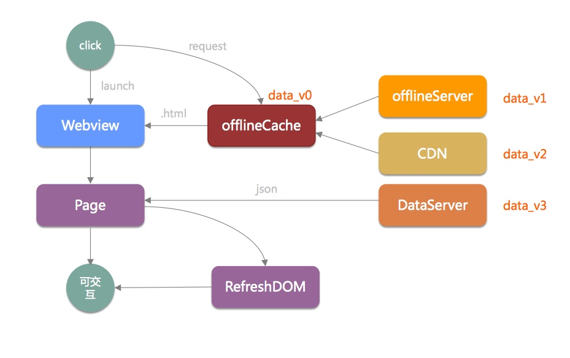

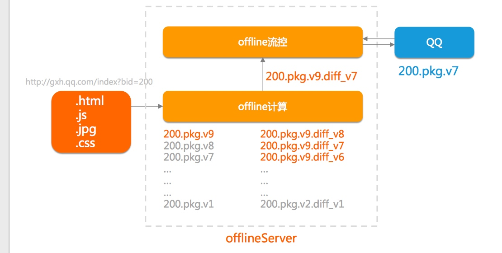

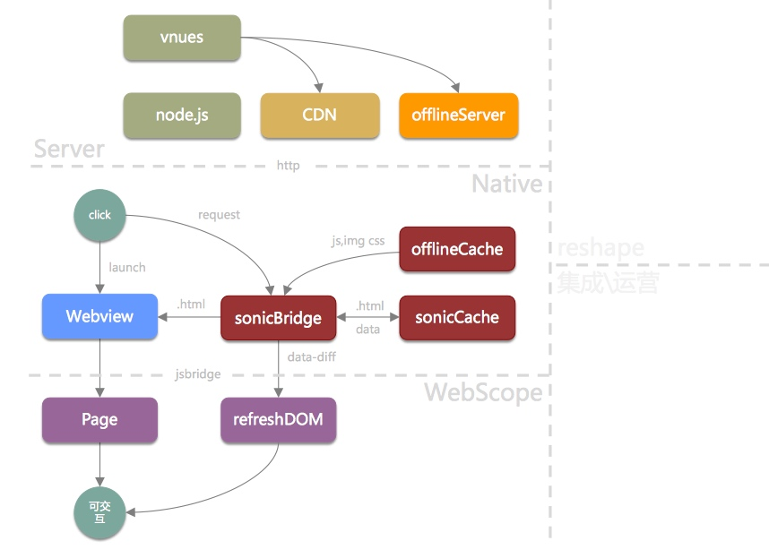

### 图片格式

他们自研了新的 SharpP格式 （对比jpg，webP，在大小上有优势，但是解码速度妥协），有一些应用成本（client要把自己的能力-是否能解码sharpP待在header上，然后走cdn逻辑根据不同的header返回不同格式的image

同理，响应式图片（针对不同手机屏幕大小的图片裁剪返回，reshape

User-Agent: Android QQ NetType/WIFI Pixel/750
Accept: image/sharpP, image/webp, image/*, */*; q=0.8

PS：分享了他们的坑，因为中间运营商会针对GET URL缓存资源（图片url一致），所以需要通过 Vary header 告诉 中间层的服务器区别对待的头： Vary: Accept，User-Agent

### 研发体系

- quick test automation
- web performance test
- 测速监控
- 页面综合评分

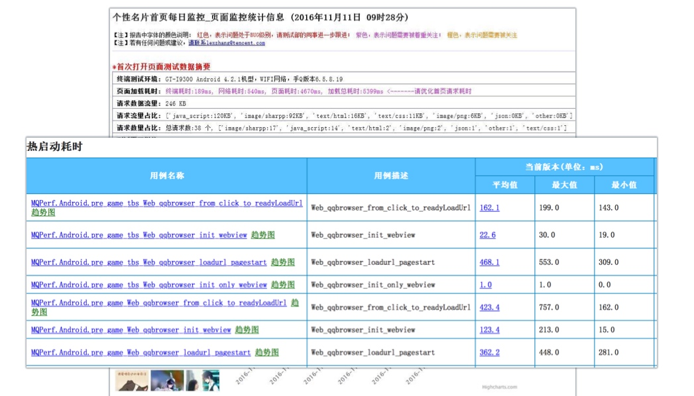

## 4 The Road to a Complete Tweet Index
Twitter的搜索引擎起初只能检索最近7天的推文，只能满足基本的实时搜索需求。现在的完整推文集索引 (Complete Tweet Index) 可以检索有史以来10多年的所有推文。从架构上的演进完成从千万推文规模到万亿条推文的规模。同时介绍了围绕搜索的应用：如 Ranked Timeliness 等

1. Current Scale of Twitter Search
”Our Complete Tweet Index is served by thousands of instances, each with 256GB RAM and 2TB SSD“ 超大规模的机器集群和存储实例 - 10名工程师(包括1名SRE）

2. The History of Twitter Search Infra

- 2010 Search Powered by replicated MySQL instances and MySQL text matching (没有分词，geo地理搜索支持差，容易down机，no search assistance
- 2011 Lucene-based search engine: Earlybirds (对标ElasticSearch，很多特性的提前引入 - 内存操作优化的数据结构，lock free memory models)，此时 utilize MySQL 向 Earlybird 导入数据（tweet json -> ingestion[包括预处理，分析和tokenization等]-> MySQL replication -> hash partitioning[Tweet ID % number of partitions]）
- 2013-2015，使用 Distributed Log 取代 MySQL 作为 data bus （Twitter’s Partitioned, Replicated, High-performance Messaging System）

论文：http://www.umiacs.umd.edu/~jimmylin/publications/Busch_etal_ICDE2012.pdf

3. Complete Tweet Index

一些精彩时刻（如奥巴马再次总统，奥斯卡经典等推文）居然搜索不到（因为7天的realtime search）
一些挑战（scaling - 推文会越来越多！架构要调整-之前realtime是把7天内的所有推文放到RAM中去搜索）
设计目标：

- 模块化（realtime 和 complete index 尽量共享代码 - cleaner system
- 可伸缩（应对越来越多的推文
- high parallel ingestion（快速摄取消费从而建索引时间可控）
- simple interface（虽然背后是cluster但是为API消费方提供简单的single point）

主要组件：

- Batch ingestion: 基于Hadoop的Tweet预处理pipeline (raw tweets是聚合了tweet text, user data, engagement counts, geo data 等信号的 - UDF，很容易DDos downstream services via RPC)
- Inverted index builder: stateless，builder on Mesos (coordinated via ZooKeeper - process tracking, PS: avoid overloading HDFS namenodes and data links 他们组的把HDSF的名称节点冲垮过)
- Index shards: 二维切片（基于用户分区和时间分层） search index servers （data was further divided into chunks called segments which grouped together based -> feed 到 Earlybird machine 中）
- Roots: hierarchical scatter 聚合服务 on Mesos
	- 每层Root收集它下面的shards，然后 hierarchical scatter-gather
	- SuperRoot 汇总（Complete index + realtime root），stitching results together 把结果装订在一起，然后支持分页

背后的一些难点：

- query cost 和 tail latency 昂贵
	- 每次搜索要查询150+的切分服务，延迟问题木桶效应。
	- smart request routing「对于如搜索特定时间和用户的，可以单发给特定shards」
	- 灵活的shard timeout configured, backup request 到 replica 等）
	- 优化JVM GC（控制在一天一次full GC not serving traffic）
	- deadline estimation and early termination（如果评估在timeout时间内返回不了就结束结算返回partial results and cursor（用于恢复）
- 流量尖峰
	- 200% capacity provisioning，regular automated redline tests, client rate throttling, graceful degradation(rate vs feature - 如关闭个性化，这样大量hit cache)
- 海量数据和超多实例
	- 避免对下游服务的DDos（如ZK的写入 overwhelming，HDFS相关的
	- 每周都有机器挂掉，需要automated failure detect and alert, automated state transition and hot swaps
- SSD 性能实战

https://blog.twitter.com/2016/superroot-launching-a-high-sla-production-service-at-twitter

4. Search Engine Applications

基于搜索的玩法（ranked timelines -> 用户不会看光所有timeline找出用户关心的那些-> 基于搜索用户following的并且sort -> search it）

其他还有（antispam, ads and sales[企业广告主关注被推文中提到多少次基于时间轴上]，Gnip（买数据给企业-基于关键词搜索））

5. Outlook

未来更好的支持 scoring 打分和ranking 排序（基于 search engine）
	- 更多信号量导入结合计算
	- machine learning 算法高效支持
	- 允许使用方添加信号和传入打分函数

OmniSearch

5
阿里云数据库从最初的只支持MySQL，到现在支持关系数据库、NoSQL、HTAP、EMR产品体系，在管控系统和数据链路上做了好几次重大架构迭代，云产品很长的生命周期里面会遇到新老架构共存，如何做到架构连续和系统无缝迁移是个很大的挑战, 本次报告为你分享实践。

## 6 Go:微服务架构的基⽯石

本人挺喜欢这个分享的，孟军在Go社区第一人哈，演讲也是很有激情（《Go Web编程》作者，开源框架 beego 作者）

### 第一部分 微服务架构的核⼼ (小，独，轻，松）
### 第二部分 基于Go的微服务架构核心系统

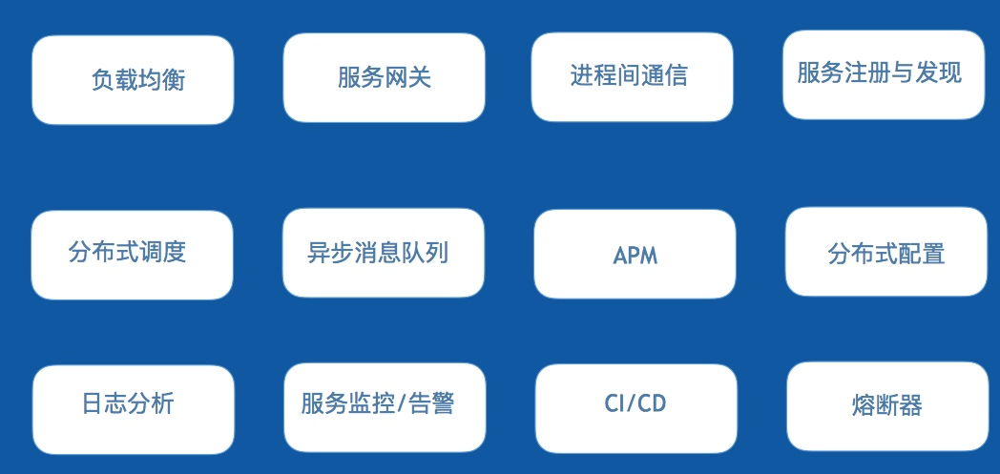

然后给出了各个部分下，Golang的一些实现：

负载均衡： seesaw, caddy
服务网关：tyk，fabio，vulcand
进程间通信：RESTful（beego，gin，go-kit，goa，micro，lris），RPC（grpc，thrift，hprose）
服务注册发现：etcd，consul，serf
分布式调度：k8s, swarm
异步消息队列：NSQ，Nats
APM：appdash，Cloudinsight，opentracing
分布式配置管理：etcd, consul, mgmt
日志分析：Beats，Heka
服务监控/告警：open-falcon, prometheus
CI/CD：Drone
熔断器：gateway，Hystrix-go

### 第三部分 Go语⾔言概述

Go是Google开发，09年发布，12年正式版本的作为系统性语言

背后的人：

Russ Cox，Ian Lance Taylor，Brad Fitzpatrick

### 第四部分 为什什么选择Go

“Go is not meant to innovate programming theory. It’s meant to innovate programming practice.”

1 出身名门，血统纯正
2 开发效率，运行效率
3 学习曲线（类C语法，内置GC，编译快速，调试方便
4 天生并发（多核支持，轻量并发，简易同步
5 Unix精髓（组合无对象，无侵入接口
6 标准库（网络编程必备库，系统编程必备库
7 部署方便（交叉编译，无依赖部署
8 稳定（编译检查，编码规范，工程工具

### 第五部分 Go适合开发怎样的系统

中间件系统
服务器编程
分布式系统
网络编程
云平台应用
数据库系统
运维系统
云存储系统
容器类系统

7

随着互联网网民数的爆发式增加以及人们对随时随地接入互联网诉求的加强，互联网产品需要面对的并发请求量越来越大，云计算的诞生和普及为海量并发请求的应用提供了弹性的硬件支撑。本案例分享基于微服务的应用架构设计，内容涉及如何构建一个微服务应用，服务注册与发现，微服务测试和典型的微服务架构设计模式，以及微服务架构在七牛的实践案例。
演讲提纲：
  1. 构建一个微服务应用；
  2. 服务注册与发现；
  3. 微服务测试；
  4. 典型微服务架构设计模式；
  5. 七牛微服务架构实践。
听众受益：
  1. 学习如何构建、测试和部署一个高可用应用；
  2. 了解常见微服务架构设计模式。
