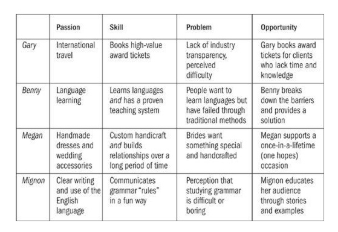

the $100 startup
reinvent the way you make a living, do what you love, and create a new future
重新定义你的生活工作，做你喜欢的，创造未来~
Ps： [豆瓣链接](http://book.douban.com/subject/7015950/)
<!-- more -->

## contents
prologue - manifesto a short guide to everything you want 你所需知道的一切在宣言中

part 1: unexpected entrepreneurs 『另类』企业家

- 1 renaissance 复兴
you already have the skills you need，you just have to know where to look 必须知道哪里去看信息？！
- 2 give them the fish
how to put happiness in a box and shell it
- 3 follow your passion.. maybe
get paid to do what you love by making sure it connects to what other people want 创造用户需要的产品和服务
- 4 the rise of roaming entrepreneur
location, location, location is overrated 地点没那么重要
- 5 the new demographics
your customers all have something in common, but it has nothing to do with old-school categories 你的客户群不是老派的分类

part 2: taking it to the streets 开展项目

- 6 the one-page business plan 一页纸BP
- 7 an offer you can’t refuse 无法拒绝的offer
the step-by-step guide to creating a killer offer
- 8 launch! 发布上线
a trip to Hollywood from your living room or the corner coffee shop
- 9 hustling: the gentle art of self-promotion 自营销和宣传
advertising is like sex: only losers pay for it
- 10 show me the money 筹钱和资金
unconventional fundraising非传统筹钱 from kickstarter to unlikely car loans

part 3: leverage and next steps 再进一步！

- 11 moving on up
tweaking your way to the bank: how small actions create big increase in income
- 12 how to franchise yourself 如何特许经营（开展加盟店）
instructions on cloning yourself for fun and profit
- 13 going long 长久保持
become as big as you want to be (and no bigger)
- 14 but what if i fail? 假如失败
how to success even if your roof caves in on you

### manifesto a short guide to everything you want
becoming their own bosses, a microbusiness revolution - a way of earning a good living while crafting a life of independence and purpose
two key themes: freedom and value. freedom is what we’re all looking for, and value is the way to achieve it.

stumbling onto freedom:
the value doctrine
it’s a blueprint, not a vague series of ideas

## Part 1 unexpected entrepreneurs
### 第一章 you just have to know where to look
“the need for change bulldozed a road down the center of my mind"
the $100 startup model

lesson 1: convergence
intersection between something you especially like to do or ar good at doing and what other people are also interested in.

lesson 2: skill transformation
“i succeeded as a cartoonist with negligible art talent, some basic writing skills, an ordinary sense of humor and a bit of experience in the business world. the world has plenty of better artists, smarter writers, funnier humorists and more experienced business people."

lesson 3: the magic formula
passion or skill + usefulness = success

the road ahead: what we’ll learn
product or service: what you sell
people willing to pay for it: your customers
a way to get paid: how you’ll exchange a product or service for money

microbusiness aren’t new. they’ve been around since the beginning of commerce. what’s changed, however, is the ability to test, launch, and scale your project quickly and on the cheap
if you’re good at one thing, you’re probably good at other things too. many projects begin through a process of skill transformation in which you apply your knowledge to related topic
most important: merge your passion and skill with something that is useful to other people

### 第二章 how to put happiness in a box and sell it
“catch a man a fish, and you can sell it to him"
teach a man to fish, and you ruin a wonderful business opportunity

whether your big idea will resonate with customers. to find out what people and then find a way to give it to them

to consider it is to think about fish
(most customers don’t want to learn how to fish, how to cook)
你去吃西湖醋鱼，不是因为你不会做，你是想去relex, paying a big premium for atmosphere and service.
what they sell and whey their customers buy from them?
we’re offering freedom - let them be someone they may have never even considered before.

where do ides come from:

- an inefficiency in the marketplace
- new technology or opportunity
- a changing space
- a spin-off or side project

what is the value：

- a trade-off(less money at first, better health).
- freedom was Kelly’s primary motivation in making the switch, but the key to her success is the value she provides her clients
- you can pursue freedom for yourself while providing value for others

the more a business can focus on core benefits instead of boring features, the more customers will connect… and purchase

s1: dig deeper to uncover hidden needs
s2: make your customer a hero (印度Excel老师)
s3: sell what people buy(作者自己的travel ninja 案例)

six steps to getting started right now：

- 1 decide on your product or service
- 2 set up a website, even a very one
- 3 develop an offer(an offer is distinct from a product or service)
- 4 ensure you have a way to get paid
- 5 announce your offer to the world
- 6 learn from step2 through 5, then repeat

what people really want:
if you make your business about helping others, you’ll always have plenty of work

key points：

- give people what they really want, not just what think they should have. give them the fish! not how to fish, and cook
- the more you can market a core benefit instead of a list of features, the easier it will be to profit from your idea. core benefits usually relate to emotional needs more than physical needs.
- most people want more of some things(money, love, attention) and less of other things(stress, anxiety, debt). always focus on what you can add or take away to improve someone’s life.. then prepare to get paid

### 第三章 follow your passion.. maybe
get paid to do what you love by making sure it connects to what other people want

reality check checklist
instead of just during your free time, would you enjoy pursuing your hobby at least twenty hours a week?
do you enjoy teaching others to practice the same hobby?
do you like the ins and outs(al the details) of your hobby?
if you had to do a fair amount of administrative work related to your hobby, would you still enjoy it?

have other people asked for your help?
are enough other people willing to pay to gain or otherwise benefit from your expertise?
are there other businesses serving this market but not in the same you would

（passion + skill） -> (problem + marketplace) = opportunity

key points：

- good businesses provide solutions to problems: what do i do with all those extra frequent flyer miles, how can i easily learn a new language?
- many follow-your-passion businesses are built on something indirectly related, not the passion or hobby itself. when considering an opportunity, ask: “where is the business model”?
- not every passion or hobby is worth building into a business, and not everyone will want to have a business that is based on a passion or hobby
- you can establish a specialized consulting business in one day - the more specific, the better

### 第四章 the rise of roaming entreprenur
location, location, location is overrated
a desk is a dangerous place from which to view the world
作者的例子，中转香港，开视频会议，去越南远程办公。

case study1: the music teacher
case study2: the accidental worldwide photographer
case study3: the spreadsheet king

a brief primer for location independence
easier to operate a business while roaming the world than it is to start one. be sure to spend plenty of time getting set up before you hit the road
with U.S. or Canadian passport, you can stay for up to ninety days in many different countries around the world
learn about visas required visahq.com etc
keep your work in the cloud by using online services such as Google Docs and Dropbox
change your password frequently, and don’t use the name of your cat as the password
stay for free with helpful hosts through couchsurfing.org, low cast from AirBnB.com
latin America and Southeast Asia are two of the easiest and most hospitable regions to begin your nomadic adventures
to take advantage of sightseeing and experiencing the local culture. don’t feel bad about needing to devote more hours to work whenever needed. it’s ok, the work allows you to travel

become your own publisher:

the $120,000 e-book:
(哈哈，讲了 Evernote Essentials)

become your own publisher:
basic outline -
find a topic that people will pay to learn about. it helps if you are an expert in the topic, but if not, that’s what research is for
capture the information in one of three ways:

 - write it down
 - record audio or video
 - produce some combination of a and b

combine your materials into a product: a e-book or digital package that can be downloaded by buyers
create an offer - what exactly are you selling, and why should people take action on it?
decide a fair, value-based price for your offer.
find a way to get paid.
publish the offer and get the word out.(hustle喧嚣)
cash in and head to the beach!

key points：

- roaming entrepreneurs are everywhere these days. many of them are quietly building significant businesses while living in paradise
- just as not every passion leads to a good business model, a lot of people pursue the nomadic lifestyle for the wrong reasons. the best question to answer is: what do you want to do?
- there are many roads to location independence, but the business of information publishing is especially profitable(more than one path to information publishing, it isn’t just about e-books)

there was no English-language manual, more than a dozen books or guides on Evernote already existed in Japan. this suggested the strong marketability of the project and revealed a gap in the English-language marketplace that Brett was able to fill

### 第五章 the new demographics
your customers all have something in common, but it has nothing to do with old-school categories
Business opportunities are like buses; there’s always another coming.

key points:

- who are your people? you don’t necessarily have to think of them in categories such as age, race, and gender. instead, you can think of them in terms of shared beliefs and values
- you can often follow a fad, craze, or trend by establishing yourself as an authority and simplify something about the process for other hoping to benefit from it.
- use surveys to understand customers and prospects. the more specific, the better. ask: what’s the number one thing i can do for you?
- use the decision-making matrix to evaluate multiple ideas against one another. you don’t have to choose only one idea, but the exercise can help you decide what to pursue next.

## Part 2：Taking it to the streets
### 第六章 the one-page business plan
plans are only good intentions unless they immediately degenerate into hard work.

the action bias: 立即行动
select a marketable idea
keep costs low
get the first sale as soon as possible
market before manufacturing
respond to initial results

seven steps to instant market testing:

- 1 you need to care about the problem you are going to solve, and there has to be a sizable number of other people who also care.
- 2 make sure the market is big enough. test the size by checking the number and relevancy of Google keywords(keyword you would use if you were trying to find your product.)
- 3 focus on eliminating blatant admitted pain(to solve a problem that causes pain that the market knows it has.)
- 4 almost everything that is being sold is for either a deep pain or a deep desire.(remove/reduce pain, for respect and status, to be loved)
- 5 always think in terms of solution - your solution must be different or better(differentiation)
- 6 create a persona: the one person would benefit the most from your idea. take your idea to this person and discuss it with him or her in detail
- 7 create an outline for what you are doing and show it to a subgroup of your community. to test if for fee in return for feedback and confidentiality. they will act as evangelists. use a blog to build authority and expertise on a subject. leave comments on blogs where your target audience hangs out.

good to know if people want what you have to offer before you put a lot of work into making it. through surveys

freely receive, freely give:

plan as you go to respond to the changing needs of your customers but launch your business as soon as possible, with a bias toward action
Nick’s first print sale provided far more motivation than the $50 he received. as soon as possible, find a way to get your first sale
follow the Seven steps to Instant Market Testing(or the market before manufacturing method) to gauge the initial response.
use the one-page business plan to outline your business ideas quickly
to avoid overcomplicating things, explain your business with a 140-character mission statement

### 第七章 an offer you can’t refuse
the step-by-step guide to creating a killer offer

key points:

- as much as possible, connect your offer to the direct benefits customers will receive.
- what people want and what they say they want are not always the same thing; your job is to figure out the difference
- when developing an offer, think carefully about the objections and then respond to them in advance
- when developing an offer, think carefully about the objections and then respond to them in advance
- provide a nudge to customers by getting them to make a decision(difference between a good offer and a great one is urgency - why should people act now)
- offer reassurance and acknowledgement immediately after someone buys something or hires you. - small but meaningful way to go above and beyond their expectations

### 第八章 launch!
thirty-nine-step product launch checklist

the big picture:

- 1 ensure that you product or service has a clear value proposition 清晰的价值主张
- 2 decide on bonuses, incentives, or rewards for early buyers how will they be rewarded for taking action?
- 3 have you made the launch fun somehow? - will they non-buyers still enjoy hearing or reading about the launch
- 4 if your launch is online, have you recorded a video or audio message to complement the written copy?
- 5 have you built anticipation into the launch? are prospect excited
- 6 have you built urgency - a real reason for timeliness into the launch
- 7 publish the time and date of the launch in advance
- 8 proofread all sales materials multiple times.. get someone else to review them as well
- 9 check all web links in your shopping cart or payment processors, and them double-check them for a different computer with a differ browser.

next steps:

- 10 if this is an online product, is it properly set up in your shopping cart or with PayPal
- 11 test every step of the order process repeatedly(whenever you change any variable - price, order components, text etc)
- 12 have you registered all the domains associated with your product?
- 13 are all files uploaded and in the right place?
- 14 review the order page
- 15 read important communications(launch message, order page, sales page) out load
- 16 have you or your designer create any custom graphics for the offer, including any needed ads for affiliates or partners?
money matters:
- 17 set a clear monetary goal for the launch
- 18 advise the merchant account or bank of incoming funds
- 19 create a backup plan for incoming funds if necessary
….

key points:

- a good launch is like a Hollywood movie: you first hear about it far in advance, then you hear more about it before the debut, then you watch as crowds of people anxiously queue up for the opening
- a good launch blends strategy with tactics. strategy refers to why question such as story, offer, and long-term plan. tactics refers to how question such as timing, price and specific pitch
- a series of regular communications with prospects before launch will help you re-create the Hollywood experience with an audience of any size
- consider the question of timeliness: why should people care about your offer now?
- use the thirty-nine-step product launch checklist as a model.

### 第九章 hustling: the gentile art of self-promotion
advertising is like sex: only losers pay for it
good things happen to those who hustle

key points:

- if you’re not sure where to spend your business development time, spend 50 percent on creating and 50 percent on connecting. the most powerful channel for getting the word out usually starts with people you already know.
- if you build it, they might come.. but you’ll probably need to let them know what you’ve built and how to get there.
- when you’re first getting started, say yes to every reasonable request. become more selective as you become more established
- use the one-page promotion plan to maintain a regular schedule of connecting with people as you also spend time building other parts of your business.

### 第十章 show me the money
unconventional fundraising from kickstart to unlikely car loans

key points:

- there’s nothing wrong with having a hobby, but if you’re operating a business, the primary goal is to make money
- goding into debt to start a business is completely optional. every day, people open and operate successful ventures without any kind of outside investment or borrowing.
- whether it’s money, access to help, or anything else, you probably have more than you think. how can you get creating about finding what you need?

## Part 3: Leverage and Next Steps 更进一步
### 第十一章 moving on up

key points:

- moving on up by increasing income in an existing business is usually easier than initially starting the business
- by making careful choices, you can often grow the business without dramatically increasing the workload, allowing you to scale without hiring more people
- easy growth options include adding a service to a product-based business(or vice versa), deploying a creative series of upsells and cross-sells, and making a few key tweaks
- horizontal expansion involves going broader by serving more customers with different(usually related) interests; vertical expansion involves going deeper by serving the same customers with different levels of need

### 第十二章 how to franchise特许经营 yourself
instructions on cloning yourself for fun and profit

key points:

- by leveraging skills and contacts, you can be in more than one place at the same time. strategies to do this including outsourcing, affiliate recruitment, and partnerships
- use the hub-and-spoke辐射式 model of maintaining one online home base while using other outposts to diversify yourself
- when it comes to outsourcing, decide for yourself what’s best.the decision will probably come down to two things: the kind of business you’re building and your personality
- carefully chosen partnerships can create leverage. just make sure that’s what you want to do. use the one-page partnership agreement for simple arrangements

### 第十三章 go long

key points:

- there’re more than one road to freedom, and some people find it through a combination of different working arrangements
- going long by pursuing growth and deciding to stay small are both acceptable options, and you can split the difference by go medium. it all depends on what kind of freedom you;d like to achieve
- work on your business by devoting time every day to activities specifically related to improvement, not just by responding to everything else that is happening
- regularly monitor one or two key metrics that are the lifeblood of your business. check up on the others monthly or bimonthly
- a business that is scalable is both teachable and valuable. if you ever want to sell your business, you’ll need to build teams and reduce owner dependency

### 第十四章 but what if i fail?

key points:

- advise can be helpful, but you can also just step out and take a big leap. don’t wait for someone to give you permission
- more than competition or other external factors, the biggest battle is against our own fear and inertia. thankfully, this also means we are in complete control of managing it
- when you have a success or moment you knew story, hold on to it. these experiences are powerful and will help you later if times get hard
- the most important lesson in the whole book: don;t waste your time living someone else’s life

书末尾有： twenty-five selected case studies
ps:
stop off for an espresso recharge
fire off a few more replies
settle into an unfamiliar routine
opt out of traditional employment

charlatan - 吹牛者忽悠
martyr - 烈士
