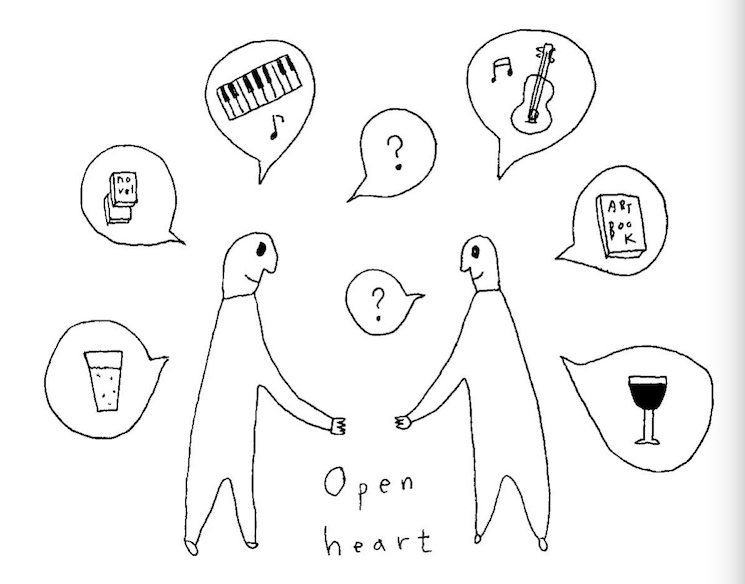
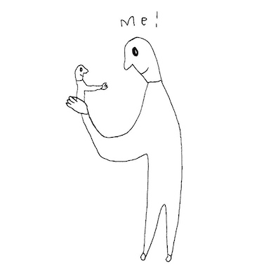
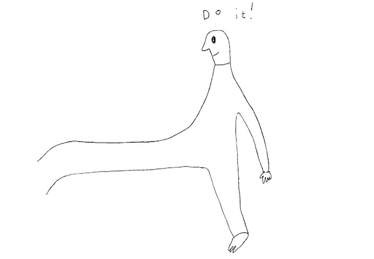
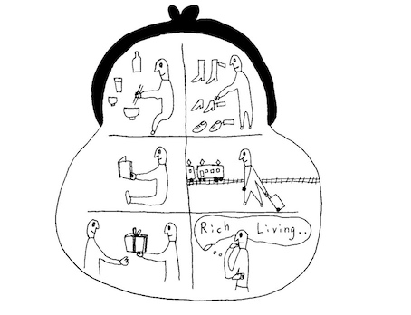
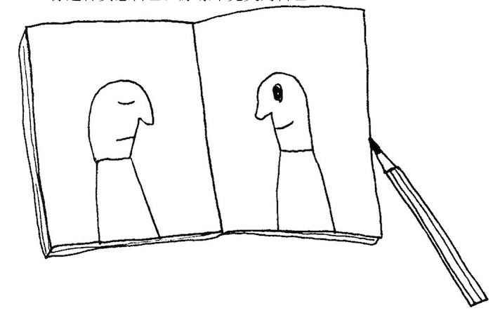
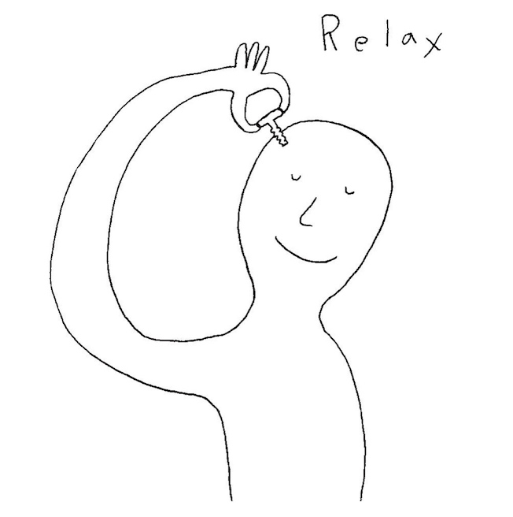
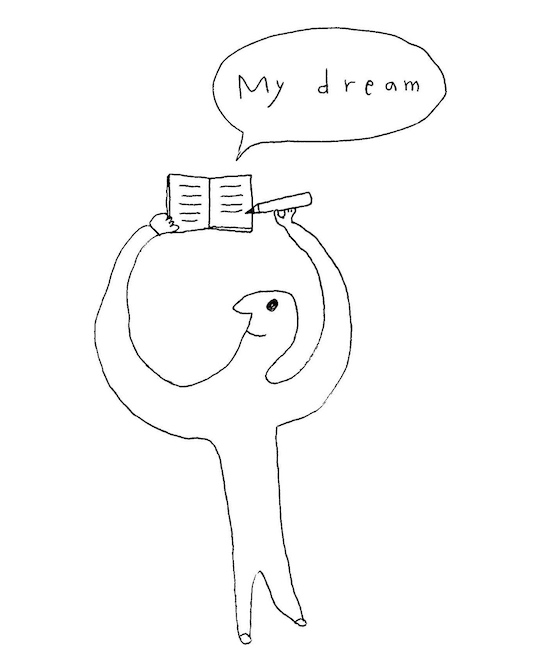
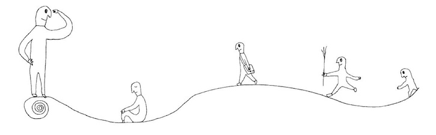

是松浦弥太郎给所有内心怀抱不安(恐惧)和寂寞的朋友的19封关于人生的信
ps: 所以两件小事就是恐惧和寂寞
<!-- more --> 
和你倾诉他如何面对自己的孤独和脆弱，如何和自己相处的经验。『我因为旅行以及其他事，变得孤零零的。人的一生中有两个生日，一个是自己诞生的日子，一个是真正理解自己的日子』 - 独处的时间就是思考的时间，就是自己找答案。正视自己的孤独和脆弱，才是获得强大内心的途径。

这种正面积极的追逐自我的人生态度确实值得肯定，而在这正面力量的引导很多人也开始记录关于自己的梦想笔记，幻想着有一天可以实现自我

## 序
恐惧：最根本的原因其实是我们害怕贫穷，害怕被别人比下去，害怕被社会排挤等各式各样的恐惧
寂寞：我们恋爱，结婚，交友，加入小团体，找人聊天，写信；或是借由什么事来表现自己，主动发消息。这些都是源于你心中的寂寞。

这本书就是让你不逃避，泰然接受，和他们交朋友和平共处的一些方法。这样让你保持内心平静，不会再苛刻自己，也能宽恕他人，这想必会让你迈向幸福的一小步

每篇文章，插画形式呈现那篇文章想传达的重点，每一则都是简单又实用的练习，请大家放松心情，务必挑战看看。每章节后，提供可供实践的课题当做是总结和练习

## 第一章　去凝视那“两件事”
### 给对将来感到不安的你
### 给没有自信的你
### 给需要别人肯定的你
### 给想要朋友的你
『如果你想要伙伴，就去制造一个敌人』在遵守礼节社交规则将心比心前提下，表达出自己的观点即使会得罪有些人，但你鲜明观点也很多人觉得你志同道合。
我们总是习惯在对方身上找寻和自己相同的地方，如果过程中双方都没有表明自己的意见和敞开胸怀，那么友谊就无法成立。
社交网络盛行的时代，交朋友更应该走出家门，面带微笑打招呼，注视着彼此的眼睛说话。

Do Next:
与人见面的时候， 试着把自己喜欢的东西和讨厌的事物告诉对方把。
你也可以主动询问对方，『这件事你怎么看』

### 给戒不掉快乐的你
越是令自己开心舒服的事情，同时也伴随着同等的可怕
那些让你兴奋痛苦难以释手的嗜好品（睡觉，玩乐，吃东西，购物，计算机、手机，游戏机，性相关的活动，电视等）
不要放任自己的快乐膨胀，被快乐支配，要知道为什么自己要接着快乐沉迷来逃避现实
是什么让你痛苦，让你感到空虚，会悲伤，心中无法填满的感受，是从何而来的。 要摸清根源，你必须面对自己。
凝视自己的手心，什么事都不做，一直盯着，慢慢的你会从手心看到自己的心
痛苦时需要的药品和休息，而快乐是精神好的时候才能享受的事情。只要不对快乐产生依存，失去快乐的不安和寂寞也会渐渐远离你。

Do Next:
请仔细凝视自己的手心
说不定，你能因此发现自己的问题

### 本章总结课题
自己软弱的地方和坚强的地方，自己怀中揣着的不安和寂寞的真面目。
如果你想知道答案， 你就得去面对自己。
『我自己的事，我再清楚不过了』但这往往只是人的自以为是

我们每天的生活充满了外来的刺激和他人的影响，很少有时间能够静静地沉浸在自己的世界
但只要你花时间面对自己的心，每一次你都会有新发现。

我给各位的建议是 - 一个人去旅行

旅行很容易便能达成，你也能因此了解到自己软弱的地方，坚强的地方， 擅长的事情以及不拿手的事。
一个人去旅行把。目的地选在自己陌生的城市，语音不同的国度是最理想的

## 第二章　去接受那“两件事”
### 给害怕失败的你
因为害怕失败，所以裹足不前。在一件事开始之前， 总是忍不住进行『事情发展不顺利时的模拟想象』
每当迟疑的时，会自问：『不做这件事的不利点是什么』

只要想到越多不走这件事的不利点，心中便会渐渐涌现『好，那我就干吧』的决心
『先下手为强，确认工序，万事俱备，仔细作业』

你只须要全神贯注地仔细去完成你的计划，把对失败的不安和寂寞上头的无谓心力转而用来细腻的执行作业。绝不要输给对失败的不安和寂寞，因而不去行动。

Do Next:
去思考『如果不做这件事，事情会如何发展』
跨出你的第一步把。

### 给胆小的你
你手头既没有地图，也没有结伴同行的搭档，举目望去，不见一个可以为你指引方向的对象，你也找不到标志牌。但你有一个无论如何都想抵达的目的地。不要因为自己孤身一人，就感到胆怯觉得寂寞。通常对于现实的目的地，你可以拿出智能手机来随时上网检索。但是如果你想去的地方是工作，人际关系或自己的目标之类的事情，你就没办法利用网络的地图检索功能来查询了。

不管你有多聪明，终究有你不懂的事。不管你准备多充分，终究有你算计不到的地方和因秩序规则而错过的。
要承认自己有不懂的事，抛开自己的聪明才智，你便能得到迈出脚步的勇气。
不要害怕自己的看不清前路，只要你心动迈开脚步，你便能看见接下来要走的路，或者因此认清自己走错的路。开走，脚踏实地的感觉也会给你带来自信。

不要总是花了很长时间在原地思考评估，被不安所牵制，因而动弹不得，久而久之这种行为模式就变成了你的习惯，越发束缚你的行动。很多时候，行动的勇气不是从你的脑袋中生出的，而是从你的脚下涌现的~

Do Next:
如果有根圆木倒在一步之外，你只要跨过去就行了

### 给害怕孤独的你

十几岁去美国流浪的时，有很长一段时间，我都是窝在廉价旅社的破房间里，明明我前往异国是为了获得自由，却搞得连出门的兴致索然，原因是-我不愿承认自己的孤独。

事实上，我找到了价钱不贵，食物看起来很美味的餐厅，但是从窗外望了一眼后，我羞耻得根本不敢进去。因为所有的客人都是和同伴坐在一起，和乐融融地用餐。难道连话都讲不好的我要一个人孤零零的坐着店里埋头吃饭？太惨了~ 顿时萎靡，双腿发软，心想与其那样，还不如待在脏乱的房间啃洋芋片。 - 觉得没有人了解自己， 一种疏离感充斥心头。 除非自己主动打电话， 主动发邮件，主动打招呼，与人见面，否则自己一直是孤独的。

所以我硬着头皮把孤单又丢人的自己送到人前，用不擅长的外语开始找人说话， 于是有了于不同人的邂逅，也交到了朋友。正因为你是孤独的，你才能与人相遇，建立关系。不要为了消除孤身一人的不安，填补心中的寂寞就而拼命努力，最终落到可悲的地步~

当我一个人伫立于数百人往来横行的大型十字路口时，孤独曾经找上我，『周围那些人看起来感情真好，全是情侣，我却是一个人』在你为了填补心中的空虚去和别人见面， 不断地朝外部寻找安慰之前，你得花时间好好面对自己，与自己交往。软弱的地方，坚强的地方，好的地方，讨厌的地方。

置身于群体中确实会感到安心，与亲密的人在一起的确开心，但这些关系可能在一瞬间不复存在。转而对自己多报些兴趣。去了解自己，接受自己，然后，好好爱自己。

Do Next:
请用今天一整天的时间来好好面对自己，
试着一个人度过吧。

### 给不愿变老的你
### 给害怕疾病的你
### 本章总结课题
只要在身体被逼到极限的时候，才审视自己的心，你会发现自己的意外一面。你会被迫认知到自己并不完美的。但那个你尽可能不想看见的丑陋的自我，才是你应该接受的自我。

## 第三章　去原谅那“两件事 ”
### 给不想被讨厌的你
我总是一个不小心就很容易想太多『大家心里是怎么看我的』，让自己看起来体面些，希望别人喜欢自己，不小心说出口的小谎言，会嫉妒别人，会斤斤计较的，感到自卑的丑陋小人。 可以试着把自己的秘密告诉倾诉给自己的好朋友，那些缺点，不好的地方，觉得需要改进的地方，像是那些基督教教徒们在教堂告解或类似的心理咨询的行动。

努力把自己打开把。把平时说不出口的私事向某人坦白。去到没有半个熟人的外国，自己主动向人打招呼，主动对人微笑是最容易交到朋友的方法。如果你只是一直待在原地，等着别人来向自己搭话，你会一直孤独下去，除了主动出击，别我他法！

Do Next:
试着自己主动敞开心门吧
方法很简单，就算对方是陌生人
你也主动打招呼，微笑以待，这么做就行你

### 给想自痛苦中逃离的你

笔者从跑步的例子（每次开始加速锻炼时，觉得气喘吁吁双腿打颤熟悉的路变成你艰辛的路，但是最终又顺畅跑完）每个人都想b避开困难通过眼前的路，但感到痛苦吃力却正是自己正在成长，正在前进的证明。而不是那条对你早就驾轻就熟的没法从中成长和学习的路~ 你的困难正是你正在补强自己不足的地方，不要在困难前，什么都不做，一味地任由不安和寂寞膨胀，你会使出浑身解数，得到正面与困难交手的勇气。

Do Next:
遇上困难时，就念诵这个咒语：
『正因为我有能力跨越，这个考验才会降临』

### 给不愿失去的你

小孩子，会把所有的玩具都收集起来放在连自己都装的进去的大箱子，站在箱子前面看守。但他发现就算是玩具再多，一个人玩根部一点也不开心，『这个给你们，谁来陪我一起玩吧』 每个人都有自己珍视的东西。如那些无法用金钱取代的朋友，恋人和家人或是工作和地位。『要是失去这些，我该怎么办』 - 但其实那些珍贵之物其实全都是不属于你的，不过是暂时寄放在你手上的东西或任务。 你要绞尽脑汁想出办法来利用它。排除怕失去的落寞，体会到与人分享的喜悦。
如自己的工资用在维持健康，让自己能精神百倍的工作，能提升自己的事情上，当你一无所有的时，将会有一个更宽广的世界在你眼前展现。

Do Next:
请检索你一个月的金钱使用方式
你是否有效使用你你的财产了？

### 给害怕贫穷的你
### 本章总结课题

每个人都会有讨厌自己的时候，没有自信，厌恶自己，无法原谅自己。如果遇到这种时候，就去一件可以立即执行，自己喜欢并且擅长的事情吧。

## 第四章　 去爱那“两件事”
### 给在意外表的你
抛开过去，活出全新的自己 - 心情的转换无需改变一张脸或是判若两人地改变身材，你也能办得到。
唯一必须为自己的外在负责的部分，是自己的服装仪容，穿着整洁和符合社会礼仪的服装，是成人应有的教养。

Do Next:
你唯一必须为自己的外在负责的部分，是你的服装仪容
你是否打理好你的仪容呢？

### 给讨厌自己的你
过度敏感的自己并且毫不掩饰的表现出来，会让自己很疲倦的（而它有助于提升想象力和观察力，催生对他人的关怀） - 对于细节看出的小问题，不要生对方和自己的气，接受对方，原谅对方和珍爱对方，状况会立刻得到缓解

对自己的内在太过敏感的人，『松开脑袋的一两根螺丝钉』偶尔恍惚下，讲通俗点就是装点小傻~

### 给为生育感到苦恼的你
### 给想实现梦想的你

大约在我年满三十五岁的时，我实现你一直以来的梦想，但是没有了『终于实现了！』的兴奋，长期以来我始终把梦想放在心里，我毫不气馁，就像每天洗澡吃饭一样，理所当然的持续拥抱梦想，全心全意相信它一定会实现。在每天中不过度勉强自己，孜孜不倦的为了实现梦想而付出行动。

用心过好生活，不受过去的牵绊，也不因未来而分心，重要的就是坚持过好今天让它充实和成就感

那些迅速到手的东西也会轻易的离开我们，这可能就像是临时抱佛脚所背完的书，总是一考完试就忘光。自己投资漫长时间，脚踏实地完成的梦想，才算是真正属于自己

### 给对一切都感到不安的你

恐怕这世上大部分的人都和你一样有一颗软弱的心，大家都揣着各自的不安和寂寞，如果你能够承认自己心中的不安和寂寞，并且拥抱他，珍爱他，这就是最好的应对方法

### 本章总结课题

### 后续
严于律己的人才有资格享受生活
早上五点起床，跑步，晚上五点半结束工作，七点和家人一起用餐，十点准时睡觉。经年如此。三个人以上的聚会，他尽可能不参加

