Gopher China 今年是第三届了，这次在上海小南园花园酒店举行。下面是这两天的一些记录，主要是对我平时工作中涉及的如服务治理、微服务、高可用和分布式等话题有较为细致的关注，同时对于其中关联的 Golang 语言知识点进行较详细的记录。

PS：隔壁群组的同事使用了 Golang 开发行情云 V3 也在这次大会上进行分享了，涉及到不少海量并发情况下打造低延迟系统的系统的知识点。说起 Golang 早在14年还在北京前公司的时候，前同事（现在PingCAP的CXO们）就在公司小范围鼓动过。今年群组有计划打造一些稳定性和吞吐量要求较高的系统（微服务，全球结算交易系统），这次参会下来 Golang 的确没有让我们失望，相关的准备工作也可以开启了。

重点记录的话题整理如下：

- 1.3 Go coding in go way
- 1.4 understanding the interface @francesc
- 1.6 Go 微服务架构 - 来自 Java/Spring 开发者视角
- 1.8 B站 Go 微服务实战
- 2.1 Go打造亿级实时分布式平台
- 2.8 Go在证券行情系统中的应用

PS：最近也在学习 Golang 语言，演讲中涉及到的一些知识点和之前看的 Go in Practice 的有呼应的，加了 reference，可以结合查看~


## 1.1 Go在大数据开发中的经验总结

七牛的孙建波老师，介绍了七牛大数据产品 Pandora （潘多拉），它服务于：

	▪	将多样的大数据工具整合
	▪	将复杂的大数据管理简化
	▪	构建完整的大数据生命周期闭环

这样的理念下，引入的架构：


海量数据的实时导出时存在的问题本质上是数据流动效率的问题。pull 和 push 的方式各有利弊。需要构建加速系统，这样的加速系统现在有 Logstash、Beat、Flume，但无法满足需求决定采用Go进行自研，下游的Sink代码由使用方编写为插件式，并利用 Go 的 Channel 实现快速响应与反压（入 Channel 的时候返回200，否则返回503）。

提到了分布式实践时的一些困难：维护困难、数据分散、资源浪费、负载不均等，这些都归结为一致性问题。七牛基于键值对实现了二级缓存的框架qconf，提供最终一致性。请求会先去本地缓存进行查找，如果没有再去memcache，如果还没有就去MongoDB进行查询了。

采用基于key hash的平衡调度算法，通过按需创建和资源回收提高资源利用率，同时使用protobuf代替json以缓解CPU开销，和变长的失败等待时间


## 1.2 Go in TiDB

由 PingCAP 的老师带来。TiDB 受到 Google Spanner 和F1的启发，采用Raft协议保证一致性。申老师为大家展示了TiDB的整个架构：


讲了 SQL Layer 的架构和数据库内部实现细节。
分布式数据库的过程中有很多挑战，比如它是一个非常复杂的分布式系统，有很多RPC任务，需要在大量的数据压力下保证高性能，拥有大量的OLTP请求和非常复杂的OLAP请求。

### Golang 的语言注意点：

#### Goroutine 泄露
如向一个没有 reader 的 channel 写入，向一个没有 writer 的channel 读取等。可以通过 Block profile（dump 下来分析看看哪些 goroutine 在阻塞），超时机制，利用context cancel 等
[testleak](github.com/pingcap/tidb/util/testleak): 查看前后两次调用，新多出来的goroutine 等

func (s testMiscSuite) TestRunWithRetry(c *C) {
	defer testleak.AfterTest(c)()
	…...
}


#### 关注内存和 GC
在 Query 时会使用大量内存读取数据，通过：

- 减少内存分配次数 （相关变量一次申请好，而不是。如果多个变量要去分配，使用一个结构体去统一做）
- 复用对象（ cache in goyacc）
- sync.Pool (线程安全，如 bytes pool）
- gogo/protobuf - fields without pointers cause less time in gc
- 监控内存使用（在单独的背景 goroutine 中调用 runtime.MemProfile()
- 在 Go1.8 中的. 更好的GC（停顿50微妙）sort.Slice 性能提升


## 1.3 Go coding in go way

tonybai 老师结合 Go 团队的对外分享的话题、参考和提炼 Go 标准库以及主流 Go 开源项目的精华源码风格和惯用法，给出了地道 Golang 语言的写法。 作者自己有一篇 blog，把演讲的文稿也给出来了(http://tonybai.com/2017/04/20/go-coding-in-go-way)

首先高层次的提出："语言影响/决定思维"，提出实际问题素数筛。给出 C 和 Go 两个版本解法From divan's blog (http://divan.github.io/posts/go_concurrency_visualize/)

面对同一个问题，来自不同编程语言的程序员给出了思维方式截然不同的解决方法 一定程度上印证了前面的假说：编程语言影响编程思维 避免 Go coding in c way/in java way/in python way...

而编程语言思维的形成：
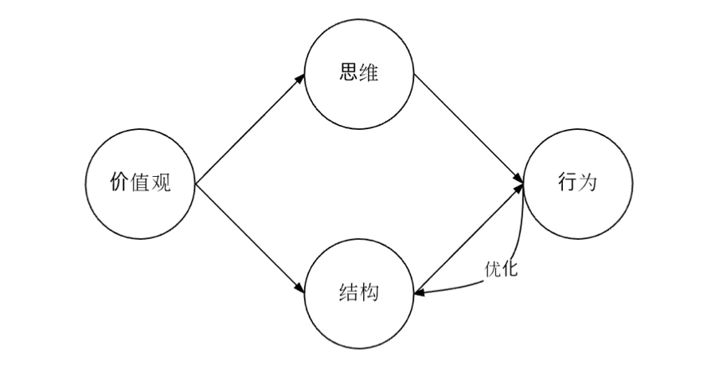


- 根本：价值观决定思维和语言结构
- 核心：思维和语言结构影响语言的应用行为
- 反馈：语言的应用行为反过来持续影响/优化语言结构

而 Go 语言价值观的形成来自于背后的三位作者：Robert Griesemer, Rob Pike 和 Ken Thompson

- Unix 文化：这些大牛背后的 Unix 文化（比如：简单、模块化、正交、组合、pipe、功能短小且聚焦等
- 继承优良传统：implicit interface implementation、首字母大小写决定visibility等
- 与时俱进：时代变迁、面对新的基础设施环境、多核多处理器平台的出现，解决构建缓慢、依赖失控、代码风格各异、难用且复杂无法自动化的工具、跨语言构建难等。


那么Go语言的价值观就是：Go是在偏好并发的环境下的简单概念/事物的正交组合

### 全面简单 Overall Simplicity

- 短命名思维 short naming thought
- 最小思维 minimal thought

简洁正规，仅仅25个keyword：主流编程语言中最简单的，没有之一（一个语言特性的加入需要得到三位作者的同意，这门语言是克制的，连三元符也没有~）


在gofmt的帮助下，Go语言一统coding style。（回看 JavaScript 社区各家特色和百花齐放的 Style Guide，目前也有类似于统一 coding style 的提出，不要为个人喜好而争论不休了）对于变量命名等在并不影响readablity的前提下，尽可能的用长度短小的标识符，于是我们经常看到用单个字母命名的变量（不同于 Java 语言“见名知义” （"index" vs. "i" "value" vs. "v"）
Go is not a “TMTOWTDI — There’s More Than One Way To Do It”。这点与C++、Ruby有着很大不同。和 Python 是一致的
提倡显式代码（obvious），而不是聪明(clever)代码

短变量命名在 stdlib 中体现：
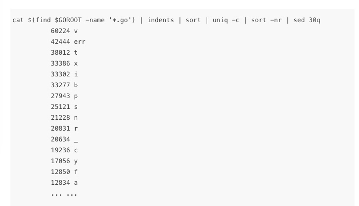

一种 for 循环

```go
- 常规
  for i := 0; i < count; i++ {}

- "while"
  for condition { }

- "do-while"
  for { // use "for-break" instead
        doSomething()
        if condition { break }
  }

- iterator loop
  for k, v := range f.Value {}

- dead loop
  for {}

```


另外Go语言的错误处理是基于比较的，没有针对exception的“try-catch"控制结构，这样的好处是让开发者聚焦于错误本身，能够显示地处理每一个error，同时保证了错误值和其他类型的值地位一样，并无特殊之处。关于错误处理的模式：

- 在外部无需区分返回的错误值的情况下，可以在内部通过fmt.Errorf或errors.New构造一个临时错误码并返回
- 在外部需要区分错误类型，可以通过导出 error 变量 ` var ErrShortWrite = errors.New("short write");  if err := doSomeIO(); err == io.ErrShortWrite { ... }`
- 需要提供错误上下文信息，可提供 Error type 之后通过针对error interface value的type assertion or type switch得到真实错误类型并访问error context
- 包含package中error公共行为特征的Error interface type
- 通过一些公开的error behaviour function对error behaviour进行判断

```go
//net/net.go
  type Error interface {
      error
      Timeout() bool   // Is the error a timeout?
      Temporary() bool // Is the error temporary?
  }

//net/http/server.go中的使用举例：

  rw, e := l.Accept()
  if e != nil {
      if ne, ok := e.(net.Error); ok && ne.Temporary() {
```

其中 Go 关于 error type 和 variable 的命名方式

```go
 错误类型: xxxError

  //net/net.go
  type OpError struct { ... }
  type ParseError struct { ... }
  type timeoutError struct{}

导出的错误变量: ErrXxx

  //io/io.go
  var ErrShortWrite = errors.New("short write")
  var ErrNoProgress = errors.New("multiple Read calls return no data or error")
```

关于代码中大量重复着if err!= nil { return err} 这段snippet，可以使用将 error 作为一个内部状态解决（具体在 [errors are values](https://blog.golang.org/errors-are-values)

关于错误处理的技巧还可以参见与 [Go in Practice Technique 16-18 - minimize the nils, custom error types, error variable]


### 正交组合 Orthogonal Composition

- 垂直组合思维 vertical composition thought
- 小接口思维 small interface thought
- horizontal composition thought

需要注意的是Go语言无类型体系(type hierarchy)，类型定义正交独立 （“If C++ and Java are about type hierarchies and the taxonomy(分类）of types, Go is about composition.”）
垂直组合(类型组合)：Go通过 type embedding 类型嵌入机制提供；水平组合：Go通过interface语法进行“连接”。

垂直组合方式有：

```go
// a) construct interface by embedding interface
type ReadWriter interface {
 Reader
 Writer
}

// b) construct struct by embedding interface
type MyReader struct {
 io.Reader // underlying reader
 N int64   // max bytes remaining
}

// c) construct struct by embedding struct
// sync/pool.go
type poolLocal struct {
 private interface{}   // Can be used only by the respective P.
 shared  []interface{} // Can be used by any P.
 Mutex                 // Protects shared.
 pad     [128]byte     // Prevents false sharing.
}
```

其中在struct中嵌入interface type name和在struct嵌入struct，都是“委派模式(delegate)”的一种应用。需要注意的是：struct中嵌入struct，被嵌入的struct的method会被提升到外面的类型中，比如上述的poolLocal struct，对于外部来说它拥有了Lock和Unlock方法，但是实际调用时，method调用实际被传给poolLocal中的Mutex实例。


#### 小接口思维

在Go语言中，你会发现小接口（方法数量在1~3）定义占据主流。无需显式的”implements”声明(但编译器会做静态检查)； 很有意思的图体现了大量小接口用于在 stdlib， k8s，docker 等库中（背后是职责单一；易于实现和测试）


#### 水平组合思维


### 偏好并发 Preference in Concurrency
 - concurrency thought

最后讲到并发。Go语言通过goroutine提供并发执行，它是Go运行时调度的基本单元。channels用于goroutines之间的通信和同步。select可以让goroutine同时协调处理多个channel操作。


## 1.4 understanding the interface @francesc

what is an interface?
"In object-oriented programming, a protocol or interface is a common means for unrelated objects to communicate with each other"
关注 unrelated objects, communication
老师首先援引了Wikipedia上对于Interface的定义：Interface是面向对象程序设计中用于不相关对象间通信用的一种协议或接口。这里面比较重要的两个关键一个是“communicate"，另一个是“unrelated objects”。


接口一直符合约定就可以容器集装箱，乐高积木等

what is a go interface?

- abstract types
- concrete types
在Go里， 数据类型可以分为Abstrace和Concrete两类

concrete types
- they describe a memory layout
- behavior attached to data through methods
如 int, []bool, *gzip.Writer, *os.File, *strings.Reader

abstract types
- they describe behavior (如 io.Reader, io.Writer, fmt.Stringer）
- they define a set of methods, without specifying the receiver

type Positiver interface {
  Positive() bool
}
Abstract类型定义了方法集，用于描述行为。而Concrete类型定义了通过方法关联到数据的行为，用于描述内存布局。

concrete types 和  abstract types 关系

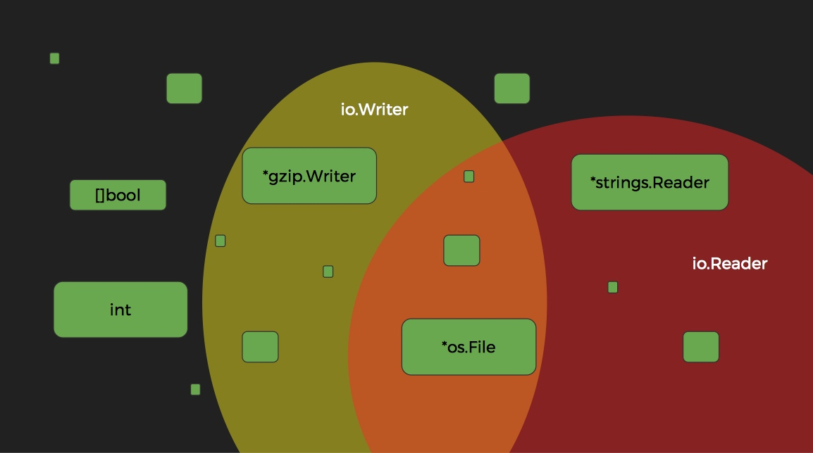

union of interfaces

type ReadWriter interface {
  Reader
  Writer
}

type Reader interface {
  Read(b []byte) (int, error)
}


interface{}, it ways nothing


为什么需要使用接口?

	▪	编写通用的代码
	▪	隐藏设计细节
	▪	检查监测点

- writing generic algorithms
- hiding implementation details
- providing interception points

“The bigger the the weaker the abstraction”
“Be conservative in what you do, be liberal in what you accept from others”
“Be conservative in what you send, be liberal in what you accept”

避免出现：


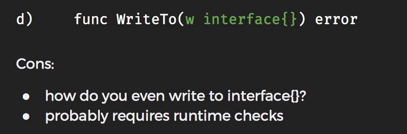


### 抽象数据类型

a Stack interface

```go
type Stack interface {
  Push(v interface{}) Stack
  Pop() Stack
  Empty() bool
}
```


write generic algorithms on interfaces
“Return concrete types, receive interfaces as parameters”

Hiding implementation details
Use interfaces to hide implementation details:

- decouple implementation from API easily switch
- between implementations / or provide multiple ones

context.Context
满足 Context 接口的 emptyCtx, cancelCtx, timerCtx, valueCtx


interfaces: dynamic dispatch of calls
chaining interfaces
interfaces are interception points


Go 中的接口有什么特殊之处：

- implicit interface satisfaction
- interfaces can break dependencies

define interfaces where you use them

guru - a tool for answering questions about Go source code. (看一个interface在哪些地方被实现了
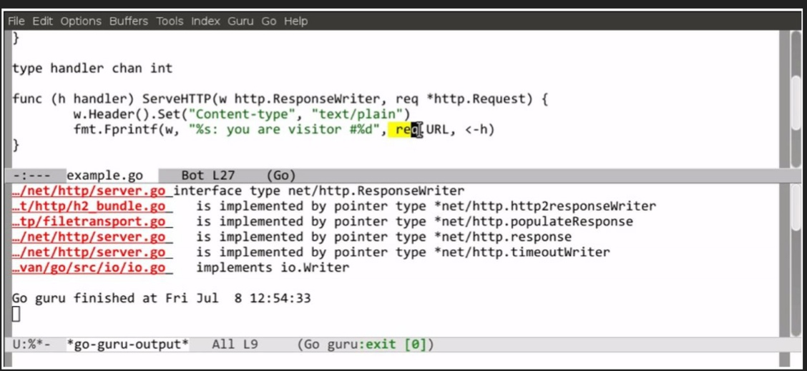

强大的 Go 接口

- 类型断言
	- from interface to concrete type
	- avoid abstract to concrete assertions
	- from interface to interface
	- runtime checks interface to concrete type
	- as extension mechanism
	- errors in context
	- use type assertions to classify errors
	- as evolution mechanism
	- to maintain compatibility

Don't just check errors, handle them gracefuly
Context interface

隐式满足:
- break dependencies

类型断言:
- to extend behaviors
- to classify errors
- to maintain compatibility


## 1.5 NSQ-重塑之路

由杭州有赞的李文带来。从原始架构开始，到给出重新设计的架构。在 NSQ 上的Jepsen 测试
有赞的应用场景里需要实现消息队列的高可用、自动平衡、有序发布和消费历史消息。现在存在的问题以及重新设计是：

	▪	从Topic Channel把所有的数据拷贝到Consume Channel
	▪	多份数据拷贝，浪费了很多磁盘
	▪	重新设计：使用Cursor用来指示要消费的数据。

有赞实现的自动平衡，包括如下方面：

	▪	负载因子：CPU负载、Topic PUB大小、Leaders
	▪	添加/移除节点平衡
	▪	手动迁移数据

以及实现了SmartClient。它可以周期性地刷新Topic Leader和分区，以及HA的重试（在非Leader上失败后的快速查询）以及发布策略（支持轮询和按照主键的sharding）。
还有按序发布，包括：在同一个分区里有序，在一个线程里向同一个节点发布相同的sharding键，以及按序一个接一个地向消费者发送消息。


## 1.6 Go 微服务架构 - 来自 Java/Spring 开发者视角

来自于阿里云的聪心老师，以Spring开发者的视角进行了讲解。

该演讲主要从如下方面展开论述：

- 背景 - 云产品的前端架构
- 在阿⾥云微服务的复杂性
- 简要的 Java Golang 对比(Spring vs. Go tooling)
- 介绍 gRPC 和 Go Kit
- 微服务最佳实践

讲述的顺序是看目前云产品架构，其中新加的 Aliyun API 网关服务和天象全链路监控。其中阿里云内部大量使用的 Dubbo RPC 框架作为服务治理的重要手段，目前有一些瓶颈。如 big data payload 还有多语言的client 支持。所以引入了 gRPC，同时对比了用 go 开发（go-kit 微服务框架）对比目前的 Java/Spring 技术栈下的（Dubbo 和 Spring Cloud ），最后给出了一般微服务开发的实践总结。


Dubbo 背景介绍
- 分布式 RPC 架构： Fast, highly scalable and industrial proven (2K+ nodes providing 3B+ request/day, adopted by Alibaba, JD, 当当⽹网)
- J2EE play nice
- Features
	- 服务动态注册 & 服务发现
	- SOA 服务治理
	- 软负载均衡
	- 熔断，服务降级

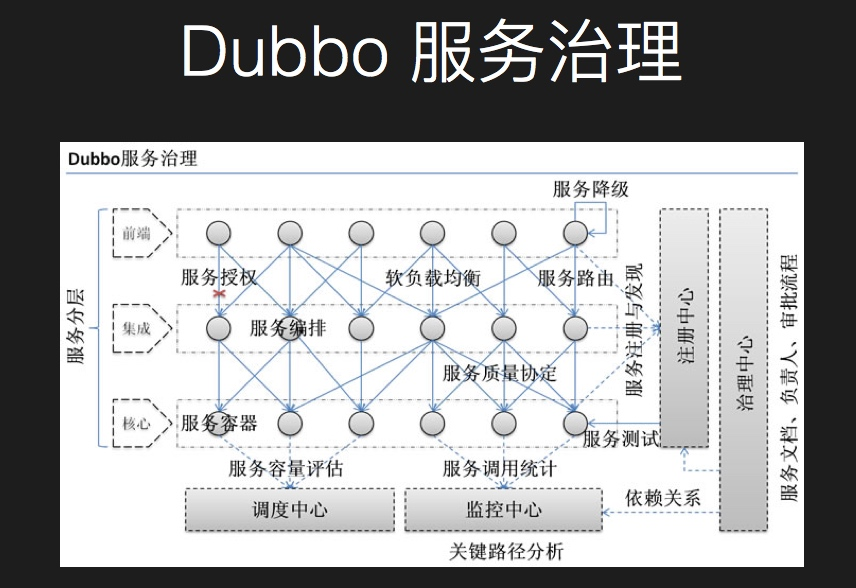

但是微服务在阿里云这套仍然有问题：

- 微服务：“team large, product velocity
- Dubbo and Spring Cloud 的问题：
-  testing is still hard, devops culture, security, distributed tracing, huge payload


目前团队服务端人员的技术分布：

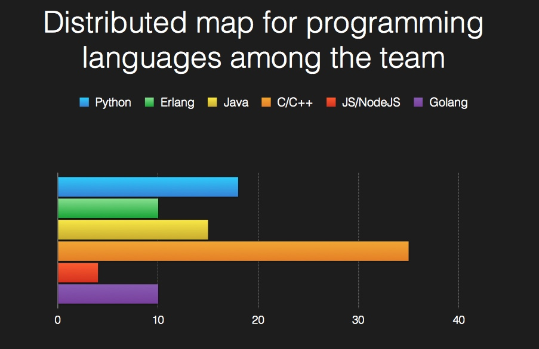

Java is “SO DYNAMIC”! (Spring 框架 引入的一些动态。在 Spring Boot 中大量使用的 auto configuration 等）
Java is "MAGICAL" 一些annotaion 注解（@Service，@Autowire, @Resource 。 AOP 切面 @Aspect，@Before 等）


介绍 gRPC - open sourced version of Google Stubby RPC

- “HTTP/2” & “Bi-Directional streaming”!
- Working with Protobuf3
- Generated both client and server in 9 languages（允许了 polyglot micro-services architecture

介绍 go kit - toolkit for micro-services.
PS：go-kit 我在之前也在 wiki 中给出过分享 [go与微服务：使用 go-kit 开发](http://wiki.gf.com.cn/pages/viewpage.action?pageId=43065602)


一些最佳实践的点：

- Design with “Single” domain in mind (DB)
- Strong DevOps culture - CI/CD
- Logging, Metrics and Tracing
• Logging Options - Aliyun Logging Service/Apache Kafka/ELK
• A trace ID to co-relate all the requests that’s been made
- Transactional requests with idempotence handling in mind/Eventual Consistency
- Think twice if you need to propagate your requests to a number of micro- services request in “parallel”
- Provider services governance and versioning
- Circuit Breaker/Fallbacks
- Multi-region cluster/failover
- Employ Container/Docker technologies (DevOps)
• docker-compose • swarm • k8s
- Be very careful when introduce a whole new set of framework/library (shoot yourself in the foot)
- SIMPLE is the BEST


## 1.7 Automate App Operation

部署应用可用通过容器进行，不管是Docker（或者OCI）都提供了标准的应用打包格式，Kubernetes或Swarm则提供了资源调度、集群管理的功能。

• Docker/OCI
	• Standard app packaging format
• Kubernetes/Swarm
	• Resource scheduling, cluster management

deploy stateful apps"

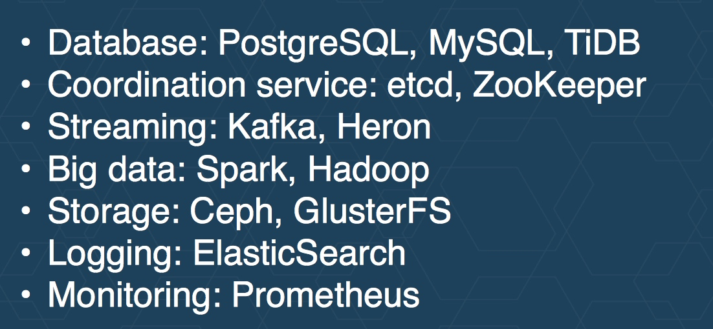

首先要解决复杂依赖的事情，如 Prometheus 中（alert manager, alerting rule）等。如etcd部署，每启动一个新 etcd 实例需要配置的initial-cluster要相同等。


perator是用来解决自动化应用运维的工具，而应用包括代码和配置两部分。Operator的原理是这样一个循环：首先观察集群的当前状态，然后分析之与期望配置之间的差异，最后以此为目标进行操作，并进入下个循环。

采用 self-updating kubernetes. 通过update strategy 描述需要什么
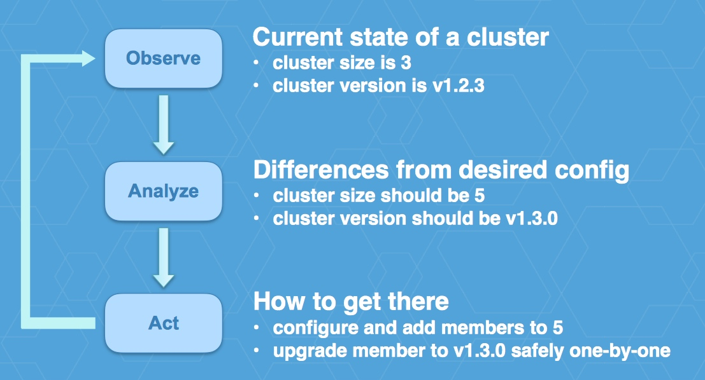

kubectl create -f 根据yml中描述的服务信息（target service, resize, upgrade, backup, failover 等


## 1.8 B站 Go 微服务实战

由 B 站的毛剑老师分享，里面分享了不少 B 站改造的有趣故事，从一个一个人写的基于 php 某 cms 框架到一个高可用的 golang 系统的进程回顾。讲得思路非常清晰，重点突出。

演讲从下面的大纲进行讲述：

- 微服务的演进
- 高可用
- 中间件
- 持续集成和交付
- 运维体系

其中微服务的演进：

- 梳理业务边界（合理拆分，不扯皮）
- 资源隔离部署（新服务在新机器上没暗坑）
- 内外网服务隔离
- RPC框架
	序列化（GOB） 上下文管理（超时控制） 拦截器（鉴权、统计、限流） 服务注册（Zookeeper） 负载均衡（客户端）
- API Gateway
	统一，聚合协议，errgroup并行调用
	业务隔离 熔断、降级、限流等高可用

其中高可用部分包括了 隔离 ，超时 ，限流 ，降级 ，容错 几个部分。

微服务的架构可以很好的实现隔离。不同类型的微服务有不同的计算和内存资源的诉求，同时它们本身的稳定性和业务流量压力也是不一样的。同时新改造迁移的服务可以通过物理隔离和之前的legacy的系统分离开，避免被拖累~

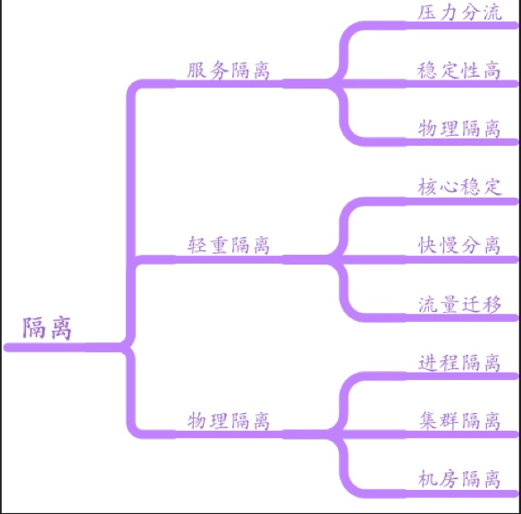


在 Web 系统中对于超时处理是很重要的，在微服务情况下，API 网关等聚合场景下也提出了一些新诉求（circuit breaker - 类 Hystrix），其他对外部系统和中间件也要处理好超时关系。
客户端实现服务器接口返回的ttl，在ttl时间内不要发请求，避免雪崩，聚合接口的降级（个别接口有问题就返回 default 值等，类 Hystrix ），熔断器，个别接慢就先踢掉，

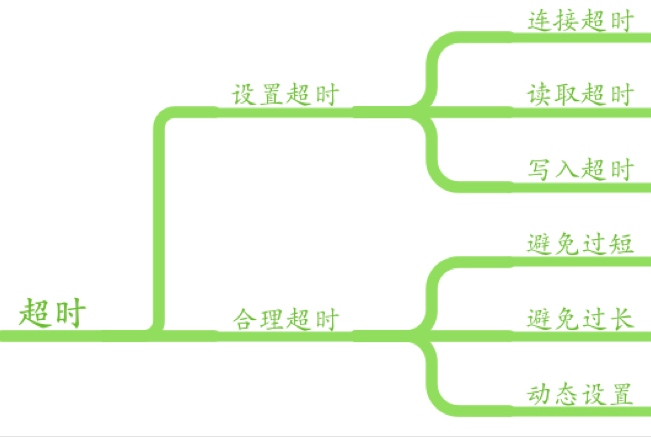

随着超时处理而来的是对限流的实施。不同系统有应对不同流量级别的能力，然后由于外部情况（如爆点事件，push 拉新，异常上游系统的不合理使用）都会引入无法处理的流量，所以合适的限流是系统防御性措施之一。


当真正的用户实际流量随着业务开展不可避免快速增长起来，或者线上部分节点出故障被隔离起来后。需要进行合理的降级来让整个系统基本可用，去掉那些 fancy 的增强点。整个需要前后各端系统的通力配合。


一个响应式的系统还需要对故障保持灵敏。可回复性可以通过复制，围控，隔离和委派等方式实现。


微服务的打造，离不开以下的中间件：

databus（基于Kafka）
canal（MySQL Replication）
bilitw（基于 Twemproxy）
bfs（facebook haystack，opencv）
config-service
dapper（google dapper 分布式追踪）

运维体系。统一的 portal 去管控资源和服务运行环境进行回顾。

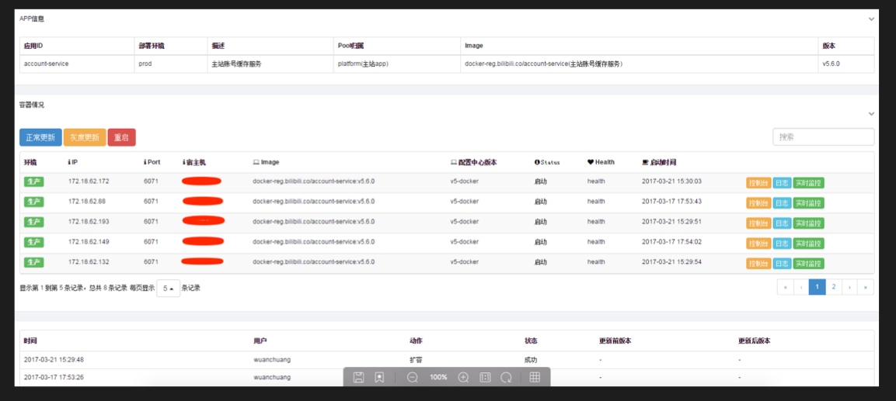

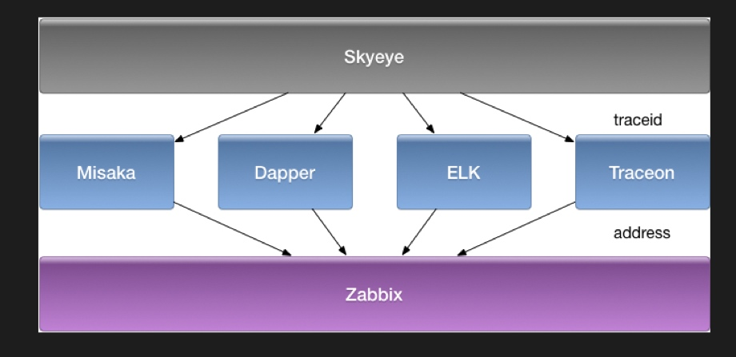


第二天的议题如下：


## 2.1 Go打造亿级实时分布式平台

这个话题由Grab的高超带来。Grab 是东南亚最大的出行平台（类滴滴）

首先回顾之前的技术栈（Ruby on Rails, Nodejs, MySQL 等）随着快速增长的业务需求，老旧系统无法满足。开始改造，给出了目前最新的技术栈：

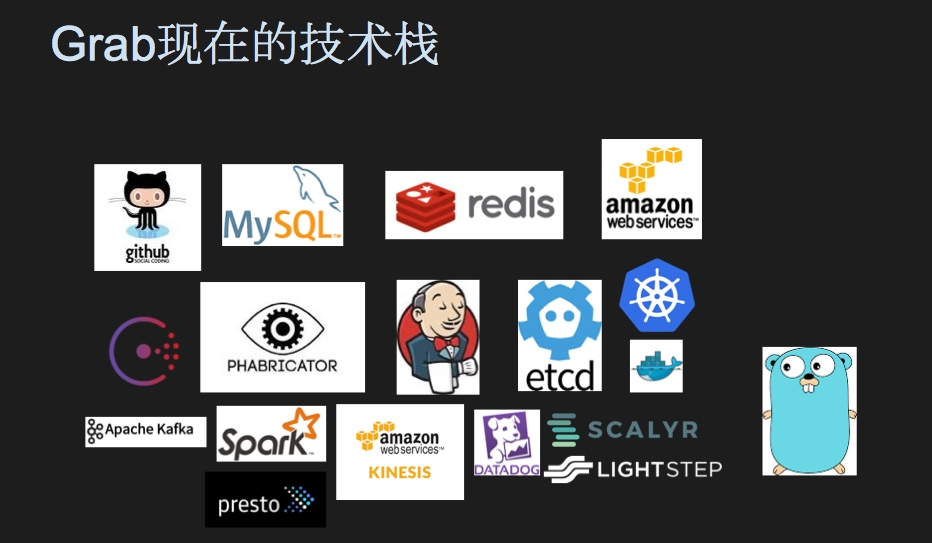

引入了常见的容器化和分布式技术（如 etcd, docker, kubernetes）外，显著特点是目前后台均采用Go实现。他们认为 Golang 语言：

▪	简洁的语言规范
	◦	上手轻松
	◦	提升生产效率

▪	完整的工具链
	◦	go test，go build，go vet...

▪	方便的部署流程
	◦	直接部署打包好的二进制文件

▪	优秀的性能
	◦	弹性云机器数量骤减90% （啊... 之前 Rails / Node.js 系统是咋写的）
	◦	响应延迟骤降80%

其中用 Golang 打造的系统包括：流式数据采集系统（每天亿万事件处理）、API Gateway、RPC和RESTful框架、ORM（约束对数据库的访问模式，缓解后台扩展瓶颈，可以后续替换。也是 Rails 等成熟框架下的preference了）、CI系统（与Jenkins深度集成），还有机器学习平台和Serverless平台计划（弥补目前 AWS lambda 不支持等等。

Grab 的Golang 实践从下面展开：

	▪	单体代码库
	▪	分布式追踪
	▪	测试
	▪	代码质量控制
	▪	Bugs

在代码管理方面， Grab采用了单体代码库，也就是说所有的Go代码都放置在同一个Repo里面。这样的好处是可以保证不同组件间版本的一致，简化了依赖管理，同时提供了良好的代码复用和分享基础。另外也保证原子化的代码更改，利于支撑大规模的重构和更新。

分布式追踪对于判断系统的运行状况、分析调用性能瓶颈、快速发现和诊断服务存在的问题等都非常重要。Grab通过在请求头里添加traceId和spanId来进行追踪。利用Go的Context进行实现，Context的生命周期等于Request的生命周期，在其中添加全局唯一的traceId刚好可以实现对整个Request流的追踪和观察。

测试中提到了“契约驱动的测试”，它的实现类似于这样：在测试代码里编写好一个结构体数组，其中每个元素都代表了一种特定的场景（输入和输出），最后借助于Go test这样的工具完成测试。同时Grab的实践还包括使用了Testify这个第三方的测试包、在Staging集群上进行端到端的测试以及将数据库从单例改写为接口，作为依赖进行注入。

代码的质量是非常重要的，好的工具能够提高Code Review的效率。在Grab使用了 Phabricator、Jenkins、Slackbot 帮助 Code Review 流程，值得一提的是：
- Review 界面和测试覆盖检查结合（Phabricator页面上会清晰的标注测试覆盖和未覆盖到的代码块）可以让 reviewer 心智集中在那些没有被测试覆盖的代码。
- 但单元测试覆盖率低于一定百分比后， CI build 会主动失败。迫使大家把测试覆盖率提升

最后分享了在实践中他们遇到的一些Bug，比如Nil Pointer（技巧是 make zero values useful）,DNS Resolution（已经提交，在 Go 1.9 修复）



## 2.2 Go语言在讯联扫码支付系统中的成功实践

“支付系统用Go编写行么？”。张老师说对于很多金融企业来说，目前使用的系统可能是十年前甚至二十年前的系统，那么在这些系统仍然运行稳定的基础上，推动新技术的落地是非常挑战的事情。

除了常见的Golang的技术特点（上手容易，天生并发），下面特点

- 简洁的错误处理（defer、panic、recover）
- 安全性够高。在搜索中 golang 仅有5条漏洞记录，java有1600多条记录（jvm是没有这么多漏洞的，大部分漏洞还是来自于各个框架，比如Struts）

并且在自己电脑上对常见 case 进行了压测benchmark看吞吐量，对比 Java 和 Golang 效率
如 Http 接口 和 RSA 加解密

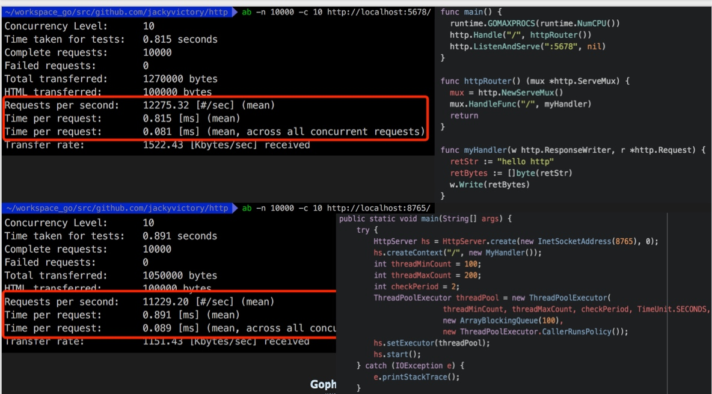


最终架构如下：


其中实践中遇到的一些坑：

变量作用域（玩 JavaScript 应该会很熟悉。closure
chan 操作和关闭的注意点（见 Go in Practice Tip 14）

问题代码：


## 2.3 Golang在百万亿搜索引擎中的应用

这个话题由的360的郭军老师带来。开源在 https://github.com/Qihoo360/poseidon A search engine which can hold 100 trillion lines of log data.

由于数据量级特别大（大小在100PB，每天还继续灌入约2000亿条的新数据。这么大的数据量需要实现秒级响应），无法使用目前的常用技术栈（如 ELK 等）
造轮子的目标是：对现有的Map-Reduce无侵入、自定义分词、实现故障转移、节点负载均衡、自动恢复，并且要支持单天/多天批量查询和下载。

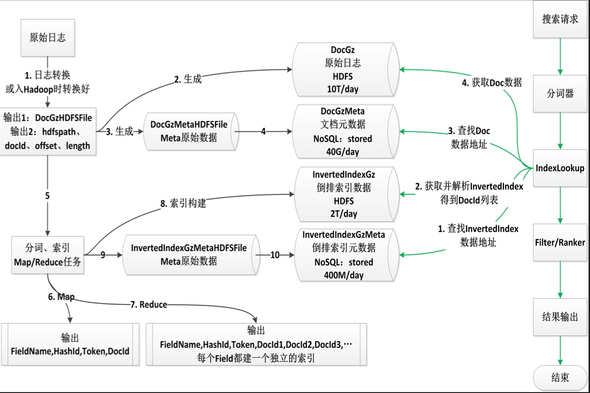


Go 问题与瓶颈：
大量使用 goroutine，子 goroutine panic 在主 goroutine中不能被 recover （看 Go in Practice Technique 21. a panic on a goroutine can't jump to the call stack of the function that initiated the goroutine(no path for a panic to go from handle to listen). 可以通过通道传回给主 goroutine。该通道类型为struct，封装正常数据和error。从而便于在主 goroutine 取出数据统一处理）

参考NSQ，利利⽤用for+select的不不确定性来分流，随机流量量到 cache和hdfs做热测试，缺点：开发成本较⾼高
ReadHDFS （goroutine太多，底层readhdfs挂掉， 通过连接池和熔断机制。超过连接数量就直接返回 error）


## 2.4 Go's Hidden Pragmas

演讲者是大胡子 Gopher sticker 的原型
不同于C，Go语言的pragma实现在注释里，由编译器识别并执行。老师介绍了下面几个Go的Pragma：

	▪	//go: noinline
	▪	//go: nosplit
	▪	//go: noescape
	▪	//go: norace
	▪	//go: nolinkname


## 2.5 跨境电商的Go服务治理实践

由于 Ezbuy 工程师带来。集中在讲解构建开发上，对群组有不少参考价值

	▪	背景&前言
	▪	开发环境构建
	▪	微服务选型
	▪	分布式追踪
	▪	跨数据中心

开发环境构建，通过 Goflow 统一开发环境。使得与个人开发环境共存同时保持独立。依赖管理要实现共享依赖、内网缓存、业务隔离、并且允许修改第三方包。使用官方的vendor方案进行实现，新建一个仓库存放所有的依赖包，第三方包通过subtree进行导入，这个库的名字就叫做vendor。

微服务选项：使用 gRPC 利用PB描述接口、扩展代码生成、使用Consul进行服务发现和负载均衡。

	▪	使用Internal来隔离资源/函数
	▪	Consul深度结合
	▪	程序内维护地址列表
	▪	Polling 获取更新


使用 option 定义接口特性；接口路径 === 代码路径；让远程调用看起来像是本地调用；


分布式追踪：
分布式追踪，比如要实现跨进程的错误跟踪时，错误可能会被覆盖掉，那么“懒人做法”是建立一个错误栈，类似于将每个调用的错误信息都收集在这个栈里，最后一并打印出来。“更进一步”的做法是利用Context完成。最终灌入到 Sentry 中，是比起 opentracing 比较另类的方案。同时不仅仅是 latency

跨数据中心：


## 2.6 ContainerOps DevOps Orchestration

DevOps，它的终极目标认为在开发的时候需要考虑到将来要部署到的生产环境（比如网络、存储等）
而通过 Docker 容器较好的统一了开发到生产的环境变化，尽可能自动化全部的流程。

ContainerOPS 就是代表：
defining -> Component
drawing -> Workflow
running -> Container Orchestration

其中 Components 封装一个DevOps任务，传递一些数据（环境变量等），利用phusion作为baseimage，启动多个进程，在ContainerOps系统中管理组件声明周期。


## 2.7 Harbor开源项目容器镜像远程复制的实现

首先从为什么需要 Private registry 开始 （拉取和推送镜像的网络效率高，安全对私有镜像实施 ACL）
在以前传输镜像的方式要么是写shell脚本，将某镜像打包、传输、推送到指定仓库，或者利用rsync进行执行，这样会有很多的不可控因素。Harbor让镜像的管理变得简单和可靠。

而镜像复制的使用case。譬如总公司需要分发多个镜像到各个省市。可以先分发 replica 到各个省市的 registry 上。用于 geographically distributed teams，和备份

其中技术点包含：

- 使用 dispatcher/worker pool 来实施具体的replica job


type workerPool struct {
  workerChan chan *WorkerPool // a channel for free workers
  workerList []*Worker // a pool of available workers
}
var WorkerPool *workerPool

func Dispatch() {
  for {
    job := <-jobQueue
    go func(jobID int64) {
      worker := <-WorkerPool.workerChan
      // Channel WorkerPool.workerChan is blocked if no worker is available
      worker.RepJobs <- jobID
    }(job)
  }
}


type Worker struct {
  ID int
  RepJobs chan int64
  SM *SM
  quit chan bool
}

func (w *Worker) Start() {
  go func() {
    for {
      WorkerPool.workerChan <- w
      select {
      case jobID := <-w.RepJobs:
        w.handleRepJob(jobID)
      case q := <-w.quit:
        if q {
          return
        }
      }
    }
  }
}


- 通过状态机管理复杂的 replica job

(limited states, conditions of transition, handle logic for each state, separate concerns like error and retries)
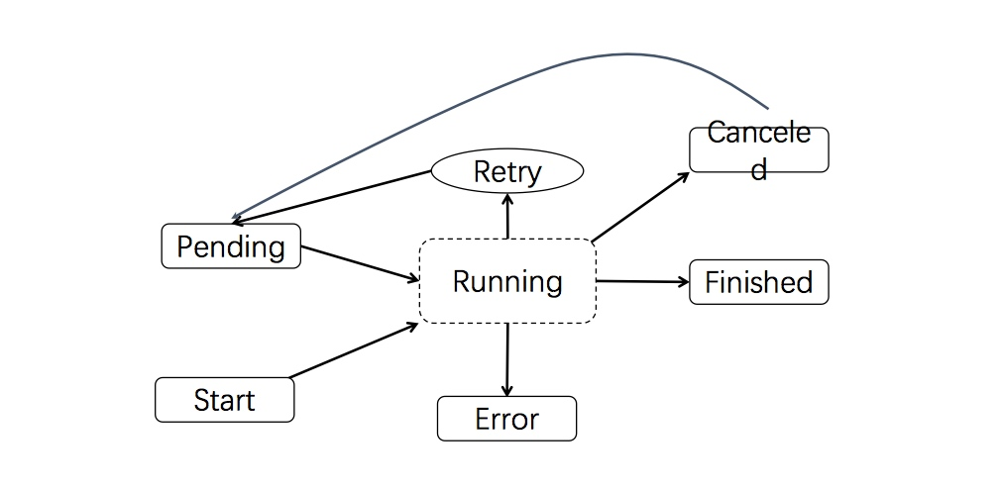


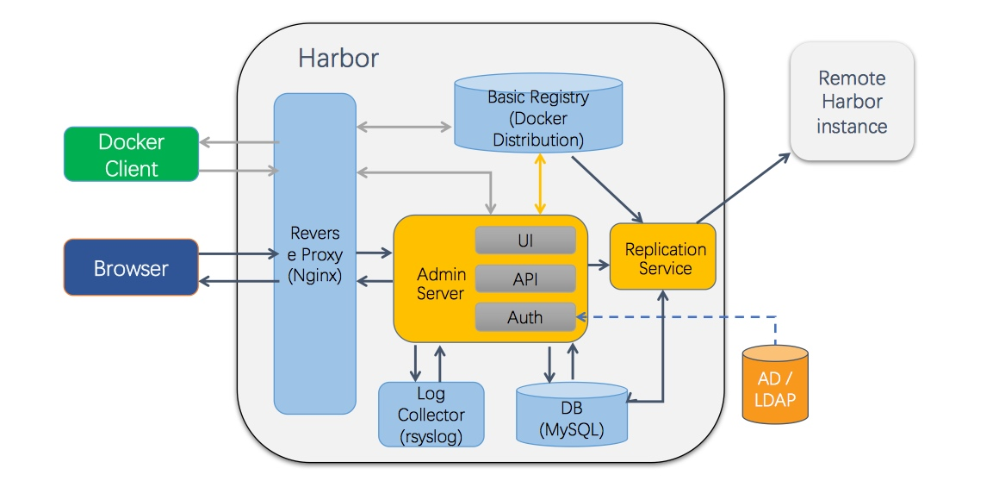


## 2.8 Go在证券行情系统中的应用

行情开发遇到的挑战有：

	▪	开发语言的选择
	▪	GC问题的困扰
	▪	面向并发的数据结构
	▪	融合替代方案
	▪	网络底层优化

首先是开发语言的选择。刘楠老师很形象地用AE86、99坦克和特斯拉Model X类比C/C++、Java和Golang。C/C++性能好，历史悠久，更适于“爱改装”的老司机。Jave大而全，被广泛使用，安全性高，但是太重而迟缓。Golang是为并发而生，集成了现代设计理念的系统级语言，代表了业界的发展方向。

GC的内存对象扫描标记会消耗大量的CPU，同时它的“Stop The World”特性还会造成毫秒级的延时

创建Goroutine固然很方便，但也要考虑到频繁创建销毁带来的麻烦。
	▪	并发量小于1000时，每个请求分配一个Goroutine，模型简单，类似于Apache的并发模型
	▪	并发量大于1000时，频繁创建销毁的Goroutine会产生大量的内存垃圾，GC拖慢系统响应速度，适宜采用Nginx的并发模型（异步io加状态机处理回调等）

尽量使用栈对象。因为堆上的对象需要GC才能释放，栈对象在函数结束时就释放了。另外在堆上创建对象需要先进过分配算法，回收的时候也可能产生碎片。在栈上就简单多了，只需移动栈指针即可。（逃逸的对象变量，是函数返回时会清除回收的局部变量）
对于大对象：goroutine一开始分配4k栈。默认是分段的当超过，链表连起来。所以大对象放在堆上，避免goroutine创建时的开销来栈创建回收

面向并发的数据结构：

- 内部存储器层次结构
- Per-CPU Storage
- 支持和并发访问的Map

cpu多核多socket 卡槽。cpu有三级缓存，goroutine多个跑在不同的cpu，要独占内存，其他cpu的内缓存要通知失效. 缓存失效，由于goroutine各种在cpu上跑，得到时间片就会造成其他cpu上的缓存失效，多次缓存就无效了。访问同一片的内存造成cpu缓存失效


pb使用产生垃圾，使用cgo常驻 . 如推送机器30w链接的goroutine，但是一边网络情况不好移动，导致大概3k的重连，就有频繁的goroutine销毁创建。使用常驻的不退出，告知执行等
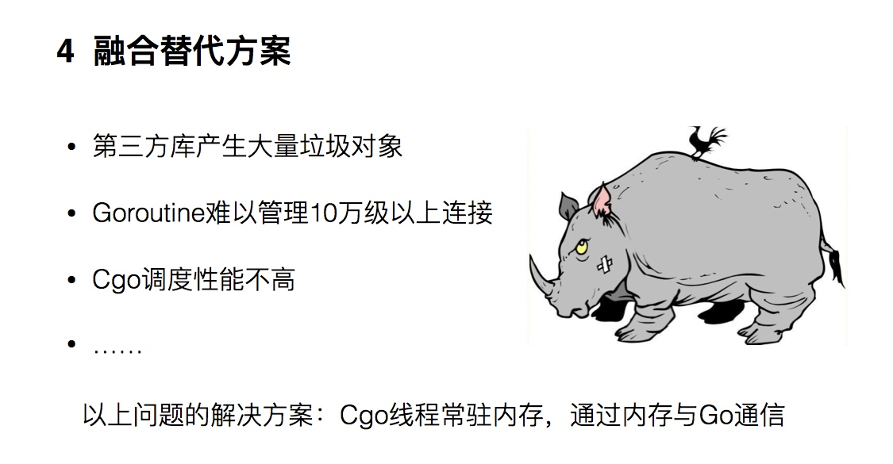


mtu加大，协议栈中不segment，而在网卡中支持分片去减少cpu load . 线上问题，docker内网卡支持分片，host机器被vm虚拟化出来不支持 offload FALSE
docker issues 18776

最后的面向并发的数据结构、融合替代方案和网络底层优化内容比较偏细节


## 2.9 Go语言在证券期货行情系统中的实践

行情服务的特点：快，准，稳
系统设计的特性要求： 高并发要求系统在用户规模变大的时候具有弹性扩展的能力。高容错要求系统在出现故障时可以将错误的影响控制在一定范围，不影响整体的服务。
服务设计：

- 接入服务：面向客户端，实现高并发，高在线的需求
- 计算服务：加工行情数据，按特性组织管理数据
- 采集服务：从行情源采集数据。异构数据转化等


其中主要讲解了接入服务：

- 去状态化：将状态存储到外部，然后通过请求的Context附着状态来实现
- 故障恢复
- 负载均衡

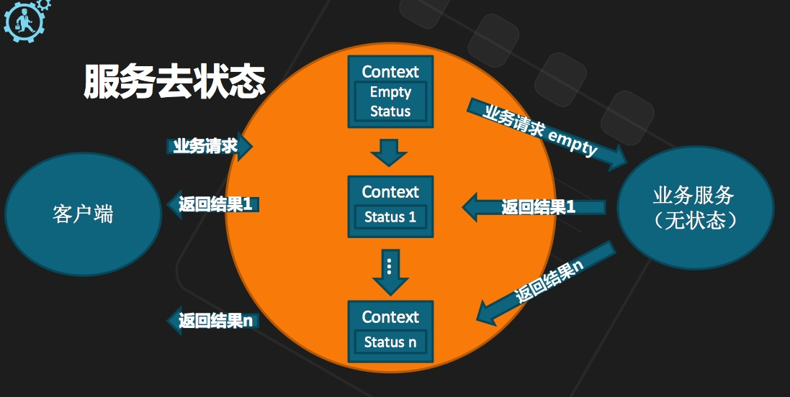


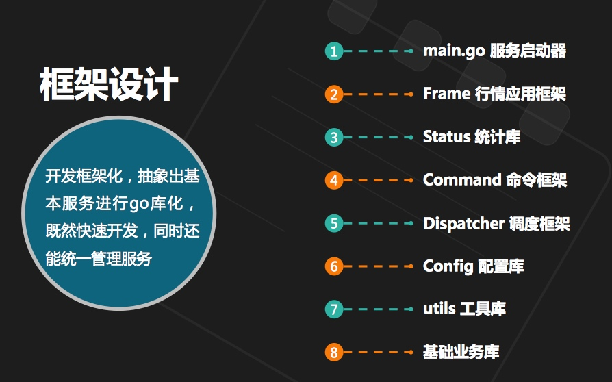


以上是对本次 Gopher China 2017 topics 的小结，比较少参与这种垂直会议。前者的一些于会前的准备如基础语言知识，相关工程实践等还是非常重要的~
