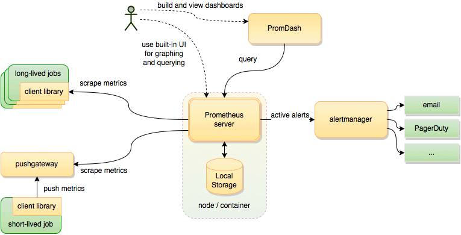
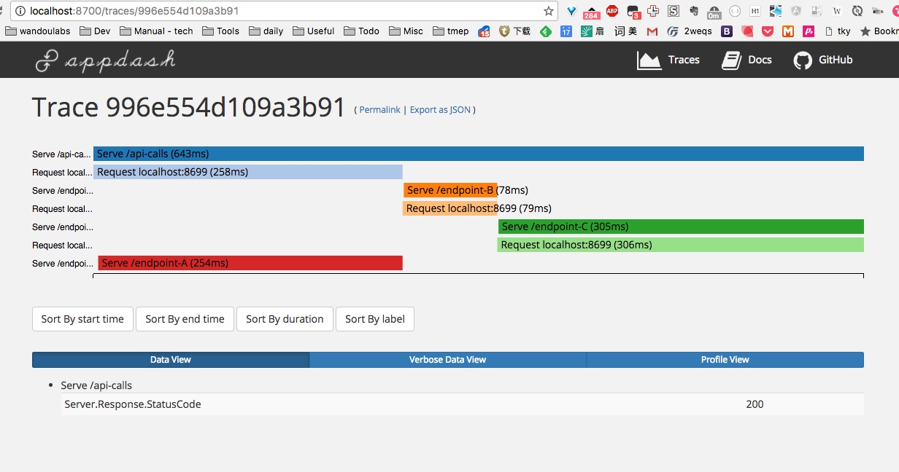
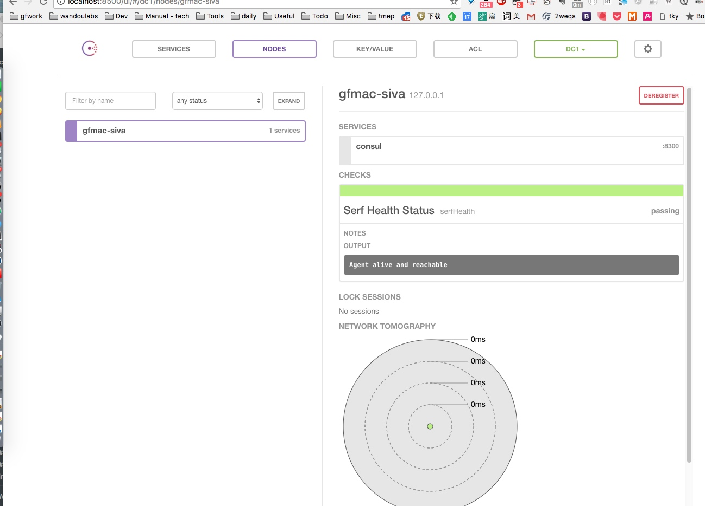

对微服务下重要的组件如 Consul （用于服务发现和分布式键值数据库），Prometheus（服务监控系统和时间序列数据库，做应用的instrument），Zipkin/appdash 分布式系统跟踪系统(背后Dapper以低消耗、对应用透明以及良好的扩展性著称（收集性能数据，便于优化性能瓶颈

下面依次进行了解和上手使用。

### Prometheus
它是开源的服务监控系统和时间序列数据库

对比 statsd 数据模型：
StatsD在所有监控实例上聚合数据（从而不能深入到个别有问题的实例）. 它的度量指标是由于dot-separated的隐式编码的维度（implicitly encode dimensions）. 而 Prometheus 是把维度显式的用 key-value 对的形式（label）来标注

- stats.api-server.tracks.post.500 -> 93
- api_server_http_requests_total{method="POST",handler="/tracks",status="500",instance="<sample1>"} -> 34

其他存储的区别和架构上的区别

背景：
montioring 对系统目前的状况了然
alerting 不要等到老板找到你！
info 提供：相关信息周边来定位问题 （prevent等）

service level indicator, objective(latency 要低于，9999可用性 )
metrics（series - latency，server load、 计算相关性correlation）

分层：
app 框架代码
dependencies（中间件
environment（运行环境如操作系统和计算资源等
biz业务指标 - 最终体现

Prometheus是主动去采集pull，而不是通过agent埋点push
pull problems - short lived jobs (通过 pushgateway)
target discovery （结合 consul，新的监控实例通过consul，而不需要动态调整实例后更新'prometheus'配置的targets）
最好是跑在一个网络下（不需要公网）

pull advantages: 
multiple prometheus easy (高可用 - run multiple parameters service and point them at the same exports  就可以了)，（譬如多个环境的，只需要启动test下的P然后target指定原来的，多pull就好）
outage detection（很容易发现对方是否有问题-去主动拉取的时候，是否正常返回等）
predictable, no self-DOS（traffic/congest/等）
easy to instrument 3rd parties(exportors)

## graph

PromDash, to create custom dashboards 高度定制和better-looking
但现在可以统一使用 Grafana 来配置和显示。

setInterval(function() {
    c.inc({ code: 400 });
}, 500);

rate(test_counter[20s]) 
sum(rate(test_counter[20s])) 多个序列如不同的label的求和（这个metrics每秒变化的个数）

rate - 这个counter 1s中增加x个值（在5m观察范围内 - 小一些可以看出更抖动的速率攀升）

按照10min来观察，90分位的值都是多少
setInterval(function() {
    h.labels('200').observe(Math.random());
}, Math.random()*6000);

histogram_quantile(
 0.9, rate(
 test_histogram_bucket[10m]
))

## alert

Prometheus 启动时要被告知 alertmanager.url，同时它的配置文件要知道什么时候告警。rule 如下： 当遇到告警告诉给alertmanager，alert manager 根据它自己的配置怎么怎么处理（如aggregation、silencing、inhibition 后再 send notification via receiver 等）

安装：
$ GO15VENDOREXPERIMENT=1 go get github.com/prometheus/alertmanager/cmd/...
$ cd $GOPATH/src/github.com/prometheus/alertmanager
$ alertmanager -config.file=<your_file>
然后进入到  # cd $GOPATH/src/github.com/prometheus/alertmanager examples 中运行echo 和 ha中的测试

该规则就是当 gauge 指标large then 0.9 就把一些信息汇总并且报告（其他配置在config中如group by, wait, interval 等

ALERT APIRandomLarge09
  IF test_gauge > 0.9
  ANNOTATIONS {
    summary = "node client gauge random large than 0.95 on {{ $labels.instance }}",
    description = "{{ $labels.instance }} random value is (current value: {{ $value }}s)",
  }

界面：

### Appdash - 分布式系统跟踪系统

Appdash则是sourcegraph开源的一款用Go实现的分布式系统跟踪工具套件，它同样是以google的 dapper为原型设计和实现的

Spans: 一个服务调用的跨度，在实现中用SpanId标识
Event: 显示UI上的追踪信息. 显式使用event埋点，吐出跟踪信息，也可以使用Appdash封装好的包接口
Recorder: Recorder是用来发送event给Appdash的Collector的，每个Recorder会与一个特定的span相关联
Collector: 从Recorder那接收Annotation（即encoded event）。通常一个appdash server会运行一个Collector，监听某个跟踪信息收集端口，将收到的信息存储在Store中

譬如http用户请求背后 by calling other components in your system, which in turn make various API and DB calls(The HTTP handler's span includes all downstream operations and their descendents) appdash constructs a tree of all the oeprations(during the handling of the http request)
Appdash中SpanId由三部分组成：TraceID/SpanID/parentSpanID
frontservice: SpanId = xxxxx/nnnn1，该span为root span：traceid=xxxxx, spanid=nnnn1，parent span id为空。
serviceB1: SpanId = xxxxx/nnnn3-1/nnnn3，该span为serviceB的child span，traceid=xxxxx, spanid=nnnn3-1，parent span id为serviceB的spanid：nnnn3

$GOPATH/bin/appdash demo

### Consul - 服务发现和分布式键值数据库

构建一个高可用的分布式键值数据库，基于Go。分布式系统中，各种服务的配置信息的管理分享，服务的发现是一个很基本同时也是很重要的问题

运行 consul: consul agent -dev
浏览如下地址： localhost:8500

echo '{"service": {"name": "stringsvc", "tags": [], "port": 8080}}' \
    | sudo tee /etc/consul.d/stringsvc.json

