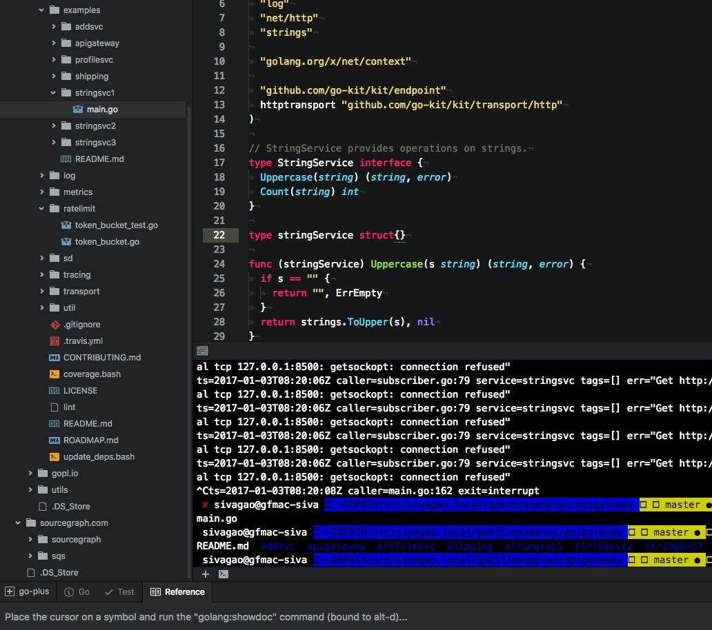

### 安装和上手

安装：
https://golang.org/doc/install#install
mac package installer -
go 执行文件在 /usr/local/go 下
$PATH 环境变量下添加 /usr/local/go/bin

使用：
在你的dotfiles中（.bashrc或.zshrc ）添加如下：
export GOPATH=~/projects/topics/golang

其中的 src 放源代码，bin 放构建打包好的工具

```shell
├── bin
│   ├── appdash
......
│   ├── gocode
│   ├── godef
│   ├── godex
│   ├── gogetdoc
│   ├── gohello
│   ├── goimports
......
│   └── toolstash
├── pkg
│   └── darwin_amd64
......
└── src
    ├── github.com
    ......
    │   ├── go-kit
    │   ├── go-logfmt
    │   ├── golang
    │   ├── google
    ......
    ├── golang.org
    │   └── x
    ├── google.golang.org
    │   └── grpc
    ├── sivagao.local
    │   ├── go-gin-app-master
    │   ├── gobyexample
    │   ├── gokit
    │   ├── gopl.io
    │   └── utils
    └── sourcegraph.com
```

go install github.com/gaohailang/gohello 此时文件落地于：src/github.com/gaohailang/gohello
运行相应的命令：$GOPATH/bin/gohello

go run 运行


### 语法篇

另外再讲，可看如下资料

### 工具篇

Golang 周边有不少好用稳定的工具，用于代码格式化、检查、代码重构和补全等。也有用于打包和管理依赖等（如 gb, glide, gvt, govendor, 和 vendetta）
这有一些是包含在二进制的Go发行版本中的如godoc, vet 等。其他第三方工具可以使用 go get 来安装（如$ go get github.com/golang/lint/golint


govet：
Govet关注正确性

golint：
golint打印出风格错误。 golint关注编码风格(和 govet 的区别

gofmt：
Gofmt重新格式化源代码/ gofmt -w goroutines.go

goimports
goimports是一个工具，可以更新您的Go import导入行，添加缺失的和删除未引用的包。它的行为与gofmt（插入替换）相同，但除了代码格式化，还包含模块导入。

gorename：
重构中的rename。工作区感知（当前包中，如果使用它重命名导出的标识符，它检查GOPATH中的所有包使用该标识符）。 type-ware（拒绝执行让代码无法正确编译的更改

goreturns：
场景：多值返回时，返回错误通常还需要返回一个或多个零值避免手动指定这些非错误的默认值。

go generate：
应该替换Go软件包中makefiles和shell脚本的各种用法。它寻找指令来执行程序的指令（特殊注释表）

godef：
“go to definition” - 能够跳转到常量，变量和函数的定义（打印关于标识符的信息）go生成的示例使用包括运行yacc将语法文件转换为Go代码，从protobuff定义生成Go代码，将二进制文件嵌入Go程序中。一般需要手动运行然后把生成放入vcs中等

gocode：
Gocode提供上下文敏感的自动完成，并使用客户端/服务器体系结构，其中服务器是缓存守护程序，客户端是命令行实用程序以及所有流行的编辑器。例如解析被导入的对象文件等


### IDE & Editor

主要讲在 atom 中一些插件和配置的使用

安装主题（如 monokai-seti），编程字体（Hack或Inconsolata），语法支持（如Docker，protobuf

安装 go-plus 编辑器插件（提供构建支持，linters检查工具，格式化和覆盖率工具，还有一些代码补全snippets等
它背后需要go-plus支持（通过命令行 go get 安装 go get -u golang.org/x/tools/cmd/...
PS：网络超时问题可以使用 http_proxy 命令行环境变量设置代理

从而可以在编辑中发现一些错误（无法构建等

安装 go-rename 编辑器支持 https://atom.io/packages/go-rename

- 使用ctags(gotags)来快速跳转
- debug调试工具 delve
	brew install go-delve/delve/delve
	https://github.com/derekparker/delve/tree/master/Documentation/cli


#### 其他 Atom 配置：

- file-icons：让sidebar的文件显示各种类型图标等 https://atom.io/packages/file-icons
- 自定义编辑器界面样式
- 为编辑器添加代码片段支持
- Dash 集成（可以在编辑器中快捷调转到 dash 中对应文档 https://atom.io/packages/dash：
	ctrl-h 在dash中查找文档
- terminal集成（对比 terminal-plus 和 atom-term2

修复term2 安装问题：
cd ~/.atom/packages
git clone https://github.com/svenax/atom-term2.git
cd atom-term2
git checkout update-pty.js
apm install
sudo apm link


reference：http://marcio.io/2015/07/supercharging-atom-editor-for-go-development/

