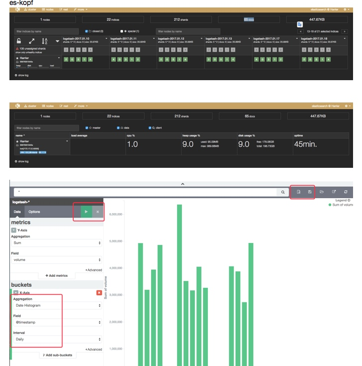
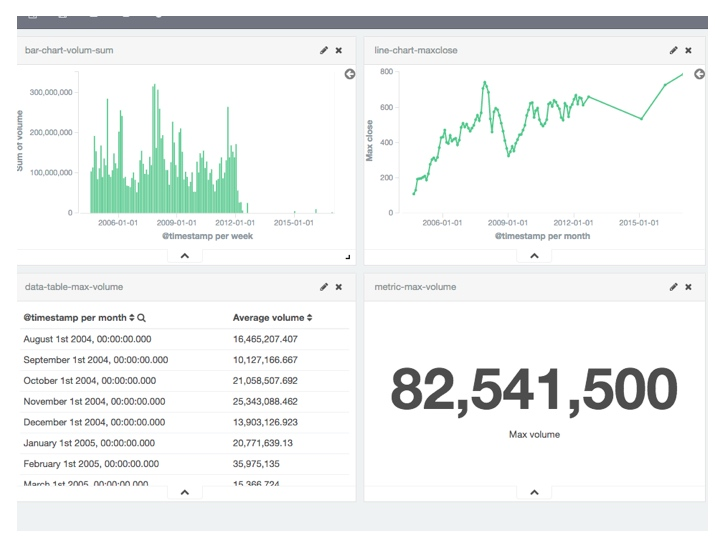
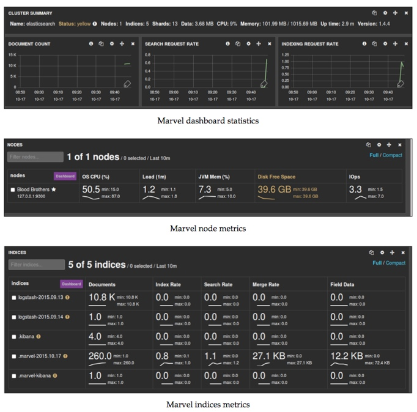
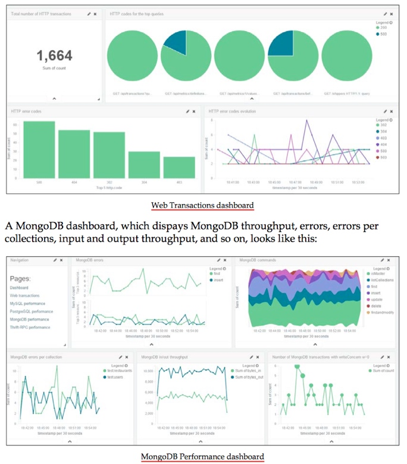

最近花了一天时间，根据 ELK 这本书（笔记如下），然后在 AWS 上的机器上搭建做了试验（机器和一些fixtures 数据在），感兴趣的同学可以到机器上继续实验。

机器如下：
Host devaws.gf
  Hostname 54.222.242.232
  User ubuntu

目录如下：

```sh
ubuntu@ip-10-71-137-164:~/projects/learning-elk-stack-book$ tree .
.
├── docker-compose.yml
├── GOOG.csv
├── logstash.conf
└── raw.csv

0 directories, 4 files
ubuntu@ip-10-71-137-164:~/projects/learning-elk-stack-book$ cat *
version: '2'
services:
  elasticsearch:
    image: elasticsearch:1.7.3

  kibana:
    image: kibana:4.1.1
    environment:
      ELASTICSEARCH_URL: http://elasticsearch:9200
    links:
      - elasticsearch
    ports:
      - "3001:5601"
```


## 1: INTRODUCTION TO ELK STACK

- The need for log analysis
  - issue debugging
  - performance analysis
  - security analysis
  - predictive analysis
  - internet of things and logging
      "log data is expected to play a crucial role in understanding system behavior and reducing downtime."
- Challenges in log analysis
  - Non-consistent log format
      "Every application and device logs in its own special way, so each format needs its own expert. Also, it is difficult to search across because of different formats."
  - decentralized logs
      "complexity of log analysis increases with multiple components logging at multiple locations"
  - expert knowledge requirement
      "People interested in getting the required business-centric information out of logs generally don't have access to the logs or may not have the technical expertise to figure out the appropriate information in the quickest possible way"
- The ELK Stack
  - Elasticsearch
      "分布式搜索引擎基于 Apache Lucene. It provides horizontal scalability, reliability, and multitenant capability for real-time search"
      "through JSON over a RESTful API. The searching capabilities are backed by a schema-less Apache Lucene Engine, which allows it to dynamically index data without knowing the structure beforehand"
      "such as multilingual search, geolocation, autocomplete, contextual did-you-mean suggestions, and result snippets"
  - Logstash
      "input, filter: data pipeline that helps collect, parse, and analyze a large variety of structured and unstructured data and events generated across various systems."
      "output: distribution into a variety of outputs like namely file, stdout, Elasticsearch"
  - Kibana
      "discover, visuals, dashboard" real-time analysis, summarization, charting, and debugging capabilities.
- ELK data pipeline
    "logs from multiple application servers are shipped through Logstash shipper to a centralized Logstash indexer. The Logstash indexer will output data to an Elasticsearch cluster, which will be queried by Kibana"
- ELK Stack installation
  - lmenezes/elasticsearch-kopf: web administration tool, perform common tasks on ES cluster, With REST client
    "shows Elasticsearch nodes, shards, a number of documents, size, and also enables querying the documents indexed."
  - logstash
    "bin/logstash -e 'input { stdin { } } output { stdout {} }'"
    -e flag allows you to quickly test the configuration from the command line.
    较大的性能损耗send logs with it from small machine without harming application perfmrance: Logstash runs on JVM and consumes a hefty amount of resources to do so. Logstash, at times, has significant memory consumption
    The forwarder uses Lumberjack's protocol, enabling you to securely ship compressed logs, thus reducing resource consumption and bandwidth.
    也可以使用 rsyslog, Log-Courier 来分发 logs（集中式的 logstash indexer input lumberjack:port=>xxx）
  - kibana
      discovery: submitting search queries, filtering the search results, and viewing document data, showing distribution of documents over time
      visualize: area, data table, metric, line chart, vertical bar chart 等
      dashboard: a collection of saved visualizations in different groups.
      settings: configure Elasticsearch indexes/ shows various indexed fields in one index pattern and data types of those fields. / 配置计算字段

## 2: BUILDING YOUR FIRST DATA PIPELINE WITH ELK

  "使用 yahoo finance 中 GOOG 股票数据来 logstash 来收集解析和传入 ES，然后使用可视化【x, y轴。row/column】 chart，最后dashboard"

- Input dataset
- Configuring Logstash input
- Filtering and processing input
- Putting data to Elasticsearch
- Visualizing with Kibana

## 3: COLLECT, PARSE AND TRANSFORM DATA WITH LOGSTASH

- Configuring Logstash
- Logstash plugins
  - input: streams log events from
    file, stdin, syslog(over the network), lumberjack, ganglia
  - filter: transform by one by as order defined in conf
    date(时间日期格式解析), drop, grok, multiline(parse multiple lines as one event), mutate(格式转换字符串到特定类型number，array等)
  - output: writes event to
    file, elasticsearch, kafka topic, redis(writes events to redis queue and is used as a broker)

## 4: CREATING CUSTOM LOGSTASH PLUGINS

- Logstash plugin management
- Plugin lifecycle management
- Structure of a Logstash plugin

## 5: WHY DO WE NEED ELASTICSEARCH IN ELK?

- Why Elasticsearch?
- Elasticsearch basic concepts
  - index
    "default index pattern "logstash-%{+YYYY.MM.dd}". It partitions indices by day so that it can easily be searched and deleted if required"
  - document
  - field
  - type
    "Type is used to provide a logical partition inside the indices." 譬如 type:post, type:comment 等
  - mapping
    "map each field of the document with its corresponding data type, such as string, integer, float, double, date, and so on. Elasticsearch creates a mapping for the fields automatically during index creation"
  - shard
    "Each document in an Elasticsearch index is stored on one primary shard and a number of replica shards."
  - cluster
  - node
    each node can have its own conf defiend in elasticsearch.yml 中。三个 roles: data node, master node, routing node as land balance
- Exploring the Elasticsearch API
  - list indices, nodes in cluster, health of cluster, create/retrieve/delete index/documents
- Elasticsearch Query DSL
- Elasticsearch plugins

## 6: FINDING INSIGHTS WITH KIBANA

- Kibana 4 features
- Kibana interface

## 7: KIBANA – VISUALIZATION AND DASHBOARD

- Visualize page
- Dashboard page

## 8: PUTTING IT ALL TOGETHER

  "使用 Apache log 进行一次 ELK 集成和分析"

- Input dataset
- Configuring Logstash input
- Visualizing with Kibana

## 9: ELK STACK IN PRODUCTION

- Prevention of data loss
    Redis in front of logstash indexer, as message broker can help in these situations (Logstash may slow down while indexing data to Elasticsearch) where it can buffer the data while Logstash is busy indexing to Elasticsearch
- Data protection
    Elasticsearch shield can be used to provide index level access control to your data in Elasticsearch.shield is not free and is a part of a paid service provided by Elastic.
- System scalability
    扩容方案 logstash snipper 是随着应用实例成比例的，redis cluster, logstash cluster, elasticsearch(master and data nodes, routing nodes)
- Data retention
    『a process to automatically delete old indices after a certain defined period.』
    curator --host 10.0.0.7 delete indices --older-than 10 --time-unit days \ --timestring '%Y.%m.%d'
- ELK Stack implementations
   在应用中常见的做法，把metrcis web transaction，中间件的数据导入到ELK中便于分析如慢查询等情况
- ELK at SCA
- ELK at Cliffhanger Solutions
- Kibana demo – Packetbeat dashboard

1## 0: EXPANDING HORIZONS WITH ELK

- Elasticsearch plugins and utilities
- ELK roadmap


## 实战纪要


logstash:
- logstash-collector, logstash-indexer, redis

kopf:


Learning ELK stack

1 intro to ELK stack
need for log analysis
challenges in log analysis
- non-consistent log format Log格式不一致
- decentralized logs Log文件分散
- expert knowledge requirement 需要专家知识


bin/logstash -e 'input { stdin { } } output { stdout {} }'
output { stdout { codec => rubydebug }}
{
"message" => " Hello PacktPub",
"@timestamp" => "2015-05-20T23:48:05.335Z",
"@version" => "1",
"host" => "packtpub"
}
input {
  file {
       type => "apache"
      path => "/user/packtpub/intro-to-elk/elk.log"
  }
}
output {
  elasticsearch: { host = localhost}
}
to see indexes in Elasticsearch through: /_search
logstash config 可以有不同的 section for each type of plugins.
if you specify multiple filters, they are applied in the order of their appearance in the configuration file


https://hub.docker.com/_/logstash/

docker-compose up


docker run -it --rm logstash -e 'input { stdin { } } output { stdout { } }'
<!-- docker: Error response from daemon: Cannot link to /learningelkstackbook_elasticsearch_1, as it does not belong to the default network -->

docker-compose stop

docker run -d --name=elasticsearch -e ES_JAVA_OPTS="-Xms4000m -Xmx4000m" elasticsearch:1.7.3

docker run -d -p 3001:5601 --link elasticsearch:elasticsearch --name kibna -e "ELASTICSEARCH_URL=http://elasticsearch:9200" kibana:4.1.1

 logstash -f /config-dir/logstash.conf -t 校验配置的格式： " Unknown setting 'host' for elasticsearch"
 更改格式为：hosts => ["elasticsearch"]

 运行并且验证，在kibana 上可视化查看等：
 echo "2017-01-09,806.400024,809.966003,802.830017,806.650024,1272400,806.650024" >> GOOG.csv，动态添加等

docker run -it --rm  --link elasticsearch:elasticsearch -v "$PWD":/config-dir logstash -f /config-dir/logstash.conf

使用kopf 插件
https://hub.docker.com/_/elasticsearch/
https://github.com/lmenezes/elasticsearch-kopf/tree/master/docker
docker run -d -p 3000:80 -e KOPF_SERVER_NAME=grafana.dev \
    -e KOPF_ES_SERVERS=es.dev:9200 --name kopf lmenezes/elasticsearch-kopf

docker run -d -p 3000:80 -e KOPF_ES_SERVERS=elasticsearch:9200 -e KOPF_SERVER_NAME=grafana.dev \
  --link elasticsearch:elasticsearch --name es-kopf lmenezes/elasticsearch-kopf
// 注意KOPF_ES_SERVERS包含端口号！

开始玩 kibana 图片（visuals, dashboard 照着书）

下载新的GOOG.csv数据
清空旧的脏数据，在 kopf 上可以rest client 调用es
DELETE /_all
curl -XDELETE 'http://localhost:9200/_all'

瞬时导入大量数据导致：1/21/2017 4:53:30 PMjava.lang.OutOfMemoryError: Java heap space

Elasticsearch uses a hybrid mmapfs / niofs directory by default to store its indices. The default operating system limits on mmap counts is likely to be too low
sysctl -w vm.max_map_count=262144

ES_JAVA_OPTS="-Xms4000m -Xmx4000m"

在 rancher 中观察host机器上的docker container（即使没在rancher stack下运行），进入后可以看logs等还有负载，很有用！

做了些可视化







仅仅才2k多的document消费起来居然那么慢。。。（后续调优！！）

// 写脚本，每隔n秒，插入几个到 csv 文件然后 es 中


## Putting it all together
the commonly used grok patterns are already included with the Logstash installation.
.

https://github.com/logstash-plugins/logstash-patterns-core/tree/master/patterns

譬如：COMMONAPACHELOG %{IPORHOST:clientip} %{USER:ident} %{USER:auth} \[%{HTTPDATE:timestamp}\] "(?:%{WORD:verb} %{NOTSPACE:request}(?: HTTP/%{NUMBER:httpversion})?|%{DATA:rawrequest})" %{NUMBER:response} (?:%{NUMBER:bytes}|-)

```conf
input{
  file{
    path =>"/var/lib/tomcat7/logs/localhost_access_log.txt"
    start_position =>"beginning"
  }
}

filter{
  grok {
    match => { "message" => "%{COMMONAPACHELOG}" }
  }

  date{
    match => ["timestamp","dd/MMM/yyyy:HH:mm:ss Z"]
  }

  mutate{
    convert => ["response","integer"]
    convert => ["bytes","integer"]
  }
}

output{
  elasticsearch {
    host => "localhost"
  }
}
```

Kibana discover 界面中的查询：
基于field 和逻辑组合
clientip:10.0.2.2 AND verb:GET

build a vertical split bar chart showing the number of requests split across multiple clients.
use sub aggregation using the Split Bars feature, and split it using the clientip term:


使用 markdown 来 构建 dashboard
build one Markdown to give an explanation of our Dashboard:


PS:
You have to send a DELETE request to
http://[your_host]:9200/[your_index_name_here]
You can also delete a single document:
http://[your_host]:9200/[your_index_name_here]/[your_type_here]/[your_doc_id]


## 截图实践






