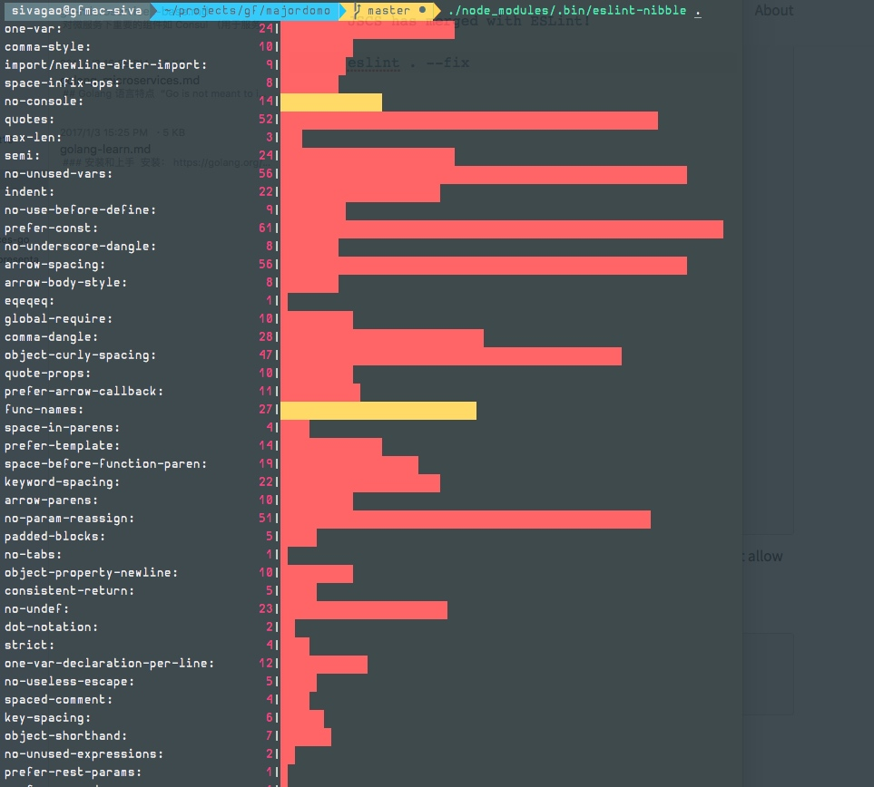
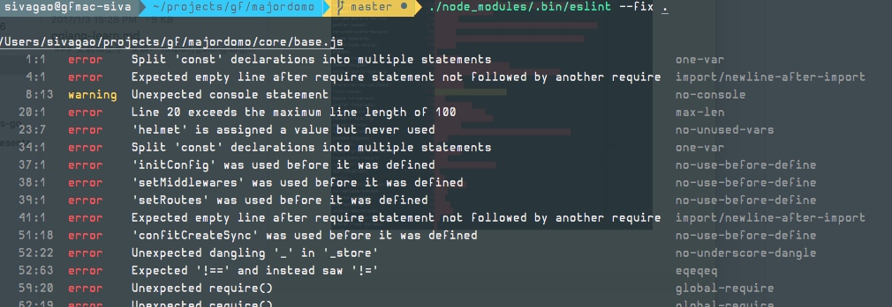
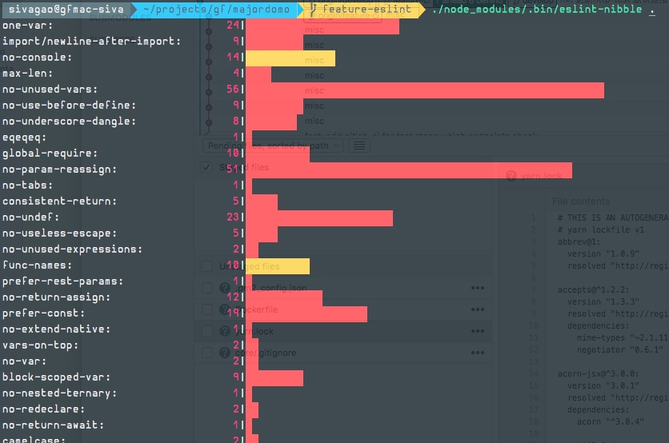

Git 仓库的代码保持良好优化统一的代码风格（style-guide），是该项目是否易于维护和持续开发的基础条件。我们要把linting & formating 加入到开发的workflow中得以保证（如npm test 前或git commit hook前）。
但是难免有时候接受老项目代码或者之前项目没有严格执行 linting 等，这时候就需要我们全局统一做一次 refactor 来处理，便于为以后的良好遵守童子军原则提供好的基础。
PS：童子军原则：eave the campground cleaner than you found it. 他们在离开营地前要收拾自己带来的垃圾甚至是前任留下的，确保走之后被来之前更干净。


记录将老旧仓库代码使用 eslint 改善到规范的过程。

### 筛选

- jslint, jshint 老一代的工具，逐渐过时。
- 后 es6 时代的选择：standard(npm install standard) 和 eslint
- 同时还有 xo(基于eslint，提供)，jscs（现在被merged 到 eslint，同时让 eslint 支持--fix，自动按照rule改文件）

### 安装
yarn add eslint --dev
使用 eslint
./node_modules/.bin/eslint --init
? How would you like to configure ESLint? Use a popular style guide
? Which style guide do you want to follow? Airbnb
? Do you use React? No
? What format do you want your config file to be in? JavaScript

继续通过 yarn add 安装如下插件：

"eslint-plugin-import": "^2.2.0",
"eslint-config-airbnb-base": "^11.0.1",
"babel-eslint": "^7.1.1",

### 配置

配置文件如下：

其中 config-airbnb-base 为 配置文件中 extends 的配置值，它是以 Github 上流行的 airbnb JavaScript StyleGuide 为基础提供的rules配置集合。
同时 eslint-plugin-import 是 插件，为我们提供额外的 rules
最后， babel-eslint 是 parser（因为我们代码中涉及ES2016/ES7 code like async and await），用它来取代默认的 Espree parser.


编辑器工具：linter-eslint (atom)


注意点：

- ignoring files: .eslintignore 配置文件（语法和 .gitignore 类似）
- integrations: 和构建工具整合（如npm scripts 中的 test或 git hook，便于上测试运行和提交代码前运行 lint ）

### workflow

对于新文件，可以通过编辑器插件保存时候对代码进行 scan 和 format，对于无法自动改造的rules，需要手动改造（可以在编辑器preview 或者在本地测试或提交前审核，发现问题）

对于老旧文件，可能会存在较多的问题（上百上千），这时候需要一个好的workflow 帮助我们快速解决问题。

这里引入工具 eslint-nibble https://github.com/IanVS/eslint-nibble. 它其实有两部分组成。首先是使用 eslint-stats 和 eslint-summary 显示有问题的规则校验结果和摘要（这样可以快速预览下主要问题集中），然后是选定特定规则，它将只显示来自该特定规则的错误，包括您的代码片段，以显示每个错误的问题所在


- 使用 eslint-nibble 快速预览下先有问题和主要分布



28 files checked.  0 passed.  28 failed.  41 warnings.  756 errors.


- 使用 eslint --fix . 用工具 auto format(jscs) 批量快速解决现有问题解决 （可以发现从进八百个错误和warning 降低到两百多个）





28 files checked.  0 passed.  28 failed.  24 warnings.  272 errors.

- 继续使用 eslint-nibble 两步骤，逐步解决遇到的问题，直至如下，


### 实战

下面罗列下主要出现的错误和对应的规则，便于后续编写代码快速回避这些问题：

- no-return-assign: Disallow Assignment in return Statement
不要在函数 body 结尾出现类似于 return foo = bar + 2;

-
module.exports = (router) => { 对于arrow function 需要有() 对param

- no-undef:
不要出现使用没有先定义好的变量和函数（global或hoist），对于mocha等测试工具提供的 describe, after, it 等，可以通过配置 .eslintrc 环境有 mocha:

"mocha": true // adds all of the Mocha testing global variables

```shell
? Type in the rule you want to focus on no-undef

  ✘  http://eslint.org/docs/rules/no-undef  'describe' is not defined
  /Users/sivagao/projects/gf/majordomo/core/test/test-acl.js:8:1
  describe('test-acl', () => {
```

- prefer-const:  require const declarations for variables that are never reassigned after declared
如果用 var/let 申明的变量在后续代码中没有被重新赋值，那么建议直接用 const

- global-require: （可以关掉）
require require() calls to be placed at top-level module scope
要求把所有的 require(module) 放在文件开头便于明确该文件模块的依赖

- max-len:
该行代码字符不要超过100字符

- no-empty:

- camelcase:
变量名风格统一，如 crsf_token 改为 crsfToken

- prefer-rest-params:
不要在代码中出现使用特殊的 arguments，而是直接使用 rest parameters

- import/no-extraneous-dependencies
报错信息：'supertest' should be listed in the project's dependencies, not devDependencies. 而我们知道在测试脚本中需要运用在 devDependencies 的依赖，所以需要配置放行如下：
"import/no-extraneous-dependencies": ["error", {"devDependencies": ["**/test/*.js"]}]


### 总结

基于 airbnb-base ，但为了使用方便对于个别选项参考 eslint 官方提供的基础 extends: eslint:recommended 中约束的微调。该全部 rules 如下 http://eslint.org/docs/rules/（其中打勾为官方推荐）

Tips：

- 对于一些拿捏不准的标准，可以适当降低级别。off 0, warning 1, error 2.
- 对于无法避免的个别case，可以通过在代码文件 inline comment 的形式，放行如：

```js
try {} catch (err) {
    if (err == null) {
      /* eslint "no-ex-assign": "off" */
      err = new Error('Null or undefined error');
    }
    // some errors will have .status
    // however this is not a guarantee
    ctx.status = err.status || 500;
}
```

最终项目修改tweak后的配置如下：

```javascript
// .eslintrc.js
module.exports = {
    "extends": "airbnb-base", // eslint:recommended 官方提供
    "plugins": [
        "import"
    ],
    "env": {
      "node": true, // Node.js global variables and Node.js scoping.
      "mocha": true // adds all of the Mocha testing global variables.
    },
    "rules": {
      "one-var": "off",
      "no-param-reassign": "off", // allow Reassignment of Function Parameters
      "no-unused-vars": "off", // allow unused variables, such as next, err in cb
      "no-return-assign": "off", // return this.body = xxx
      "one-var-declaration-per-line": ["error", "initializations"],
      "no-underscore-dangle": "off",
      "consistent-return": "off", // require return statements to either always or never specify values
      "global-require": "off",
      "no-nested-ternary": "off",
      "no-use-before-define": ["error", { "functions": false }], // fucntion call be use first define later(hoist)
      "no-unused-expressions": "off",
      "no-nested-ternary": "off",
      "no-empty": ["error", { "allowEmptyCatch": true }]
    }
};

```
