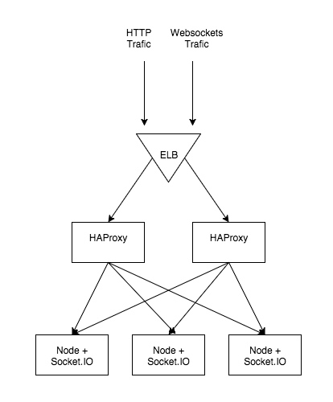
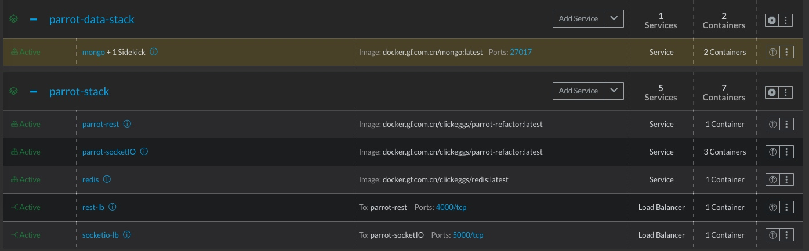
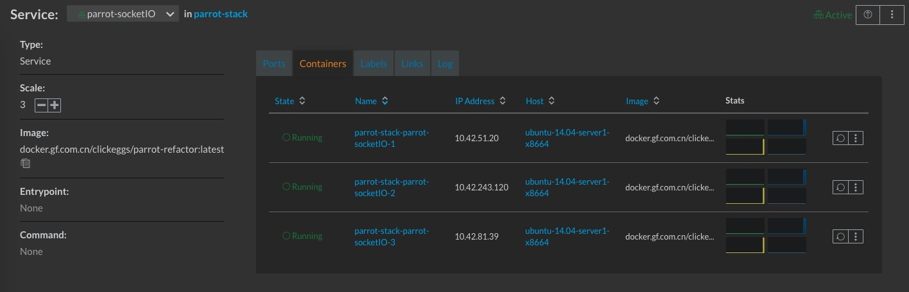
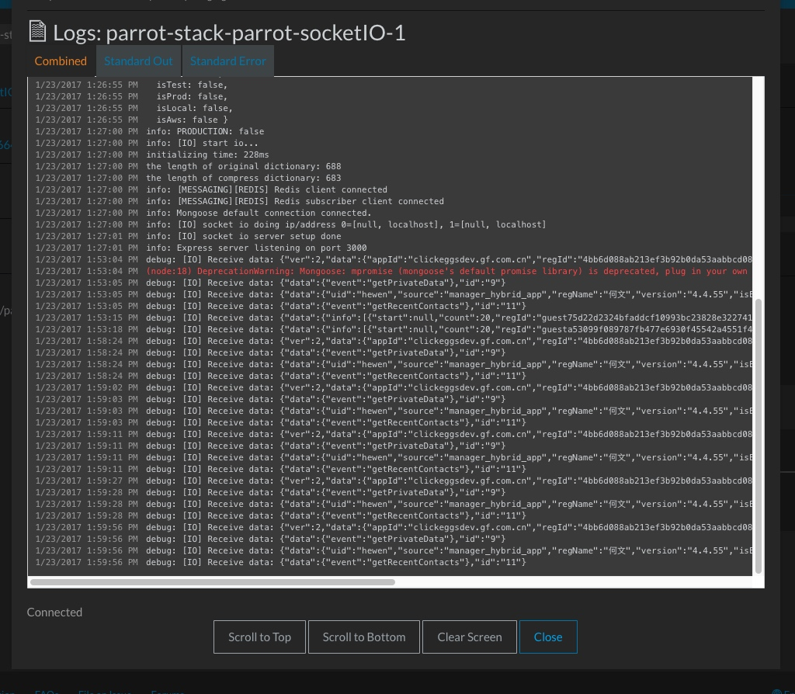
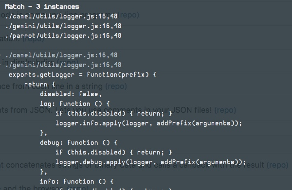
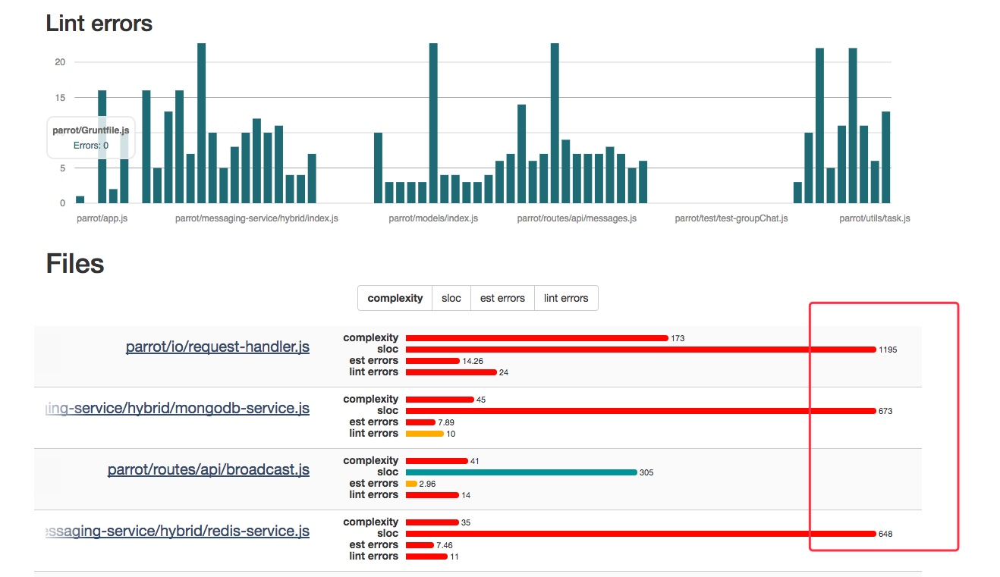

### 背景介绍：
聊天服务部署在云上 AWS 上，由于费用问题（比起自建机房高出很多，如去年就花费了三四百万元）还有若干网络问题（AWS Zone north-cn 到广发广州的马场机房网络质量很差）等，今年觉得把服务迁移下云。AWS 环境独立存在也部署了不少基础服务如 docker-aws.gf docker registry，stats/graphite/grafana 等。

同时，由于之前的应用部署已经使用了 Docker 容器化，但是没有使用容器的 Orchestration 编排自动部署和管理平台（如 gf's eagle, rancher 等），所以这次改造涉及相关的容器编排和管理平台整合。

聊天的代码是 ES5 的，现在看起来颇为过时和老气，里面主要异步处理使用bluebird 的Promise 层层then。在文章尾部有使用 jsinspect(检查出代码中结构类似和copy-pasted的部分)还有 plato（静态分析复杂度分析）等工具的简要分析，为改造提供质量衡量的 benchmark

经过分析和一步步实践，我们的改造任务如下：


### 代码改造：

- config profile
- 剥离远 hard-coded LB
- ES6 化和验证（测试用例和watch）

#### 环境配置

原先项目在 misc 目录下维护类似于 config-production.js, config-aws.js, config-dev.js 等若干配置文件，不同环境下运行需要手动 cp config-<env>.js 到项目入口处为 config.js，然后通过utils.config 解析和包装 config.js提供的（如再从环境变量做一些 merge 和 变体），非常不灵活。

之前在 Spring Boot 下开发它们有灵活的配置优先级和指定的方法。参见 Spring Boot In Action


它通过层层优先级覆盖，实现灵活的override 和 不同环境的特定申明。我们新的配置方法如下：

- default properties (conf/base.js)
- config/<env>.js
- config/<env-modifier>.js
- 操作系统环境变量

首先应用有自己的默认配置，定义一些常见的不常改变的配置。通过应用有不同环境stages（develop, test, uat, prod 等）和不同变体下的(local, aws, aliyun）等配置落地在 config 目录下 的 <env>.js, <modifier>.js 中若干。它们是特定环境下的配置（如不同的env profile 下用不同的db连接等），通过程序运行时，config lib 自动读取约定好的 NODE_ENV, NODE_ENV_MODIFIER 拿到目前的环境（如 prod, aws）则会自动载入和覆写base config。最后基于环境变量，可以提供最后的最高优先级的复写，对于某些具体的变量需要在运行打包好的容器时候指定。

#### 剥离远 hard-coded LB

原先实现中的， 聊天分为 RESTful server 和 Socket.io servers ，后者是具体聊天的 websocket 连接的服务器，它使用了应用维护的连接负载数据从而为 RESTful server 中为客户端提供的 /api/server 拿取可用并负载低的 socket.io server 提供数据（通过 redis 数据结构， startHeart）

同时因为在生成环境下要https协议还有 AWS EC2 上本机ip拉取方式（需要调用 AWS的接口），这里需要一个hard-coded的主机ip对可用域名的链接（https://conn1.gf类似），在后续的容器化扩缩容环境下必须要提前改造。原先部署参考 [聊天线上部署](http://wiki.gf.com.cn/pages/viewpage.action?pageId=43072122)

我们预期改造为如下的方式，不需要需要应用端实现，而是使用 HAProxy 做负载均衡和规范化的LB算法，从而在量级下也会呈现较为平均的分布。



#### ES6 化和验证（测试用例和watch）

要将之前的老旧的若干成百上千的大文件升级到 ES6 下，还是颇有挑战的。参考 [eslint & eslint-nibble workflow 代码改造（高海浪）](http://wiki.gf.com.cn/pages/viewpage.action?pageId=43070890)中的workflow 已经可以为整个过程加速和无痛化不少。

但是要确保逻辑的改变前后的正确运行，需要在一步步改造代码时同时确保每次的正确性。这里使用 node-watch 来在每次文件被修改改造后运行运行的测试用例，来确保。

```js
    "watch": "npm-watch"
  },
  "watch": {
    "start": "**/*.js",
    "test": "**/*.js"
  },
```


### 服务描述：

- compose
- 数据容器
- LB for restful
- LB for socket.io HaProxy

那我们把第一步的基础工作准备好后，可以改造CI/CD流程了。原先聊天测试环境为了方便是直接使用 pm2 start 方式（好改代码？ docker cp 和 docker run -v 形式取代快速调试）因为我们之前的工作（环境剥离和外部指定调整），我们觉得使用一套代码镜像，通过在不同环境中使用环境变量来drive.


#### Compose 描述

之前的部署是单独部署独立的应用容器，现在通过 docker-compose.yml 来完整描述整个应用的stack，下面是部分的（还有四个 plugins docker images, 还有外部的存储和消息推送的容器等）

```yml
version: '2'
services:
  parrot-rest:
    image: docker.gf.com.cn/clickeggs/parrot-refactor:latest
    labels:
      io.rancher.container.pull_image: always
    ports:
      - "3000:3000"
    depends_on:
      - mongo
      - redis
    environment:
      NODE_ENV_MODIFIER: rancher
      RUNTIME_MODE: rancher
      # HTTP_PORT: 3001
      DISABLE_HEARTBEAT: true
      SOCKETIO_LB_HOST: parrot-socketIO:3000
      REDIS_HOST: redis
      MONGO_DB_CONNECTION_STRING: mongodb://mongo:27017/gf-aws-chat

  parrot-socketIO:
    image: docker.gf.com.cn/clickeggs/parrot-refactor:latest
    labels:
      io.rancher.container.pull_image: always
    depends_on:
      - mongo
      - redis
    environment:
      NODE_ENV_MODIFIER: rancher
      RUNTIME_MODE: rancher
      # HTTP_PORT: 3000
      DISABLE_HEARTBEAT: false
      REDIS_HOST: redis
      MONGO_DB_CONNECTION_STRING: mongodb://mongo:27017/gf-aws-chat

  mongo:
    image: docker.gf.com.cn/mongo:latest
    labels:
      io.rancher.container.pull_image: always

  redis:
    image: docker.gf.com.cn/clickeggs/redis:latest
    labels:
      io.rancher.container.pull_image: always
```

#### 数据容器

为了数据存储卷的独立和后续更新调整应用stack时，保证数据的迁移和持久化，我们把数据独立出来作为单独的 stack，而应用stack只需要通过external link的形式消费和使用

这里使用了 io.rancher.sidekicks 帮 mongodata 和 mongo 服务绑在一起，让 rancher cattle 等编排时候确保是同主机同 ratio scale

```yml
version: '2'
services:
  mongodata:
    image: docker.gf.com.cn/mongo:latest
    entrypoint:
      - /bin/true
    network_mode: none
    volumes:
      - /data/db
    labels:
      io.rancher.container.start_once: 'true'
      io.rancher.container.hostname_override: container_name
      io.rancher.container.pull_image: always

  mongo:
    image: docker.gf.com.cn/mongo:latest
    labels:
      io.rancher.sidekicks: mongodata
      io.rancher.container.pull_image: always
    ports:
      - 27017:27017
    volumes_from:
      - mongodata
```

#### LB for restful

新的部署，我们不再使用多余的每台host上有nginx去做LB给具体的node应用，之前是前置的dns 解析到F5 -> 负载到多台hosts，每台hosts又有inline nginx 负载到单host上的多个容器(upstreams）。新架构上完全不需要多余的中间一层。我们使用应用统一的LB服务做 restful http 流量的转发

```yml
  rest-lb:
    image: rancher/lb-service-haproxy:v0.4.6
    ports:
    - 4000:4000/tcp
    labels:
      io.rancher.container.agent.role: environmentAdmin
      io.rancher.container.create_agent: 'true'

  rest-lb:
    scale: 1
    start_on_create: true
    lb_config:
      certs: []
      port_rules:
      - priority: 1
        protocol: http
        service: parrot-rest
        source_port: 4000
        target_port: 3000
```

#### LB for socket.io HaProxy

Rancher 内置的LB 服务是使用HAProxy，而它在 1.5 版本就有对 websockets 的内置支持了，这里需要对它的默认配置做一些tweak:

- 通过添加timeout tunnel 配置为 3600s 在自定义的 haproxy.conf 的默认段中来保持链接维持
- balance 的策略使用 source (来自于同一个IP的被分发到同一台主机means that connections will be assigned to a webserver based on IP address. 因为 from socket.io performing its handshake in the beginning. This means that the second request must end up with the same server as the first one


 ```yml
 backend websockets
  balance source
  option http-server-close
  option forceclose
  server ws-server1 [Address]:[Port] weight 1 maxconn 1024 check
 ```

 后续为了查看 LB 的一些数据，要打开如下配置：

  stats enable
  stats hide-version
  stats realm   Haproxy\ Statistics
  stats uri /haproxy?stats
  stats auth Username:Password


```yml
  socketio-lb:
    image: rancher/lb-service-haproxy:v0.4.6
    ports:
    - 5000:5000/tcp
    labels:
      io.rancher.container.agent.role: environmentAdmin
      io.rancher.container.create_agent: 'true'


    lb_config:
      certs: []
      config: timeout tunnel 3600s
      port_rules:
      - priority: 1
        protocol: http
        service: parrot-socketIO
        source_port: 5000
        target_port: 3000
      stickiness_policy:
        cookie: parrot-sticky
        domain: ''
        indirect: false
        mode: insert
        nocache: false
        postonly: false
```


### 压力测试：

常见的压测工具有ApacheBench，还有JMeter，我们为了测试我们的socket.io 的负载，这里选取有直接支持 socket.io 的压测工具它也可以加入自己的workflow(generators)，来支持更复杂的场景. [weosocket-bench](https://github.com/M6Web/websocket-bench)


但是我们的 WebSocket 的LB 使用 sources 算法后，单主机的ip一样，肯定会落地到同一台socket.io的实例上，所以这里需要分布式的压测。因为在AWS上我们有不少测试机，完全可以使用它们代劳。甚至spawn a couple of AWS t2.micro instances and start websocket-bench simultaneously on every machine.

使用类似于 fabric 或ansible 来通过 SSH 在多台主机上并行执行命令并返回标准输出聚合：
fab -H [LIST OF HOSTS] -u [USER] -P -- websocket-bench -a 1000 -c 200 http://my-app.io


### Rancher workflow

在本地改好 compose 和 rancher 的yml 配置，通过命令行：

../rancher up -s parrot-stack

它会把新的配置提交到 rancher server，它会重新拉起来一套服务，同时把它们所有的标准输出stdout,stderr 聚合回显到启动的终端（cool！）









### 附录源代码分析：

jsinspect -t 30 --ignore parrot/public/libs -s 5 -D -i .
625 matches found across 181 files

 





