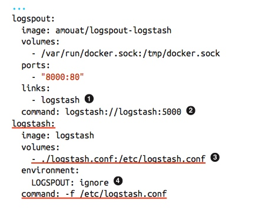

### Running without sudo

As Docker is a priviliged binary, by default, we need to prefix commands with sudo in order for them to run. This quickly gets boring. We can get around this by adding our user to the docker group.

$ sudo usermod -aG docker ubuntu
$ sudo service docker restart

### docker diff

list of files that have changed in the running container
Docker uses union file system(UFS) for containers - which allows multiple filesystems to be mounted in a hierarchy and to appear as a single filesystem. The filesystem from the image has been mounted as a read-only layer, and any changes to the running container are made to a read- write layer mounted on top of this

- docker commit <container-name> <image-name>
- to use a Dockerfile to create an automated build for the image.

### 容器状态
created, restarting, running, paused, exited.
status=exited/stopped （可以被restart）

docker rm $(docker ps -aq)

### 容器入口

ENTRYPOINT instruction lets us specify an executable that is used to handle any arguments passed to docker run.
提供entrypoint.sh

exec vs shell form:
The exec form takes a JSON array (e.g., ["executable", "param1", "param2"])
The shell format is a freeform string that will be interpreted by passing to /bin/sh -c. Use the exec form to avoid the shell munging strings

Any CMD instructions or arguments to docker run after the image name will be passed as parameters to the executable. ENTRYPOINT instructions are often used to provide “starter” scripts that initialize variables and services before interpreting any given arguments.

CMD given instruction when the container is started. If an ENTRYPOINT has been defined, the instruction will be interpreted as an argument to the ENTRY POINT (in this case, make sure you use the exec format)

在 docker run 的时候通过 --entrypoint 覆盖掉默认的启动项

// chmod +x entrypoint.sh.
#!/bin/bash
if [ $# -eq 0 ]; then
	/usr/games/fortune | /usr/games/cowsay
else
	/usr/games/cowsay "$@"
fi

### 容器数据

docker run --name myredis -d redis

referred to as bind mounting.（—the difference is that the mount point is made explicit rather than hidden in a directory owned by Docker.） If the /data directory already exists in the container, its contents will be hidden by the volume.
volume won’t be deleted by Docker (i.e., docker rm -v will not remove a volume that is mounted at a user-chosen directory).

practice is to create data containers—containers whose sole purpose is to share data between other containers.handy namespace for volumes that can be easily loaded using the --volumes- from command.

docker run --name dbdata postgres echo "Data-only container for postgres"
docker run -d --volumes-from dbdata --name db1 postgres

后续：a top-level “volume” command that will allow you to list, create, inspect, and remove volumes independent of containers. This is expected to land in 1.9, 避免 orphans files and directories in Docker directory

### 容器 Volume

docker rm -v x (-v argument will delete any Docker-managed volumes that aren’t referenced by other containers.)

using the VOLUME instruction inside a Dockerfile or specifying the -v flag to docker run

VOLUMN /data
docker run -v /data
这种没有指名和 host binding 映射的，mounted on the host inside your Docker installation directory (normally /var/lib/docker/).

$ docker run --rm --volumes-from myredis -v $(pwd)/backup:/backup debian cp /data/dump.rdb /backup/
--volumes-from to connect the new container to the Redis database folder.

### 容器 Connecting

“publish” ports with the -p or -P commands
primary advantage of the -P command is that you are no longer responsible for keeping track of allocated ports,use the docker port command to discover the port allocated by Docker.

link: over an internal Docker network, meaning communications are not exposed to the host network
Docker has also imported environment variables from the linked container, which it has prefixed with REDIS_ENV.
譬如在你的redis容器中使用环境变量to store secrets such as API tokens or database passwords. 然后该中间件被link到应用服务器容器时候，应用容器使用这些环境变量连接这些中间件

### Docker Architecture

- daemon
- client
- registries

used to talk to the Docker dae‐ mon via HTTP. By default, this happens over a Unix domain socket, but it can also use a TCP socket to enable remote clients

build context for Dockerfiles

背后的技术：
Docker daemon 使用 execution driver to create containers (runc driver 也可指定 LXC)

- 使用 cgroups: responsible for managing resources used by a container (e.g., CPU and memory usage). 还有 freezing and unfreezing container/ pause container 等
- 使用 namespaces: responsible for isolating containers, contain‐ er’s filesystem, hostname, users, networking, and processes are separated from the rest of the system.
- UFS
- SElinux and AppArmor, for security

周边技术 plugins and plumbing，譬如cluster管理，服务发现工具，高级网络能力等
（Dcoekr, “swappable batteries” strategy primarily refers to the API level—allowing compo‐ nents to hook into the Docker Engine）

- Swarm: Docker’s clustering solution. Swarm can group together several Docker hosts, allowing the user to treat them as a unified resource.
- Compose: for building and running applications composed of multiple Docker containers. It is primarily used in development and testing rather than production.
- Trusted Registry: on-premise solution for storing and managing Docker images. Features include metrics, Role-Based Access Control (RBAC), and logs.

- networking
主要为了 creating networks of containers that span hosts. 如 Weave 和 Project Calico. Docker 自带的integrated network solution Overlay. 得益于 to swap out the Overlay driver for other solutions using Docker’s networking plugin framework.

- service discovery
When a Docker container comes up, it needs some way of finding the other serv‐ ices it needs to talk to, which are typically also running in containers. 容器运行后动态被指定 ip address. 方案是 Consul, etcd 等

- Orchestration and cluster management
大规模容器部署后，工具链用于 monitor and manage the system.Each new container needs to be placed on a host, monitored, and updated. The system needs to respond to failures or changes in load by moving, starting, or stopping containers appropriately. 如 Kubernetes from Google, Marathon/Mesos, CoreOS's Fleet. Docker's own Swarm tooling

- volume plugins for storage system
include Flocker, a multihost data management and migration tool, and GlusterFS for distributed storage. 跨主机的分布式存储，包括数据管理和迁移工具

- 定制的操作系统
focused entirely on running containers 如在数据中心和机器集群中. CoreOS, RancherOS. minimal and easy-to-maintain distributions. 不同于常规发行版. 大公司可能为它们的大型分布式应用裁剪适当轻量的容器

### 容器打包

由于上面提到的 UFS - a union mount(if two files have the exact same path, the last mounted file will hide any previous files. 不同的实现：different UFS implentations, including AUFS, Overlay, devicemapper, BTRFS, and ZFS. 在 docker info 中的 storage driver 项可以看到)

A layer is created for each instruction in a Dockerfile and sits on top of the previous layers. When an image is turned into a container (from a docker run or docker create command), the Docker engine takes the image and adds a read-write filesystem on top (as well as initializing various settings such as the IP address, name, ID, and resource limits).
PS: 为了避免多余的layer（limit of 127 layers），try to minimize the number of layers 如 specifying several UNIX commands in a single RUN instruction.
docker create 为镜像构建容器但不运行.

build context: the set of local files and directories that can be refer‐ enced from ADD or COPY instructions in the Dockerfile. All the files and directories under the path form the build context and will be sent to the Docker daemon as part of the build process. gathered into a tarball and sent to the Docker daemon, you really don’t want to use a directory with lots of files in it already.

所以远程打包的不需要把巨大node_modules 上传到 daemon 上（ignore掉）
本地和registry网络慢的话，通过远端的daemon打包. Todo

use a .dockerignore file. The file should contain the names of files to exclude, separated by newlines.

layer each instruction results in an static image—essentially just a filesystem and some metadata—all running pro‐ cesses in the instruction will be stopped.

关于 Cache 的处理：

in the case of COPY and ADD instructions, the cache will be invalidated if the checksum or metadata for any of the files has changed.
that RUN instructions that are not guaranteed to have the same result across multiple invocations will still be cached. （如 git clone ... 这个layer会被缓存. to invalidate the cache, you can run docker build with the --no-cache argument. 或者指名使用类似于 ENV UPDATED_ON "14:12 17 February 2015" RUN git clone....）

### 容器打包调试

我们自己编写 Dockerfile（而不是从外部拿一个现有的），涉及到一些问题。我们不清楚我们从 barren 操作系统有哪些命令和依赖，通常会先 exec 进入一个基础镜像包，然后逐步执行安装依赖等直到我们的服务运行成功。通过 docker diff 和 docker history，以及中间image（docker build 时候指定 --rm=false 保留）

docker history docker-aws.gf.com.cn/restful-nginx

When a build fails, it can be very useful to launch the layer before the failure.

docker exec -it 85b49a851fcc bash. 进入这些中间容器中调试。

### 基础包的tradeoff

有些人喜欢精简的包（最小主义），等项目有新依赖在逐步该 Dockerfile 加入. 有些人喜欢大型包含常用工具和依赖的包，方便交付和打包。

极致最简包：
write a Dockerfile that inherits from the special scratch image (a completely blank filesys‐ tem) and simply copies your binary in and sets an appropriate CMD instruction. Your binary will need to include all its required libraries (no dynamic linking)
busybox won’t have a lot tools to work with, and if you’ve used scratch, you won’t even have a shell.

tradeoff

- the need for an init service
each container should only run a single application and ideally a single process. 在这种思路下 no need for an init service. 但是要注意 zombie processes

- a running cron daemon
ubuntu and debian images do not start the cron daemon by default 需要手动启动.

- an SSH daemon
default images do not install or run an SSH daemon by default. The normal way of getting a shell is to use the docker exec command, which avoids the penalty of running an unnecessary process per con‐ tainer.

### Docker 命令

The attach command allows the user to view or interact with the main process inside the container.

docker cp
Copies files and directories between a container and the host.

docker logs Outputs the “logs” for a container. This is simply everything that has been writ‐ ten to STDERR or STDOUT inside the container.

管理容器

docker diff
Shows changes made to the containers filesystem compared to the image it was launched from. For example:
$ ID=$(docker run -d debian touch /NEW-FILE) $ docker diff $ID A /NEW-FILE

容器相关

docker port

docker ps - -q argument, which only returns the con‐ tainer IDs and is very useful as input to other commands such as docker rm.

docker top
Provides information on the running processes inside a given container.

镜像相关
commit, rmi,
docker load/import

registry 相关

### Todo
网络变化：  from --link to more idiomatic to “publish services” rather than link containers.(link Docker set up an entry for “redis” in /etc/hosts inside the container, pointing to the IP address of the “myredis”.)

PS:
when you exit the shell, the container will stop - containers only run as long as their main process

-h docker run 指定 hostname
docker inspect <container_name>
docker inspect --format {{.NetworkSettings.IPAddress}} <container_name> PS: 内部使用了template engine which provides filtering and selecting data

image namespace:
Names prefixed with a string and /, such as amouat/revealjs, belong to the “user” namespace. These are images on the Docker Hub that have been uploaded by a given user.
Names such as debian and ubuntu, with no prefixes or /s, belong to “root” name‐ space, which is controlled by Docker Inc. and reserved for the official images for common software and distributions available from the Docker Hub.
Names prefixed with a hostname or IP are images hosted on third-party regis‐ tries (not the Docker Hub).

## Logging and Monitoring

if you want to keep any nontrivial system up and running and debug issues effectively. In a micro‐ service architecture, logging and monitoring become even more important due to the increased number of machines. Given the ephemeral nature of containers, a given container may no longer exist when debugging an issue, making centralized logs an indispensable tool.
vendors have begun to offer specialist container solutions and integrations.

### default logging

docker logs logtest
get the timestamp by using the -t argument:
stream the logs from a running container with -f:

do this from the Docker Remote API, 1 which opens possibilities for pro‐ grammatically routing and processing logs.

一些问题：
It can only handle STDOUT and STDERR, which is problematic if your application only logs to file. Also there is no log rotation（很容易 eat all the free space on your disk drive）

--log-driver 来设置 logging method:

json-file: The default logging we’ve just looked at.
fluentd: forwards log message to fluented
syslog: 后面详解
none: turns off logging

### aggregating logs
do is aggregate all logs—potentially across hosts—into a single location - monitor and do analytic tool on them.

两种收集：
1. Run a secondary process inside all our containers that acts as an agent and for‐ wards logs to our aggregation service.

2. Collect the logs on the host, or in a separate, standalone container and forward to the aggregation service.

避免第一种。bloats images and unnecessa‐ rily increases the number of running processes

四种采集方案：

1. We can use the Docker API to programmatically access the logs. This has the advantage of being officially supported, at the cost of some overhead from using the HTTP connection. We’ll see an example of using Logspout to do this in the next section.

2. If using the syslog driver, we can use syslog functionality to automatically for‐ ward the logs, as shown in “Forwarding Logs with rsyslog”.

3. We can just directly access the log files from the Docker directory. This is described in “Grabbing Logs from File”.

4. using insists on logging to file rather than STDOUT or STDERR, have a look at Handling Applications that Log to File

### ELK 集成

Logspount:

use Logspout, a Docker-specific tool that uses the Docker API to stream logs from running containers to a given endpoint (something like rsyslog for Docker).
高效和精简 written in Go and built on top of the extremely minimal Alpine Linux image. + logstash adapter
with the con‐ tainer logs on the left being collated by logspout, then parsed and filtered by Logstash before being deposited in Elasticsearch

logspout:
	image: amouat/logspout-logstash
	volumes:
		- /var/run/docker.sock:/tmp/docker.sock
	ports:
		- "8000:80"

to connect to Log‐ spout’s streaming HTTP interface: curl localhost:8000/logs
in multihost systems, you will need to run one Logspout container per host, which will route to a centralized Logstash instance.

Logspout will not gather logs from any container that has the environment vari‐ able LOGSPOUT set.
Use the “logstash” prefix, which tells Logspout to use the Logstash module for output.

###

PS：
### log storage and rotation
to a new file under /etc/logrotate.d/ (e.g., /etc/logrotate.d/docker), or added to /etc/logrotate.conf:

/var/lib/docker/containers/*/*.log {
	daily
	rotate 3
	compress
	delaycompress
	missingok
	copytruncate
}
