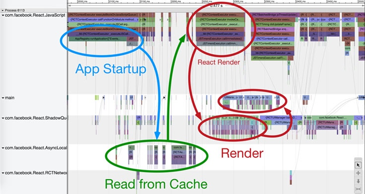

该文章翻译自Facebook官方博客，[传送门](https://code.facebook.com/posts/895897210527114/) 

React Native 允许我们运用 React 和 Relay 提供的声明式的编程模型，写JavaScript来构建我们的 iOS 和 Android 的应用。这样的做法使得我们的代码更精简，更容易理解和阅读，这些代码还可以在多个平台共享。我们也可以加快迭代速度（因为在开发时不用等待漫长的编译。使用React Native，我们可以发布更快，打磨更多细节，让应用运行的更流畅。这其中优化性能是我们工作的一大重要部分，接下来讲述 Facebook 如何使应用性能足足提升两倍的故事~

### 为什么要加快?
当应用运行的更快，内容加载的更迅速，就意味着用户可以有更多时间来使用应用，流畅的动画让用户更加享受的使用应用。在新型市场中，2G网络和几年前的机型还是主力。这时那些性能良好的和那些运行卡顿就有很大差别了。
自从发布了 iOS 和 Android 版本的 React Native 后，我们团队一直在诸如 提升列表视图的滚动性能，优化内存占有，让 UI 界面更具响应性和加快应用启动速度 上做了不少工作。这其中应用启动关乎初次印象和是框架其他部分的压力源头，所以它是要解决的头等难题。

### 量化一切
我们把Facebook的iOS版中的事件主页用RN重新实现（在更多标签页下点击事件进入查看）。这是个非常好的用于测试性能的例子，因为原生版已经做了大量的优化工作，而且该页面也是非常好的典型列表交互的例子。

接下来，我们自动化的 CT-Scan 性能测试来帮助我们自动定位到我们需要到的标签页。然后反复打开和关闭事件主页50次。在每次交互中，我们能够记录下从点击事件按钮到事件主页能够被完整显示的时间，我们也添加更多详细的性能埋点来告诉我们启动过程哪些步骤是缓慢或消耗CPU的

下面是我们记录和测量的一些步骤的大致描述：

1 原生启动：初始化JavaScript虚拟机和其他一些原生模块（如磁盘缓存，网络，UI管理器等）
2 JS初始化和依赖加载：从手机存储中读取被压缩的JS代码，加载到JavaScript虚拟机，从而解析和产生字节码，加载相关的依赖
3 取数据前：加载和执行事件主页的应用代码，构建Relay的查询语句，然后触发取数据。
4 取数据：从手机磁盘缓存读取数据
5 JS渲染：初始化所有相关的React组件，把它们发送到原生的UI管理器模块来显示。
6 原生渲染：在shadow线程中先通过根据 FlexBox 布局计算视图大小。然后在主线程中创建和定位这些视图。

我们根据于此的黄金法则是：永远不要忘了回归测试。我们持续的运行它来追踪性能提升和功能回归。开发者在提交改动的代码之前用它对特定的提交做运行和详细的性能分析。其他的一些测试也需要被同样的方式建立来衡量诸如功能性能和内存使用等

### 启动时发生了什么

当我们设置好自动性能追踪，我们需要一个工具来给我们更多细节来决定启动过程中的那些部分需要优化。我们在我们框架里添加详细的启动/暂停的性能锚点，收集数据，使用 catapult 查看器来定位热点和阻塞线程间交互的。也可以从开发者菜单下触发开始对我们应用的性能分析。
在RN中，代码是在JavaScript线程中执行的。每次你要写数据到磁盘，在一次网络请求，或者取一些其他原生的资源（如摄像机），你的代码都需要调用原生模块。当你要渲染力你的 React 组件，它们会被转发到界面管理器的原生模块中，它在主线程中来执行布局和创建相应的视图。桥协议来转发请求到原生模块和被回调到你的JS代码（如果需要）。在RN中，所有原生的调用必须是异步的来避免阻塞主线程和JS线程。
在下面的事件组件的启动可视化图中，我们可以看到应用在 JS 队列中运行，为了显示事件列表，触发了相关的缓存读取（在本地存储队列中被异步触发）。一旦它取得了缓存数据，应用在 JS 队列用 React 渲染事件单元格，接着又传给栅格队列来布局和最终传给主队列来创建视图显示。这个例子展示了多个缓存读取（组合成单个常用读取操作可以做到更快）和一些React在JS线程上的渲染操作可以被统一合并。

### 性能提升

下面是那些我们在实施过程中最重要的性能和时序安排的提升做法，同时配有对应代码提交的链接。

#### 启动时少做些

- [清理 Require/Babel 辅助方法（高优先级）](https://github.com/facebook/react-native/commit/b90fe8e2e8fd173498c268abf39a21b665e019ed)：清理掉那些在require时执行的多余逻辑和代码，那些事为了网站准备而不是 RN
- [避免在加载打包文件时，复制和解码字符串](https://github.com/facebook/react-native/commit/f5670f8ab5cd045402ed037ade372c182902d19e)
- [去除开发时才需要的模块](https://github.com/facebook/react-native/commit/7a794cc72bf5c2ea6da4dbda3a452bafc2997885)：不像编译代码，在发布模式下 JS 不需要用来去除debug特性的预处理器。使用 Babel 的转换函数，我们可以剔除那些在 __DEV__ 语句下方的代码，来有效的减少要打包的代码量，从而节省 JavaScript 解析时间。
- 在服务器端生成事件描述

#### 安排合适时机执行

- [懒加载](https://github.com/facebook/react-native/commit/d088750163bd45cb60c4c6796ed97624fb6f91bf)
- [Relay的增量缓存读取](https://github.com/facebook/relay/commit/cc7c0e5b16999e045937a5f75a4ef0fe05b4695e)：Relay一开始是web项目而生所以仅仅把请求响应放在内存中 - 要从磁盘读取的第一个请求的缓存响应需要从磁盘中读取全部的缓存到内存中。通过只读取满足特定查询请求的缓存，我们可以显著减少 I/O 负载和原生到JS桥的流量。
- [不用批量桥协议调用，要批量Relay调用](https://github.com/facebook/react-native/commit/31f9a690f3b3524adf08aa9d8c01843e8524453e)：一开始我们认为通过把JS请求批量发送给原生模块可以减少调用原生到JS桥的负载，但是性能分析告诉我们JS和原生间的桥调用根本不是性能瓶颈。事实上，UI界面或缓存读取的批量操作的延迟也会延迟原生线程的操作，从而影响应用性能。在其他case上，注入Relay用于拉取多个键值数据的缓存读取，通过批处理可以有显著提升。
- [更早的界面填充](https://github.com/facebook/react-native/commit/c25c98c00c8c195f85c9fb17eae3cb0c36b465f5)
- [懒加载原生模块](https://github.com/facebook/react-native/commit/060664fd3d9331f062696e68179bac9cd4544a06)
- [对文本组件的触摸做懒绑定](https://github.com/facebook/react-native/commit/4ce03582a0013e60417dedbf2f760d00e687e540)：绑定触摸事件回调会需要不少时间。所以我们现在仅仅先绑定触摸开始事件touch down event（就是当你第一次触摸对象时）然后只当你触摸对象后才开始绑定其他回调函数，而不是一开始就全部绑定对调
- 延迟流行事件的查询：

### 为光速做准备

几个月前，事件主页的启动在 iPhone5 上需要2秒。经过我们在RN上的大量性能优化工作，在伦敦，门洛帕克和纽约的RN，React和Relay团队，事件主页的启动被加快了一倍。而且大部分我们实施的优化是在RN的框架层的，这就意味着开发者们的RN应用也会自动得益于这些工作（当他们把应用迁移到最新版本的RN下
这些优化才仅仅是个开始：我们会继续在整个栈的各个部分都开展工作，从JavaScript代码解析时间到数据拉取性能。同时，你们也可以[给社区贡献](https://github.com/facebook/react-native)，学习[如何让应用更快](https://www.youtube.com/watch?v=0MlT74erp60)，在[社区论坛](https://www.facebook.com/groups/react.native.community/)提出你可能遇到的任何问题。

