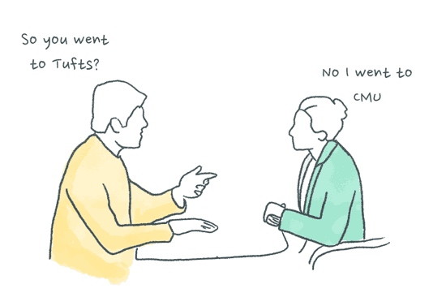
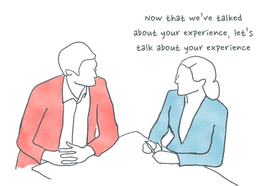
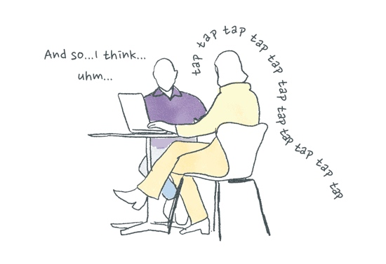

谷歌，脸书，苹果，微软，亚马逊。这些顶级的技术公司每天会收到数以百万计的简历。所以几乎不用怀疑，它们有一套筛选好简历的优秀流程，不是吗。问题是，它们怎么做到的？

要澄清下，这不是一份可以在 Google 中搜索到关于 Google 流行面试题列表。实际上，它们精细调整的招聘流程不仅仅是一些对算法或量化物理这些关键词的基础查询。

如果，你和它们一样，也想招聘到世界上最优秀的技术天才，那么试试下面这些绝密的招聘策略。

## 不要在约定好的时间电话面试
### 为什么 - 找到那些总是为新工作做好准备的人

每个人都能在精心准备后在合适面试时间上，回答好一系列的刨根问底的问题。但是想想看，如果你在他们还在睡觉时，在健身课上，甚至在上厕所时，给他们打电话面试。这就是那些顶级技术公司怎么找到哪些永远让自己专业让自己随时准备好应对挑战的方法。

## 把面试行程表搞得让人费劲和不可预测
### 为什么 - 找到那些不需要指示能自我驱动的人

如果在面试中，面试官和面试者在面试都不知道接下来该做什么。这是一个非常好观察时机，来看看谁会在这个沉默的时刻保持主动和发表观点。

## 把面试展示中需要的设备搞砸
### 为什么 - 看看面试者在不那么好的环境下的适应

故意把考察候选人需要做展示的房间中的投影设备『搞坏』。看看候选人逆来顺受和不介意调整，看看他是否足够好相处和合作。如果候选人对展示还有 B 计划，C 计划甚至 D 计划，这就是加分项了，因为这在技术领域非常常见。

## 面试中，搞出不少错误假设
### 为什么 - 淘汰那些容易被激怒的人

如果候选人上家公司是滴滴，试着这样问，『你在快的工作呢多长时间？』注意看候选人改正你时的语调语气，他是保持冷静还是会显得很不舒服。技术公司常常会不可避免的被误解和被背黑锅，通过这个测试可以预测到他那时会怎么处理。

## 让候选人解决你真实遇到的难题
### 为什么 - 因为你真的要处理这个问题！！

技术公司经常让候选人解决它们当前遇到的真实问题。这是一个很好获得免费帮助的方式

## 让面试者不断转移面试地点
### 为什么 - 找到那些即使不舒服，但是仍然能保持热情的人

永远不要让你的职位申请人一直舒服的面试。通过那样的方法，找到那些在自己不舒服时仍然能保持专注，同时真的解决你公司一整天都没有空余会议室的难题。

## 同样的问题反复去问
### 为什么 - 测试一致性

在技术领域，可预测性是一件好事。 在面试时，不要担心一直问同一个问题多次。这是一个很好用于测试候选人一致性的工具。只有在面试高级职位时，候选人才会对他们的回答变得非常不一致。
`ps: 这一段不是很理解，附上原文`
『In the tech world, predictability is a good thing. During the interview, don’t worry about asking the same question over and over again because you keep blanking out. This is a great tool for testing the candidate’s consistency. Candidates should only be wildly inconsistent with their answers when interviewing for senior roles.』 

## 进行双面试官群面，搞砸气氛
### 为什么 - 找到那些可以在压力下多任务的人

把候选人安排在会议室中间，两端各有面试官。看看候选人能否同时能取得两位面试官的关注和同时能无压力的回答他们两人提出的各种有跳跃的问题。这是一个很好的机会看看他能否在困难时期把事做成。

## 问完问题，开始大声敲键盘
### 为什么 - 找到那些即使有干扰也能保持专注的人

问候选人问题，然后等他开始回答，就大声敲击键盘，并且向她解释说你在听他回答但是在记录笔记。你可以真的在记录或者仅仅是给朋友写邮件。看看他是否能够专注回答问题还是被打乱思路了。这样可以筛除那些被一些小事就干扰到无法顺利完成工作的人。

## 三个月后，再发 offer！
### 为什么 - 找到那些下定决心的人

这是非常好的用于筛出那些并不是非常看重这份工作的人。看候选人是否为了这个想要 offer 而做出牺牲和努力。他是否认为该份 offer 就是他面前最好的选择。还是拒绝了因为上个月拿到的其他 offer。这就是帮你搞清这些问题的策略。

