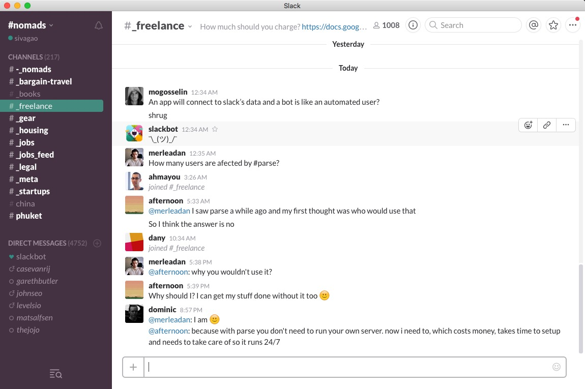
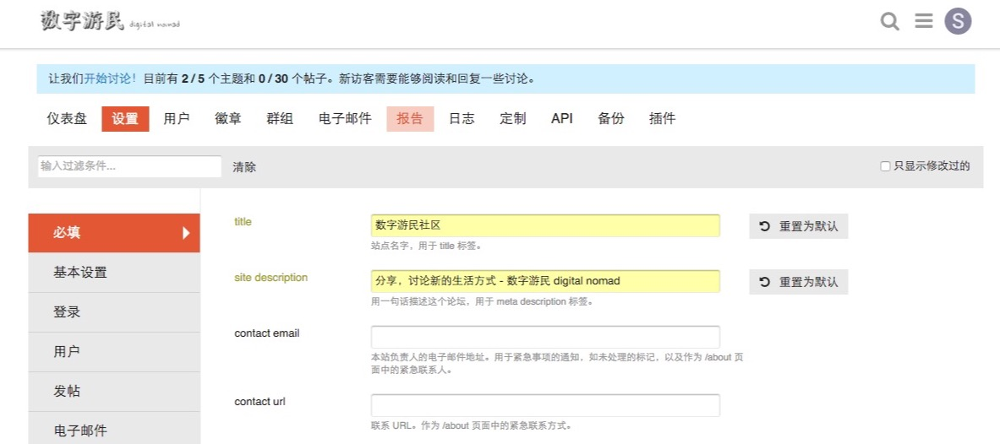

### 起因
很早就关注了数字游民这个话题，现在国内也慢慢的新起来，但是好像搜索了一圈以后没有什么论坛站点来聚集网友们。同时，国外的围绕着 nomad list 的 slack hashtag nomad 早就在那么圈子很火了。所以证明需求是有的，国内的发展也是可期的（虽然对于潜在的数字游民英语应该都不差），我还是非常想搭建这样的论坛来把牧民们汇集起来。

### 选型
这个几乎没什么好说的，slack 因为可以archive 聊天信息，甚至可以给特定信息 highlight，有作为社区的潜质，但是它更多还仅仅是个聊天工具~ 其他诸如Discuz，NodeBB 都是过去时了，样式和玩法太老旧了。通用的平台也不够强大（如贴吧太low，豆瓣小组太简单，其他web上不容易搜索如陌陌，same等）。但是之前玩 ionic 时候对 forum.ionic.com 一直很喜欢，所以毫不犹豫的选择了 [Discourse](http://www.discourse.org/) 。事实证明它的确很棒（虽然是 Ember 框架写的）


### 过程
这个部署按照我的一开始打算应该是容易迁移和部署的。 所以毫无疑问选了 [docker镜像](https://github.com/discourse/discourse_docker)。 具体安装步骤和设置更改有[安装文档](https://github.com/discourse/discourse/blob/master/docs/INSTALL-cloud.md)

所以，我毫不犹豫选择了我免费一年的aws套餐 ec2 实例开始折腾：
#### ssh 到机器
#### 打开 docker daemon

```shell
Cannot connect to the docker daemon:
docker daemon // -d 选项先启动
service docker stop
ps aux|grep docker 等
```

#### 下载代码

```shell
mkdir /var/discourse
git clone https://github.com/discourse/discourse_docker.git /var/discourse
cd /var/discourse
cp samples/standalone.yml containers/app.yml
```

#### 修改配置

```shell
主要是developer email，后面注册用这个email注册会自动有admin身份

邮件服务选择：smtp 服务 mailgun 后台
设置一番后找到配置项 DISCOURSE_SMTP_ADDRESS，DISCOURSE_SMTP_PORT，DISCOURSE_SMTP_USER_NAME，DISCOURSE_SMTP_PASSWORD 等
联系了下 mailgun 的人，邮箱又能用了，之前被disable掉
可以看发送数据和log，打开到达率等等 后台 https://mailgun.com/app/logs/
todo: 添加 txt 记录dnspod 使得可以用sivagao.com 发送邮件 custom domain

因为aws ec2 免费机器的内存不够，所以要修改配置 UNICORN_WORKERS ：2 两个实例，128M 来缓存等
```

一开始邮件发不了，但是没法激活。通过[命令行来创建管理员帐号](https://meta.discourse.org/t/create-admin-account-from-console/17274)


#### 编译和启动

./launcher bootstrap app #大概几分钟，中间还提示机器不够用... 
./launcher start app

配置 DNS，需要添加一个 A 记录，来把 discourse.sivagao.com 打到 aws机器上。


#### 站点后台和配置
很顺畅的就部署完毕，浏览器访问一切正常。进入后台设置站点名称和logo（用keynote和两款漂亮的字体搞定），系统语言等。并且把一些文章如welcome欢迎页等建立起来




### 上线啦，撒花

[欢迎光临 - 数字游民](http://discourse.sivagao.com)


