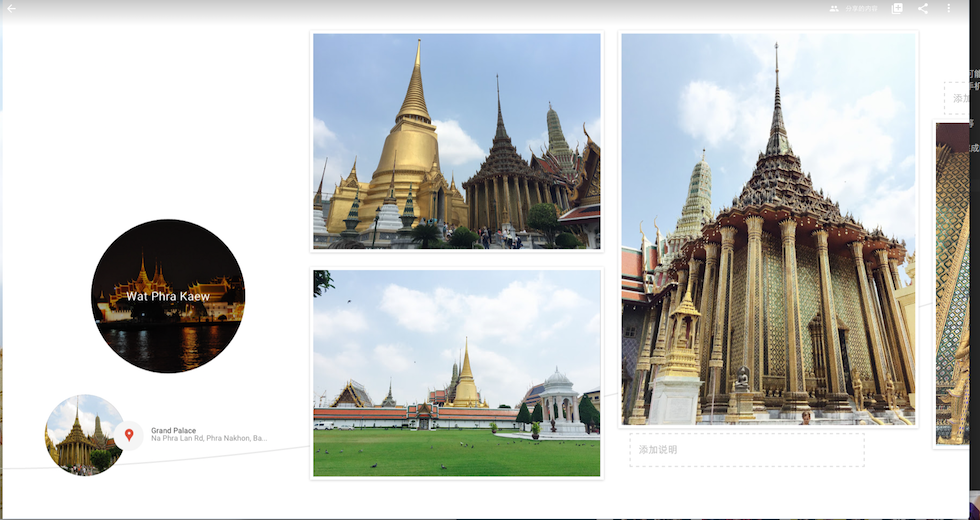
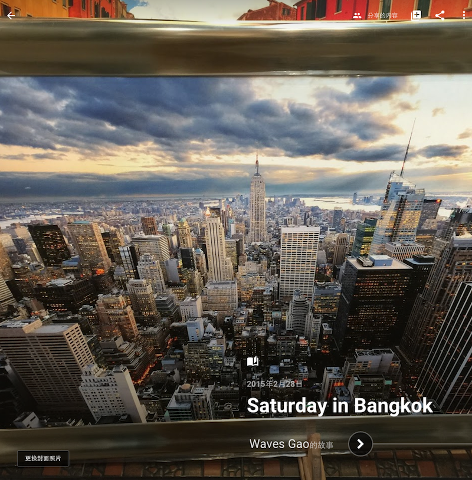

这年头，专业的数码相机越来越便宜，同时手机自带的摄像头越来越专业。所以，一不小心可能大家手头的照片很容易攒个数千张。那些照片记录了当时的可爱时光，现在也不舍得删去，但是也静静待在手机/电脑的存储中，值到一天越来越小的可用空间提醒着你『是时候要收拾整理下了！』

从照片这个话题说起来，需求链大概是这样的『拍摄，存储，整理，编辑修改创作，分享』等

我们就先聊聊今天的主角 Google Photos 帮我们在存储和整理 这个关键步骤的替我们完成的事情。和国内使用的一些注意点。

通过手机端 iOS APP，安装后进入简单的Google登录后，会提示备份，然后APP就会在后台开始漫长的上传（考虑到我们的网速 - 深圳联通，通过shadowsocks（部署在新加坡的aws节点），来连接Google photos的服务器），具体进度可以在智能助理中看到~

上传完毕后，Google就开始了它的各种计算图像分析和识别（主要是meta信息处理，如geolocation地理位置，拍摄时间等）这样用于生成自动创建的事件『特定时间段通常一天的多张照片组成，按照拍摄时间和地理位置切分』，这样在手机上、浏览器上看到的就是一个非常顺畅的故事连环画了。这个功能的确是十分惊艳，好像其他家都没提供。

然后高质量的图片上传无限连免费的确很棒，因为很多时候我们并不需要那么大的原图。
自带的人脸识别，把照片中出现的人物识别出来并且以此聚集照片，是一个非常方便的找出人像的方法。（当然了Apple自带的iphoto也提供类似的功能，iphoto的根据geo生成的图片聚合也不错。）

一句话，值得一试，大厂服务值得信赖~

更多的照片类型筛选，除了人脸~


云时代，选好服务，不要再出现图片丢失的蠢事了~


