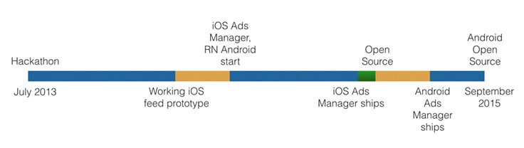
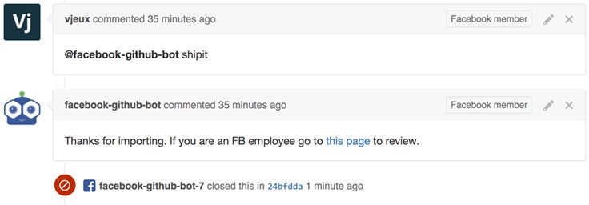
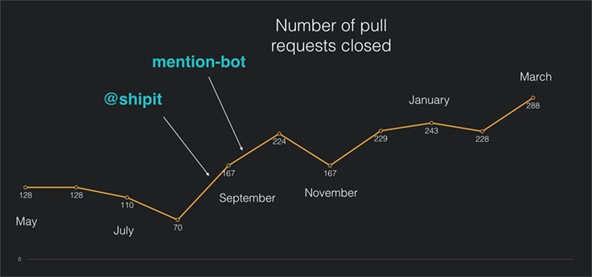
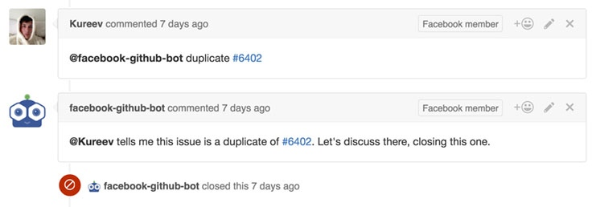
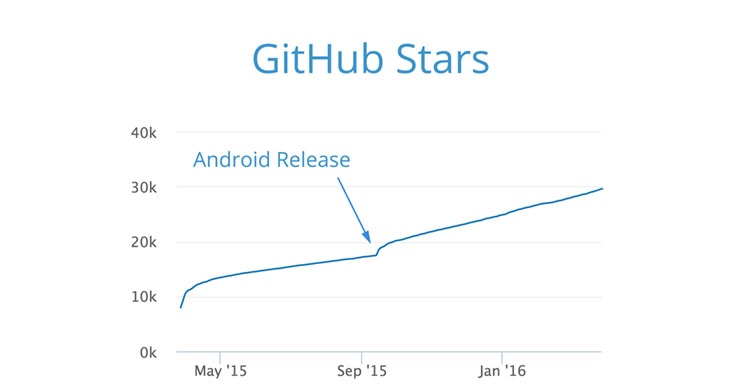
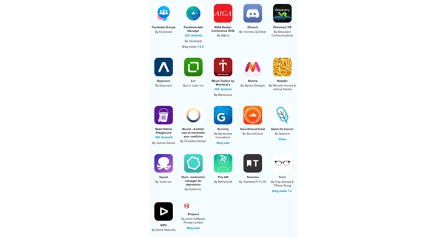
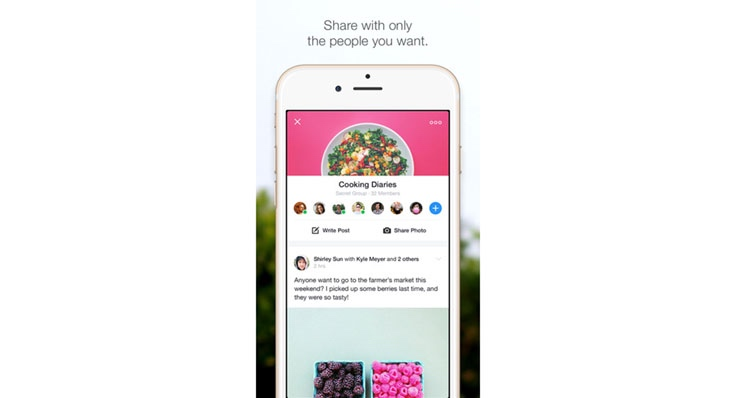

> 翻译自Facebook工程团队的官方博客，[React Native: A year in review](https://code.facebook.com/posts/597378980427792/react-native-a-year-in-review)，本文分别从 RN 起源，项目过去一年在FB内部的发展，在业界的广泛使用和生态圈的快速建立，在 Github 上的开源协作，核心团队对 RN 的未来展望等进行一一讲述，来吧看看 RN 的传奇之路

## React Native 的一周年回顾

自从我们开源 React Native 已经有一年的时间了。这个最早仅仅是一小撮工程师『异想天开』的项目现在已经作为应用开发框架被广泛使用在 Facebook 的产品团队甚至其他公司中。在今天的 F8 大会上，我们宣布了微软正在把 React Native 技术带到Windows的生态系统这消息，让开发者可以在 Windows PC，Phone，Xbox 上构建 RN 的应用，同时也提供了开源工具和服务（譬如Visual Studio Code的RN扩展和CodePush相关的RN服务）来帮助开发者在 Windows 平台构建 RN 应用。同时，三星正在用 RN 技术构建它的混合应用平台，来辅助三星的开发者在数以百万级的SmartTV，手机和可穿戴设备上开发应用。我们Facebook 也发布了 RN 的 Facebook 开发者套件，使得开发者更加容易集成 Facebook 的社交特性(例如登录，分享，应用分析和 Graph API 等功能)到他们的应用中。就这一年，React Native 显著的改变开发者在主流手机客户端上开发应用的方式。

史诗般的旅程不是吗，不过我们才刚刚开始。接下来我们往回看自从开源后这一年，RN 是如何一步步流行和不断完善的，看这一路来我们面对的挑战，并且我们是怎么看待 RN 未来的发展的。

### React Native 开始的缘由

作为Facebook 黑客文化的精髓，React Native 于2013年也是作为编程马拉松 hackathon 的项目开始。类似于 React，React Native一开始也是看起来很大胆的异类想法。一开始我们并不确定这是否能行。譬如 JS 和原生滚动间的交互怎么做，性能怎么样，如调试等。不过这些挑战都没有阻止我们的工程师进一步的推进这个项目。

当我们把这个想法做出原型后，我意识到这个项目在 Facebook 中可能会大有用途。在几年前，我们从Web H5 开发转变到目前的原生客户端开发上。不过，每次修改代码都需要漫长的重新编译，开发不同的客户端（iOS、Android）需要不同的配套技能等都让我们头疼，这些都导致了产品开发的进展缓慢。React Native 这样的构想就能把之前我们热衷的Web开发的一些优点借鉴到原生应用开发上，譬如足够快的开发迭代速度，只需要精简的 JS 工程团队就能交付整个移动端产品。

所以，我们开始在这个项目继续投资时间和精力。我们也知道证明一项新技术是否真的有效好用就是用它来尝试解决生产环境下的复杂问题。所以我们决定做 FB 的消息流主页的原型，这就是我们用 RN 开发的第一个产品项目，同时也在不断丰富优化 RN 这个基础框架本身。这些代码最后成为现在 FB 群组应用代码的基础部分。

在2014年7月，还在 RN 上持续下功夫的我们小群团队第一次接了一项大活：广告管理大师团队希望构建单独的 iOS 应用，但是他们没有直接的iOS工程师也没相关的开发经验。这是个非常不错的机会，接下来几个月广告管理大师的产品团队和 RN 工程团队紧密工作相互配合。产品工程师不断挑战提升着RN平台的功能和性能边界。我们的目标就是要发布一款用户体验不差于 Objective-C 构建的 iOS 应用。

在对此任务非常有信心实现后，我们决定尽早让 RN 能够跨平台，在伦敦组建了 RN 的 Android 团队。这团队在14年下半年开始写了最早的 Android 核心运行时和第一个组件。此后我们决定要让 Android 能顺利运行之前的 iOS 广告管理大师的JS代码。到2014年底，我们有个最基础版本，尽管它还缺了不少的界面，在低端Android手机上性能也不行，不过你还是可以看到如下图展示的一列广告和可以用它来创建新的广告。我们当时非常自信能把这项工作推进下去，获得更棒的性能，更强大的功能。

`Facebook的广告管理大师运行在Android低端机上。2015/01`

FB 广告管理大师这款应用在2015年2月在iOS在苹果 AppStore 发布，离我们正式在全职搞 RN 不过才6个月。同时，关注 JS 或 iOS 的同事开始考虑开源这套 iOS RN的实现。在2015年1月的 React.js 开发者大会，我们发布了初次的公开预览版。在2015年3月的 F8 开发者大会，我们正式开源所有代码~

在此之后，广告管理大师的工程团队开始把他们的 JavaScript 代码移植到 Android 应用上。和伦敦的RN团队紧密配合，一开始我们并没寄希望能在这两个平台很复用很多代码（我们只是把它当做 RN 方案的加分点），不过当 Android 版的广告管理大师准备发布上线后，我们惊喜发现这两个应用的85%的代码都是可共用的。

在2015年的6月，经过三个月的开发和一个月左右的内部 dogfooding 使用，第一个 Android 版本的广告管理大师发布了，考虑到 RN 的 iOS 部分大受欢迎的情况，我们立即开始把工作重心转移到开源 RN 的 Android 部分。我们对此热情高涨。毕竟，需要给不同平台构建同一款应用是业界都有的大难题，我们从开发广告管理大师项目的经验来看，RN 正是解决这样难题的好方案。

类似于 iOS 部分的发布，我们希望 Android 部分也能尽早发布，从而尽快获得反馈。因此，我们从核心运行时开始，加上一小部分的视图和模块（如文本，图片，ScrollView，Network，AsyncStorage等）的支持。在9月14号，我们把 Android 核心运行时和初始部分的 Android 模块发布到 Github 和 npm 上。在 React Native 的0.11版本上，我们第一次发布了 Android 部分的支持。从开源 Android 部分后，我们也陆续加入这些模块的支持：Alert，APPState，CameraRoll，Clipboard，Date和time pickers，Geolocation，Intent，Modal，NetInfo，Pull to refresh view，Picker，Slider，View pager，WebView等（它们和 iOS 部分的 API 非常类似）

`从最早 React Native 设想，到我们开源 RN的 Android 部分的时间轴`

不得不说，在开源后，外界对 RN 的接受程度和热情让我们 RN 团队感到非常惊喜。

### 快速迭代：这一年的学习和成长

React Native 的流行程度和它的开发者社区都在快速发展，远超我们的预期。

超过650个人给 RN 的代码仓库贡献过代码。在代码仓库的5800个提交，有30%左右都是被不在 FB 工作的贡献者提交的。在2016年2月，第一次超过50%的代码提交来源于这些外部贡献者。随着这么多来着于社区对RN的贡献，我们发现每个月都将近266新的 PR（每天多大10个PR）被要求合入。这些 PR 很多都是高质量的，提供着后续被广泛使用的功能特性。

`这是RN的Github代码仓库每个月被提交PR数量趋势图`

在一开始，这些暴涨的 PR 数量导致我们很难快速高效的审核合入。每天为这些 PR 找到合适的审核人员都消耗着很多人力成本。为了解决这个问题，我们通过开发两个 Github 机器人来自动化分发 PR 到合适的reviewer头上~

第一个机器人是提醒机器人，为每个PR找出合适的 Reviewer 审核人。

这个提醒机器人现在被开源了，他的确帮助了我们在一天中更高效的审核这些PR。有趣的是：在上个月（2月份）超过50%的提交来自于社区，提醒机器人总能在社区中找到合适的reviewer来审核（工作原理大概是通过在 Github issues 中定位到提出的人，和 PR 要解决的 issues 关联起来）

很难Merge这些PR是我们遇到的第二个难题。FB 工程师们用的同一个代码仓库（就想你在 Github React Native Repo 上看到的一样），我没有对这个做任何 fork 没有其他的内部 commit 之类的。因此，每次要合入 PR 的代码到我们内部的大型叫做 fbsource 的Mercurial 仓库后我们都会自动执行测试脚本来回归我们类似于 Facebook Ads Manager（广告管理大师？）等应用功能。

`简化版的单例Mercurial代码仓库fbsource。这个仓库包含所有的移动端和服务端端代码`

之前合入一个 PR 涉及多个手动操作。我们现在把这些简化为仅仅需要在 Github 回复一句评论。

`@facebook-github-bot-shipit： 如果所有的内部测试运行通过，PR的那些代码会被自动合入到 fbsource 主分支和 Github 主分支中`

感谢这些工具，我们这个项目才能和这么多社区持续贡献的 PR 保持上同一进度。在过去一年，我们总共关闭了2351个 PR！！

`Github的RN项目上每个月被关闭的PR数量趋势图`

#### 管理 Github issues

随着项目的流行，我们要构建和引导一种机制环境：让社区中有心的人来帮忙一起管理日益增多的 issues。

我们实施了另外一个机器人来使得社区中的任何人都能来帮助管理 Github issues。它可以让任何人（无需push权限）都可以关闭重复的 issues，回答后关闭 issues，给 issues 添加标签等等。你可以参考这篇指南参与进来 [guide to managing Github issues](https://github.com/facebook/react-native/blob/master/docs/IssueGuidelines.md)

React Native 涉及的 API 面非常广泛。它暴露了构建 iOS 和 Android 应用的绝大部分 JavaScript 调用，同时提供了跨平台的抽象。很难有一个对这些所有APIs都很熟悉的人，即使 FB 中有很多产品团队在使用 RN，我们还是不能保证覆盖到所有的边缘情况。RN 适合我们，但是我们不能保证它绝对完美。这就是需要社区中了解这些代码仓库的人参与进来，这对于我们和更宽泛社区的其他人（那些把自己的应用押宝在 RN 上，在 RN 上构建自己的服务，为 RN 开发第三方类库工具的）都非常重要。

#### 社区贡献者

React Native 开源贡献者组织是由社区中那些提供非常高质量的代码补丁，非常积极帮助其他遇到使用问题用户的人构成的。我们创建这个组织感谢他们为RN项目的推进表示感谢，也给我们代码仓库的提交权限。

下面是我们 RN 开源贡献者组织的大合照，依次是这些人：*省略*

`开源贡献者组织的不少人，在2016/02/22的旧金山的React.js Conf开发者大会的合照`

### React Native 时至今日

每两周RN就会有新的发布。意味着在主分支中发布后，你就能在你的应用中立即使用上这些功能特性。仅仅在2016年3月，RN 的代码在 NPM 上的下载次数就达到7w次。在 Github 有着近3w的加星，RN 是 Github 上最受关注的21项目之一。

`在过去一年，RN在Github的代码仓库的加星数从0到30000之多`

#### 社区中的成绩

自从 iOS 版的 RN 发布后的这一年，有非常多用RN开发的应用被上架到苹果的AppStore，高质量的RN写的的Android应用也慢慢出现了。在[展示页面](https://facebook.github.io/react-native/showcase.html)罗列了107个用 RN 构建的优秀应用，通过提交 PR 把你的 RN 应用也加入其中。

我们尝试使用这些，发现了不少被精细打磨的RN应用。所以确保你也下载一些来试一试，看看 React Native 能用来干什么。

- Townske 这个城市指南应用就曾经在AppStore的最优秀新应用板块栏目被推荐。
- Discovery VR 让你探索浏览Discovery频道的360度视频。这是第一个用RN构建的VR应用。
- Running 是颜值爆表的运动跟踪应用。它也是最早一批拥有优秀设计的RN应用之一。

这样高质量的RN还有很多，在这里就不一一陈诉了。去[showcase展示页](https://facebook.github.io/react-native/showcase.html)去一探究竟吧。

除了这些应用外，现在还有不少辅助RN或构建于RN之上的服务：Exponent 让你无需编译任何东西就能开发和分享 RN 应用。React Native Playground 让你在浏览器中编辑和运行RN应用。AppHub和微软的CodePush让你避开应用市场快速部署新代码。[JS.coach](https://js.coach/react-native)提供着索引大量第三方模块的数据库，Deco 是用于构建 React Native 的 IDE 集成开发环境。

随之还有快速发展的第三方模块的生态，你可以很方便的把这些功能/插件集成到你的应用中。借助于JS.coach，这些模块非常容易查找。借助于 [rnpm](https://github.com/rnpm/rnpm) 安装他们也变得非常容易。

网上现在也有非常多的关于 RN 的优秀技术博客和入门提升的教程。感谢社区，继续保持！我们在这里特别推荐下 Brent Vatne的 [React Native Newsletter](http://brentvatne.ca/react-native-newsletter/)，它提供了对 RN 社区发生的所有好玩有趣值得关注的事的不错的概述，同时提供了不少指向优秀 RN 技术博客的链接。

对了，我们现在还有三本关于 RN 的书籍呢~

所有的这些都是在这一年诞生的，成果不少！

#### Facebook中的成绩

Facebook 中越来越多的产品团队用 RN 来开发新功能和应用。它即被应用在其他业务的单例App中也被集成在大Facebook的iOS/Android App中。

`Facebook群组应用就是个混合应用，消息流就是用RN实现的`

在去年，RN团队中的工程师人数从过去的10名快速增长到20名，成员分布在加州的Menlo Park， 伦敦和纽约。自从 Ads Manager（广告管理大师）发布RN后，RN 团队的主要聚焦在：

- 提供诸如在应用启动时间，响应性和滚动流畅等性能问题上。来看看我们的博客[翻译：看Facebook是如何优化React Native性能](https://github.com/gaohailang/blog/issues/4)，和我们在此性能问题上的[计划安排](https://www.facebook.com/notes/andy-street/react-native-scheduling/10153916310914590)
- 在大Facebook App的iOS和Android平台上，把 RN 集成到目前的视图界面UI和基础架构中
- 构建诸如CPU和内存 profilers等性能调优工具
- 开发Facebook产品团队提出的功能和特性
- 支持使用RN的产品团队，解决他们的难题，快速为他们解决bug
- 提升开发体验，譬如整合到内部的开发者工具和构建系统中

### 展望 React Native

这个项目在去年发展很快取得了长足的进展，不过就像我们在Facebook内部说的『我们才完成了1/100的进度』！我们内部会持续大力开发RN项目。在去年，我们团队规模扩大了一倍。我们也会继续在开源工具链上投入。我们希望 React Native 项目在公司内外都能取得成功~

下面是大家可以参与到这个项目中的一些我们推荐的方式：

- 如果你发现了Bug，那么帮忙提交Fix吧。小的带有测试规划的PR（注：Github中给开源项目贡献代码的方式）是最快最容易被审核后合入的
- 如果你觉得文档中有不清晰的地方，请通过PR来改善它
- 在 StackOverflow 上提问关于你有疑问的
- 在 Github Issues 回答和提供方案来帮助 RN 使用者
- 如果你提议一个新特性，那么最好把它提交到 [Product Plans](https://productpains.com/product/react-native/?tab=top) 中，它有个投票系统。即使你没有时间去实现它也没关系，如果被支持的高会有其他的开发者来帮忙实现。
- 参与到Facebook上的 [RN 社区群组](https://www.facebook.com/groups/react.native.community/)来

如果你刚开始接触 RN，那我推荐你看看我们为RN设计的一系列的教程来介绍这个框架和它的开源生态圈。就拿今年的F8应用作为例子，我们展示了我们在开发时是如何为多平台做设计的，如何整合数据，通过测试应用来提高代码质量等。

感谢每一位用 React Native 技术来开发他们优秀应用的开发者，感谢那些在 RN 之上构建工具和服务，开发开源第三方模块，帮助回答问题，提交PR，帮忙组织会议分享，给RN写技术博客等社区中的每一位成员。 继续保持吧！

让我们期待来年的 RN 的大发展吧~
