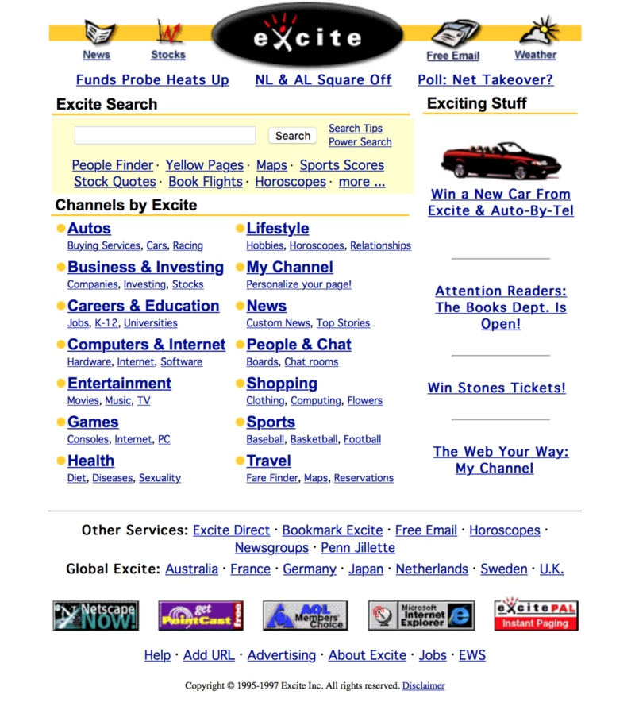

来听年入40的老开发者讲讲故事，听听教诲。

今年4月25号，我在 App Builders 大会做了 年迈40的开发者 （Being A Developer After 40）的演讲。该份ppt可以在 SpeakerDeck 上看到，[传送门]()

### 1997，软件世界是什么样子

### 我的第一份开发工作

### 6776天

### 给年轻从业人员的由衷建议

### 1. 不要疲于追新 Forget the hype

### 2. 选对你的技术栈 Choose your galaxy wisely

Examples of galaxies are, for example, .NET, Cocoa, Node.js, PHP, Emacs, SAP, etc. Each of these features evangelists, developers, bloggers, podcasts, conferences, books, training courses, consulting services, and inclusion problems. Galaxies are built on the assumption that their underlying technology is the answer to all problems. Each galaxy, thus, is based in a wrong assumption.

### 3. 学习了解下软件历史

### 4. 持续学习

#### Tip: 每年至少学习一门新语言

#### Tip: 每年至少读6本书

### 5. 传道受业

### 6. 自己掌握职业发展路线

不要期望软件公司会为你职业发展路线出谋划策。You are solely responsible for the success of your career.

### 7. 明确自己的价值

### 8. 心态开放（放低姿态） Send the elevator down

It is your duty to send the elevator down.

Do not critisize or make fun of the technology choices of your peers; for other people will have their own reasons to choose them, and they must be respected. Be prepared to change your mind at any time through learning.

### 9. LLVM

Everybody is raving about Swift, but in reality what I pay more attention to these days is LLVM itself.

I think LLVM is the most important software project today, as measured in its long-term impact. Objective-C blocks, Rust & Swift (the two most loved strongly typed and compiled programming languages in the 2016 StackOverflow developer survey,) Dropbox Pyston, the Clang Static Analyser, ARC, Google Souper, Emscripten, LLVMSharp, Microsoft LLILC, Rubymotion, cheerp, watchOS apps, the Android NDK, Metal, all of these things were born out or powered by LLVM. There are compilers using LLVM as a backend for pretty much all the most important languages of today. The .NET CLR will eventually interoperate with it, and Mono already uses it. Facebook has tried to integrate LLVM with HHVM, and WebKit recently switched from LLVM to the new B3 JIT JavaScript compiler.

### 10. 跟随内心 Follow your gut

### 11. APIs 是王道

Great APIs enable great apps. If the API sucks, the app will suck, too, no matter how beautiful the design.

Remember that chunky is better than chatty, and that clients should be dumb; push as much logic as you can down to the API.

Do not invent your own security protocols.

Learn a couple of server-side technologies, and make sure Node is one of those.

Leave REST aside and embrace Socket.io, ZeroMQ, RabbitMQ, Erlang, XMPP; explore realtime as the next step in app development. Realtime is not only for chat apps. Remove polling from the equation forever.

Oh, and start building bots around those APIs. Just saying.

### 12. 降低复杂性

### 结论

你唯一需要记住的就是，在这个行业中， your age does not matter.

Of course I do not know what will happen 19 years from now, but I can tell you three things that will happen for sure:

- Somebody will ask a question in Stack Overflow about how to filter email addresses using regular expressions.
- Somebody will release a new JavaScript framework.
- Somebody will build something cool on top of LLVM.

And maybe you will remember this talk with a smile.

