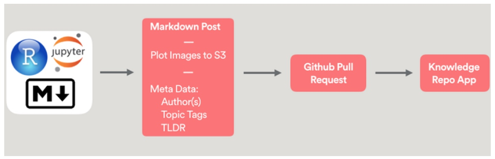
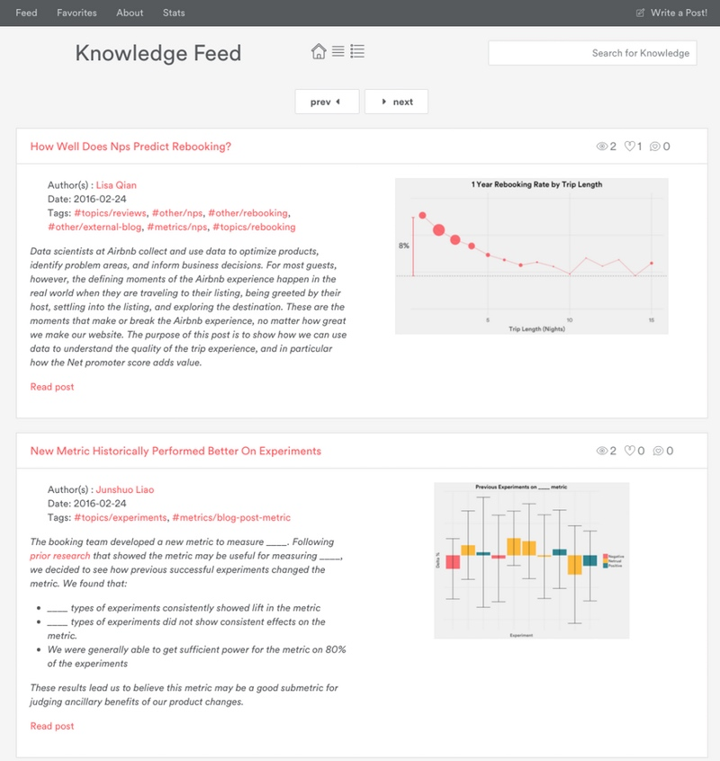

## 问题

在 Airbnb，数据团队的一大指责就是让让我们基于数据的决策的系统更容易扩展。我们民主化[数据读取权限]()来让所有同事都能借助数据做出好决策，让他们使用[实验]()来正确衡量他们决定的影响力，把从用户倾向数据中得到的洞见加入到数据产品中从而提升我们产品的用户体验。最近，我们开始处理另一类型的难题。随着组织的不断的发展，我们要怎么确保一个人的精彩见解如何有效的传递给需要的人。在内部，我们成这个叫做知识规模化

一开始我们团队成员还不多，在团队内部分享各自发现的调研结果和技巧都很方便。但是随着团队不断扩展，之前的小问题变得越来越严重起来。就拿 小琳（Jennifer）的故事来说，新来的数据科学家想要把一个同事在Airbnb的房东退订这个话题的工作进一步拓展，我们来看看现在是怎么做的：

- 小琳问组里的同事之前是否有相关工作的沉淀，然后各种展示 PPT，邮件和 Google 文档被扔过来。
- 之前的工作中的代码都过期了，小琳从之前的代码作者的机器复制或从过期的 Github 链接中拿到到代码。
- 做折腾修改几下之前别人的代码后，小琳却发现现在的结果和之前的图表有些差别，她决定要么要修改偏离代码要么重新开始写新代码
- 经过花了不少时间复现之前的结果，或者干脆放弃，自己从头开搞，她终于完成了自己的工作
- 小琳通过展示，邮件或 Google 文档把自己的工作结果和更多人分享，也开启呢下一个糟糕循环~

和和其他公司在这个问题上沟通后，这样的例子太常见了。随着组织不断增长扩大，在团队内或跨团队的知识分享消耗呢大量的时间。这样的无效率的无政府的研发环境导致了成本飙高，分析和决策速度也随着降下来。因此，一个更加流式的解决方案可以加开决策的速度，让公司在快速增长的知识库上更加敏捷智能。

## 解决方案

随着我们眼看上述有问题的流程被一遍遍重复，我们意识到我们能够做的更好。作为一个组织，我们聚集在一起，形成了以下5个关键的原则性信条：

- 再现性：不需要代码复制后修改。整个查询，数据转换，可视化和相关文章都应该在每次提交中包括，并且确保和最终结果保持同步。
- 高质量：每个研究结果都必须被正确性和准确性的验证
- 好理解：作者自己的研究结果要让读者易于理解，这些研究要保持一贯的美学和个人调性。
- 好定位：每个人都应该很方便的查找，浏览和了解特定话题最新的工作成果。
- 可学习：对标与再现性，其他调研人员可以从他人工作中提升自身在特定工具和技巧的掌握能力上。

把这些信条牢记心中，我们独立评估现在来解决这些问题的工具集。我们发现 R Markdowns 和 iPython notebooks 通过附带代码和结果解决再现性问题。Github 提供了不错的 review 流程的框架，但是对于诸如图片这些不同代码和文章的内容不适应于。好定位一般通过文件夹目录组织，但注入 Quora 的文章通过标签组织出多对单的层级结构。可学习通过关注哪些代码被提交上线或人际之间的交流。

从而，我们整合这些想法成为统一系统。我们的解决方案结合贡献和 review，借助工具来展示和分发。在内部我们称之为知识仓库（Knowledge Repo）

在中心位置是我们用来提交工作的 Git 仓库。文章帖子用 Jupyter 笔记本，Rmardown 文件，或纯 markdown 文件的方式被撰写，同时所有其他文件（包括查询文件和其他脚本）也要提交。每个文件都要附上一些部分结构化的元数据（如作者，标签和内容概要）。有个 Python 脚本来验证内容同时把帖子文章转化为 Markdown 语法的纯文本。然后我们使用 Github 的 Pull/request 系统来实施我们的 review 审核流程。最终，有个 Flask 写的 webapp 来渲染仓库的内容成为我们内部的博客，根据内容，话题和时间被良好的组织着。

在这些工具之上，我们有个流程专注于确保让这些调研是高质量和好理解的。不像工程代码，低质量的调研成果不会造成运行指标的下降或系统崩溃报告。相反，它只是宣告了知识无效劣质的环境，从而同事只相信那些它们自己撰写的调研。

为了防止这种情况的发生，我们流程中结合了工程师的代码review和来自于学术同事的互查。在代码review中，我们检查代码的正确性，最佳时间和工具。在同事互查中，我们检查方法上的提升，和优先工作的关联上，说明性主张的准确性上。

我们的工具包括来内部的R包和Python类库来维护有统一调性，美感，一致性，和现有数据仓库整合的方法，来处理文件从而适配R和Python Notebook的格式来提交Github PR。

截图：展示了两篇文章的总结性卡片的知识流。

图2：一篇解释房东接客决定的间隔天数的文章帖子

一起，这些一起提供了我们知识信条下的很多功能：

我们的知识仓库存储了大量的文章。这其中包括了回答一些重要问题深入见解和研究，这些对试验结果的说明并没有完全在experiment reporter（内部其他方式）中提到。还有很多其他的文章被撰写仅仅来扩展做数据分析同事的视野，如对新方法论的讲诉，对个工具或代码包的示例，在SQL或Spark上的教程。我们很多公开的数据博客都在Knowledge仓库，也包括这篇。通常，如果你写的能够对其他人产生作用，那么就开始写吧，分享他，和别人讨论，接受同事们的review~

## 未来

知识仓库仍然是在不断进展中的项目。一个攻克小组在处理不断的功能性需求。我们在朝着让全公司的有研究的团队都能适应使用的目标努力着。如那些不使用Github的质量研究团队。最终，我们已经开始测试一个内部构建的在内置浏览器的markdown编辑应用的review流程。它很可能包括如一票否决的审查者，在待调研话题的投票。我们也在想办法让复制现有的帖子后继续再此之上的新帖子流程更方便。

尤其在新生尚不成熟的数据科学领域，不同的数据团队很有可能在不断的重新发明轮子。我们通过分享我们的实践做法希望给你们组织在处理我们也在处理的这类问题一些启发，后续通过你们的一些分享和学习借鉴，通过协作出最佳实践。

