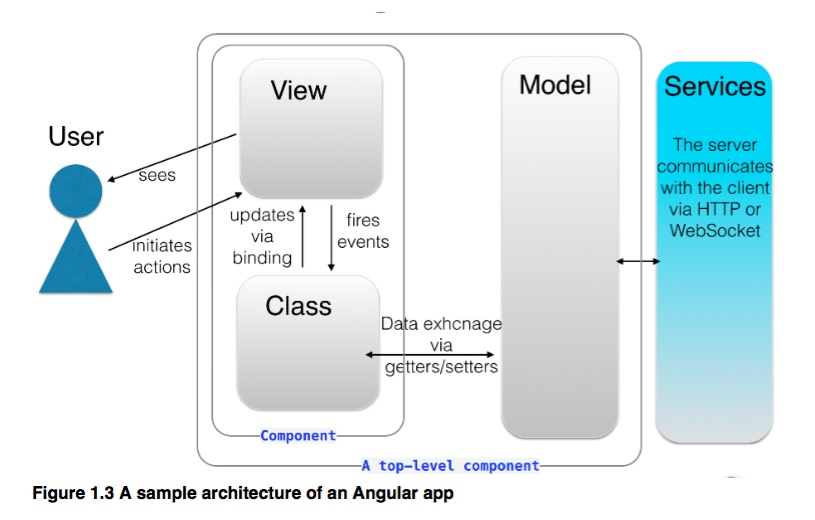
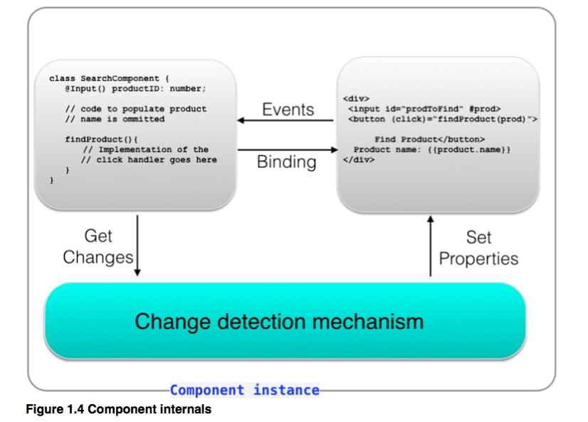
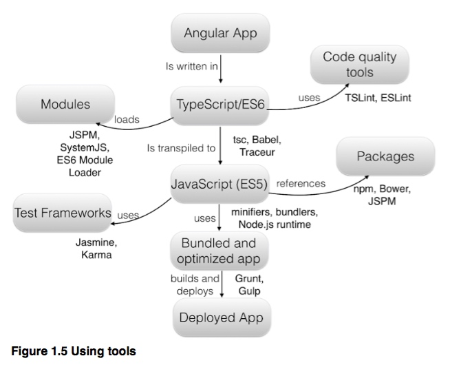


## Angular 是什么
## Angular 由哪些部分组成
### Component
### View & Tempaltes
### Directive
### Services & DI
### Http
### Route
## Angular 各部分是如何交互跑起来的
## Angular 和其他框架的异同
### Angular 1.x
### React
### jQuery


AngularJS 框架开始于 2009 by Misko Hevery 和他的朋友，用来帮助web设计师定制网页. Angular 1.0 在2012年正式官方发布. 到2015年多个小迭代版本发布，同时此时的稳定版本是1.4. Google 在持续优化功能和解决angular1.x遗留的问题，同时在并行开发angular2. 我们来看看为什么angular 如此流行吧：

（四五点）
- AngularJS 拥有依赖注入机制从而让应用开发更加松散的方式

jQuery简化了DOM操作，AngularJS则让开发者可以应用逻辑和UI相互独立解耦合（利用MVC的设计模式），图1展示了简单的angular程序（来处理商品相关） - ngapp：
user sess view, user initiates actions view
view informs controller
controller modifies修改数据model
model($scope)用http或websocket通信和后端服务


接下来blah讲了angular中的运行机理
router, services, inject 等

### 目的：
系统架构（How it works）。各个组成部分概述（模块、组件、模板、元数据、数据绑定、服务、指令、依赖注入）的关联，怎么跑起来的。

1.3 hig-level overview of angular
Angular 框架比AngularJS拥有更好的性能。更容易学，应用的架构被简化，代码更容易书写和读取。接下来看下Angular的整体架构同时会对比下AngularJS

## code simplication 代码简化
首先，一个Angular的应用程序由标准的ES6或AMD/CommonJS 格式的模块组成。通常一个模块一个文件。不需要什么特别的框架相关的语法来加载和使用模块，仅仅使用通用的模块加载器SystemJS来使用import 语句来使用被加载模块中提供的功能。你不需考虑在html文件中国的script标签的顺序。如果模块A需要使用模块B的功能，只需要在模块A到导入模块B就行
你应用程序落地页的html只需要引入框架模块，你的应用代码通过简单的加载应用的根组件来启动。所有子组件通过import语句被自动加载。下面是一个angular应用index.html中典型的内容。在顶部，你引入框架所需要的模块和代码，在文件底部你配置system加载器和加载位于app/my_application.ts的根组件。`<app>`标签是个选择器在root组件中被定义

```html
<!DOCTYPE html>
<html>
<head>
  <script src="../node_modules/angular2/bundles/angular2-polyfills.js"></script>
  <script src="../node_modules/typescript/lib/typescript.js"></script>
  <script src="../node_modules/systemjs/dist/system.src.js"></script>
  <script src="../node_modules/rxjs/bundles/Rx.js"></script>
  <script src="../node_modules/angular2/bundles/angular2.dev.js"></script>
</head>
<body>
  <app>Loading...</app>
  <script>
    System.config({
      transpiler: 'typescript',
      typescriptOptions: {emitDecoratorMetadata: true},
      packages: {app: {defaultExtension: 'ts'}}
    });
    System.import('app/my_application');
  </script>
</body>
</html>
```

每个应用组件的html代码片段可以通过组件内联的方式（template 属性）或者文件引用在component的templateURL属性。后面文件引用的方式，可以让设计师书写应用的UI界面部分而不用学习angular
Angular的组件是新架构的核心部分。图3显示了一个angular应用的高层示例图
《图》


申明组件最简单的形式是用TypeScript写个类（当然也可以使用es5, es6, dart），我们来做个试验。通过下面的代码来看看如何用TypeScript写一个ANgular的组件。

一个被注解的TypeScript的类代表着一个组件。注解@Component包含了template属性来申明html代码来在浏览器中渲染。html部分可以包含数据绑定表达式用来{{}}双层花括号表示。如果该视图view依赖于其他的组件，@Component组件需要在directives属性中罗列它们。 @Component部分模板中的事件处理event handlers
用类的方法来实现。
组件的注解也包含一个选择器用来定义在html模板中使用的自定义标签名。当angular处理html模板发现和这名字相对应的元素，从而知道哪个组件实现了它。下面的 html 片段展示了父组件`<auction-application>`和它的子组件`<search-prodocut>`
```javascript
<body>
  <auction-application>
    <search-product [productID]= "123"></search-product>
  </auction-application>
</body>
```
父组件通过属性绑定（注意方括号）传递数据给子组件，子组件通过发送事件来和它的父组件来通信。
下面是SearchComponent的代码，我们可以在html文档中通过`<search-product>`来引用，因为它的组件定义中包含了selector属性值用了同样的名字

```js
@Component({
  selector: 'search-product',
  template:
     `<form>
        <div>
          <input id="prodToFind" #prod>
          <button (click)="findProduct(prod.value)">Find Product</button>
          Product name: {{product.name}}
        </div>
      </form>
  `
})
class SearchComponent {
   @Input() productID: number;
   product: Product; // code of the Product class is omitted
   findProduct(prodName: string){
    // Implementation of the click handler goes here
    }
   // Other code can go here
}

如果你对任一拥有类的面对对象的语言熟悉的话，你很容易看懂这个代码。被标注的SearchComponent类声明了product的变量，它可代表一个拥有多个属性的对象，其中name属性被绑定在视图中`{{product.name}}}`。 #prod 会包含组件的input元素，所以可以不用查询DOM来获得输入的值
`(click)`标注代表了click点击事件，事件回调函数通过函数参数获得
通过对这个简单组件的快速学习，我们对组件是由哪些部分组成有了清晰的理解，从而便于后续章节的学习。
如果我们从来没有学习过class类，不同担心，在附录中会有介绍。
下图展示了组件各个部分的交互
《图 - component internals》


一个组件从model中使用数据（MVC模式中的M），Model可以通过class来代表。在TypeScript中，模型类用于SearchComponent可以如下：

```js
Class Product{
  id: number;
  name: string;
  description: string;
  bid: number;
  price: number;
  // constructor and other methods go here
}
注意：TypeScript允许通过类型来定义类变量。让UI组件searchCOmponent知道它的模型类，通过定义类变量：

```js
@Component { // code omitted for brevity}
class SearchComponent {
   product: Product;  // the model
   findProduct(productID){
       // The implementation of the click handler
       // for the Find Components button goes here
} }
```
如果搜索组件会返回多个产品我们可以申明一个数组来存储它们`products: Array<Product>`
<Product> 泛型标注（见附录）来告诉TypeScript编译器唯一被允许存储在数组的类型是Product 类型。
在Angular中，没有独立的控制器（MVC中的C部分），组件可以包含所有的代码，在范例中，SearchProduct 类可以包含控制器职责的


### navigation 各个视图中的通过router组件ng-router来配置。你可以使用一系列的.when 选项来路由应用到合适的视图通过URL配对。接下来的代码片段用来展示
AngularJS 路由支持deep linking，意味着用于书签页面中单一特定状态，而不是整个页面

performance 性能提升
一顿乱讲（如rendering，分离，如跨平台，worker等）


这部分很不错。
操作HTML - 通过内置的结构化指令（*ngIf, *ngFor）或者创建一个自定义的标注类用@Directive
在当前作用域指代变量 - 通过this关键词： this.userName="xxx"
给组件传入数据： 标注组件属性用@Input通过绑定值给它
从组件传出数据：@Output
如何发送HTTP请求：注入Http对象，调用它的http方法：`this.http.get('/products')`
等等

..







