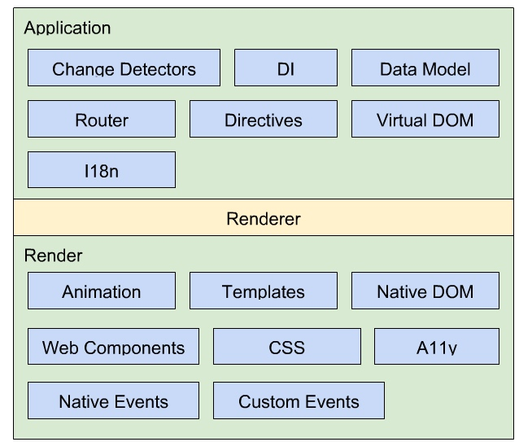
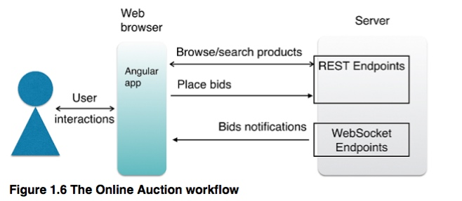

### 草稿汇总区域

- [ ] the death of scope
- [ ] angular 2 加入了大量的更改 - they love and love to hate.
- [ ] 譬如很多人花了不少时间去学习原来的古怪语法（directive），花了不少精力在scopes和digest
      cycles是如何工作的，在ngModel上调试上被坑过，努力去找到合适的目录结构，等等 这些angular2中都有不少变化
- [ ] weird System.* things?” System just adds es6 module loading
      support to the browser - 我们不需要ngapp了
- [ ] js 变成了 typescript
- [ ] Angular 框架比AngularJS拥有更好的性能。更容易学，应用的架构被简化，代码更容易书写和学习
- angular2 更多结合鲜有的web 标准如 web component 等来，而不是放弃了之前的一套（如 controller, directive 写法，scope等等）

