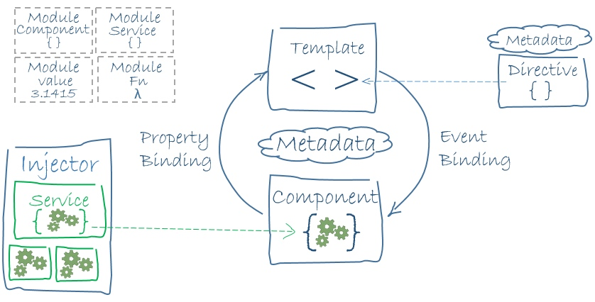
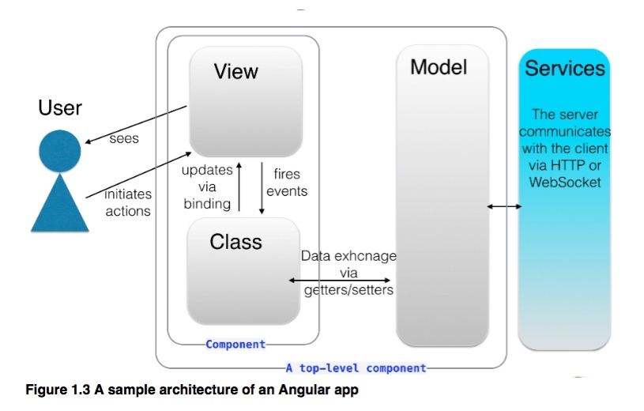
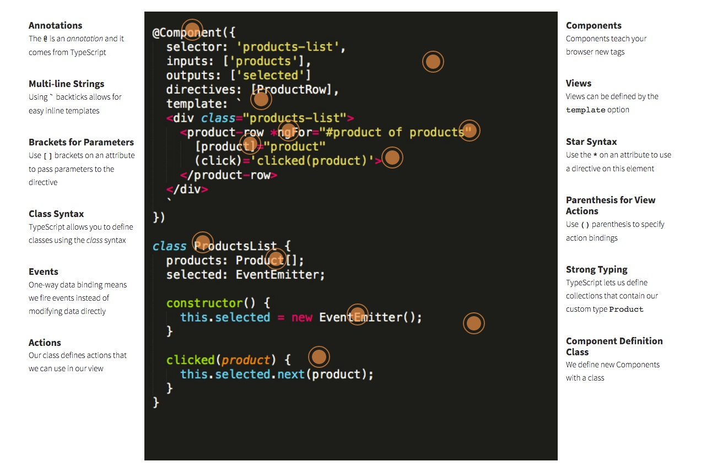
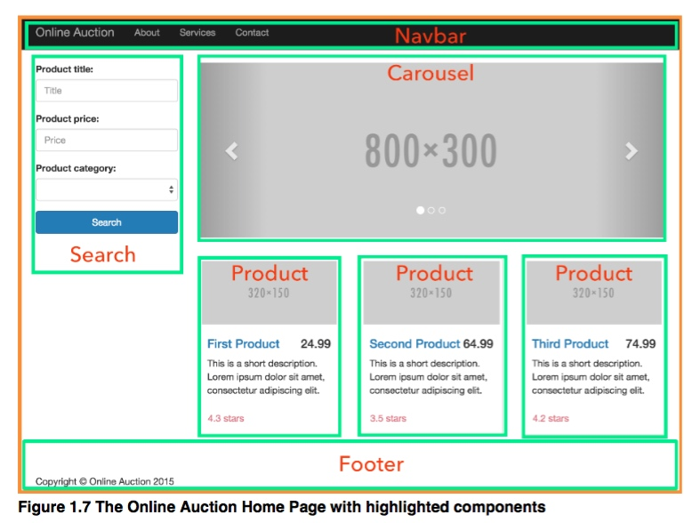
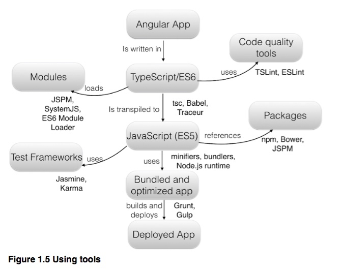
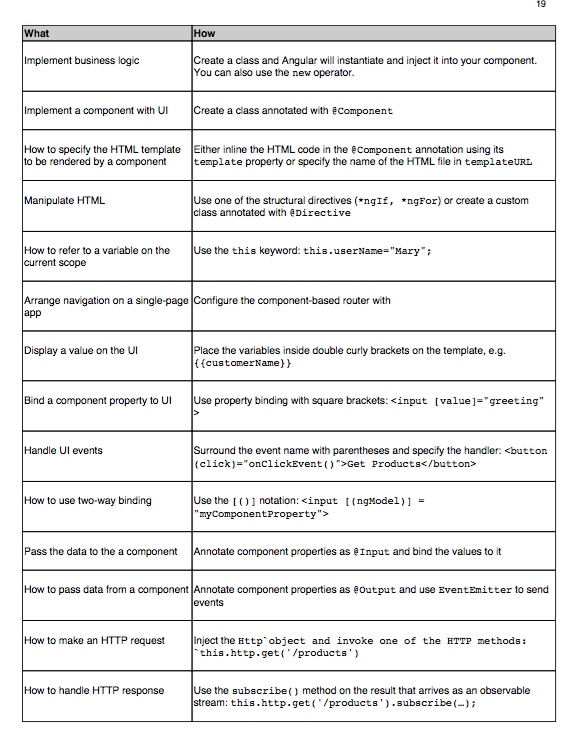

- [ ] 完成多个配图
	- [ ] Angular Framework Architecture
	- [ ] 用户视角下的 Angular 应用
	- [ ] 组件书写（引入 service）标注顺序
	- [ ] 组件树 + 路由代码图和标注顺序
	- [ ] 工具系列图
- [ ] cheatsheet 表格编写

## Angular: How it Works 

### Angular 的构成

本章节的目标是帮助读者熟悉 Angular 的一些术语和技术，它们的定义和相互关系。

Angular 是 Google 主导开发的，非常流行的下一代 MV* 开发框架，用于在浏览器（或其他更多平台）构建复杂的客户端应用。

Angular 的官方文档这么介绍它：Angular 是一个用来帮助我们用 HTML 和 JavaScript 构建客户端应用的开发框架。HTML 适合用来表述静态文档（它就是因此而生），但是当我们要开发一个交互复杂的 Web 应用，HTML + DOM 操作（通常用jQuery）也很难帮助描述好应用中的动态视图。所以我们要利用类似于 React，Angular 这样的 Web 框架来帮忙我们描述逻辑。



`Figure 1.0 - Angular Framework Architecture <Todo 待替换>`

#### 核心部分

在 Angular 框架下，我们的应用程序一般由一下部分组成：

- 使用模板语言描述的页面视图
- 使用组件来封装 UI 和应用逻辑，多个父子组成的组件树构成应用主体
- 使用服务来添加可特定抽象或单独的逻辑功能（如日志，数据，消息，配置等服务
- 使用路由来定义各个页面/视图组件跳转和管理浏览行为
- 使用启动（Bootstrap）方法来启动应用的根级组件运行应用

#### 关键概念

当然应用的这些部分和组件的运行和连通少不了一下的机制：

- 模块：它是语言层面的语法如 TypeScript/ES6 中的 import/export，实现内聚性良好来解决单一问题的代码块，如各个组件本身就该用模块来提供
- 元数据：它告诉 Angular 如何处理类代码实现不同的功能组件如@Component，@Directive等，在 TypeScript中它以装饰器形式提供
- 生命周期：当应用在应用中移动浏览时，Angular 会创建，更新，销毁组件，你可以通过组件的钩子方法定义在它的生命周期的关键点的前后插入相应的逻辑
- 依赖注入：它是应用解耦的一种技巧，通过先我们的各个部分注册后使用。类在创建新的实例时向提供器（Provider）要求和申明它所需的全部依赖。譬如 Angular 通过依赖注入机制给组件提供它们运行所需要的服务
- 改变检查：数据绑定方便我们把组件内部状态和页面视图内容联动起来（之前jQuery以手动处理DOM更新文明，在Angular中你根本不需要它），但就需要 Angular 合理利用 Zone 机制去拦截异步行为和实施它的脏检查策略（之前是dirty check类轮询的做法）
- 同时我们还需要 HttpClient，Animation， Form 相关的工具来

#### 其他部分

同时，还有一些其他部分，才能构成一个复杂应用其他的边角和剩余部分：

- 指令，当 Angular 渲染模板时，它把根据指令提供的指示来把模板变成DOM，它包括了属性和结构型指令
- 管道，用来转化格式化数据来显示的服务。在模板层使用pipes管道来提升用户体验
- HttpClient，利用它和服务器通信来拉取数据，提交保存数据和调用服务器端的方法
- 表单，通过HTML为基础的验证和脏检查，支持复杂数据条目的场景
- 动画，Angular提供一个面向未来的动画库，使得开发者可以很容易的给组件行为加动画，而不需要过多了解动画技术或css的知识

需要特别指出的是，RxJS，Immutable Data，ES6/TypeScript 等是新的基础和思想，如果对它们还不了解，你可以通过书后提供的链接进行临时『补课』。

> 写给Angular1.x用户： Death of scope 等等 组件之前通常在1.x需要借助于指令，Scope，Controller等概念和部分组成。在2.x中所有这些通过组件就能实现。

Angular 就是根据这些内容，在浏览器中展示应用内容，通过我们的提供的代码描述来响应用户的交互。



`Figure 1.1 - 用户视角下的 Angular 应用 <Todo 待替换>`

综上，Angular就是提供你开发现代 Web 应用程序一系列的高级功能框架：

- 解耦应用逻辑，数据模型和视图
- MVVM 和数据绑定
- Ajax等 Http 服务
- 依赖注入
- Navigation浏览导航
- 测试（包括单元测试，E2E测试等）
- 多渲染支持（如服务器端，web worker，native客户端等）
- 等其他

不用担心有这么多概念需要理解和学习，写一个简单的Todo应用，或计算器不需要这么多，可能仅仅利用组件，模板等就能很好的处理，但是 Angular 团队提供的这些强大的工具和类库，可以在你构建复杂应用程序（想想看炒股软件，Google的广告管理后台等）提供强有力的支持。

#### Tip 知识点：MVC， MVVM

MVC模式的意思是，软件可以分成三个部分。
视图（View）：用户界面。控制器（Controller）：业务逻辑模型（Model）：数据保存
各部分之间的通信方式如下（所有通信都是单向的：

- View 传送指令到 Controller
- Controller 完成业务逻辑后，要求 Model 改变状态
- Model 将新的数据发送到 View，用户得到反馈

MVVM是Model-View-ViewModel的简写。它采用双向绑定（data-binding）：View的变动，自动反映在 ViewModel，反之亦然。Angular 和 Ember 都采用这种模式。（view 层非常薄，一般没有任何业务逻辑，称为被动视图，通常被 viewmodel 驱动现实）

#### Tip 知识点：Web Components

Web Components是W3C定义的新标准，目前还处于草案阶段，但各大浏览器已经开始支持。它给了前端开发者扩展浏览器标签的能力，可以自由的定制组件，更好的进行模块化开发，彻底解放了前端开发者的生产力。。它包含 custom elements, html templates, shadow dom, html imports 等部分。而 Angular 是一个 MVVM 的框架。本质上的区别在于一个是创造小而美的组件，一个是基于组件之上创造大而全的框架。


### 从代码示例看各部分的联动

我们大概知道了 Angular 怎么把需要构建的复杂应用按照它的设计理念切分成框架中的各个部分，那么我们还需要了解 Angular 的这些重要组成部分之间是如何相互的关联作用的。
该小节通过一个具体的例子的代码，标注及其相关的解释，与上一节的一些概念结合，帮助用户从更全局的视角，提供直观的感受。那么让我们开始吧，我们通过一个简单的XX应用。

#### 核心组件

> 组件的写法和关键概念代码示例



`Figure 1.2 - 标注讲解顺序点的代码示例 <Todo 待替换>`


```javascript
@Component({
  selector: 'products-list',
  inputs: ['products'],
  outputs: ['selected'],
  directives: [ProductRow],
  template: `
    <div class="products-list">
      <product-row *ngFor="#product of products">
        [product="product"] (click)="clicked(product)"
      </product-row>
    </div>
  `
})
class ProductsList {
  products: Product[];
  selected: EventMitter;

  constructor() {
    this.selected = new EventMitter();
  }

  clicked(product) {
    this.selected.next(product);
  }
}
```

1.0： TypeScript，一般的JavaScript 的开发者看到这段代码发现有很多不认识的语法。如：
- annotations（注解）: @ 是typescript 用于注解的标志
- 多行字符串：我们的模版是通过 es6 中新字符串特性来书写的，我们再也不用+来连接你
- 类：使用 class 关键字来定义类和相应的 constructor 构建函数
- strong typing:强类型如 product[]的数组

1.1 组件
我们通过注解提供一个组件需要的一些属性点配置，并且告诉给浏览器新的 tag，如
1.1.1：inputs 和 outputs
1.1.2: selector

action 和 parentheis for views 和用户事件和类中的 action 函数结合（事件绑定） - 如例子中就是当用户点击 product-row 这个组件时，去设置 productList 组件的 selected 属性的值为


1.2 View 和 template（视图和模版）
在例子中我们通过模版定义我们用户看到该组件的样子，如它包含你传统的 html 语法和一些其他的语法和新属性

1.3 directive指令
正如我们刚才在模版中看到的，和在注解中看的 directives:[]
ngFor - 结构化指令，其他还有 ngIf
(click) - 属性指令，和事件绑定
productRow - 组件类指令

1.4 service 服务
我们引入的 data 服务服务用来引入 product-list 的数据，它可以来自于 http 数据api 接口也可以来自于客户端的缓存。我们引入服务这个概念把相关的逻辑 xxxx

1.5 DI
我们可以看到 DI 来帮助我们xxx
如 constructor，或者 directives，providers 中声明的那样，我告诉通过注解告诉 angular2：该 ProductList 需要用到 xxx，请在运行的时候提供（该那部分通过向 provider register 形式告诉 angular2 他们各种的创建方法）


#### 应用的组件树

> 我们的应用页面通过组件以树的方式表现出来：



`Figure 1.4 应用的组件树`

root component -> (list->item) + form 
从而很直观的认识到页面的构成，相互之间通过事件，inputs & outputs 等来交互，整个流程和交互非常清楚，界限定义的

#### 应用各视图的路由

当然当我们的应用变的更复杂的时候，可能会出现更多的页面，每个页面有自己的 url 来标识和不同的组件构成提供不同的功能。

> @3：路由和页面:[about, todoList, todoDetail 和 ComponentRoute 定义]

```javascript
import { Start } from './components/start';
import { About } from './components/about';
import { Contact } from './components/contact';

// 3.1
@RouteConfig([
    { path: '/', component: Start, as: 'start'}
    { path: '/about', component: About, as: 'about'}
    { path: '/contact', component: Contact, as: 'contact'}
])
class App {
....
}

<html><head></head><body><nav>
    <ul>
        <li><a router-link="start">Start</a></li>
        <li><a router-link="about">About</a></li>
        <li><a router-link="contact">Contact</a></li>
    </ul>
</nav></body></html>
```

Angular 通过 component rounter 定义提供这样：
如上面的例子告诉我们，当用户访问/about 路径 url 访问关于页面的时候，我们提供 about 组件来提供视图和逻辑来相应用户操作

3.1：通过 route，我们定义了三个页面，如 url 路径，对应的组件和别名。
3.2 我们可以在使用刚才定义的 route，实现点击链接后的跳转


### Angular 的工具周边

构建 Angular 应用，你可能还需要借助一些工具，才能让你的workflow流程更加顺畅高效。下图展示了一个 Angular 应用书写，构建，测试，打包，发布等一系统流程可能会用的工具。



`Figure 1.6 Angular 相关工具和关系`

- 代码质量工具： ESlint
- 测试框架和工具：Jasmine，Karma
- 模块系统和加载：JSPM，SystemJS，ES6 Modules
- ES6/TypeScript语言工具：Babel，tsc，typings
- 包管理工具：npm/bower/jspm
- 打包构建工具：Webpack，Grunt，Gulp，Npm Scripts

Todo： 每个部分一句话介绍和引入。


### Angular 和其他框架简要对比

相信各位读者之前除了jQuery外，也会用过其他MV*类的框架来构建自己的应用。那么它们究竟和 Angular 差别在哪，本小节通过对比 Angular 1.x，React，Backbone，jQuery 来简要描述它们和 Angular 的异同，从而让你信心满满的开始学习和使用上最新最强大的框架王者 - Angular 2。

Angular 则让开发者可以应用逻辑和UI相互独立解耦合（利用MVVM的设计模式）Web Component + DI + Routing + Observables + Input/Output + ... 等提供了开发复杂应用的大量的框架，我们只需要把我们的逻辑按照框架提供好的坑和脚手架往里面填入就行你

#### Angular 1.x

#### React

#### Backbone

#### jQuery

jQuery 最早简化了DOM操作（处理了浏览器兼容性问题和提供不少好用的方法），也提供一些诸如动画，ajax 网络请求等功能，但它仍然是一个较为底层的类库


### Angular 常见功能写法一览

<Todo - 引入之前的 cheatsheet 表格，如一般常见的事情在 angular2是怎么做的>




### 总结
希望通过这章节的介绍，读者可以对 Angular 应用的组成，各部分的关联，工具周边等有个较为全局的理解，具体部分的讲解，读者将会在后续的章节逐一深入学习和使用。


----


