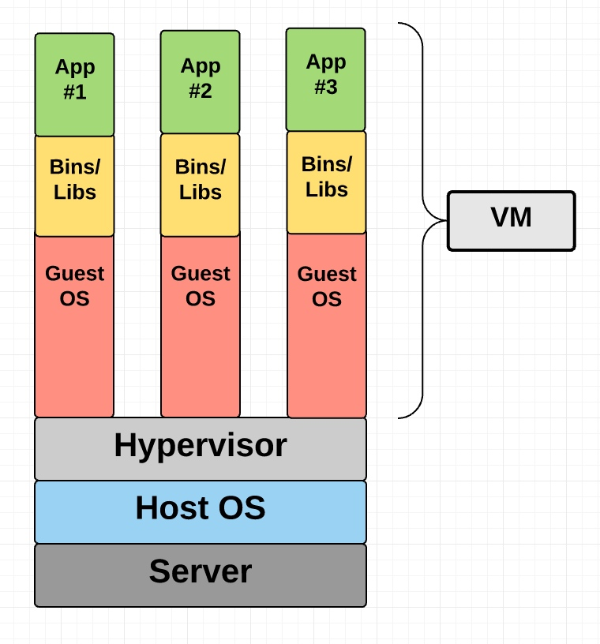
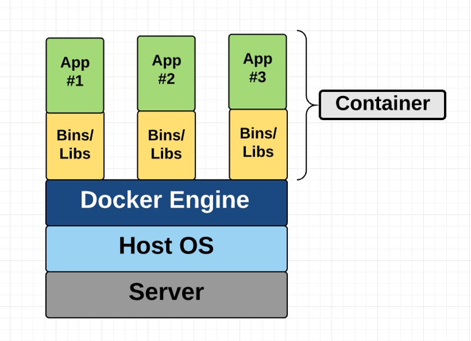
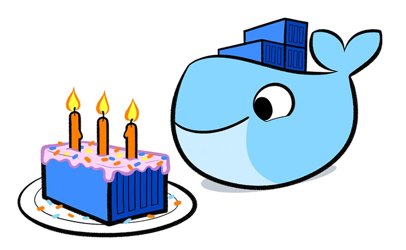
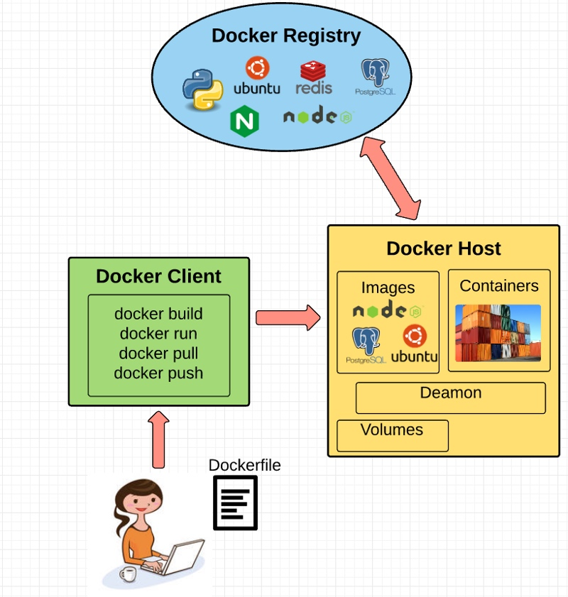
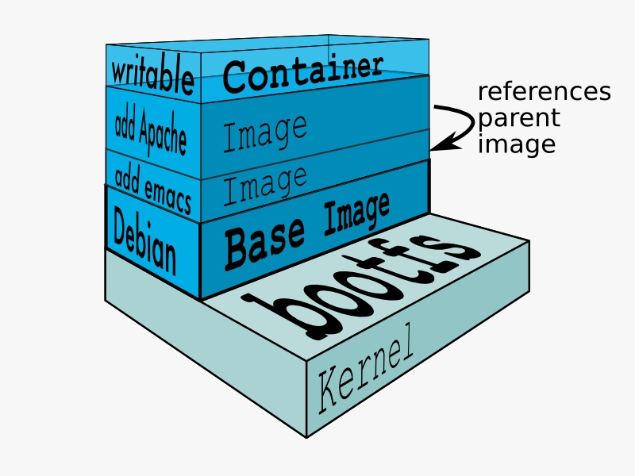

如果你是位程序员或技术爱好者，你可有可能已经听说过 Docker：用来打包，分发和在容器中运行应用的好用工具。这段时间获得巨大的用户关注，从普通开发者到系统管理员之类的。对于那些像Google，VMware和亚马逊这样的大公司都在开发支持它的服务。

不管你是否在脑袋中立即对Docker有了使用场景，我仍然认为去理解诸如什么是容器和它和之前虚拟机是什么关系等这些基本概念都是非常重要的。虽然网上有大量的优秀的Docker使用指南等资源，但我还没发现一些针对入门者的概念性指南，尤其是容器是有什么组成等概念上。希望，这篇博客能解决目前这问题。

让我们从理解什么是虚拟机和容器开始吧。

### 什么是容器，什么是虚拟机？

在各自的目标上看，容器和虚拟机是类似的 - 就是独立应用和它的依赖到独立自包含的直到你可以在其他地方运行。

进一步，容器和虚拟机消除了实体机的需求，允许我们更有有效地使用计算资源（在能源消耗和成本花费上）
容器和虚拟机的主要差别体现在它们的架构实现方案上。让我们细细看来：

### 虚拟机

一个虚拟机通常就是对一台真实电脑的虚拟，就像真机那样用来执行软件。




### 容器

不像虚拟机技术提供硬件虚拟化，容器通过抽象用户空间（用户态）提供操作系统级别的虚拟化。随着我一步步解包容器这个术语，你就会理解我所说的。




### Docker起源于？

Docker是基于Linux容器之上的开源项目。它使用了Linux内核特性如命名空间和控制组在操作系统之上来创建容器。

容器从不是个新东西。Google已经使用自家的容器技术数年之久了，其他的Linux容器技术包括如：Solaris Zones, BSD jails, and LXC也面世了好几年了。

那为什么Docker突然一下子流行起来了呢？


- 1 易于使用
- 2 快速
- 3 Docker Hub
- 4 模块化和可扩展性

最后也同样重要的是：谁能不喜欢这么可爱的 Docker 鲸呢



### Docker 基本概念

现在我们先全局看下，然后一步步过下Docker的主要部分




#### Docker Engine

docker引擎是docker运行在的那层。它是轻量级的运行时和诸如管理容器，镜像，构建和其他等系列工具。它原生运行子Linux系统上，有下面部分组成：

- Docker守护进程，在宿主机器上运行
- DOcker客户端，和Docker守护进程进行通信来执行命令
- 一套REST风格的接口，用于和Docker守护进程来远程交互

#### Docker Client

Docker客户端，是我们作为Docker的终端用户需要打交道的。把它想成Docker的界面UI。
你和Docker客户端沟通，而它会最终把你的指令送给Docker守护进程去执行。

#### Docker Daemon

Docker守护进程是真正执行那些先被送给Docker客户端命令的地方，如构建，运行和分发你的容器。Docker守护进程在你的宿主机器上运行，但是做为用户你从不用直接和它打交道。Docker Client也可以在宿主机器上运行（但不是强制必须的）。它可以在不同机器上和宿主机器上的Docker守护进程进行通信。

#### Dockerfile

Dockerfile正是你把如何构建Docker镜像的一步步指令记录的地方。这些指令可以是：

- RUN apt-get install some-package：安装软件包
- EXPOSE 80：暴露特定端口
- ENV ANT_HOME /usr/local/apache-ant：传递环境变量

迄今一旦一设置好了 Dockfile，你就可以用 docker build 命令来依据它来构建镜像了。下面是一个 Dockerfile 的例子：

```sh
# Start with ubuntu 14.04
FROM ubuntu:14.04

MAINTAINER preethi kasireddy iam.preethi.k@gmail.com

# For SSH access and port redirection
ENV ROOTPASSWORD sample

# Turn off prompts during installations
ENV DEBIAN_FRONTEND noninteractive
RUN echo "debconf shared/accepted-oracle-license-v1-1 select true" | debconf-set-selections
RUN echo "debconf shared/accepted-oracle-license-v1-1 seen true" | debconf-set-selections

# Update packages
RUN apt-get -y update

# Install system tools / libraries
RUN apt-get -y install python3-software-properties \
    software-properties-common \
    bzip2 \
    ssh \
    net-tools \
    vim \
    curl \
    expect \
    git \
    nano \
    wget \
    build-essential \
    dialog \
    make \
    build-essential \
    checkinstall \
    bridge-utils \
    virt-viewer \
    python-pip \
    python-setuptools \
    python-dev

# Install Node, npm
RUN curl -sL https://deb.nodesource.com/setup_4.x | sudo -E bash -
RUN apt-get install -y nodejs

# Add oracle-jdk7 to repositories
RUN add-apt-repository ppa:webupd8team/java

# Make sure the package repository is up to date
RUN echo "deb http://archive.ubuntu.com/ubuntu precise main universe" > /etc/apt/sources.list

# Update apt
RUN apt-get -y update

# Install oracle-jdk7
RUN apt-get -y install oracle-java7-installer

# Export JAVA_HOME variable
ENV JAVA_HOME /usr/lib/jvm/java-7-oracle

# Run sshd
RUN apt-get install -y openssh-server
RUN mkdir /var/run/sshd
RUN echo "root:$ROOTPASSWORD" | chpasswd
RUN sed -i 's/PermitRootLogin without-password/PermitRootLogin yes/' /etc/ssh/sshd_config

# SSH login fix. Otherwise user is kicked off after login
RUN sed 's@session\s*required\s*pam_loginuid.so@session optional pam_loginuid.so@g' -i /etc/pam.d/sshd

# Expose Node.js app port
EXPOSE 8000

# Create tap-to-android app directory
RUN mkdir -p /usr/src/my-app
WORKDIR /usr/src/my-app

# Install app dependencies
COPY . /usr/src/my-app
RUN npm install

# Add entrypoint
ADD entrypoint.sh /entrypoint.sh
RUN chmod +x /entrypoint.sh
ENTRYPOINT ["/entrypoint.sh"]

CMD ["npm", "start"]

```

#### Docker Image

镜像是从你在Dockerfile写的指令中构建生成的只读模板。镜像既定义了你需要什么软件和它的依赖同时定义了在它启动时需要运行的进程。

Docker镜像是用Dockerfile构建的，每个在Dockerfile中的指令都给该镜像添加了新的一层，通过layer层这概念代表镜像中的文件系统被添加或被替换的那部分文件。Layers层是Docker能够足够轻量但能有强大结构的关键点。Docker使用联合文件系统实现了它：

#### Union File Systems

Docker使用联合文件洗通过你来构建镜像。你可以把联合文件系统看作是可堆栈的文件系统，意味着不同文件系统（内部叫做分支branches）的文件和目录可以透明的层叠来形成单一的文件系统。

那些目录中内容如果和它所要层叠的分支中有相同的路径，那么会被看做单一被合并的目录。这样就避免为每一层单独创建拷贝的需要了。实际上，它们可是都是对相同资源的指针。当特定层的内容需要被改变，它会先创建拷贝然后在修改本地的拷贝，不去动原来的。这就是看起来可以写却没有写权限的文件系统是如何实现的（换句话就是，一个先copy后write的系统）

分层的系统提供了下面两大好处：

- 免于复制：层帮忙我们在每次使用镜像来创建和运行容器上免于全量的文件复制，使得docker容器的安装非常快速和廉价。
- 层级分离：使得修改非常快速，当你做一个修改，Docker仅仅把对该层的更新传递到那个需要被修改的层上


#### Volumes

卷是容器的数据部分。当容器被创建时候被初始化。卷允许你持久化和分享容器的数据。数据卷和默认的联合文件系统是独立的，作为宿主系统中的正常文件和目录的形式存在。所以，如果你删除，更新或重新构建你的容器，你的数据卷不会被影响。当你想要更新容器时，你可以直接去更改他（作为奖励，数据卷可以在多个容器见分享和复用，这一点很赞~）

#### Docker Containers

Docker容器，正如上面讨论的，把应用软件和它运行所需要的一切都打包到一个看不见的盒子中。它包含了操作系统，应用代码，运行时（如.NET或JVM），系统工具，系统类库等等。Docker容器是从Docker镜像中创建而来的，既然镜像是只读的，Docker在这个只读文件系统镜像之上加了可读写的文件系统来创建一个容器

同时，在创建容器时，Docker也为其创建了网络接口从而容器可以和本地网络『对话』通信，把尚有的IP地址绑定到容器上，接着运行你在定义镜像时声明的进程。

一旦你成功创建了容器，你可以在任何环境下不做修改的运行它。




### 对Docker一探究尽 - double-clicking on contianers

唷，Docker还包含了不少东西。一件始终让我感到好奇的事情：容器是如何实现的，尤其是既然这其中没有抽象的基础设施边界在容器周围。经过大量的阅读，我大概了解了现在准备尝试解释给你们听听。

容器这个词事实上是用来描述一些不同特性如何在一起配合工作，可视化的像个容器。让我们快速过下它们：

1） 命名空间
命名空间提供给容器对底层的Linux系统它们特殊视图，控制容器能看看到和访问它们什么什么。当你运行一个容器，Docker为要被运行的那个容器创建命名空间。
在Docker利用的内核中，有好几种不同类型的命名空间，如：

- a. NET: 为容器提供了它自己对系统网络栈的视图 (如，它自己的网络设备，IP地址，IP路由表，/proc/net 目录和端口号等）。
- b. PID: PID 代表着进程ID。如果你曾经在命令行中运行过`ps aux`来查看你系统中运行中哪些进程，那么你肯定对PID这列有印象。PID命名空间让容器对它们的查看和交互的进程有自己特定范围的视图，包括独立的init初始进程 PID 1(它是所有其他进程的祖先。
- c. MNT: 给容器在对系统挂载磁盘的独立视图。所以在不同MNT命名空间的进程对文件系统的目录层级有着不同视角。
- d. UTS: UTS 代表着UNIX时分系统。它允许进程认出系统的识别符(如，主机名，域名等。UTS允许容器有它们自己的域名和NIS域名，从而独立于其他容器和宿主系统。
- e. IPC: IPC 代表着进程间通信。IPC命名空间负责在不同容器中运行的进程间隔离IPC资源
- f. USER: 这一命名空间被用来隔离在不同容器中的用户。

Docker 使用这些命名空间一起从而隔离和开始了容器的创建。下面我要聊的特性是控制组

2） 控制组

控制组（通常也被称为 cgroups）是Linux内核特性用来对一系列进程的进行隔离，优先和为资源（如CPU，memory，磁盘 I/O，网络等）使用负责。在这个层面上，一个cgrou确保了Docker容器只使用它们需要的资源 - 同时，如果要需要，对容器所能使用的资源进行约束。cgroups也确保单一的容器不会消耗完所有的资源，使得整个系统挂掉。

最后，联合文件系统是另外Docker使用的特性。

3）联合的文件系统

在上面 Docker 镜像章节描述过。
这实际上就Docker容器中有的所有了（当然，魔鬼都在实现的细节中 - 如何管理不同组件之间的交互调用等）


### 未来：Docker和虚拟机共存


### 结论

我希望你现在已经拥有一些关于容器Docker等基本知识，用于下一步的继续学习或有一天在项目中的使用。

按惯例，如果我说错什么或有什么好建议，不要吝啬留下你的评论。


