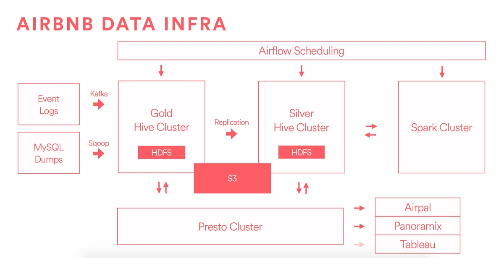

## 我们数据平台背后的哲学

  在airbnb，我们推崇数据导向的文化，利用数据作为我们市场决定的关键因素。跟踪指标，验证假设通过实验，构建机器学习模型，深挖商业价值，这些都让我们变得更快更明智。
  
  经过许多次的进化步骤，我们现在感到我们的数据基础架构栈变得稳定，可依赖和可以扩展的。所以这看起来是个好机会，来和社区分享我们的经验。在最近几个星期，我们发布了不少博客文章来讲述我们的分发/分布式架构和我们的工具集。因为开源贡献者提供了许多我们现在在用的基础系统，这些让我们也非常乐意于通过开源有用的项目在github来回馈社区，也记录我们这一路学到的东西~
  
在我们实施数据基础架构时，一些非正式哲学慢慢形成了：

- 借鉴开源社区
- 倾向于标准组件和方法
- 确保它可扩展
- 倾听同事，解决实际问题
- 预留更多资源

## 基础架构概述

上图是简化的图表来展示我们基础架构中的主要组件
我们系统的原数据主要来自于两个主要的渠道：那些代码中的指令通过kafka来发送书剑 和 生成数据库dump出然后通过Sqoop导入（通过AWS的RDS(类MySQL)在时间恢复点导出）

这些源头数据包含了用户活动事件数据和多维的快照被接着发送到黄金集群（Gold）中（我们用于存储数据和开始跑我们的ETL任务（抽取，转换和加载）在这一步，我们实施业务逻辑，构建汇总表，和实施数据质量检查。

在上图中，有两个分离开的集群代表Gold金和Silver银，它们会在下一博文中详细讲解。抽象解释下这样分离是为了确保计算和存储资源的隔离，这样在遇到灾难等情况可以提供确保恢复的机制。这样的架构让Gold环境下，大部分重要的任务可以在严格确保下运行，SLA服务级别得意确保，从而避免受到资源密集型的热查询的干扰。我们也把Silver环境作为生产环境，但是不那么严格要求和容忍突发的资源密集的查询

要意识到通过设置两个集群我们拥有了隔离的能力，但是它的代价是大数据量的数据复制和复杂动态系统间的数据同步的管理。Gold是我们数据源头，我们从它那边到Silver做全量的复制。在Silver产生的数据不会被复制到Gold下，你可以这样认为这样的单向复制的设计方式让Silver免于成为其他任何东西的父集。 因为我们很多的分析和报告在Silver集群上实施，所以确保新数据被尽快加载到Silver中使用户的任务执行的没有延期是至关重要的。更重要的是，如果我们在Gold集群更新现有的数据，我们必须通知更新事件和同时把更新的变化同步到Silver。这复制优化问题在开源社区目前木有什么好方案，所以我们在接下来的博客中会详细描述为解决这问题构建新的一套工具。

我们在调优HDFS上付出了巨大的努力，对我们的中间源和数据池 - Hive管理的数据表提供更精确的调优。数据仓库的质量和稳健依赖于数据要不可修改和所有的延生可以被重现 - 使用分区Hive表对实现这个目标是很重要的。进一步，我不鼓励不同数据系统的延续和我们也不想维护在数据源头和最终用户表报间的中间数据基础架构。在我们的经验中，这些中间系统会混淆唯一数据事实，给ETL任务的管理添加负担，让展现在Dashboard仪表盘上的指标的线性最终变得困难，从而不明确它是怎么从源数据一步步来的。我们不需要跑 Oracle， Teradata，Vertica和Redshift等，相反我们使用Presto对于据大部分热查询在Hive维护管理的数据表。我们喜欢在不久将来把Presto直接连接到我们的Tableau的按照上。

图上需要单独说明的点，包括Airpal，我们开发和开源的web界面的查询执行工具（背后是presto）
<Todo - 省略部分>

## 细看我们Hadoop集群进化

### A）在Mesos架构上运行唯一的Hadoop

### B）远程的读写

### C) 同构机器上的异构负载

### D）HDFS的同盟

### E）系统监控重担

### 结论

在经历过旧集群按照配置时遇到的各种错误和低效能，我们决心来系统性的解决这些难题。它是个长期的工程来迁移PT级别的数据，和数以百计的用户任务（但不干扰同事们的任务）。我们会新写一篇在此主题上的博客，和发布一系列的工具到开源社区中。

## 感谢和表扬
非常感谢对原先实现Airbnb的数据基础架构的工程团队和对那些持续工作让系统不断稳定和提升的同事们。我很高兴能写这篇文字，但是真正的工作和荣耀属于这项目背后的人员：Nick Barrow-Williams, Greg Brandt, Dan Davydov, Wensheng Hua, Swaroop Jagadish, Andy Kramolisch, Kevin Long, Jingwei Lu, Will Moss, Krishna Puttaswamy, Liyin Tang, Paul Yang, Hongbo Zeng, and Jason Zhang。

