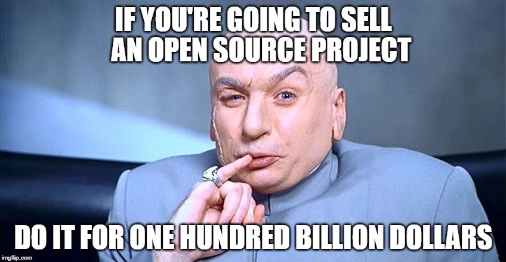

如果你在过去5年什么时间点里用过 Node.js，那么你很有可能也用过 Express。
它是在github上被加星最多的nodejs相关的项目，每周平均大概100w的下载量。

这就是最近项目进展中发生的冲击破迅速引起了我的注意。

『I am closing down Express5.0. I'm quitting the Express TC now. I cannot trust anyone any more.』
我要关掉 Express5.0项目了，我现在要退出Express技术委员会了。我再也不会相信任何人！！

谁是 Doug Wilson？他凭什么可以关掉Express的未来版本？！
接下来我的一些发现让我真是大吃一惊

如果你和我一样，认为过去两年Express核心项目被Strongloop公司积极维护着。那我准备告诉你一些新消息了，Express并没有被他们维护着！

那些像我们一样在过去两年用着的Express，其实是要靠着Doug Wilson的辛苦工作支持的。

『谁说Doug Wilson』你可能会问，如果你之前没有听说过他，你绝不是少数。我也是知道最近才了解他的。

为了更加全景化了解这个问题，我们最好先从Express框架的全能创建者 TJ Holowaychuk 聊起~

## 偏执狂：TJ Holowaychuk

## 能把开源项目卖掉是什么鬼

## MIT 开源授权：简单解释（读者可略过）

## 占有几乎就有真理

## 下次你做坏事时

TJ已经对他把Express卖出的决定感到后悔。把开源项目卖掉是你能做的最混账的事！
很多人也对此很生气。
但让我真正生气的是，TJ并没有卖到什么钱。

『你弄得看起来卖完后，我突然好有钱的样子，但实际上连我半个月的工资都不到。。。』

这才是真正让我无语的地方。如果你真要做什么坏事，好歹是为了什么非常吸引人的诱惑如大量钱财等

如果读者中有任何想过把自己开源项目卖掉给最高的开价者，那么我的建议是：

## 欢迎进入黑暗世界：Strongloop接管Express项目！

StrongLoop 收购了Express项目在Github的所有权。这是个明智的决定，毫无疑问让它到了社区的前沿和中心。

虽然说这不是什么道德优越的好事，但是这意味着Strongloop就要影响Express项目的进展？

这还很有可能StrongLoop是对Express是出于好心，同时会给社区分配除足够的资源和支持。甚至精心的找了个全职的开发者来帮助开发这个项目。

『那些不那么多地道的行为会持续产生，沿着不地道的方式』

在 2014年的 7月29 号，StrongLoop 发表了臭名昭著的声明：
TJ HolowayChuk 把Express的赞助方转让给了StrongLoop。

在同年的8月，Express 在github的项目被移StrongLoop org下。同年10月，Express官方网站在显著位置加了一条指向LoopBack的链接（StrongLoop自己的构建在Express之上的开源框架）

在2014年那个命运般的日子和知道2016年3月到这个月这篇文章写的日子下，你猜StrongLoop给Express项目的主分支提交了几次代码？

一次都没！！

或者说几乎为0.反正绝对少于5个，就如下图所示：

该项目的最高提交数的6位贡献者都不是StrongLoop的员工。

## 未被歌颂的Express英雄：Doug Wilson

## 人事现状

你可能已经听到了，IBM最近收购了Strongloop。我敢肯定Strongloop对Express项目的慷慨赞助对IBM收购这个决定起了不小的作用。
IBM最近还把Express也加入了Node基金（head off xx to 阻止？）
据传言，IBM分配了两个全职工程师在这个项目上。

## 最后的思考

Doug 和他的朋友们目前在全力以赴在类似于Express的崭新项目上。我相信你不久后就会有所耳闻。
按我目前理解的，Express需要彻底的重写来支持HTTP/2。希望这能顺利进展但是谁知道呢现在

说实话，如果你只能从这件JavaScript历史的风暴轶事中记住一件的话：

『在互联网的某个角落有个名叫 Doug Wilson（@blipsofadoug）的人，在过去的三年里，它就是为了我们默默支持和照顾Express的人！』

在过去的三年中，Doug 很可能解决了影响你生产环境下的应用的一个真实bug，而同时你可能都没有用意识到这一点就提升了服务器的运行性能~

