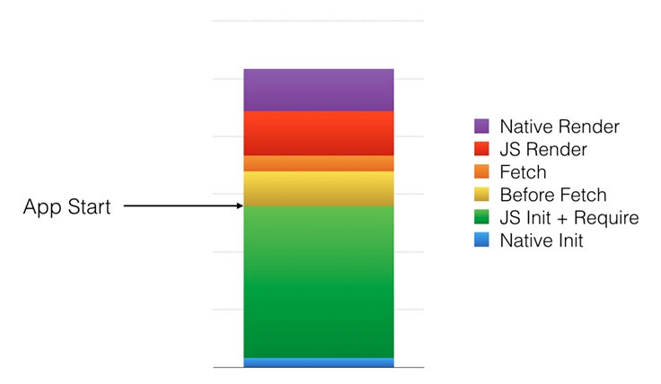

该文章翻译自Facebook官方博客，[传送门](https://code.facebook.com/posts/895897210527114/) 

React Native 允许我们运用 React 和 Relay 提供的声明式的编程模型，写JavaScript来构建我们的 iOS 和 Android 的应用。这样的做法使得我们的代码更精简，更容易理解和阅读，这些代码还可以在多个平台共享。我们也可以加快迭代速度（因为在开发时不用等待漫长的编译。使用React Native，我们可以发布更快，打磨更多细节，让应用运行的更流畅。这其中优化性能是我们工作的一大重要部分，接下来讲述 Facebook 如何使应用性能足足提升两倍的故事~

### 为什么要加快?
当应用运行的更快，内容加载的更迅速，就意味着用户可以有更多时间来使用应用，流畅的动画让用户更加享受的使用应用。在新型市场中，2G网络和几年前的机型还是主力。这时那些性能良好的和那些运行卡顿就有很大差别了。
自从发布了 iOS 和 Android 版本的 React Native 后，我们团队一直在诸如 提升列表视图的滚动性能，优化内存占有，让 UI 界面更具响应性和加快应用启动速度 上做了不少工作。这其中应用启动关乎初次印象和是框架其他部分的压力源头，所以它是要解决的头等难题。

### 量化一切
我们把Facebook的iOS版中的事件主页用RN重新实现（在更多标签页下点击事件进入查看）。这是个非常好的用于测试性能的例子，因为原生版已经做了大量的优化工作，而且该页面也是非常好的典型列表交互的例子。

接下来，我们自动化的 CT-Scan 性能测试来帮助我们自动定位到我们需要到的标签页。然后反复打开和关闭事件主页50次。在每次交互中，我们能够记录下从点击事件按钮到事件主页能够被完整显示的时间，我们也添加更多详细的性能埋点来告诉我们启动过程哪些步骤是缓慢或消耗CPU的

下面是我们记录和测量的一些步骤的大致描述：

1 原生启动：初始化JavaScript虚拟机和其他一些原生模块（如磁盘缓存，网络，UI管理器等）
2 JS初始化和依赖加载：从手机存储中读取被压缩的JS代码，加载到JavaScript虚拟机，从而解析和产生字节码，加载相关的依赖
3 取数据前：加载和执行事件主页的应用代码，构建Relay的查询语句，然后触发取数据。
4 取数据：从手机磁盘缓存读取数据
5 JS渲染：初始化所有相关的React组件，把它们发送到原生的UI管理器模块来显示。
6 原生渲染：在shadow线程中先通过根据 FlexBox 布局计算视图大小。然后在主线程中创建和定位这些视图。

我们根据于此的黄金法则是：永远不要忘了回归测试。我们持续的运行它来追踪性能提升和功能回归。开发者在提交改动的代码之前用它对特定的提交做运行和详细的性能分析。其他的一些测试也需要被同样的方式建立来衡量诸如功能性能和内存使用等

### 启动时发生了什么
### 性能提升
#### 启动时少做些

- 清理 Require/Babel 辅助方法（高优先级）：清理掉那些在require时执行的多余逻辑和代码，那些事为了网站准备而不是 RN
- 避免在加载打包文件时，复制和解码字符串
- 去除开发时才需要的模块
- 在服务器端生成事件描述

#### 安排合适时机执行

- 懒加载
- Relay的增量缓存读取
- 不用批量桥协议调用，要批量Relay调用
- 更早的界面填充
- 懒加载原生模块
- 对文本组件的触摸做懒绑定
- 延迟流行事件的查询：

### 为光速做准备

