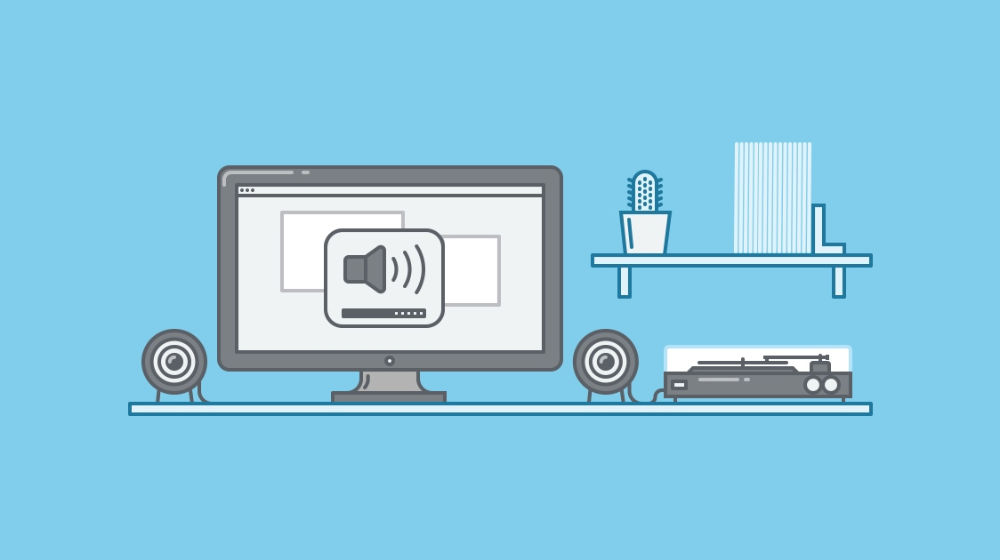

如果哪个时间段我没带上降噪耳机工作，那我的效率肯定不高，因为我没有进入到属于我自己的由音乐营造的氛围空间中~

编译自[How Music Affects Your Productivity](https://medium.com/life-learning/how-music-affects-your-productivity-42a6dfa6fdfe#.o4igwm3u)

Since music has increasingly become a part the modern-day workplace. 

>『Music has a strange temporal permanence; as art decorates space; so does music decorate time』

With so much of our time being spent at work, and so much of our work being done at computers, music has become inseparable from our day-to-day tasks — a way to “optimize the boring” while looking at screens.

### 音乐让重复性的任务更有意思

### 音乐是逃离繁杂办公环境的出口

### 环境噪音是迸发创造力的好方法

### 歌词有时会分散注意力

### 熟悉的音乐让你更容易集中

### 哪些音乐适合长时间的沉浸式任务？

#### 古典乐 Classical Music

为什么有效

听哪些

例子

#### 电子乐 Electronic Music

为什么有效

听哪些

例子

#### 电子游戏乐 Video-game Music

为什么有效

听哪些

例子

#### 换个口味？

为什么有效

听哪些

例子

#### 环境噪音

[SimplyNoise](http://simplynoise.com/)

[RainyMood](http://www.rainymood.com/)

### 营造完美的工作环境

the environment you create impacts the behavior you get.

test and tweak until you find the perfect harmony.

