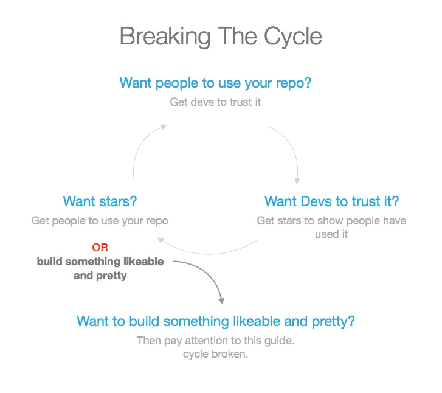
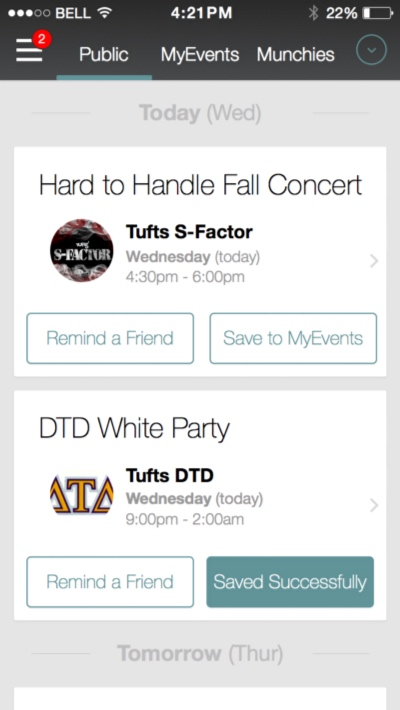
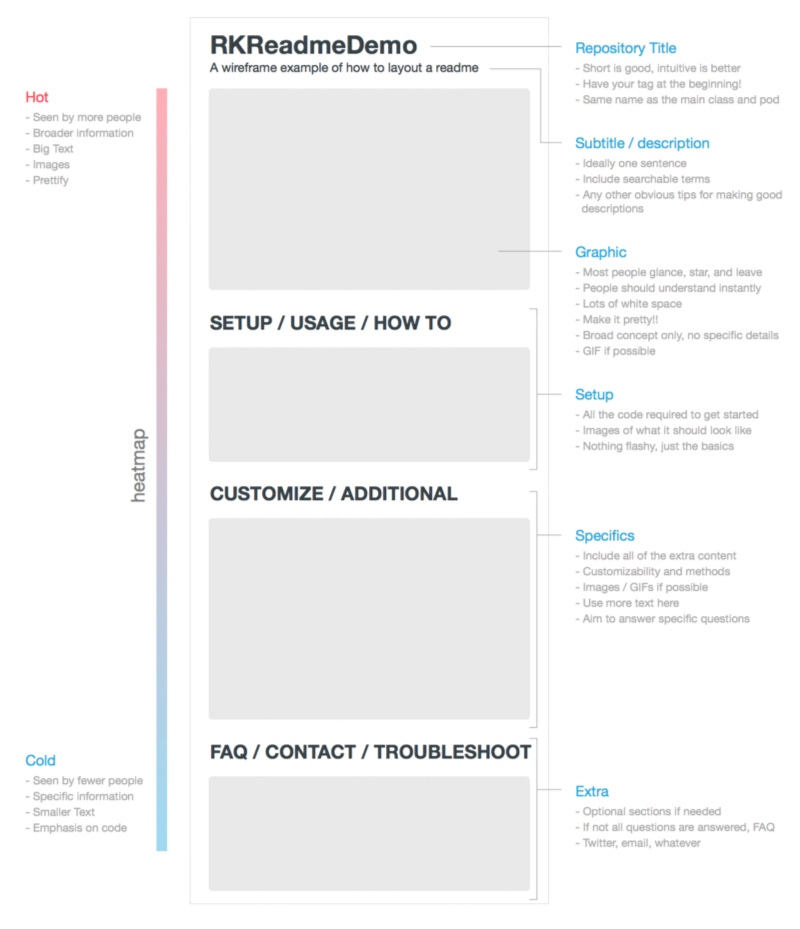
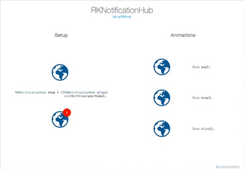
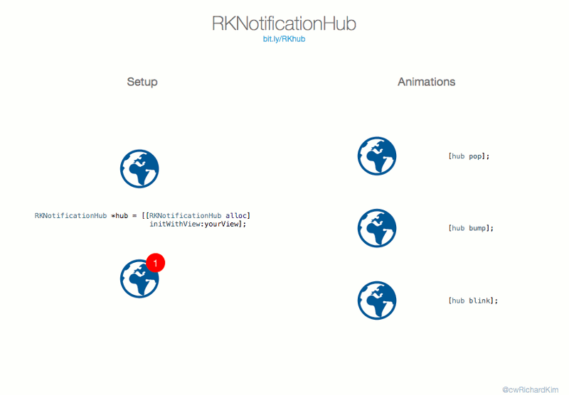
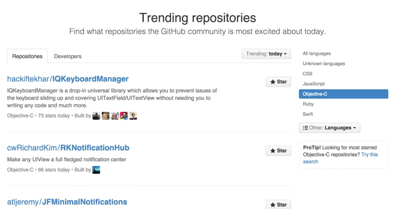
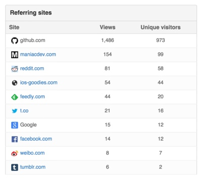

目前为止我已经有五个流行项目（登上Github的Trending页），所以想分享我的一些经验和方法。

如果你开源过代码，就会知道让别人对你的感兴趣是多么困难。这很奇怪，不是吗？ 我们花了至少数百小时在这上，把它免费提供给别人却没人感兴趣！！经过几次较为幸运经历，我慢慢发现如何让其他人对我的开源工作感兴趣。如下图展示的：

最终你希望得到那些使用你Repo（Github上开源的项目）的开发者的点赞加星。但第一步你需要先获得一些加星，你就是这篇文章的目的。

首先，我介绍下我自己。我目前主要是一名iOS开发者，我在六个月前开始发布自己的开源作品。目前为止，我应该算是能在Github的世界范围顶级iOS开发者榜单上出现了。

事实上我没有Github上显示的那么厉害（谢天谢地，不要鄙视我~）我觉得我能够在开源社区有些影响力，是因为我同时能做些设计工作（你接下来会见识到），下面是我的流行项目：

- [TinderSimpleSwipeCards](https://github.com/cwRichardKim/TinderSimpleSwipeCards) (650+ 加星, 6 个月内)
- [RKSwipeBetweenViewControllers](https://github.com/cwRichardKim/RKSwipeBetweenViewControllers) (400+ 加星, 4个月内)
- [RKDropdownAlert](https://github.com/cwRichardKim/RKDropdownAlert) (500+ 加星, 4个月内)
- [RKCardView](https://github.com/cwrichardkim/rkcardview) (500+ 加星, 2个月内)
- [RKNotificationHub](https://github.com/cwRichardKim/RKNotificationHub) (500+ 加星, 一星期内)

这上面的5个项目都上过Github流行的页面，我把如何做到如此分为6个步骤。

六步骤（主要秘诀在第四到第六步）

为了行文简短，一到三步骤会简单论诉下，四到六步骤会详细讲解。

- 项目是最重要的
- 阅读和调研
- 开搞项目仓库
- 写好 Readme
- 配上好图
- 注重反馈回路

### 项目是最重要的

Repo就是你作为开发者在构建的产品。
那既然是产品，它就要解决用户的难题。你估计听见过不少那些著名的产品都是创始人正好碰到一些难题需要解决而产生。同样的思路，大部分开源出来的代码也是要解决开发者的一些难题。所以，你不一直的创造新东西你怎么会遇到那些待解决的难题呢~

Twindr（Twitter+Tinder）就是我为了逗乐我朋友和自己这个简单原因做的傻傻的业务项目。不过最后它带来了 RKCardView（500+个加星）

所以做业务项目，参加编程马拉松吧，周末和同事瞎搞搞。*找到你在重复什么样的代码*，从而你可以构建别人也会需要的模块化的东西~

### 阅读和调研

大部分问题已经被解决过成百上千万次了，并且它还会被继续重新解决。

每次你想到某些可以开源做成Repo的，先看看是否其他人已经做过类似的了。如果真的已经存在，很多人已经在用了，说明它还不错，那么拿起来用别自己搞了。

如果它还没有被解决，或者没有被优雅的解决，那开始你的调研。看看现有的方案，找出不喜欢它们的原因。我喜欢浏览现有项目的Githu Issues来为如何构建自己类似方案找灵感。如果我有足够时间，我会亲自使用这些项目记录下我遇到的一些问题（或文档上不好的地方），虽然我自己没这么做过，我只是听说过这个方案而且觉得真的不错。

最后，开始真正过下它们现有的代码。譬如我喜欢 SVProgressHUB 这个项目。特别的，我喜欢它仅仅通过一行代码就能调用而不需要创建和维护对象才能实现。最终我以类似的方式实现了 RKDropdwonAlert。

### 开搞项目仓库

先快速说5次这句话：『简单，直白，可用』！

我意识到我最近的项目比之前的老项目更快的获得一些关注和加星。可能是因为越来越多人认识我了（我觉得自己非常有名哈哈哈），但我觉得是因为我越来越懒了。一开始我写开源项目时，我会写很多很多代码就为了些不那么明显优化，我因为那些很重要很吸引人。不过现在我会构建优雅好用的东西，却花不少时间来清理接口/界面。

RKNotificationHub 汉堡菜单按钮的左上角。

我们拿RKNotificationHub（RKNH）来举个例子。

一开始我设想RKNN是当我希望在我项目的菜单按钮上加上一些东西，因为我认为是非常好的懂事吸引用户来检查下新功能。这的确工作的很好，我持续在其他项目中也陆续使用。

一开始我设想这个Repo可以支持大量的后端的全能型通知系统。譬如链接到类似 set，array，dictionary，API hit，APN等上，每次值改变了就更新它。

不过最终，我就实现了简单的UI逻辑，把具体业务逻辑交还给用户自己去实施，使它们有更多精细控制。为什么？因为我变懒了，但是我认为它也有它的优势：足够简单，轻量和直白，非常易于使用。

一句话总结就是：如果没人知道怎么使用你的代码，那么就没有会使用它。

### 写好 Readme

Readme（Github允许你创建该文件，通过markdown等语法来在项目主页显示你项目相关内容）是你整个项目中最重要的内容。

如果你最后只能从该文章学到一样的话，我觉得就应该是：

> 你在代码上花多长时间，那么就花同样的时间来写你的 README 吧。

我是认真的！事实上，我认为我在Github上的成功很大部分来自于我认真设计我的 README 让它更具美感（也证明了我就是一般程序员而已）。

下面是我是怎么布局我的 README 文件的：

一些关键点是：

- 它是大部分人会停留还是会离开的关键。把它做好些从而开发者更会在走之前给它加星。越多人加星，就说明越多人认可/相信你的项目。
- 图片，图片，图片！使用类似于 LICEcap 来创建gif图如果它们是些动画效果，把创建好的图片统一放在 imgur 帐号中。
- 展示，而不是啰嗦讲诉。 不要用文字说它怎么怎么优雅解决什么什么问题了，用一张 GIF 来展示，它比啰啰嗦嗦的废话好用多了。给他们展示代码示例。
- 你必须有个 HOW-TO 的部分。用的人不会通读你的代码，所以你必须替他写好示例。
- 用图片辅助你的代码示例来更好展示效果
- 如果有人提issue了，尽快解决它。如果有人提出同样的问题多次了，那么考虑是否要把这个写到 README 上了。

### 配上好图

图片效果是好于文字的。

Repo 中确实需要好代码。不过我敢打赌如果我画一些好看的图片不放代码依然能获得现在60%的加星。*有了好的科技，然后好的设计就随之而来* （wherever tech goes, design eventually follow）。消费硬件，应用，网站，着陆页等都说明了这个趋势。技术我们定位的是Github的浏览用户，而仅仅是开发者。

下面有些当你在做图需要考虑的一些关键点。我还是使用 RKNK 中图作为例子。

> 思考怎么把你的Repo的目的传达出来。

你想要他们能理解为什么这个Repo能有用。RKNK 就是创建出简单的通知图标，所以我决定使用 Facebook 的通知中心作为中心图片。

留意空间

在顶部的title部分有个特定的短链接，在结尾有我的Twitter。然后把中间部分且为两块。

左边的图来展示如何使用RKNH的使用。它被居中排放（有不少的留白），人们大多都是从左读到右的，所以左面承载了更主要的概念。

右边的图通用被居中并且留有空白。如果说左边是为了说明这是个什么产品，那右边就是来说明你为什么需要使用它。动画很具有吸引力，所以我想用它来展示。

最终效果：

这个图不仅仅是开始一份不错 README 的简单有效的方式，也同样是*适合分享*。

快速说下目前的工具。我绝大部分的设计工作通过 Sketch3 来完成（它是个非常简单的图片设计软件），GIFs 通过 LICEcap 录制，并且在 GIMP 中被编辑。它们有些不太好用，不过也是我目前能发现最好的免费方案了

### 关注反馈回路

迭代！开动！可执行的指标！

现在我们有了图片和不错被加了文档的代码。我要向你展示如何玩转整个洗通过你。我首先介绍下 Github 的 Trending 流行页的机制。

这就是你要努力登上的页面。

数据是 Github 提供的，时间窗口不明确，我觉得应该是一周。
这就是原因。大于90%的页面流量和跳转来自于 Github 本身，很可能是来自于 trending 流行榜单页。

成千上万的开发者到 Github 的流行页面来看看开发社区中又有哪些流行的东西。更棒的是这些人都有Github帐号并且都登录着。如果你喜欢获得Github加星，这些人就是最好的来源。

流行页的算法也很简单：就是看在特定时间内被加星的次数。当天和一周都是这样。

反馈回路（feedback loop）是我用来让更多观众参与进来的方法（对他们的建议尽快的回复和迭代）。这是从 the lean startup 中获得的启发和也是我第一次获得30个加星的方法。

反馈回路看起来像：

- 贴出带有图片的链接（比单单的Github有效多了）
- 几分钟内获得反馈
- 及时回复这些反馈
- 重复两到三次，直到完成初次的传播

因为之前的不愉快的事，我现在不太喜欢也很警惕在我个人的社交网络中王婆卖瓜似推广自己的东西。所以除了这篇文章，你很少能在Facebook上看我的状态。对我来说， Reddit 就是个不错的地方，我能够获得匿名的反馈（因为那些人也喜欢学习和接受新东西）。它确实是一个积极和提升自信的好环境。

当然你不一定就要选Reddit作为主要平台。我只是觉得它适合我。你可以更倾向于 Product Hunt，Twitter，Facebook，同事间，本地的计算机科学的用户组类似于编程马拉松的群组等。确保记住一下的原则：

- 如果你的作品是垃圾，那反馈很可能也是
- 如果你的文档是垃圾，那反馈也不会是什么好货
- 如果你还要和那些花时间给你他们建议的人争吵，那你几乎就会失去他们的后续关注

我们再看看上面的来源网站的截图，可以发现Reddit给我带来了58个人，那我需要从这个58人中取得最初的30个加星。这就是显示出之前我们的工作（如项目文档README和配图）的作用了，所以要加倍努力去取得这最初的加星。

如果我遇到一些举棋不定的时刻，我总会求助于我的部分开发者朋友。他们都会帮我解决难题，所以密切关注他们。

### 结论

感谢那些读到现在的朋友，我希望你们马上就能够获得你想要的效果，但是要记住这不是一个一撮而就的魔法。你还是需要做你该做的工作，也许需要花上上百个小时。我并没有夸大（当我说编码和写文档的时间应该1：1的对应），越是复杂的大型项目越需要越清晰易懂的文档。

你也许会从你写的小东西上获得好几百的加星，但是如果你真的搞出影响力，你需要做出大型项目。我个人在接下来几个月会继续花时间来维护现有的开源项目，试着理解开发者上什么使用我的Repo的。构建创造是快乐的，不过修复问题也是同样重要的。

