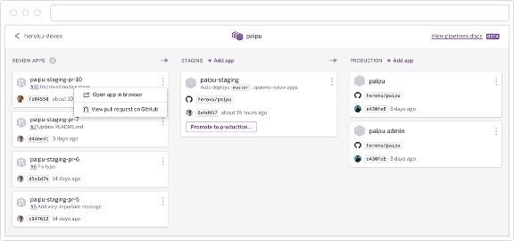

不管何时，你对你的代码仓库进行的任何修改，都会有可能搞砸线上的某些服务。

没人喜欢那样（服务downtime），没人喜欢惹怒用户，更没人喜欢惹怒他的经理。所以说每次发布迭代的新代码到线上都是充满压力的事。

不过，事实上不必每次都那么紧张的。在这篇文章我会反复说明这样的观点：

『你的部署应该变得非常无聊，非常直白，从而毫无压力』

部署产品服务新的主要功能到生产环境：

- 应该是像在Hacker News上开始一次关于空格还是Tab的口水战一样简单
- 应该足够简单，以至于新来的员工都能上手
- 应该是防止产生错误的
- 应该是远远在用户看到新代码生效前被反反复复测试验证过的。

这是一篇非常长的（抱歉，但不得已不如此）的关于部署的较高层次的观点文章：协作，安全和节奏。不过文中还是有不少较为底层细节的部分，因为那些很难在语言层面上去抽象，所以不得不撩开袖子去单独解决和说明。我喜欢讨论团队间是如何配合协同，而部署恰恰是最需要和别人（团队）打交道的一件事，我认为你们要时不时花时间去验证下目前团队的一些做法，这很有价值。

这篇文章的内容大部分来自于我在Github长达五年的工作经历和最近一年为大大小小的很多创业公司的建议和咨询的经历（主要集中在提升它们部署流程方面，而它们之前的状况既有『目前还不错的』又有『要紧急救火的』）。特别值得说的是，其中一家叫 Dockbit 的创业公司，它们的产品正是为了在部署时更好协同。所以本文不少来自于我和他们团队城成员的交谈中，这其中有不少我认为是关于部署这个话题很有价值要记录下来与大家分享的。

我非常感谢来自于把不同公司的朋友对此篇文章的不断评审检查和建议（来源于他们自身在部署方面的深刻见解和经验）： Corey Donohoe (Heroku), Jesse Toth (GitHub), Aman Gupta (GitHub), and Paul Betts (Slack)。我发现非常有趣的是不同公司在部署这件事上的做法非常不同，但是大家都基于类似的目标和关注点：协作，风险和注意事项。我认为这正是共通东西。

为这么长的开头道歉。不过考虑到这篇是那么的长，也值得如此。

目录：

- 目标

	部署不是要解决一些问题吗
	
- 准备

	开始部署前的热身，让我们关注测试，功能标志位/开关（flag），和你们常用的代码协作方式

- 分支

	为代码建立分支对于部署非常重要。你要尽量隔离新代码可能导致的一些未知后果。所以我们会讨论分支部署上的一些不同做法：如主分支自动部署和蓝绿部署等
	
- 控制

	部署的主要工作。你们控制那些需要发布的代码？需要围绕部署和合并代码设置不同的权限结构，开发和审查你所有部署有迹可循，通过部署锁和部署队列来让一些变得有序。
	
- 监控

	酷，我们的代码终于能上线了。接下来你可以关注部署相关的多样监控指标，为部署收集足够的数据，来最终确定部署是否符合预期还是要回滚代码。
	
- 结论

	朋友们，你学到了什么？
	好像有没什么，大概是不要再犯愚蠢错误了
	
本篇文章初发宇2016年3月1号。

## 目标

当你讨论如何把一行行代码把它们从代码仓库移动到不同的服务器的过程。的确有不少把这个解决的很好很傻瓜方案：Ruby下的Capistrano，Python下的Fabric，Node的Shipit，还有AWS，最差的还有FTP这个几个世纪前的方案。所以说目前工具还不是部署的问题所在。

那既然我们有这多好用的工具，为什么我们的部署还会出错呢？为什么线上还有那多bug呢？为什么服务还会有宕机呢？我们都是完美的程序员交付完美的代码。呵呵！

显然事情不总会按照我们预期的方式进行。所以我才认为部署对于小或中型公司是非常值得集中投入的有趣领域。很少有这么具有高收益的领域了。你能否在你的流程中加入提前预测问题的机制，你能否使用不同工具来帮助使你的部署更容易？

『根本不是工具的问题，是流程问题！』

过去几年我聊过的有大量大量的创业公司，并没有在公司层面上对一个好的部署流程应该是什么样子这件事做上的很好。

你不需要发行（部署）经理。不需要要预留特定某天做部署。你不需要每次部署都xin'sh
兴师动众。你只需要选择一个明知的部署方案。

## 准备

### 先打个好底子

跑之前我们要学会走。我发现现在所有创业公司的都会使用上最新的部署相关的工具链，当他们开始尝试使用却发现在这个过程需要花80%的时间去处理一些基础问题。一旦把一些基础事项准备好，剩下的就很容易按部就班的实施了

### 测试

测试是最容易开始的部分了。它不是正常部署迭代中的一部分，但却对部署有巨大影响。

根据不同的语言，框架和平台，关于测试有不少技巧。但通用建议是：测试你的代码，然后加速你的测试运行。

我一直喜欢引用Ryan Tomayko 在Github内部测试文档写的一句话来说明这个问题：

『我们让好的测试运行的足够快，但不能让那些草率的测试变得足够好而有用』

所以打好基础：写好测试。不要对它敷衍了事，因为它影响你接下来流程的所有其他事。

一旦你有了可以依赖的测试集后，接下来就要花钱处理这个问题。如果你们团队有部分预算和收入，几乎最值得投入的就是优化下你测试运行的机器。如果你运行测试在类似于 Travis CI 或 CircleCI上，并行运行它们，花目前两倍的钱在这上。如果你的测试运行在某些机器上，那么多买些机器。

通过让测试集运行的更快，我觉得是公司能够在效率提升上取得最大成效的不二做法了。因为它毫无意外的影响这反馈迭代速度，部署时间，开发者心情和惯性。在这个问题上花足够的预算吧：服务器很便宜，工程师很贵。

你的测试应该要快到什么程度？我还在Github时，它的测试一般在两三分钟内运行玩。我们并没有太多的整合测试，从而允许相对快的测试运行。

现在有非常多的项目来帮助并行加快你的构建。如 Ruby社区就有 parallel_tests 和 test_queue。

### 功能开关位

从另外的角度看这个问题：开始关注下你们的代码，让它现在就开始支持多部署代码路径？（multiple deployed codepaths）

记住，我们的目标是『你的部署应该变得非常无聊，非常直白，从而毫无压力』。而一般压力来源于你新部署的代码会导致你之前没有预测到的问题。从而最终影响了用户的使用（如它们遇到服务宕机或bug了）即使你有全宇宙最好的工程师但是你还有有可能把糟糕错误的代码部署上线，不过这错误代码影响了100%的用户还是就影响了一个用户区别很大！

一种处理这个问题的好方法是功能开关位[feature flags](https://en.wikipedia.org/wiki/Feature_toggle)，功能开关位早就存在了，从if语句被发明时估计就存在了。不过我记得第一次听到有公司使用功能开关位是在Flickr在2009年的一篇博客中：失控（[Flipping out](http://code.flickr.net/2009/12/02/flipping-out/)）

> These allow us to turn on features that we are actively developing without being affected by the changes other developers are making. It also lets us turn individual features on and off for testing.

在生产环境中使用功能开关位，从而使的一些功能只有你看见，或只有你的团队，你们公司员工才能看到。这提供了两个好处：

- 你可以在真实环境用真实数据测试你的代码，确保所有功能都一切正常。
- 你可以得到真实的测试性能基础数据和避免如果这个特性上线开放给全部用户是否拖垮服务器的风险

它带了的巨大好处，就意味着当你准备好真正上线你的新功能时候只需要设置之前的开关位置成true就行了，然后所有用户都能使用这些了。这样就让很吓人的发行新版本『变得非常无聊，非常直白，从而毫无压力』。

译者注：好像在Facebook通过WIFI等公司网络的调整，使得类似*.facebook.com等访问自动被切换到最新的UAT环境，使得 eat oneself's dogfood，也是不失为一种好方案。

### 能被验证正确的部署

功能开关位跟进一步提供了一种非常好的方式，来证明你要部署的代码不会导致对性能和稳定性上反面效果。最近几年有不苏澳工具来帮助你实现它。

我过去写过类似的（[Move Fast and Break Nothing](https://zachholman.com/talk/move-fast-break-nothing/)）。这个做法就是在线上同时运行包含开启和关闭功能开关位的代码，从这两个运行环境下收集数据，从而可以产出图表和统计数据来知道你带到线上的新代码是否匹配你准备替换掉代码的功能。一旦有了类似的数据，你就能确保你是否搞糟某些。『部署变得非常无聊，非常直白，从而毫无压力』

Github开源的叫 Scientist 的Ruby类库来帮助在这方面抽象。这个类库已经被移植到很多流行语言上。如果你感兴趣它们值得你花些时间去研究使用下。

关于此的另一个法子是：逐步发布/灰度发布（percentage rollout）。即使你非常确信你要部署的代码是准确无疑的，明知的做法还是先把代码分发出一部分比例的用户，来再三确认没有什么未预料到的不好后果。因为再不济，影响100%的全部用户肯定比影响5%的用户严重的多。

这也有不少工具类库来帮我们实施，从Ruby社区的Rollout，Java社区的Togglz，Javascript社区的[fflip](https://github.com/FredKSchott/fflip) 等等还有很多。还有一些创业团队来攻克这个难题如LauchDarkly。

这不是仅仅Web上能做的，手机客户端软件也可以得益于此。看看[GroundControl](https://github.com/mattt/GroundControl) 这个类库是怎么在iOS上实现类似行为的。

## 分支

### 通过分支来组织

### 代码分支

### 代码审核

### 分支和部署节奏

### 分支部署

### 自动部署

### 蓝绿部署

## 控制

### 控制部署流程

### 审查追踪

### 部署锁

### 部署队列

### 权限

## 监控

### 检查你的工作

### check the playbook

### 指标

### 部署后的清理

### 结论

