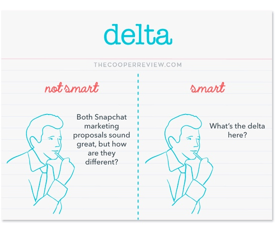
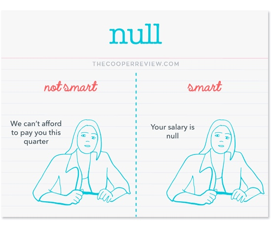

翻译自[How to Use Math Words to Sound Smart](https://medium.com/conquering-corporate-america/how-to-use-math-words-to-sound-smart-7391a5166e1)

你想过为什么每次和工程师们讲话沟通起来都感觉他们好聪gu明guai的样子。很多什么时候会用上不少数学术业来『装逼』。不过又不仅仅是他们才会用这些，快来学起来~

接下来我们来逐一看看这些词，并且学学怎么使用它~

### delta 

- not want

这两份Snapchat的市场提议听起来都不错，但是他们之间区别是啥？

- want

what’s the delta here?

### exponential

- not want

our hands-free hand washing app is experiencing massive growth

- want

we’ve got exponential growth 指数级增长

### orthogonal 

- not want

Vegan lunches have nothing to do with getting more expresso machines

- want

That's an orthogonal issue

### binary 

- not want

Either you're going to give us a million dollars or you're not.

- want

I have binary expectations here

### high order bit 

- not want

我们应该在那放上申明（不承诺），不过现在最重要的是我们被起诉了

- want

The high order bit is we're being sued.

### 3rd quadrant 

- not want

There's nothing positive about this review we got on Bloomberg.

- want

This review is pretty 3rd quadrant.

### t0(tee zero)

- not want

I know the app doesn't really work but is it good enough to launch?

- want

Is it good enough for t0?

### multivaraiate 

- not want

We should a/b test calling it "the best app" or "the bestest app"

- want

Let's do a multivaraiate test.

### forcing function 

- not want

If no one clicks on this giant red button then we drop the whole project.

- want

This is our forcing function.

### asymptotic 

- not want

It's like we keep almost keeping money but then we never do.

- want

We've got asymptotic profit.

### null 

- not want

We can't afford to pay this quarter.

- want

Your salary is null.

你今天用了什么数学术语吗？

