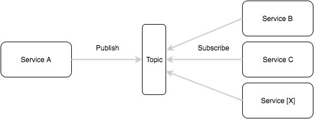
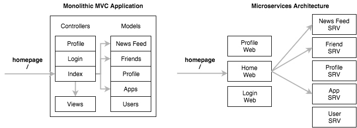
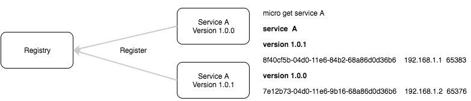
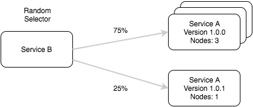
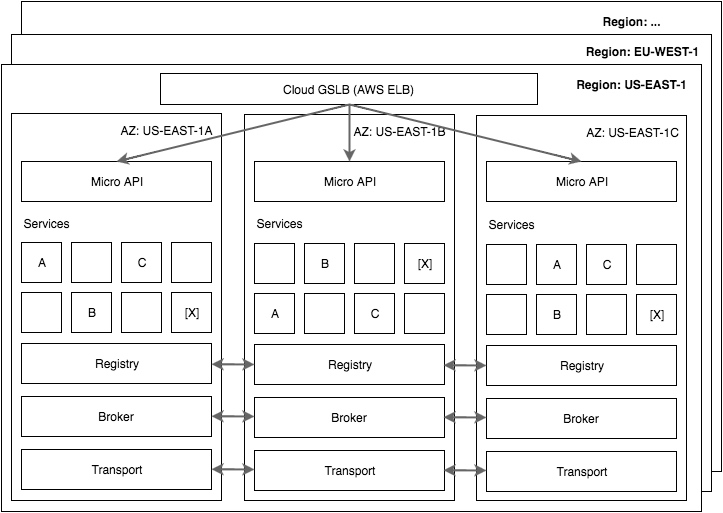

微架构：微服务的设计模式

> 翻译自[Miro architecture & design patterns for microservices](https://blog.micro.mu/2016/04/18/micro-architecture.html)

We’ve had a lot of questions about the micro architecture and design patterns for microservices over the past few months. So today we’ll try cover both.

### 聊聊微型化

### 工具箱

- Go Micro
- Micro API
- Micro Web
- Micro Sidecar
- Micro CLI

### HTTP to RPC, API...

### 服务类型

#### API

#### Web

#### SRV

#### 命名空间

#### 同步还是异步

#### 版本号

### 系统扩容

### 综述

Hopefully this blog post provides clarity on the architecture of Micro and how it enables scalable design patterns for microservices.

Microservices is first and foremost about software design patterns. We can enable certain foundational patterns through tooling while providing flexibility for other patterns to emerge or be used.

Because Micro is a pluggable architecture it’s a powerful enabler of a variety of design patterns and can be appropriately used in many scenarios. For example if you’re building video streaming infrastructure you may opt for the HTTP transport for point to point communication. If you are not latency sensitive then you may choose a transport plugin such as NATS or RabbitMQ instead.

The future of software development with a tool such as Micro is very exciting.

If you want to learn more about the services we offer or microservices, check out the blog, the website micro.mu or the github repo.

