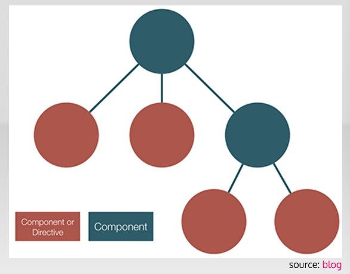
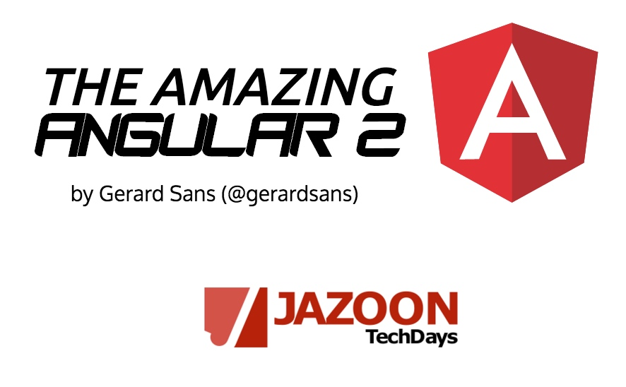

主要特性：

- simple
- fast
- works everywhere

ES5/ES6/TypeScript
es6: classes, modules, arrow functions
ts: types, annotations, better editor support

Application Design

组件树 component tree
http://blog.mgechev.com/2016/01/23/angular2-viewchildren-contentchildren-difference-viewproviders

 

'Angular 1 was a framework, Angular 2 is a platform' The father of Angular Misko Hevery http://bit.ly/1RZvST3 

http://slides.com/gerardsans/jazoon-the-amazing-ng2#/

