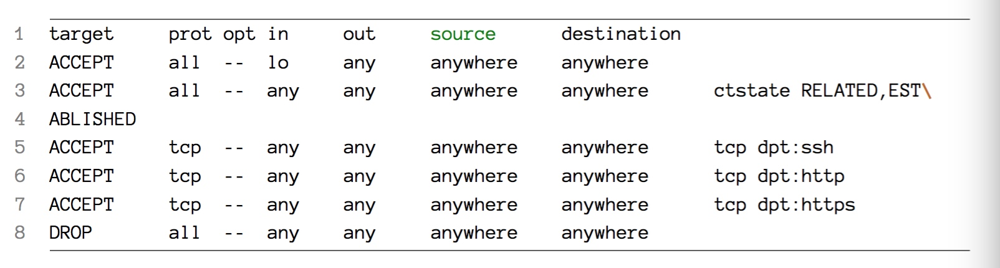

## 安全
当你创建了台可以公网访问的服务器后，你需要做的地一件事情，就是要保证服务器免于不受欢迎的入侵。
接下来的章节给你展示了你需要实施的手段方法来锁定你的服务器。

### 用户和权限
当你接手一台新服务器后，一些安全的预防措施总是必要的保证。当那台服务器是在公网可以访问时，这点就变得尤其重要。
提供商给的服务器一般都是公网可访问的，提供商在创建服务器时给它们一个有效的 IP 。

#### IP 地址

服务商提供 IP 地址，意味着一些人很可能知道你服务器用的 ip 地址，一些自动化的机器人可能就会开始嗅探看看你刚刚创建的服务器上有什么可能的漏洞可以入侵。不仅如此，许多提供商甚至把 root 秘密以明文的形式提供在邮件中。
从安全角度上看，这些都不是好的做法。我们需要一些安全措施把一些风险锁定在外边。

在接下来的章节， 我们会讲诉这些考虑点。如下是我们会覆盖的内容：

- 创建新非 root 用户
- 允许该用户 sudo 来做管理权限
- 不允许 root 用户可直接远程登录
- 配置 ssh 使用其他端口和一些其他限制
- 创建 ssh 密钥在本地来登录 我们的新机器
- 关闭密码验证，必须使用 ssh 密钥来登录服务器


#### 创建新用户

```sh
ssh -i ~/.ssh/identity.pem ubuntu@your-server-ip
sudo adduser someusername
```
#### 设置我们用户为超级用户

```sh
sudo usermod -a -G sudo someusername
```

命令解释：

- usermod: 用来修改（modify）现有用户的命令
- -a: 添加（append）组到 someusername的次级用户组
- -G sudo：指派 `sudo` 为用户的次级用户组

通常在 /etc/sudoers，用来控制哪些用户可以使用 sudo 和如何使用。
我们通常不能直接编辑这 sudoers 文件，为了安全编辑这个文件，使用 `visudo` 命令

```sh
root ALL=(ALL) ALL
%sudo ALL=(ALL) ALL
```

`%` 开头意味着说 sudo 组用于 sudo 特权。这也是 Ubuntu 系统自带的配置。如果你的 Linux 发行版没有 sudo 用户组，通过`sudo groupadd sudo` 来创建。

#### 更多 Sudoers

`NOPASSWD` 该指令告诉系统：所有命令都不需要输入密码。

PS：通常不要在生产环境这么设置，非常危险。

甚至你可以更加精细化的去设置，可以不用密码来创建目录，但是删除目录时必须输入密码等

```sh
%admin ALL NOPASSWD:/bin/mkdir, PASSWD:/bin/rm
```

#### Root 用户访问控制

通过如上设置，用户需要提供密码去执行一些操作。如果攻击人取得机器访问权限但是不知道密码仍然做不了什么伤害。
另外，用户的行为，甚至是什么时候进行 sudo，都会记录在他的命令行历史记录中。
接下来要做的就是确保我们不能直接通过 ssh 直接作为 root 登录。编辑 `/etc/ssh/sshd_config` 如下：

```sh
PermitRootLogin no
```

然后重启服务 `sudo service ssh restart`

#### 进一步配置 SSH

通常 ssh 通过标准的 22 端口可以直接，我们推荐改为你们团队才知道的约定的其他端口。
我们也可以只允许部分用户或特定组的用户可以 ssh 登录我们的机器。

```sh
Port 1280
AllowUsers someusername anotherusrname
AllowGroups sudo canssh admin
```

#### 创建 SSH 密钥

在创建 ssh 密钥，你会被提问要设置一个密码用来保护你的密钥文件（同时知道你的密钥密码和拥有密钥文件才可以『作案』）
把生成好的密钥的公钥信息粘贴到服务器的授权文件中 `sudo vim ~/.ssh/authorized_keys`

PS：当然你可以通过管道 over ssh 来一次搞定 `cat ~/.ssh/id_rsa.pub | ssh user@machine "mkdir ~/.ssh; cat >> ~/.ssh/authorized_keys"`

一旦你的公钥信息被保存在服务器的授权中，你下次登录就不用在输入密码

```sh
cd ~/.ssh
ssh-keygen -t rsa -b 4096 -C your@email.com -f id_myidentity
```

更多的一些信息在后续的 ssh 章节会有进一步的讨论

#### 关闭通过密码的访问

仍然在 `/var/ssh/sshd_config` 中编辑

```sh
PassworddAuthentication no
```

把一些主要文件，配置和数据等放在其他地方，亚马逊的 S3 服务（你可以看作是超安全的 ftp 服务器，提供11个9的保障）是个好选择。


### 设置防火墙：iptables

防火墙给你的服务器提供一些非常重要保护。防火墙可以根据你配置的一系列规则来阻止网络流量。
iptables 作为绝大多数 Linux 发行版的默认防火墙，但熟练使用它需要一些耐心。
配置 iptables 就是设置一系列的检查网络包的规则。符合的就 accept，不符合的就 reject 或 drop

PS：关于 reject 和 drop 是有区别的。前者让其他端知道数据包没被通过，而后者像被黑洞吞掉一样。

下面是执行 iptables -L -v 的显示：




#### 添加规则
#### 插入规则
#### 删除规则
#### 保持防火墙规则
#### 默认丢掉而不是接受包
#### 为拒绝包记日志

你会发现为拒绝包做一些日志记录非常有用。这也是通过创建新的chain 来实现的：

- 创建新 chain 链
- 确保其他未被匹配的流量落到新的链 chain 上
- 记录包，并追加可供搜索的前缀
- 丢掉包

```sh
sudo iptables -N LOGGING
sudo iptables -A INPUT -j LOGGING
sudo iptables -D INPUT -J DROP
sudo iptables _A LOGGING -m limit --limit 2/min -j LOG --log-prefix "IPTables Packet Dropped: " --log-level 7
sudo iptables -A LOGGING -j DROP
```

默认日志会进入 kernel内核 日志中。在 `/var/log/kern.log` 中，通过 `tail -f /var/log/kern.log` 查看

确保没问题后，保存你的设置 `sudo iptables-save > /etc/iptables/rules.v4`


### Fail2Ban
这里还有一个更加重要的安全工具我们需要提到的： Fail2Ban

它，用来监控入侵你服务器的流量。它用 iptables 防火墙来拒绝特定的域名如果它们的无效尝试次数满足之前配置好的阀值。

它，一般是通过监控特定服务的日志文件实现的。如关于登录，Fail2Ban 监控日志（/var/log/auth.log）搜索失败的登录。如果它察觉到一个域名尝试了多次登录失败后，它会在特定配置的时间段类屏蔽该域名。

PS：当然它还可以用来监控更多，如/apache 的错误日志等，也可以执行一些其他操作（如发邮件）。

#### iptables 整合
#### 安装

```sh
sudo apt-get install -y fail2ban

sudo cp /etc/fail2ban/jail.conf /etc/fail2ban/jail.local
```

#### 配置

```sh
[ssh]

enabled=true
port=ssh
filter=sshd
logpath=/var/log/auth.log
maxretry=6
```

接下来可以配置关于 ssh 或 nginx 的 jail，最后重启我们的服务以生效 `sudo service fail2ban reload`

### 自动化安全更新

你可能希望你的服务器自动更新一些软件（来减少一些软件的漏洞被利用来攻击你服务器的风险），绝大多数的 Linux 发行版允许你那么设置。

当然自动更新也可能是非常危险的。我们不希望我总是更新所有软件来作为第一批测试的小白鼠，甚至一些新服务会有兼容风险。

在 Ubuntu 上，我们可选择只更新安全相关的补丁。

```sh
sudo apt-get install -y unattended-upgrades
```

修改文件 /etc/apt/apt.conf.d/xxunattented-upgrades

```sh
Unattended-Upgrade::Allowed-Origins {
	"Ubuntu trusty-security";
	// "Ubuntu trusty-updates"
}

Unattended-Upgrade::Allowed-Origins {
  "${distro_id}:${distro_codename}-security";
  // "${distro_id}:${distro_codename}-updates";
  // "${distro_id}:${distro_codename}-proposed";
  // "${distro_id}:${distro_codename}-backports";
};
  
Unattended-Upgrade: Automatic-Reboot "false";
```


