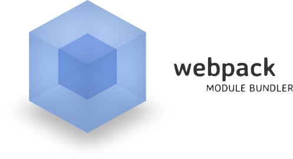

那么，你要开始一个崭新的Javascript前端项目了，或者被之前老项目折腾半死，你也许并没有和改变进化步伐极快的社区生态保持技术实践的同步，或者你开始了，但是有大量的可选项不知道怎么选。React，Flux，Angular，Aurelia，Mocha，Jasmine，Jasmine，Babel，TypeScript，Flow。哦我的天呐这么多~ 为了让事件变得更简单，我们很多人正陷入一个陷阱：被我喜欢的XKCD漫画描述的很好：

是的，好消息是现在JS生态开始慢下来了，好项目开始冒出。最佳实践爱你慢慢变得更清晰了。工程师开始在现有项目上构建自己的工程还是重新创造轮子。

作为起点，下面是我对现代化Web应用各个部分的个人选择。一些选择看起来会有些争议，我会在每个选择后附上我的基本推理判断。要注意的是，这些选择通常是我建立在我目前对社区的观察和我个人的经历。你的看法当然会有不同~

### 核心类库：React

目前胜者很显然就是React（译者：你确定？！）

- Components all the way down makes your application much easier to reason about.
- The learning curve is very flat. The important APIs would fit on one page.
- JSX is awesome. You get all the power of JavaScript and its tooling when writing your markup.
- It is the natural match for Flux and Redux (more on that later).
- The React community is amazing, and produced many best of breed tools such as Redux (also more on that later).
- Writing high quality data flow is much easier in large applications than dealing with 2 way data binding (eg: Knockout)
- If you ever need to do server side rendering, React is where it’s at.

现在不少全能的大型框架如Ember，Angular，它们承诺说帮你处理所有的事。但是在React生态中，尽管需要对组件做一些决定（哈这就是你为什么要阅读本文的原因啦），但是这方案更强壮。很多其他框架，譬如Angular2.0正在快速追赶React。

『选择React不仅是个技术上的选择，更多是个商业决定！』

- 额外奖励：一旦你要着手构建自己的移动应用，你会感谢ReactNative项目的

（很牵强哈，Angular社区的Ionic也是PC Web向移动端迁移的好选择。各自的2.0版本也相辅相成推进上）

### 应用生命周期：Redux

### 语言：ES6配合Babel，先不加类型

### 格式和风格：ESlint配合Airbnb指南

关于ESLint异议也不大。使用它的React插件和良好的es6的支持，几乎非常完美完成lint的工作。JSLint是过时了，ESLint这个软件可以单独完成原本需要 JSHint 和 JSCS 联合起来做的事。

你需要配置他用你的风格约定。我强烈建议你使用 Airbnb的风格指南，大部分可以被 ESLint airbnb config 来严格约束实现。如果你们团队会在代码风格上产生分歧和争超，那么拿出这份指南来终结所有的不服！它也不是完美的（因为完美的风格不存在），但保持统一一致的代码风格是要高度推荐的。

一旦你开始熟悉它，我建议你开启更多的规则。在编辑撰写代码时候越多的捕获不规范（配置你的编辑器IDE使用上这个ESLint插件），就会避免分歧和在决定费神，从而让你和团队更加高效！

### 依赖管理：仅考虑NPM，CommonJS 和ES6模块

这一点很明确 - 就用NPM。所有东西，忘记之前的bower。类似与 Browserify 和 Webpack 的构建工具把npm的强大功能引到了web上。版本处理变得很简单，你也获得了node生态的大部分模块提供的功能。不过CSS的相关处理还是不够完美。

你可能会考虑的一件事：如何在开发服务器构建应用。不想Ruby社区的Bundler，npm 常使用野字符来指定版本号，导致你开始书写代码到最后部署时候版本号很可能已经变化了。使用 shrinkwrap 文件来锁定你的依赖（我建议使用 [Uber的 shrinkwrap](https://github.com/uber/npm-shrinkwrap) 来获得更见一致性的输入）。同时考虑使用利用类似于 [Sinopia](https://www.npmjs.com/package/sinopia) 来构建自己的私有npm服务器。

Babel可以把 ES6 模块语法编译到CommonJS。意味着你可面向未来的语法，和在使用构建工具（如Webpack 2.0）时获得它支持的一些静态代码分析工具如 [tree shaking](http://www.2ality.com/2015/12/webpack-tree-shaking.html) 的优势

### 构建工具：Webpack

### 测试：Mocha + Chai + Sinon（但没那么简单）

目前在 JavaScript 单元测试上，我们有众多选择，你选择任何一个都不会错太多。因为你开始做单元测试，你就走对一大步了。

一些选择包括了 Jasmine，Mocha，[Tape](https://github.com/substack/tape)，[AVA](https://github.com/sindresorhus/ava) 和 Jest。我知道我漏掉来一些，它们都有一些比其他做的好的地方。

我对一个测试框架的的选择标准是：

- It should work in the browser for ease of debugging
- It should be fast
- It should easily handle asynchronous tests
- It should be easy to use from the command line
- It should let me use whatever assertion and mock library I want

第一个指标让AVA脱颖而出（因为它的确做的非常棒）和Jest（自动Mocking并不像它说的那么好，因为它太慢了）

选择Jasmine，Mocha或Tape都不会差太多。我倾向于 Chai 断言因为它拥有很多插件，Sinon's mocks to Jasmine's built in construct。Mocha的异步测试支持很棒（你不用在写类似于 done callback之类的）。[Chai as Promised](https://github.com/domenic/chai-as-promised) 也是很屌。我强烈建议你使用 [Dirty Chai](https://github.com/prodatakey/dirty-chai) 来避免一些让人头疼的问题。Webpack的 [mocha loader](https://github.com/webpack/mocha-loader) 让你编码时自动执行测试。

对于React而言，Airbnb的[Enzyme](https://github.com/airbnb/enzyme)和Teaspoon（不是Rails那个！）是不错的相关工具选择。

我非常喜欢Mocha的特性和支持情况。如果你喜欢一些最小主义的，读读这篇[关于tape的文章](https://medium.com/javascript-scene/why-i-use-tape-instead-of-mocha-so-should-you-6aa105d8eaf4)

PS：
Facebook在最近的文章中说，它们是如何扩展Jest的。可能对大部分人来说过于复杂了，如果你有那些资源，不关心是否在浏览器中跑测试，那么它就很适合你。

另外，很多人认为我对AVA太武断了。不要误会我，AVA的确很棒。但我有个标准：全浏览器支持。这样我们可以直接从任何浏览器去执行（来测试跨浏览器兼容性）同时要方便调试。如果你不介意那些，你可以使用非常棒的iron-node来debugging。

### 工具库：Lodash是绝对王者，但留意 Ramda

JavaScript不像Java或.NET上有很多强大的内置工具集。所以你可能需要引入一个。

Lodash，目前来说应该是杂七杂八都有的首选。同时它类似注入[懒求值](http://filimanjaro.com/blog/2014/introducing-lazy-evaluation/)这样的特性让它成为性能最高的选择之一。如果你不想用你就不要把它全部都导入，同时：lodash能让你仅仅引入哪些你需要的函数（这点尤其重要考虑到它现在变得越来越大）。随着4.x版本带来，它原生支持可选的函数式模式给那些函数式编程的极客们使用。来看看[怎么使用它](https://github.com/lodash/lodash/wiki/FP-Guide)

如果你真的很喜欢函数式编程，那么不管怎么样，留意下优秀的[Ramda](http://ramdajs.com/0.19.1/index.html)。如果你决定用它，你可能还是需要引入一些lodash函数（Ramda目前专注于数据处理和函数式构建），但这样你能在JavaScript中以非常友好方式获得函数式编程的强大功能

### Http请求：就只用fetch

许多React应用再也不需要jQuery了。除非你需要使用一些遗留的老旧的第三方组件（它依赖于jQuery），因为根本没必要。同时，意味着你需要一个类似于$.ajax的替代品。

为了保持简单，仅仅使用[fetch](https://fetch.spec.whatwg.org/)，它在Firefox和Chrome中内建支持。对于其他浏览器，你可能需要引入polyfill。我推荐使用[isomorphic-fetch](https://github.com/matthew-andrews/isomorphic-fetch) 来在服务器端在内覆盖了基础组件选择。

还有一些其他好的类库选择如[Axios](https://github.com/mzabriskie/axios)，但目前在fetch之上没有多余需求。

为了更多关于为什么Promise是重要的讨论，请看我们博客异步代码

### 样式：考虑CSS模块

### 前后同构：确保你真的需要它

### API接口：暂时没有好方案

看起来每个开发者最后都会疑问那么关于API接口呢？很多人会直接想到[RESTful API](https://en.wikipedia.org/wiki/Representational_state_transfer)（因为太流行了），同时SOAP真的成为过去式了。同时现在也有不少其他标准如：[HATEOAS](https://en.wikipedia.org/wiki/HATEOAS), [JSON API](http://jsonapi.org/),[HAL](http://stateless.co/hal_specification.html),[GraphQL](https://facebook.github.io/react/blog/2015/05/01/graphql-introduction.html) 等

GraphQL 赋予客户端强大的能力（也是职责），允许它来实施任意的查询接口。结合Relay，它能为你处理客户端状态和缓存。在服务器端实施GraphQL看起来比较困难而且现有的文档大部分是针对Node.js的

网飞(NetFlix）的[Falcor](https://github.com/Netflix/falcor) 看起来它也能提供那些Relay和GraphQL提供的功能，但是对于服务器端的实现要求很低。但现在它仅仅是开发者预览版没有正式发布。

所有这些有名的标准规范有他们各种的奇怪之处。一些是过于复杂，一些只能处理读取没有覆盖到更新接口。一些又严重和REST走失。许多人选择构建它们自己的，但是最终也要解决它们设计上带来的问题。

我不认为现在有什么方案是个大满贯（完美的），但是下面是我对API应该有的功能的一些思考：

- It should be predictable. Your endpoints should follow consistent conventions.
- It should allow fetching multiple entities in one round trip: needing 15 queries to fetch everything you need on page load will give poor performance.
- Make sure you have a good update story: many specifications only covers reads, and you’ll need to update stuff sometimes.
- It should be easy to debug: looking at the Chrome inspector’s network tab should easily let me see what happened.
- It should be easy to consume: I should be able to easily consume it with fetch, or have a well supported client library (like Relay)

我没有找到能覆盖这些需求的方案。如果有，务必让我知道。
同事考虑，如果你实施一个标准化的RESTful资源路径时，使用Swagger来文档化我们的API。

### 客户端软件：Electron

### 向谁学习，从哪学起

### 如果你不需要，就别用它！

### 我少了什么吗？

