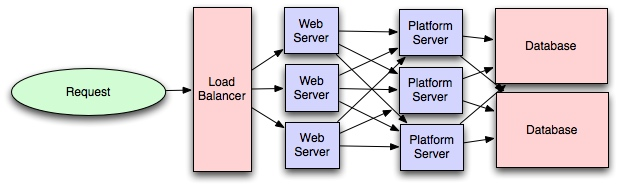

翻译自[System Design Cheatsheet](https://gist.github.com/vasanthk/485d1c25737e8e72759f).

Picking the right architecture = Picking the right battles + Managing trade-offs

选对架构就等于选对合适的战场和权衡管理好各种的选项。

### 一般步骤

1. 理清和约定好系统的边界
	- 用例
		- 谁会使用这系统
		- 他们会如何使用这个系统
	- 约束
		- 主要是识别出流量和数据处理的约束，以便于可扩展
		- 考虑系统的可扩展性，譬如每秒的请求数量，请求类型，数据写入量，数据读取量
		- 考虑该系统的特殊需求，譬如是否要多线程，使用场景主要是读取还是写入。

2. 高层次的架构设计（设计抽象）
3. 组件设计
	- 组件和所需接口（来相互调用）
	- 面向对象设计来实现功能
		- 把功能特性映射为模块：一个场景对应	一个模块
		- 考虑模块间的关系
			- 特定的功能必须有特定唯一的实例（单例模式）
			- 核心对象可以由其他对象一起组成（聚合composite模式）
			- 一个对象从另一对象而来（继承）
		- 数据库 Schema 设计
4. 理解瓶颈所在
5. 扩展你的设计
	- 垂直扩展
	- 水平扩展
	- 缓存
		- 负载均衡来帮助你用增加服务器啦水平扩展，但是缓存可以非常有效的利用你已经取回的资源数据，同时实现原本看起来不太好办的产品需求
		- 应用缓存
		- 数据库缓存
		- in-memory 缓存
		- 譬如预先计算好结果（如昨天来自不同站点的访问数量）
		- 譬如预先生成很耗时的索引（如根据用户点击流来生成推荐的内容）
		- 譬如把一些经常要用的数据存在更高性能的数据库中（如Redis而不是直接从PostgreSQL 查询）
	- 负载均衡

	- 数据库复制/主从
	- 数据库分库
	- Map-Reduce	
	- 平台层（服务）
		- 分离平台服务和业务应用使得我们可以独立扩展各部分。譬如添加新的API，你可以通过添加平台服务器而不需要为你的应用层扩容
		- 通过平台层，你可以为多个产品或多个终端（如Web应用，iPhone应用等）提供基础设施，而不需要多写很多已经在其他应用中已经处理过的模板代码（如缓存，数据库等）

		

### 系统设计的主要考虑点

	1. 并发性
你理解线程，死锁和饥饿（starvation）？你知道如何把一些算法并行化吗？你理解一致性 consistency 和内聚性（coherence）？

	2. 网络
你大概知道IPC和TCP/IP吗，你知道吞吐量和延迟的区别吗，什么时候它们会想相互影响。

	3. 抽象
	4. 实际场景下性能
	5. 评估
	6. 可用性和可依赖性

	
### Web App 系统设计的考虑点

- 安全（CORS）
- 使用CDN
- 全文搜索
	- 使用类似于 Sphinx/Lucene/Solr 等，它们搜索响应速度很快（因为不是去搜索内容文本本身，他们搜索索引文件来实现）
- 离线支持/渐进增强
- Web Workers
- 服务端渲染
- 异步资源加载（数据懒加载）
- 减少网络请求（Http2 + 资源打包/精灵图等）
- 开发效率和工具支持
- 可访问性
- 国际化
- 响应式设计
- 浏览器兼容性

### 前端架构的各部分

- 代码
	- HTML5/WAI-ARIA
	- CSS/Sass 标准规范和代码组织
	- 面向对象设计（逻辑怎么切分和组合通信等）
	- JS 框架/代码组织/性能优化技巧
	- 资源分发 - 前端运维（如接入层，CDN，机房等） 
- 文档
	- 看板文档
	- 风格样式指南，UI/UX模式库
	- 架构图（code flow，工具链）
- 测试
	- 性能测试
	- Visual Regression
	- 单元测试
	- E2E测试 
- 流程
	- Git workflow
	- 依赖管理（如 npm, bower, bundler） 
	- 构建系统（Grunt/Gulp/Npm Scripts）
	- 部署流程
	- 持续集成（Travis CI，Jenkins）

一些链接：
How to rock a systems design interview
System Design Interviewing
Scalability for Dummies
Introduction to Architecting Systems for Scale
Scalable System Design Patterns
Scalable Web Architecture and Distributed Systems
What is the best way to design a web site to be highly scalable?
How web works?

