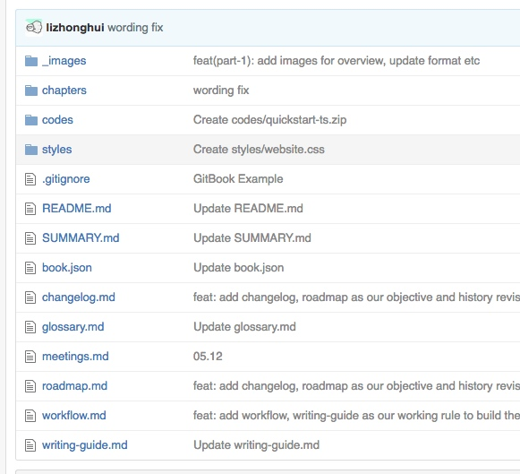
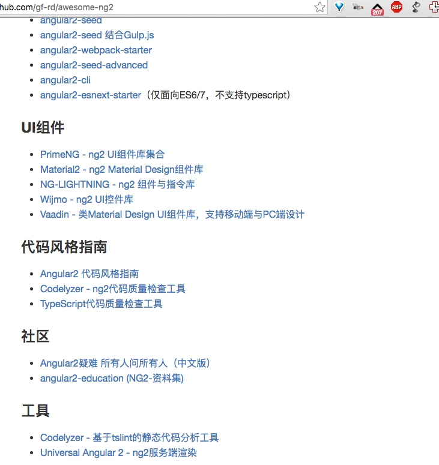
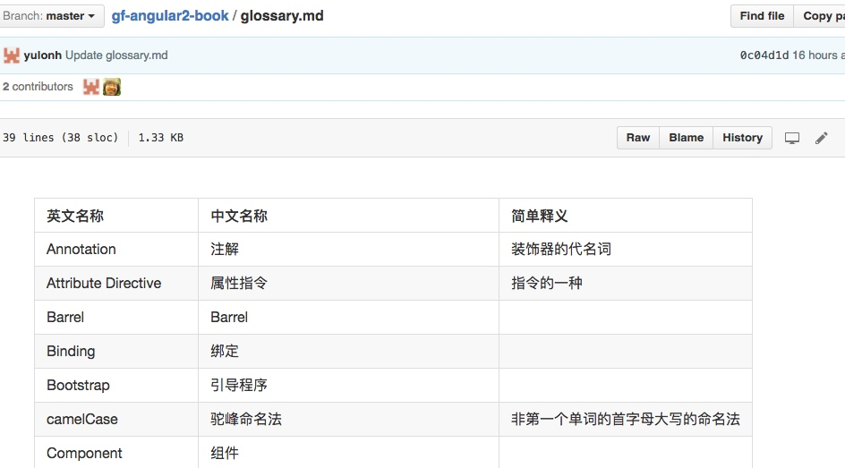

为了响应杰哥的号召，我们希望在写书过程中实施一套有规范有约束的有指导的流程框架来帮助大家更好的更有目的的来完成该任务。

我们是这么看待写书这件事的，有三个阶段：

- 预备阶段（节点人物，awesome-ng2内容支持，repo信息，营造氛围. 
- 创作阶段（写作工具. markdown，git commit；词汇表，作图，图片，demo.
- Review阶段（Gitbook，issue提出和管理）

预备阶段解决写什么，写书项目其他人的进展，deadline这些事情
创造阶段解决怎么写，用什么工具，图表和demo 代码示例怎么处理，一些词汇怎么拿捏的事情
Review阶段解决其他人如何来帮助你优化文章，借助Review工具来提意见，来整理建议和追踪实施建议。

### 节点人物：

项目经理来督促，对自己负责的章节有很明确的意识，写什么内容，怎么写，这些需要不断和具体的作者来沟通和进度把控。

书籍2、4章（李仲辉）
书籍3、7、8章（唐明）
书籍5、6章（张淼）

### Repo 信息：

- [+] 提交新的大纲和owner到contents.md
- [+] 上次商讨的guides 写作规范沉淀到repo中
- [+] 确定新的workflow.md 等（从awesome-ng2移入）
- [+] 开始把每次的reversion changelog更新
- [+] 确定我们的milestone到roadmap中
- [+] 加入glossary.md 来确定 terminology

我们希望大家的一些工作都能反馈到 github 这个 repo（如提交文章，改善指南等，我们能够明确的知道大家的这周的工作进展，更新了哪些，提交了哪些，是富有余力还是颇有压力需要支持等。

希望在流程和工具上提供支持，我们也是项目开发涉及忍更多，也是每天支持10分钟，为什么没有项目经理来…

### Awesome-ng2 内容支持：

### 词汇表 & Demo

遇到拿捏不准的英文专业术语找龙哥，和龙哥讨论，看龙哥的glossary.md

在文章中需要引入代码示例的，找钱骞Ｍｏｎｅｙ同学。为了统一的代码风格和统一的领域示例概念。

### 书写工具

我们希望我们的书稿文字都以 markdown 的形式提供，这种格式好处不需多说了。

#### 本地编写

在本地编写推荐 MWeb Lite 来实施（最棒的是解决了图片等资源可以copy&paste,drag&drop的方式添加，而且可以在编辑界面的时候就能 preview. 

推荐做法，修改或添加文本后，通过git 提交的方式同步到我们的git库

#### 在线编写

当然可以直接通过 gitbook 提供的编辑器来，但是这样会造成很多无意义的commit（污染git 提交）同时添加图片也没有那么方便

#### Review

当我们提供好基础草稿draft等后，我们就可以开始对我们的内容进行审核了。通过开启gitbook comment来实现inline comment*（选中你要评论的文字，然后在文章的右侧栏有+，点击后可以添加评论）

对于其他非inline的评论，如通用建议，内容建议等可以在discussion tab页来添加。

### 画图工具

画图工具有不少，有在线Web版也有软件版，有颜值高的也有功能强的。有可视化编辑的也有文本描述的。选一款让团队满意并且功能好用的着实不好办。

我们建议在一开始通过 mermaid 来用文本的形式来表达自己的想法（如果觉得受限，可以通过喜欢的软件甚至圈画来提供草稿版的图表UML图等

在对比了 draw.io, gliffy, lucidchart, processon 后，最终选择了 processon 来构建。我们觉得它在制图和协作上达到了比较好的平衡（建议有专门的制图同学负责统筹制作如图表颜色，大小，文字，风格等细节确认）

Generation of diagram and flowchart from text in a similar manner as markdown http://knsv.github.io/mermaid/

### 写作思考

> 在无头绪，思路枯竭时，按照套路去写~

MUCE

金字塔

六顶帽子

