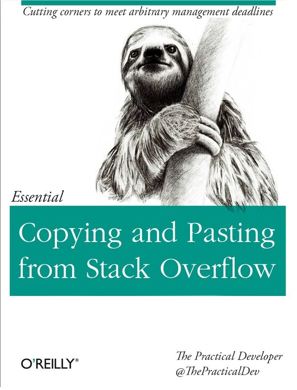
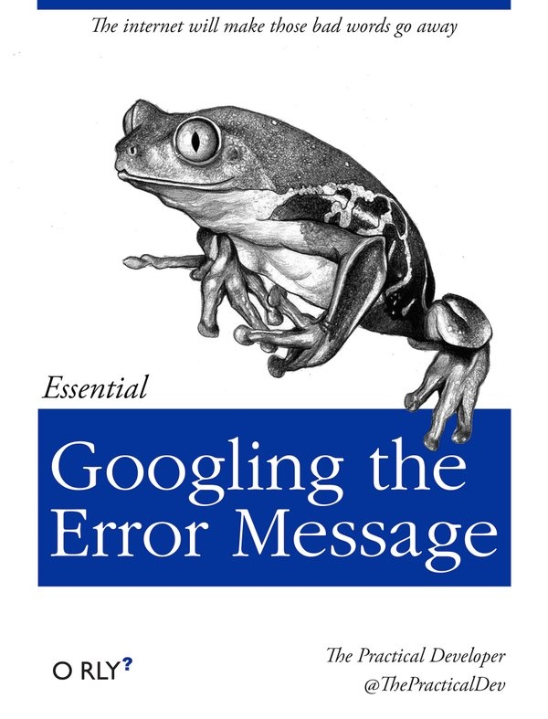
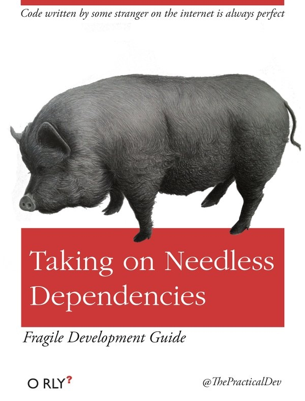

16年程序员安最需要看的8本小书 - 啪啪啪打脸指南

本文罗列的这些书籍封面其实是各种典型的反模式，不过它们真的是非常常见以至于大家都习以为常了~

### 《从Stack Overflow上复制粘贴编程方法精要》
你最需阅读的一本编程书籍（其实编程书留下这本就够了！）
搞笑的是，在 Gitbook 上真有这样的小书(https://tra38.gitbooks.io/essential-copying-and-pasting-from-stack-overflow/content/code_licensing.html) 从 code licensing issues, code attribution, code selection 上来论述

###《每六周重新你的过时前端代码实战篇》
唯一正确写 JavaScript 的方式就是每周换个花样重写一遍！
事实上拥有一个不断进化和自我革命的社区是一件很不错的事情，但前提是要你要接受这样的现实。不断学习和充实自己，并且透过变动改变的这些抓住真正永恒和持久的东西。
关于JavaScript社区为什么这么生机勃勃，折腾不止，请看文章[永不停步（折腾死人）的JavaScript 生态](https://github.com/gaohailang/blog/issues/17)

###《精通为不写测试找借口》
不写单元测试你还有千般理由！！
单测其实有很多好处，譬如尽早发现问题，为重构代码和更新代码逻辑提供保障，简化集成（因为单测从细节底层入手），可以起到文档作用（详细完善单测用例完全可以），导向设计（测试驱动的更容易让你设计出优雅低耦合的代码）
你要对如下的代码准备好足够的单元测试用例

- 那些经常要被修改的
- 那些有很高复杂度的
- 那些重要功能/常被查看的

###《临时代码权威指南》
你说你下周会开始重构这坨意大利面条似的恶心回调嵌回调代码？！ - 你TM在跟我开玩笑？
交付的确很重要，但是这绝不是让你写出烂代码的接口。

以不符合设计原理 / 不易维护 / 不易调整 / 不够健壮 / 不够美观的方式解决问题。

比如水管连接处生了锈开始漏——
 • 把水管系统整个重新布置成没有接头的管线，叫做 refactor
 • 按原样把锈掉的水管换新的，叫做 proper fix
 • 把水管拆下来用防渗胶带缠住螺丝纹再装回去，叫做 patch
 • 叫你女朋友先把漏水的地方捂住然后下面放个脸盆接漏水，叫做 monkey patch
 • 用电焊把接头焊起来，叫做 hack
 • 用口香糖塞住漏缝然后用水泥把接头浇筑起来，结果因为那一大坨太重，下面不得不放一根木棍撑着，叫做 dirty hack

Dirty hack 不一定总是坏事，如果你没有脸盆、电焊、管钳、女朋友、新水管和防渗胶带，而这套水管系统反正就快整个报废了的话。

###《都怪用户口袋书》 
你还在花时间修复那些挠人的bug？
你是10X工程师，怎么可能出错，肯定是别人的问题。是他们的手机，浏览器的问题，一定是！！很多工程师的确是这样解决问题，一些特殊case，一些在设计代码没有考虑的情况，就这样被他忽悠过去了。

###《从入门到精通：简历驱动式开发》
要做『温赵轮』式程序员？那么感觉拿起这本书开读吧。

表现型选手就是这样，他们常常需要挑活做，去做那些看起来很高大上的事情，却不愿撩开袖子去处理细节去干脏活累活。
他们也经常在简历上写着 XXX 项目的主要负责任（实际上很可能就是参与了一部分，做了边缘系统的部分功能）。或者在简历毫不谦虚的写着精通XX编程语言（实际上很可能就是用它写过helloworld而已）。或者在简历大大方方的写着熟练使用XX消息队列（实际上可能也就仅仅是看了篇肤浅的博客而已）

###《写出没人看到代码：权威指南》

如果连你自己都看不懂，那就更棒了！

他们对系统代码的要求很低，『它不是能跑吗，你管那么多干什么』
这样的态度，让后来的同事很难推动后续的工作。譬如总是有莫名其妙的错误像是被它黑洞似的吞掉了，让周边模块的开发者背黑锅，一旦定位进去就像是在漆黑伸手不见五指的下水道走路，胆战心惊瑟瑟冷风还有弥漫空中的坏味道（代码逻辑很绕，变量名称很奇葩看不懂，几乎没有log日志打印出等等）

### 《精通搜索错误消息》

在网上总能找到让这些问题消失的方法！

###《用上无用依赖的开发者指南》
如果你项目的依赖少于72个npm的包，那么你的代码是那么的孤独，赶快拿起这本书开始阅读吧。那些网上陌生人写的代码总是打包票的好是吧？

这些人真是把不重新发明轮子的优良传统发挥到极致，可能就是为了用某个函数方法就把一个巨大的依赖库加入到代码仓库中（后续花费在安装依赖上的时间，很可能超过了那个简单函数方法编写上），更有甚至不把依赖下载类似于 packages.json，bundler，requirements.txt等中，居然让后续协作人去生产机器上把依赖直接copy回来（orz...）PS：要用好类似于 pip freeze, npm shrinkwrap 等功能啊

