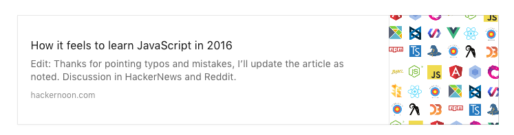
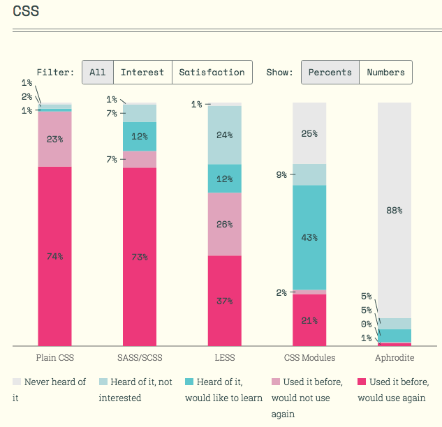
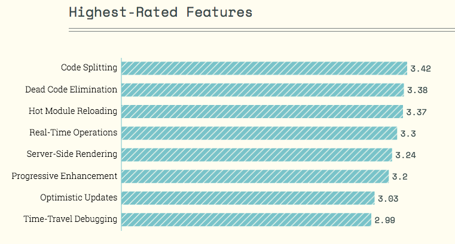
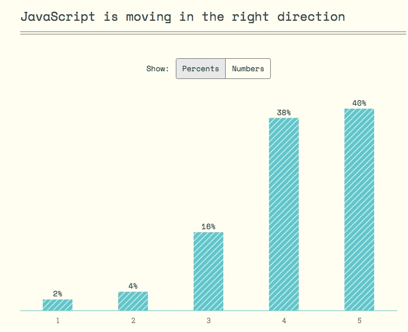

# JavaScript 社区的新语言，新趋势

PS：本文会加工为PPT，在腾讯 AlloyTeam 2016 前端大会，作为 lightning talk（10min）快速分享下~ 

由于项目开发需求我离开过前端一阵子，当我回来重操旧业，立即被一个悲催事实吓到：所有东西都变了！PS: 尽管大部分时间，这种更迭是增量的。 

## fatigue - ppt 
为什么 - 问题越来越复杂了 

我们试图构建在数十种浏览器中运行的应用程序，在数千个不同的设备上看起来正常（不同的屏幕尺寸不同操作系统不同的WebView），对进出信号不好的电梯地铁的糟糕网络环境，甚至是要对盲人等，都能deliver良好的体验。 

有许多可行的方法来实现所有这些目标。 而一个大型的工具生态系统已经出现 - 每一个从不同的角度攻击不同的问题。 

解说趋势就少不了调查问卷来的数据，下面会使用state-of-js的开放数据 

## state of js - 选择篇 
一页ppt展示『 
javascript flavors 
front-end frameworks 
css tools 
build tools 
』 目前的不同选择。相信大家都有所耳闻 

### 语言之选 
当谈论“JavaScript”时，我们不只是在谈论单一的语言：它实际上更像是一个密切相关的表兄弟家庭。 

ES6是新的标准。CoffeeScript已经过去了。新的JavaScript风格即将到来。 
ES6与React，TypeScript与Angular 2，两大框架的站位让趋势更加明朗。 

### 框架之争 
不能错过 React. 
Vue 越来越流行（因为国人？） 
Angular 2 > Angular. 吸引着大量的关注 

### 样式工具 
SASS / SCSS是目前主流。 
CSS Modules 也许值得研究。 
在React中的CSS： - 如果你想构建可以在其他React应用中可使用的可移植React组件，CSS in JavaScript 是你的最佳选择。 除了CSS Modules，还有 Aphrodite。 

### 构建工具 
Webpack和Gulp是闪亮的未来。 
Grunt可能成为过去的东西 

Webpack用户与ES6，React，React Native和Redux重叠 - happy family 
Rollup - 声称生成比Browserify或Webpack更小的包，值得关注。 (成为ionic2的default，声称在 es6 module 使用更好，webpack2 开始集成 tree-shaking) 

## JS 新趋势 

Ex极限编程方法的创造者肯特贝克 说过： 
“让它工作，使它正确，使它快速。”  
“Make it work, make it right, make it fast.” — Kent Beck 
在过去的20年，我们专注于使 Web Works~ 

如果你想知道 JavaScript 社区生态朝着什么方向发展，你可能会去关注现在什么特性和工具正在快速流行被高度评价。 

下面是这些：3代表Nice-to-have的，越高越代表是主要feature，越低代表没那么需要。 
PS：我们会发现新实践新潮流会引入新问题，从而循环往复，推着整个技术圈往前波浪式螺旋的发展。 

The Cambrian explosion of tools you see around you is what rapid progress looks like when it’s not controlled by an Apple or a Microsoft. 
Everyone’s scrambling to make it right, and to make it fast, all at once. 

## 开发构建 

-  Code Splitting 
现在的SPA框架会导致构建的单体应用所有代码被打成bundle一起发给客户端，不少是在特定环境下才会使用到的阻塞的代码的时候。所以社区以 Webpack提供的把 你的代码分离成Chunk，后者可以按需加载，这是 Code Splitting. 在React社区也很流行， Angular 中的lazyload或新路由中的懒加载都能实现。 

-  Dead Code Elimination  
虽然 Code Splitting允许你拆分文件，只发送所需的部分，死代码消除更进一步，挖入你的代码库，以删除不需要的代码。不是导入整个 Undersore 库，可以使用类似于 Rollup 的库遍历源码在bundle打包前把你没有用到的函数方法去掉。以前这是要实现在编译器的优化，现在使用类似于 tree-shaking(  possible when the entire code base is ES6 and uses import statements) 

## 开发调试

- Hot Module Replacement
热模块重新加载意味着能够立即在浏览器中看到JS代码的任何更改，而无需刷新页面。这极大的提升了开发体验
『当您更改文件时，服务器将仅向客户端发送更改（以及可能是其依赖关系）。 “热感知”的模块（导入/要求彼此的文件）然后可以在新代码到达时采取动作来使用新代码。』

-  Time-Travel Debugging 
随着新的类似于Redux这样的状态管理工具的流行，新的编码和调试模式也在涌现。Time-Travel Debugging 就是利用Redux来存储应用的连续状态，从而可以无限的撤销和重做。非常方便如果你改了reducer的代码，被staged的action会被重新全部求值生效。

## 数据交互？

-  Real-Time Operations 
现在现代浏览器和宽带速度，你几乎可以想象过不了几年，realtime ops/ui 成为默认，而不是一个高级功能。
这种在协同工具中在仪表板中是必须的，但是越来越多的譬如Facebook的，之前养成习惯是要刷新页面才，可能很快会变成历史了（00们... ）结合数据库端的livequery/或对oplog的socket.io 广播updates到客户端的状态管理工具处就行了。

-  Optimistic Updates 
而不是在客户端执行接口操作时等待服务器返回，Optimistic Updates（乐观更新）在客户端上模拟预期的返回，并立即显示它。只有在服务器少数情况下-返回异常时修复冲突回滚状态。新框架新的工具库正在让这件事变得容易

-  Offline Usage /w  Service Workers 
我们的应用环境变得苛刻在移动设备中。 上地铁进电梯的使用） - Any app that might conceivably be used from a smartphone should account for the possibility of disconnects, reconnects, and the offline use and data syncing issues that they entail. - 数据拉取是否会reconnect/retry，数据提交是否会重做。Service Workers 会帮助我们更好的实施，这两年浏览器支持情况也会越来越好。 

事实上上面特性结合统一的状态管理工具，实施起来会变得相对容易。

## 语言应用

-  Static Type System 
JavaScript可能没有静态类型系统，但不意味着你不可以使用。Angular 2采用TypeScript和像Flow这样的项目是社区中强类型系统的风向标。这样的好处如果你仅仅只会JavaScript而没有其他语言的基础估计可能体会到。编译前检查来避免runtime error，把一些常规事务延给language platform去做了。

- Isomorphic Architecture /w Server-Side Render 
你应该能够在客户端和服务器之间共享代码。
构建JavaScript应用程序的最大挑战是管理客户端/服务器分割，因此您希望在两个环境之间共享相同的语言和代码，以尽量减少复杂性和上下文切换。

## 光明的未来 - Fatigue Fatigue  

“If you’re going through hell, keep going.” — Winston Churchill 

最后大部分人还是认为JavaScript正在向着一个好的方向去发展： 

## Reference

[2016/04/12 永不停步（折腾死人）的JavaScript 生态](https://github.com/gaohailang/blog/issues/17) 
[JavaScript Fatigue Fatigue ](https://medium.freecodecamp.com/javascript-fatigue-fatigue-66ffb619f6ce#.urjlv2vyz) 
[the state of javascript in 2016](http://stateofjs.com/) 
[2016/04/07 展望 Javascript 2016年的趋势和生态发展](https://github.com/gaohailang/blog/issues/12) 

