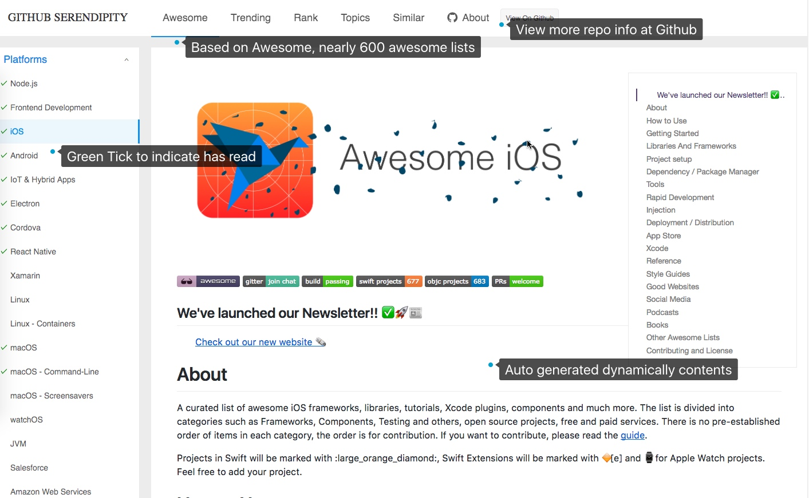
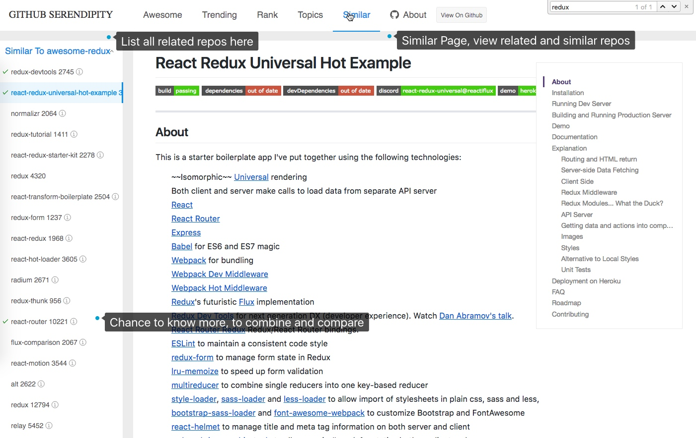
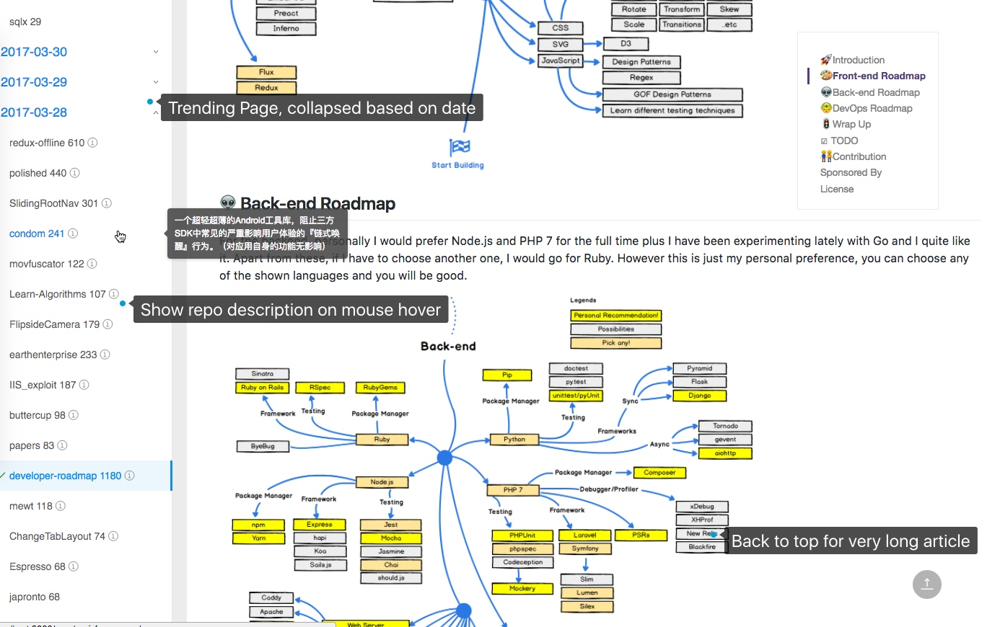
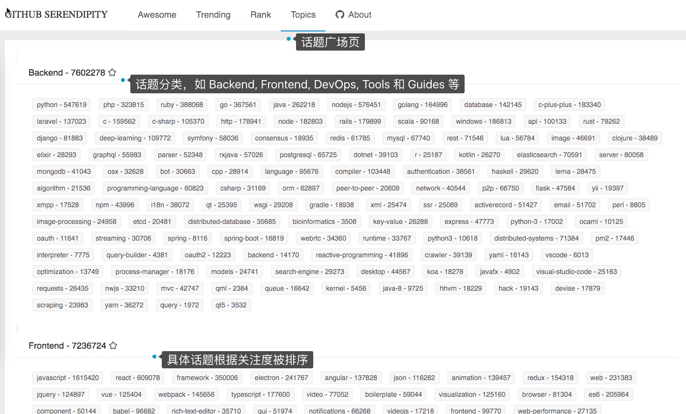
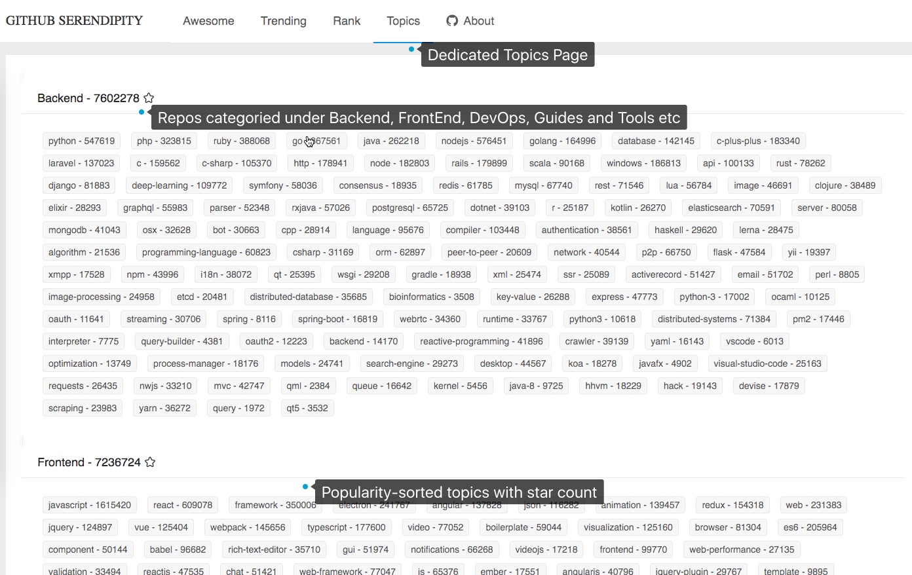

## Background

Programmers who waste their time on Twitter and Facebook, should take some time to navigate through Github Serendipity ~

Serendipity, accidental new discovery; This project(webapp) provides the great opportunity to browse and find high quality repo quickly and elegantly, with trending, rank, awesome, topics, similar dimensions.

Some great data and ideas come from previous other programmers's project, which is addressed at my article [Github Explore Tip]().

the main features:

- Awesome: Show awesome - the Awesome List, the one-stop viewing experience [Awesome - curated list of awesome lists] (https://github.com/sindresorhus/awesome)
- Trending: Show new trends in nearly ten days of time dimension, catch hot trends, keep pace with the times
- Rank: Based on the Trending project in the past year, select Repo with no specific programming language. They are mostly guides and tutorials, it provide a chance to find new ideas from these non-hardcode projects
- Topics: Topics are aggregated from the Backend, FrontEnd, DevOps, Guides, Tools, Design, Mobile and other categories and sorted by popularity. It make you quickly find all the topics popular repos
- Similar: Find similar repos for the current repo, a good chance to know more, to compare and to combine.

## screenshots

- Auto generated dynamically contents
- View more repo info at Github
- Based on Awesome, nearly 600 awesome lists
- Tick to mark read

## 用途

技术人刷微博，朋友圈。不如来刷 Github Serendipity ~

Serendipity, 意外新发现; 巧事; 机缘凑巧; 随意浏览这些高质量的 Repo，可以给我们发现很多可能性『创造生命的惊喜』~

> 花心思花时间选择究竟应该Follow谁，实际上就是在用已有的观念去过滤信息——换言之，就是用自己已有的观念给自己搭建一个新的牢房

- [“为什么我在Twitter上Follow所有Follow我的人”](http://wordpress.lixiaolai.com/archives/8779.html)

> 如若你能做个更开放的人，做个不断学习的人，做个有耐心的人，Serendipity其实是早晚能被你创造出来的东西。祝各位好运！

- [李笑来：如何创造自己生命中的惊喜]()

平时我也自己通过去找寻一些热门和优秀的 Github 项目来看，有很多优秀的工具，具体在文章 [Github Tips - Explore]()有提到。但是它们相互比较独立，发现和浏览体验比较割裂。所以就自己撸了一个用于发现和浏览这些优秀项目的 Side Project

它主要包括

- Awesome：展示 [awesome - Curated list of awesome lists ](https://github.com/sindresorhus/awesome) 中收集的众多 Awesome List，一站式观看体验
- Trending：展示以时间维度的近十天的流行新项目，抓住热点潮流，与时俱进
- Rank：基于过去一年 Trending 中项目，选择那些无特定编程语言的 Repo，多为 Guides 指南和教程，从这些非 hardcode 的项目中发现新思路和创意吧
- Topics：从 Backend，FrontEnd，DevOps，Guides，Tools，Design，Mobile 等分类下看对应的热门话题，快速找到这聚类下的流行项目
- Similar：找到当前项目的类似相关项目，以点带面，对比协同。

## 功能截图

Trending 日期汇总和菜单折叠 Trending repos collapsed based on date
Hover 后展示项目描述信息 Show repo description on mouse hover
滚回到文章顶部 Back to top for very long article

话题广场页面 Dedicated Topics Page
话题分类如 Repos categorized under Backend, FrontEnd, Devops, Guides, Tools etc.
具体话题关注度（基于 Star） Popularity-sorted topics with star count

具体话题页 Specific Topic Page
罗列选定话题下所有热门项目 List all popular repos in the topic area
基于 Star 数量排序 Sort by repo's star count
加该话题的微信群参与讨论和分享 Join Group to discuss and share your opinion

Rank 页，选出近一年非特定编程语言的流行项目 Rank Page, includes all trending repos with non-specific programming language 
多为 Readme 资料汇总和优秀文章指南等. They are mostly great articles and awesome guides
Github, as not only code repository

Similar 页，查看与当前项目类似的相关项目. Similar Page, to view all related and similar repos
发现对比和协同相关项目 Chance to know more, to compare and to combine.

## Todo

- 优化 markdown 解析 - 全支持 github markdown flavor
- 展示浏览历史，提供基于日期学习记录
- 提供基于日期的 diff readme（对比上次浏览的差别）
- 数据 json 化和 update 机制

### 源代码

好久没写前端，第一次写 React，等后续随着不断加些新功能， polish 和 refactor 后再放出

### 引用

all credits go to

- [Ant Design](https://ant.design)
- [react-markdown](https://github.com/rexxars/react-markdown)
- [create-react-app](https://github.com/facebookincubator/create-react-app)
- [awesomelists.top/](http://awesomelists.top/)
- [awesome](https://github.com/sindresorhus/awesome)
- [smart-toc](https://github.com/FallenMax/smart-toc)
- [gitlogs](gitlogs.com)
- [yasiv.com](yasiv.com/github)

