Github Tips 

> 为了更好的持续更新和沟通协作，这里使用 Github 形式沉淀该系列文章

本文先后从下面三个方面，整理和讲诉在这个过程中能够帮助我们更有效率和事半功倍的一些好用却不那么被人熟知的工具。

- [探索项目]()
- [专注项目]()
- [关注开发者]()

大致的讲诉逻辑是：

- 我们首先要在巨多的开源项目中找到哪些优秀并且我们感兴趣的项目，包括了提供最近流行，历史排行，类似项目和特定领域层面；
- 然后我们要专注和学习找到的项目，此时有效率的浏览代码，文章甚至依赖，查看项目信息，在活跃的社区沟通和快速 demo 和尝试试用就变得很重要；
- 最后，我们学习开源项目也是为了成为更好的开发者。通过『观察大师，模仿大师，最终成为大师』，所以要定位到那些厉害的程序员和定期关注他们的动态。

# 探索项目

经常的浏览 Github 对于开拓技术眼界，扩宽自己的知识面，更新自己的技术储备非常有帮助。而高效率的找到好的开源项目，定位到热点技术话题的项目，对我们探索学习非常关键。

## git:logs

它提供了 Trending 流行功能，可以看到基于日期的新晋流行和热点的项目。让最近的技术风潮，特定领域的新动向和新实践等，一览无余。

如果是想对一个特定领域和话题有着更加深入的了解或者想系统结构化的浏览 Github，通过 git:logs topics  页面就可以发现目前最热的技术点。它们利用 Github 提供的项目话题 topics 数据对源源不断的 Github 项目做聚类分析，从而汇总出类似于 Design 设计，Frontend 前端，Backend 后端，Tools 工具，Devops 开发运维，Mobile 移动应用等类别领域，在这些类目下是具体的领域话题。

譬如我们查看 Guides 类别下，可以发现有 awesome，教育，编程，社区，数学，课程，清单，书籍资料，文章等形式整理出来的优秀学习资料。这比去看一些肤浅的技术博客，不够深入的个人实践和分析的文章要有效不少~

PS：项目背后的故事，看 Product Hunt 的页面 (https://www.producthunt.com/posts/git-logs-2, https://www.producthunt.com/posts/awesome-github-topics) 

## AwesomeList top

新进入一个领域，可以在 awesome + <topic> 或者在 awesome list 中查找相应的 list。大家都知道近一两年 Github 非常流行 awesome-<topic> 类型的项目，它就是把特定领域话题下信息爆炸的众多质量参差不齐的资源（包括文章教程，开源项目工具和服务等）人为的手工整理出。而 awesome list 又是汇总和挑选这些各领域 awesome 的列表（指环王？！one ring to rule them all）

PS：浏览 AweSome list 目前不够完善的一点是，对于录入的链接，存在时效性延迟和 Maintainer 个人的喜好，同时没法对 list 中的 link 除了 intro，没有更多的信息展示（如 repo 最新的更新，Star 数，Issues 数等）。还有一份 Awesome 或大而全的 Readme 可能因为时常更新，后续回顾的时候比较难把握住内容的增删改。可以利用 Github 的 Compare 功能对比两个时间段的更新，快速可视化。

这个项目也是我最终做 [Github Serendipity](https://github-serendipity.github.io) 最初的灵感来源和优化方向~

它提供项目搜索，文章大纲目录和文章类搜索功能~

## Yasiv - similar repo

了解了一个项目后，希望找到类似项目从而更好的对比和选择。这也是在技术选型和方案对比中比较关键步骤，同时这也是以点带面的了解这一领域中相关技术的方式。背后的算法应该就算是协同过滤，大家应该对电商类网站的『猜你喜欢，购买相似产品的用户也购买』等产品特性中早已经耳濡目染的啤酒尿布

## Githunt

Githunt，它是 Chrome 浏览器，可以替换 Chrome 的新 tab 页为 Github 流行项目

## [deck](https://tilfin.github.io/deck/)

'Deck' 提供对 Github 项目事件动态的多栏时间流查看工具

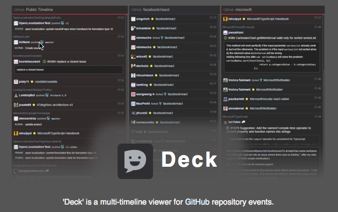

综上所述：

新进入一个领域，可以在 awesome + <topic> 或者在 awesome list 中查找相应的 list。当然也可以在 git:logs categories/topics 中快速定位该领域下的热点和优秀开源项目。同时，也可以使用类似于 Yasiv 按图索骥以点带面找到和已知项目相似的仓库，进行学习。平时可以通过 githunt/deck 等资讯或动态流保持对技术 Sense~

# 专注项目

发现项目只是第一步，最重要的是对发现的项目进入深入学习，项目使用和回馈社区。

## Gitter

Gitter是一个聊天和网络平台，有助于通过消息，内容和发现来管理，增长和连接社区（Slack 的替代方案），目前已经被 Gitlab 收购。
这里展示了社区兴旺发达，而不是简单的静态的不及时的 Github issues，用过 Slack 此类工具的就会知道及时沟通的 IM 和便于沉淀内容社区机制，对于一个刚学习一项开源技术和框架工具带来的帮助是有多大了~

提供插件 [Gitter Helper](https://chrome.google.com/webstore/detail/gitter-helper-for-github/apahfabdianobklhejoojcpmoegaolpi) 可以轻松查看 GitHub 项目是否具有Gitter 空间和传送门链接

现在不少流行的开源项目，都有非常热闹和旺盛的 Gitter 社区，如 keystone，gogs, eslint 等，在碰到棘手问题查找无果的时候，不要忘记到这里来寻求帮助~

## [Smart TOC](https://chrome.google.com/webstore/detail/smart-toc/lifgeihcfpkmmlfjbailfpfhbahhibba)

通过给正在阅读的文章添加动态的目录，来帮助更好的吸收和浏览长文章和文档。通过触手可及的目录，我们对浏览的长文有个大纲式的提纲挈领般的掌控，克服对未知内容的恐惧，便于从整体到局部细节的专研。

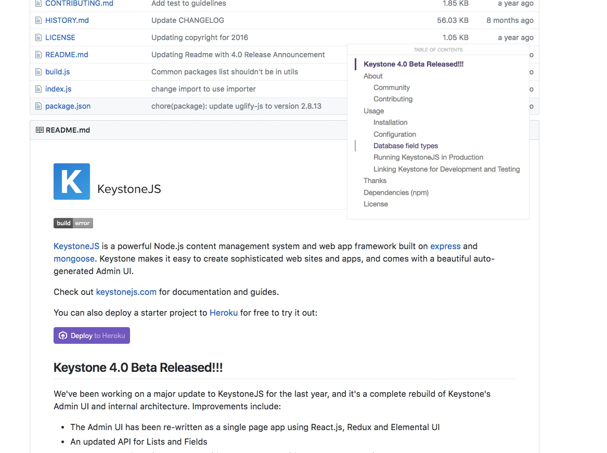

## Package Hub

通过浏览器插件的形式，当用户在浏览 Github 项目时，在说明页 Readme 底部添加项目的包依赖说明。它支持多种包管理器，如 npm(Node.js), pip(Python), gem(Ruby) 等。它的工作原理是识别出项目中的 package 文件，从而从中提取依赖，并且展示依赖的版本和说明描述等
PS：对了解该项目中依赖一目了然，对一些依赖包的简单说明便于浏览项目源码时能有不错的对应。

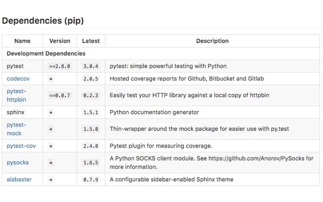

传送门：

- [安装插件](https://chrome.google.com/webstore/detail/package-hub/hnnjnbmjanpeoeapjllonejjgoonilal)
- [查看源码](https://github.com/BrainMaestro/packagehub)

## Octotree

它是浏览器扩展（Chrome，Firefox，Opera和Safari），在 GitHub 左侧展示文件导航，使目录结构一目了然，这对探索和浏览项目源码非常有帮助，就像是在编辑器/IDE 中打开一样，从而不必将每个单独的代码 Git 库拉取到机器磁盘上才能方便的浏览代码，截图如下：

传送门：

- [安装插件](https://chrome.google.com/webstore/detail/octotree/bkhaagjahfmjljalopjnoealnfndnagc?hl=en-US)
- [查看源码](https://github.com/buunguyen/octotree)

## [OctoLink](https://github.com/octo-linker/chrome-extension/)

它是浏览器插件，安装后让开发者更加有效率的在 Github 页面代码区域跳转（vim ctags）
大部分项目包含很多文件模块和第三方依赖，它们通过特定的语法被引用和导入（如 include, require, import 等），而依赖关系可能被罗列在项目的 manifest 文件中（如 package.json, requirements.txt, Gemfile 等），OctoLink 使得这些引用可以被点击跳转，而不用传统的去复制后搜索。

从最早仅仅支持 JavaScript，到现在支持大部分的编程语言，让它的可用性大大提高。

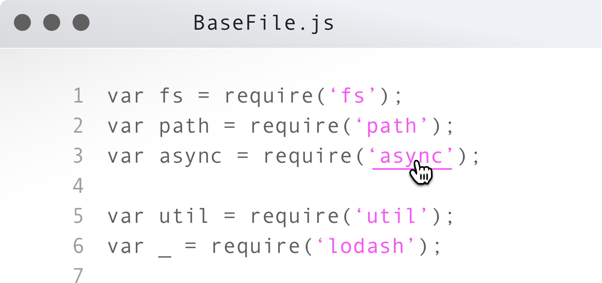

传送门：

- [安装插件](https://chrome.google.com/webstore/detail/octo-linker/jlmafbaeoofdegohdhinkhilhclaklkp)
- [查看源码](https://github.com/OctoLinker/browser-extension)

## Refined GitHub & Github Plus

提供如展示项目大小，文件大小和快速复制文件内容，单独下载文件等功能的增强的浏览器插件

传送门：

- [安装插件](https://chrome.google.com/webstore/detail/github-plus/anlikcnbgdeidpacdbdljnabclhahhmd)
- [查看源码](https://github.com/softvar/github-plus)

其他：
refined-github，在使用 Github 过程中对那些不太直观和方便的地方进行 tweak 修改。

- [查看源码](https://github.com/sindresorhus/refined-github)
- [安装插件](https://chrome.google.com/webstore/detail/refined-github/hlepfoohegkhhmjieoechaddaejaokhf)

## Lovely forks

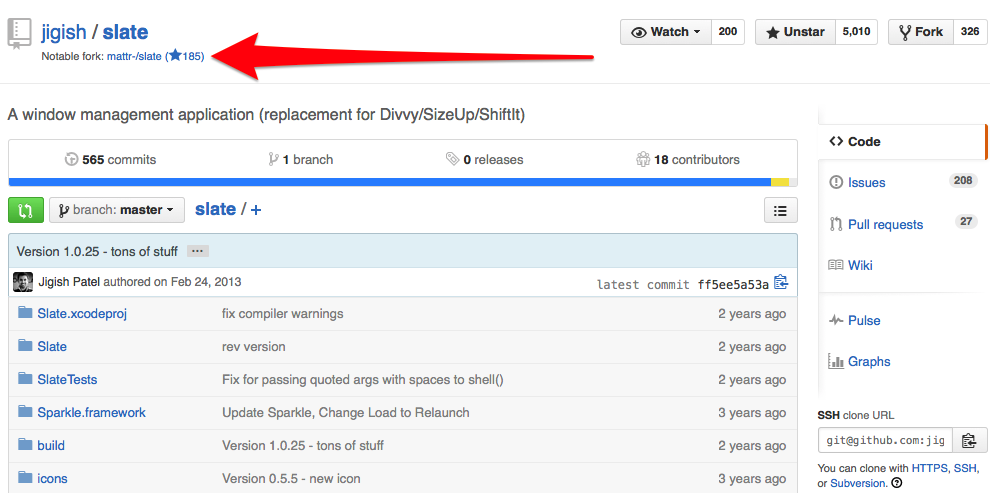

钻研一个具体项目，肯定会时不时冒出因为增加和调整特性从而对它有做修改的冲动。
该浏览器插件让你直观的查看到 Github 项目中值得注意的分支。有的项目被原作者遗弃，而它新的发展在其他被 fork 出来的分支上进行。糟糕的是，旧项目通常具有较高的搜索引擎排名和流量，这让被 fork 出被社区参与持续发展的项目很难被发现。所以插件在旧项目名称下提供那些值得被关注的分支~

传送门：

- [安装插件](https://chrome.google.com/webstore/detail/lovely-forks/ialbpcipalajnakfondkflpkagbkdoib)
- [查看源码](https://github.com/musically-ut/lovely-forks)

## Gitscout

提供界面美观功能易用的 Github Issues Mac 客户端，浏览组织和管理你参与项目和感兴趣项目的 Github Issues. [传送门](https://gitscout.com)

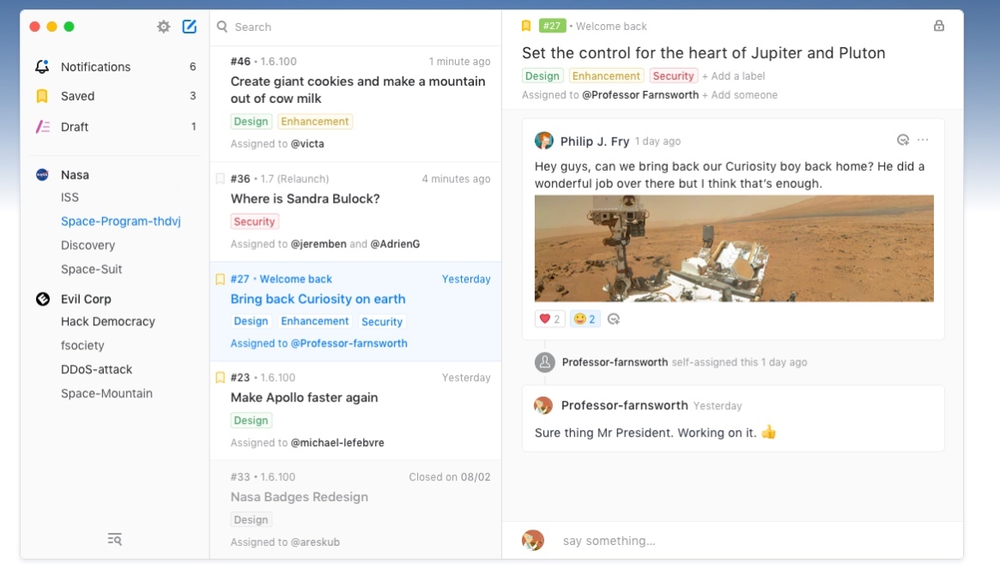

## Zenhub

为 Github 提供项目管理和敏捷开发功能整合的浏览器插件。如：多项目支持的高级任务板，整合里程碑、issues 和 PR 管理的 reporting 工具集，工作任务分为 Todo、Backlog、In Progress 等列表等。[安装插件](https://chrome.google.com/webstore/detail/zenhub-for-github/ogcgkffhplmphkaahpmffcafajaocjbd)

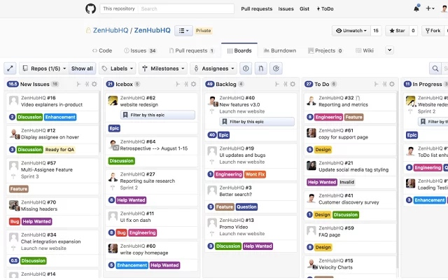

PS：最近 Github 也开发了自己的 [Github Projects](https://github.com/features)，来给项目任务加入类似于 Trello 的管理功能.

## RunKit

Node 试验台，几乎预装了所有 npm 包，立即创建自己的 API。

我们在浏览开源项目的时候，肯定想马上 clone 项目下来撩起袖子马上开搞。但是环境搭建，依赖拉取，文件下载等让这个尝试的成本变高，所以这类工具可以显著降低成本，让我们更多更快的原型~ [传送门](https://runkit.com/home)

	•	查看项目和依赖库的文档
	•	直接 require npm 上的第三方项目，无需等待下载
	•	使用最新的 ES6 语法，无需  Babel 或 nvm 最新 node engine
	•	立即试用 async/await 撸直回调代码
	

类似项目有

- [Floyd](https://www.floydhub.com/#examples): Zero Setup Deep Learning
- [codepon project](codepen.io/pro/projects/): Zero setup, full-featured front end web development environment, right here in your web browser.

## Git Notify -

Web 服务，让你长期对所关注项目保持专注和被通知更新汇总，从而每天/每周对它所有的代码提交、分支创建和 issues 讨论完全掌握。[传送门](https://gitnotify.com/home)

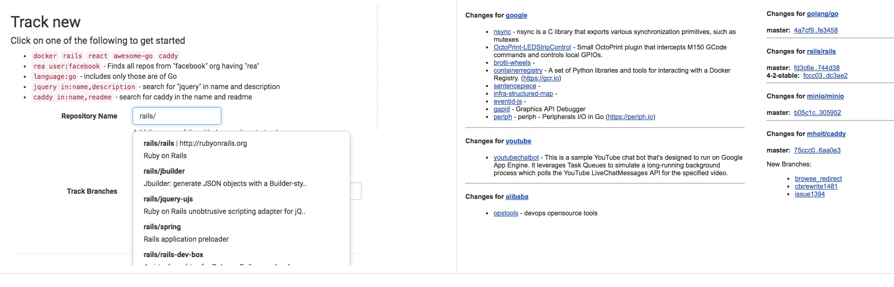

## Tip - Comparing Changes

我们关注的开源项目，可能在快速迭代和发展。当我们需要深入研究该项目时，从项目的 changelog 中可以快速掌握它的迭代更新的具体变化和内容。同时，如果一段时间未关注该项目后，可以通过 Github 提供的 Comparing 功能对比两个不同的分支（提交）等，比较方便的是。这里的分支可以设置为相对日期为对比锚点。譬如上个月我看了[system-design-primer](https://github.com/donnemartin/system-design-primer)，通读一变后，觉得收获不少。那么一个月后我再次浏览该文档时，肯定希望可以快速查看在一段时间内的变化，此时基于相对日期的 Comparing 对比就非常方便了~ [demo](https://github.com/donnemartin/system-design-primer/commit/0c8be40660b7ed7262ad1073e2ea794d9d1cbb6d#diff-04c6e90faac2675aa89e2176d2eec7d8)

# 探寻 Hacker

开源项目在 Github 上是了解开源软件的一个纬度，而优秀项目背后的作者（们）：那些传说中的高效10x 程序员是另一个纬度。我们对编程大牛的技术成长和技术动向（看他们参与的项目，加星的项目，提 PR/Issue 的项目），来实现观察大师，模仿大师，最后成为大师的套路。

## CoderStats

它是用于分析和展示程序员在开源项目（Github）的投入和产出等统计信息的服务

下面是 Tj 大神的信息，[传送门]((http://coderstats.net/github/tj/))：

通过它提供的 Chrome 插件，可以在当前浏览的 Github 作者个人资料页看到链接入口到 CoderStats 的页面
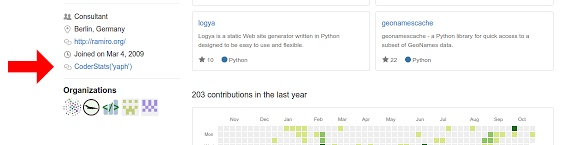

## 各类 Rank

[github-ranking](https://github-ranking.com/)
提供针对于 Github 上用户，组织和代码仓库的排序

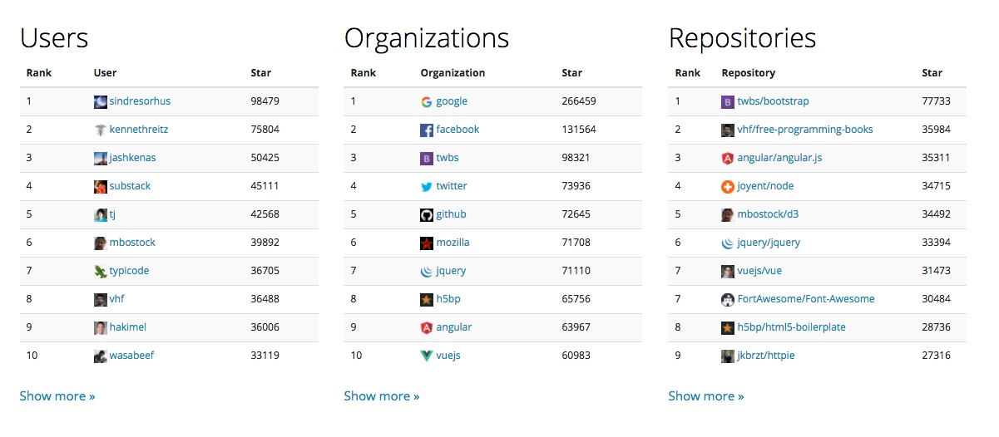

[git-awards](http://git-awards.com)
提供不同语言和不同地区纬度下的优秀 Githuber 和你在各类语言和地区中的排名

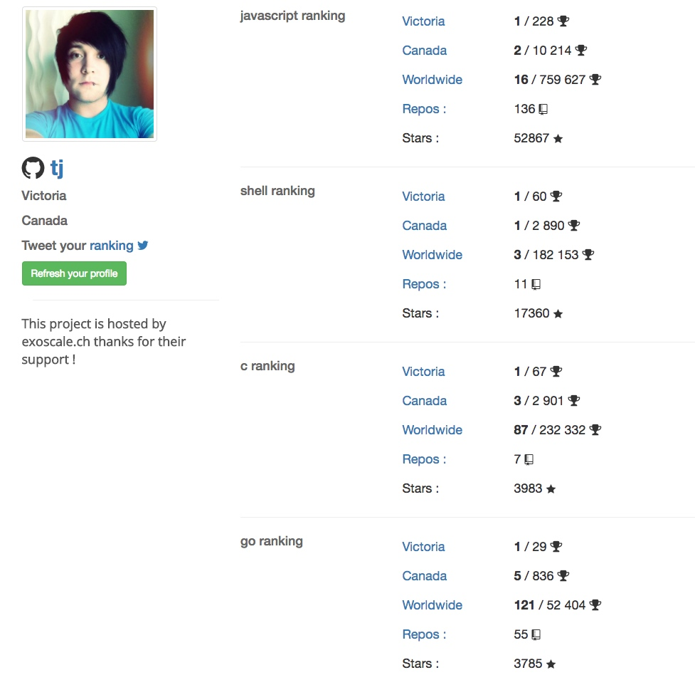

## Twitter for Githuber

Twitter for GitHub - 在他们的Github 个人资料页面上显示对应的 Twitter

## 可视化：用户在 Github 中对各语言参与情况

[Github 语言投入情况分析](https://starred.jjperezaguinaga.com/), 该项目通过分析你在一年中的对不同编程语言的 Star 加星行为来可视化这样的统计信息。非常直观的展示了一年中我们的动向和学习情况。[传送门：背后的故事](https://medium.freecodecamp.com/data-visualization-what-languages-got-the-most-github-stars-in-2016-a4e3908a9532?source=false---------7)

放出 Tj 大神的一年状态，持续和逐渐走高的 Golang 关注。
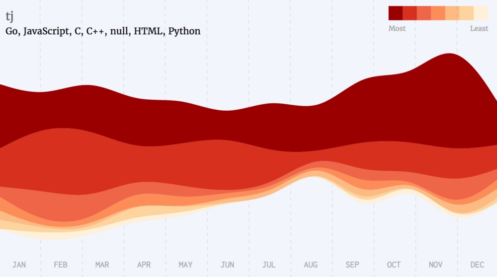

同时也是了解自己的一个方法，譬如下图是我的：

其中五月开始到八月，是我在公司里面接手一个旧的 Java 项目时间段，没有足够的时间来自我学习和浏览  Github。而在年底，我开始对 Golang 语言相关项目开始加到了投入和学习，通过这个主题河流图（参考 ECharts 的说法），一目了然。果然是我们的数据定义了我们（Our data identify us）。

结尾
以上不少工具是我们在浏览 Product Hunt，浏览自己的 Github Serendipity 中发现，希望大家有用，我们一起利用好 Github，成为优秀的开发者。

广告：Best Way to Browser Github - [github-serendipity](https://github.com/github-serendipity/github-serendipity.github.io)

