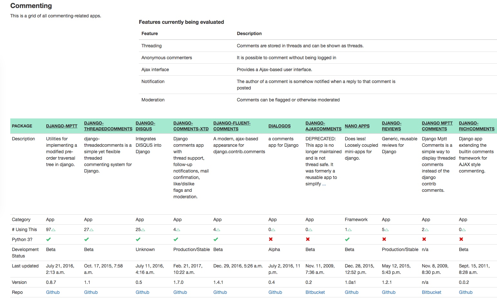
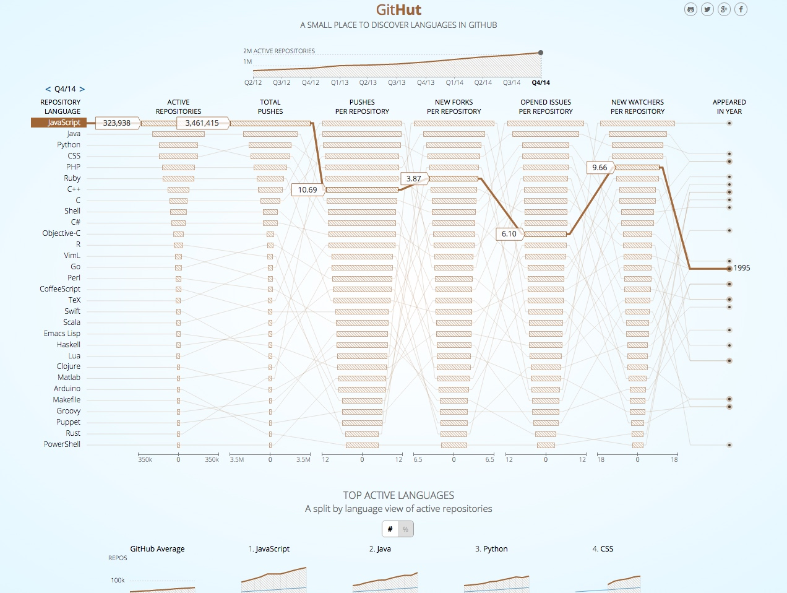
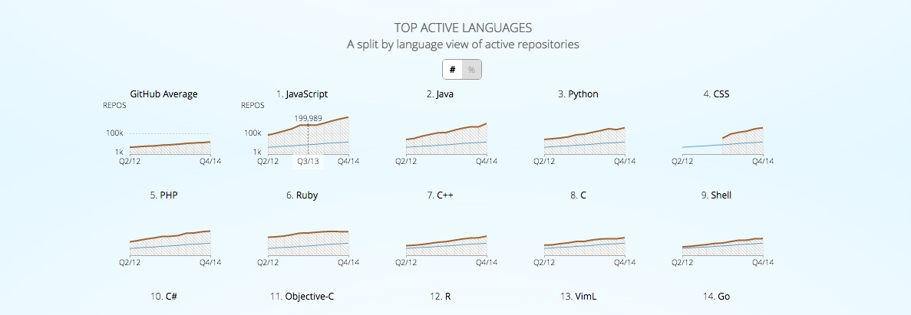

Django Packages is a directory of reusable apps, sites, tools, and more for your Django projects. https://djangopackages.org/
Grids let you compare Django packages to each other. A grid comes with a number of default items compared, but you can add more features in order to get a more specific comparison.
For now, we are trying out Django Packages without the traditional tagging system, because we think that grids give us a lot more specificity.

GitHut http://githut.info/
A SMALL PLACE TO DISCOVER LANGUAGES IN GITHUB
尽管数据过期了（到14年底），但是还是会帮我们发现很多有趣的信息。 GitHub Archive dataset is also available via Google BigQuery. 
The quantitative data used in GitHut is collected from GitHub Archive. The data is updated on a quarterly basis.

Repo Badge

https://img.shields.io/github/downloads/atom/atom/total.svg

https://img.shields.io/github/contributors/cdnjs/cdnjs.svg
https://img.shields.io/github/issues-pr/cdnjs/cdnjs.svg
https://img.shields.io/github/issues/badges/shields.svg
https://img.shields.io/github/stars/facebookincubator/create-react-app.svg
https://img.shields.io/gitter/room/nwjs/nw.js.svg

Todo: 反应 repo commits frequency 的 badge
https://github.com/badges/shields/

If your GitHub badge errors, it might be because you hit GitHub's rate limits.
You can increase Shields.io's rate limit by going to this page to add Shields as a GitHub application on your GitHub account.
https://img.shields.io/github-auth

