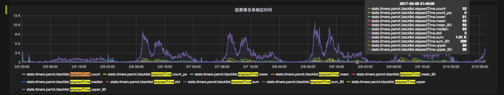
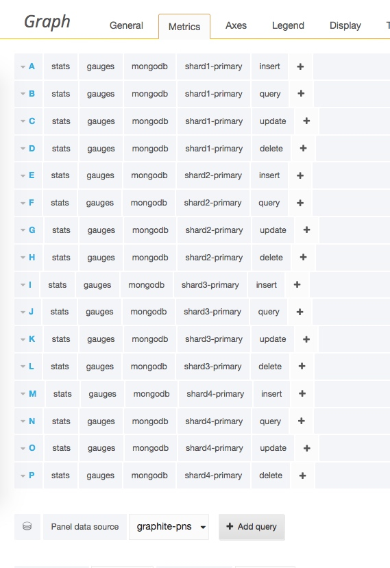
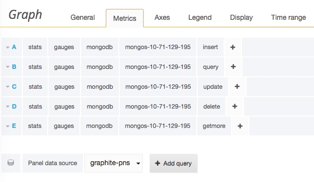

股票黑名单 /parrot/io/periphery/censor.js
timing('blacklist.elapsedTime', response.elapsedTime);

socket.io 异常 /parrot/io/request-handler.js

jobs/process-monitor-job:
gauge('instance.cpu.' + body.replace(/\./g, '_'), _.round(stat.cpu));
instance.mem
请求 http://169.254.169.254/latest/meta-data/public-ipv4

jobs/update-group-message-count-job:
gauge('chat.group.hour', sum);
gauge('chat.private.hour', sum);
使用mongodb find, distinct, count 等

Route: api/broadcast::
db.sendMessage.error
api.lightning.broadcast
db.sendMessage.broadcast.timeout
api.broadcast
api.cache.broadcast
cache.broadcast.to.length

无效的：
api.revoke

聊天中间件评估

