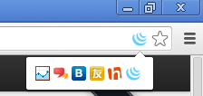
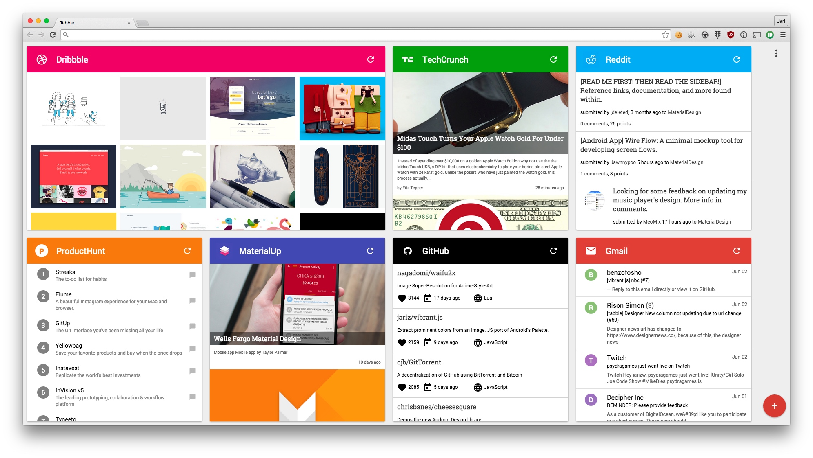
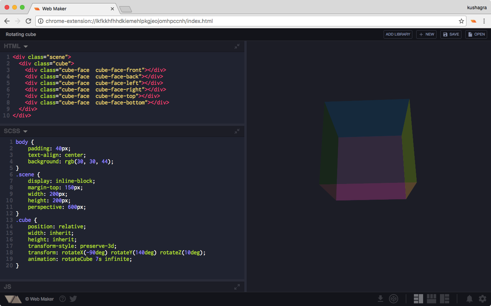
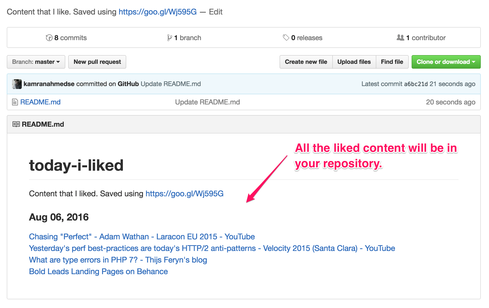

Serendipity 漫谈

stdlib: Standard library for JavaScript. 给 JavaScript 提供a collection of robust, high performance libraries for numeric computing, streams, and more.
http://github.com/stdlib-js/stdlib

date-fns: ike lodash for dates. It has 140+ functions for all occasions.date-fns provides the most comprehensive, yet simple and consistent toolset for manipulating JavaScript dates in a browser & Node.js.

you-don't-need-lodash-underscore: http://github.com/you-dont-need/You-Dont-Need-Lodash-Underscore However, when you are targeting modern browsers, you may find out that there are many methods which are already supported natively thanks to ECMAScript5 [ES5] and ECMAScript2015 [ES6]. 之前对 Lodash 依赖还挺重的，但是在 ES6 后后续新 JavaScript 语法，但是的确不少操作可以用简单的原生形式实现

Spectre.css： lightweight, responsive and modern CSS framework for faster and extensible development.http://github.com/picturepan2/spectre

tqdm，结合 Loop 展示 ProgressBar。Python

saws - aws cli

haxor-news, haxor-news brings Hacker News to the terminal, allowing you to view/filter the following without leaving your command line:
		

Hulk DoS tool - golang 版本（很好利用 goroutine）来allows golang version better consume resources and got much higher connection pool on the same hardware than Python version can.
HULKMAXPROCS=4096 hulk -site http://example.com 2>/tmp/errlog

Retire.js
 a plethora of JavaScript libraries for use on the Web and in Node.JS apps out there. This greatly simplifies development,but we need to stay up-to-date on security fixes. "Using Components with Known Vulnerabilities" to help you detect the use of JS-library versions with known vulnerabilities. 通过 command-line scanner, chrome extension 等形式提供

mirage: The Elasticsearch query DSL supports 100+ query APIs ranging from full-text search, numeric range filters, geolocation queries to nested and span queries. Mirage is a modern, open-source web based query explorer for Elasticsearch.

clockwork: Clockwork is a Chrome extension for PHP development, extending Developer Tools with a new panel providing all kinds of information useful for debugging and profiling your PHP applications, including information about request, headers, get and post data, cookies, session data, database queries, routes, visualisation of application runtime and more.

pangu.js 每次看到網頁上的中文字和英文、數字、符號擠在一塊，就會坐立難安，忍不住想在它們之間加個空格。它會自動替你在網頁中所有的中文字和半形的英文、數字、符號之間插入空白。『有研究顯示，打字的時候不喜歡在中文和英文之間加空格的人，感情路都走得很辛苦』

crx-selection-translate: 划词翻译，同时支持 pdf。我目前使用的 anki 整合版本的划词助手也挺好用的~

chromesnifferplus: Sniff web framework and javascript libraries run on browsing website.

SnappySnippet: Chrome/Chromium extension that allows easy CSS+HTML extraction of specific DOM element. Created snippet can be then exported to CodePen, jsFiddle or JS Bin with one click. http://github.com/kdzwinel/SnappySnippet

githunt Chrome Extension - Replace your new tab with trending Github repositories https://goo.gl/e7YP1h

Tabbie: http://github.com/jariz/tabbie
Tabbie keeps you informed, inspired, and up to date through it's beautiful and customizable columns. Tabbie replaces your 'new tab' page with your favorite websites. Choose exactly what content you want to see. （从 RSS 源如 Dribble, ProductHunt, Github, HackerNews 等信息源建立自己关注的专栏，每次 new tabs 查看，获得灵感）

netmonitor: extension which shows background network activity of web pages after they are loaded.A lot of web pages use background network requests for tracking user actions and sending data to remote servers, lazily loading heavy assets, etc., and all that goes unnoticed by the user. Ideally, the browser's "loading icon" should spin for those requests as well, but since it doesn't, I wrote this extension.

web-maker
Web-Maker is a chrome extension that converts your Chrome tabs into an offline playground for your web experiments. Something like CodePen or JSFiddle, but much more faster and works offline being local on your system.

console importer
Easily import JS and CSS resources from Chrome console, with one command.

$i('https://cdnjs.cloudflare.com/ajax/libs/jquery/3.1.1/jquery.min.js')
$i('jquery@2')
$i('https://maxcdn.bootstrapcdn.com/bootstrap/3.3.7/css/bootstrap.min.css')
two functions $i.unpkg and $i.cdnjs which could be used to import resources from specific CDN.

Coder's Calendar
Android App and browser extensions for competitive programming enthusiasts. Shows a list of live & upcoming coding contests taking place in various popular competitive programming websites with the facility to add them to your google calender.

like on git.
Just click a button and the link will be committed to your repository under the current date.

lovely forks - to help you notice notable forks of a Github project.

## Student Developer Pack
https://education.github.com/pack?ref=producthunt
The best developer tools, free for students

for most students, real world tools can be cost prohibitive. That's why we created the GitHub Student Developer Pack with some of our partners and friends: to give students free access to the best developer tools in one place so they can learn by doing.

