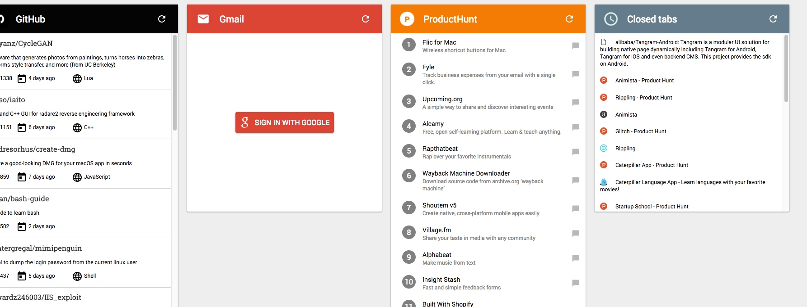
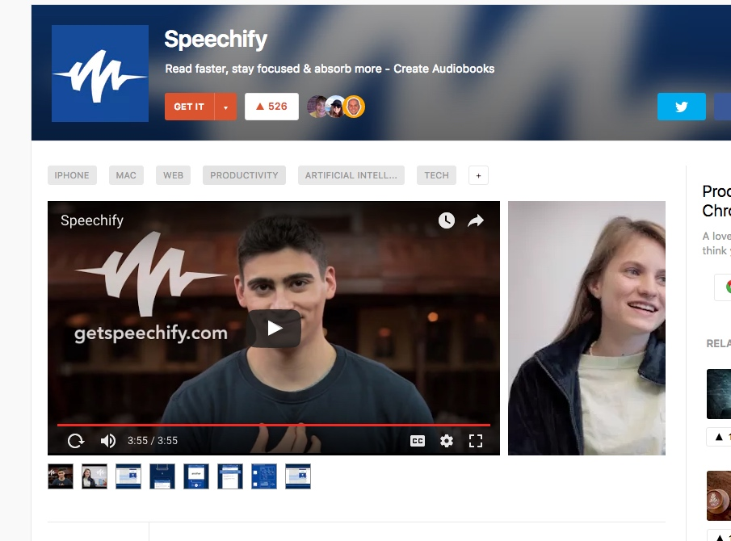
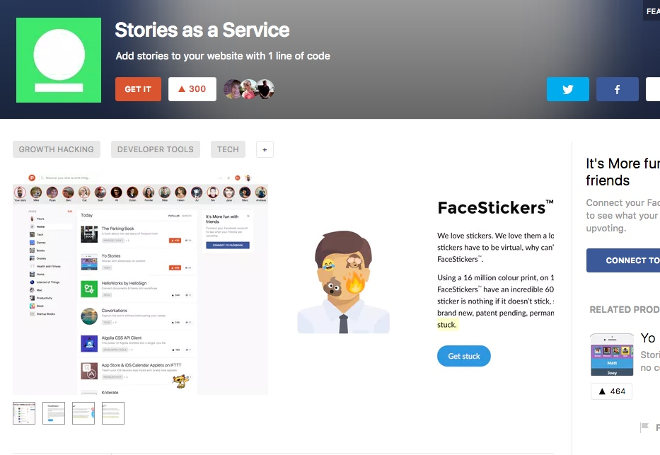

Illustrated summaries of bestselling nonfiction books

a smarter place to save anything you find on the internet
1 save any webpage
2 auto categorized
3 
https://stash.ai/skip.html?email=sivagao@126.com （通过隐身窗口打开）

tabbie 一般般。一些经常访问的可以 pinned tabs，然后在 tobby 中设置固定的 folder 便于快捷打开（同时这种 columns 注意力而且在 new tab 的，链接跳转打开页面成本高）

raindrop.io

收费内容：
Nested collections
Create as any number of nested collections.	
1 GB of new uploads each month
Images (PNG, JPEG, GIF). Soon: PDF, Mark Down

Dropbox backup
Backup the bookmarks and content in your Dropbox account.

learn to prototype.
The Free plan is perfect if you're looking to learn the basics of prototyping. You might be a student just starting out, a designer looking to level-up your prototyping skills or a casual prototyper.
With Atomic free you’ll have access to all features, however be limited to one active prototype at a time

What’s the recipe for a successful mobile startup? We believe it’s a combination of three basic ingredients – business strategy, marketing, and team. Each of these ingredients shapes the future of your mobile business.

There’s nothing magical about MakeSuccessfulApp; it’s a simple ten-question quiz designed to identify the “state” of your ingredients, so to speak, and thereby to assess the probability of your app’s success. As a bonus, after completing this little quiz we’ll offer you some advice on what you can do to improve your marketing, develop your business strategy, and strengthen your team.

So do you have what it takes to build a successful mobile application? Try out MakeSuccessfulApp and find out

每天接到一个电话来问你做了什么，然后语音记录等

