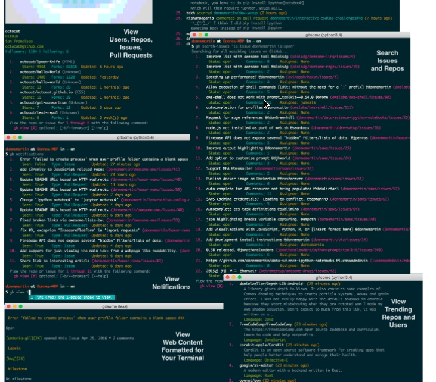
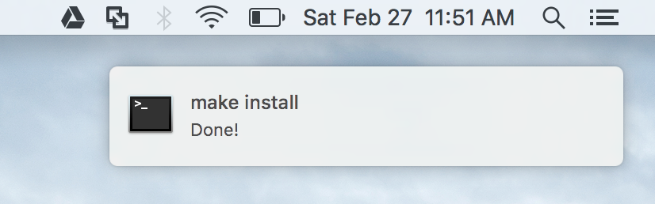

## commitizen
http://github.com/commitizen/cz-cli

When you commit with Commitizen, you'll be prompted to fill out any required commit fields at commit time

to use AngularJS's commit message convention also known as conventional-changelog.
 

## gitsome
http://github.com/donnemartin/gitsome
git 命令太多（150+ commands，若干的选项），但是用类似于 sourcetree 等 GUI 心里没安全感？
和 Github 整合良好，在命令查看 Repo 信息，issues 等

## imdone-atom

Turn your TODO comments into a task board and let imdone.io do your issue tracking so you can stay in the zone.
Just use alt+t while editing a file to see your projects board.

把项目中标注 Todo 的提取出来，并且以 dashboard 形式展示

## noti

Trigger notifications when a process completes.
Never sit and wait for some long-running process to finish! noti will alert you when it's done—on your computer or smartphone—so you can stop worrying about constantly checking the terminal.

### 安装，配置和使用

brew install noti

go get -u github.com/variadico/noti/cmd/noti

配置通知的类型，除了系统原生的方式，还支持 Slack, HipChat, Pushbullet 等

Put noti at the beginning or end of your regular commands.

If you already started a command, but forgot to use noti, then you can do this to get notified when that process' PID disappears.
noti -pwatch $(pgrep docker-machine)

