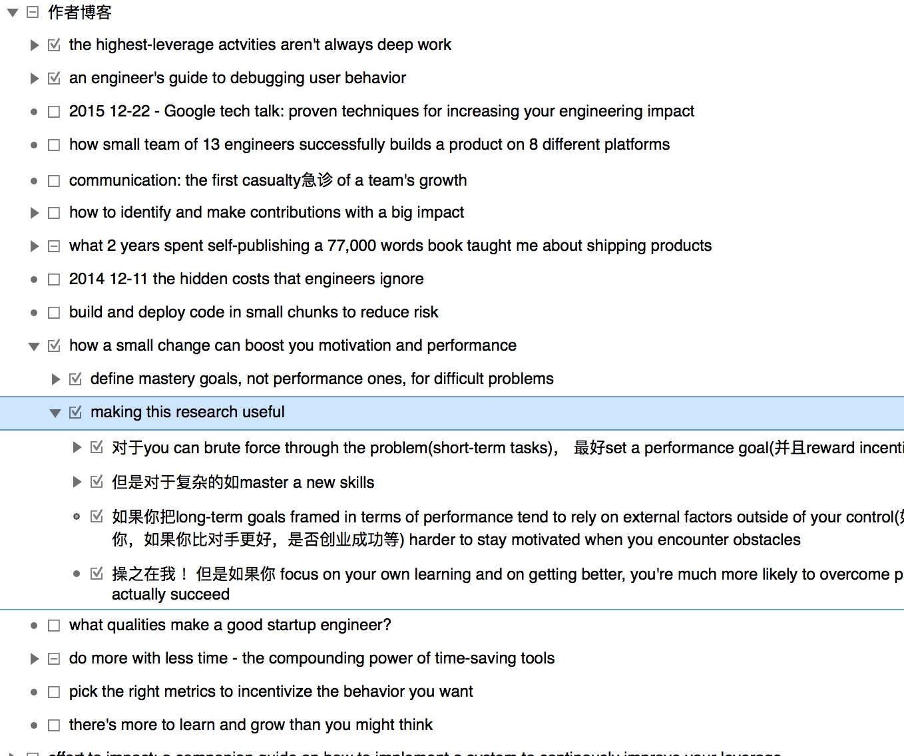

首先，作者有本书[The Effective Engineer](https://www.theeffectiveengineer.com/book/sample-chapter)。主要亮点是一手的最新的故事和技巧从硅谷创业公司，很多技巧非常实用和有帮助。譬如顶级的软件技术公司，如 Google, Facebook, Twitter, 和 LinkedIn 这些家喻户晓的; 快速成长的中型独角兽公司，如 Dropbox, Square, Box, Airbnb, 和 Etsy; 还有那些酷炫的初创公司，如 Reddit, Stripe, Instagram, 和 Lyft。

作者的书其实是从他两三年前的博客中抽取的：

| 书籍截图 | 作者博客  | 
| :------------ |:---------------:| 
|| |

这篇文章主要是针对作者在谷歌内部的 Google Talk做的分享，进行总结和整理。[传送门]( https://www.youtube.com/watch?v=BnIz7H5ruy0)

那些牛逼的工程师，哪些被提拔为高级工程师或公司里团队leader的哪些，能产出比起其他程序员的10x的影响力，不是通过工作10倍的时间达成的。而是因为他们做了高杠杆的事情。那么有哪些高杠杆的事情呢？

## 那五件高投资回报率高杠杆的事
把那些优先级高的项目和任务完成，来产出影响力

### 1. 为学习优化

学习效率成倍提升，像个复利指数曲线。
你学的越多，以后学到越快。
这一块也是老生常谈来，不清楚的可以结合阅读[李笑来的文章](http://mp.weixin.qq.com/s?__biz=MzAxNzI4MTMwMw==&mid=401199907&idx=1&sn=0d5395ca0f0737afefc72a48c7ecd278&scene=21#wechat_redirect)

### 2. 为迭代速度投资

在日常工具上的投资来提升加快迭代速度。我发现那些成功的工程师们，绝大多数都是会花时间为自己写工具的人。作者建议花日常工作1/3的时间去写工具，那些用于监控，用于让调试更容易的，用于把多个系统粘合在一起的工具。譬如你需要调一个 Android 特定页面 activity 下的具体按钮的逻辑，你可以写个启动命令来直接进入改页面而不是APP 启动后通过多个 也买呢跳转才能进入。
每隔一段时间就回顾开发过程中哪些事或瓶颈需要通过工具和改善流程（workflow）来优化的

### 3. 有效迭代验证你的想法

如果验证一个功能特性是否有效，你不一定要真正先开发完它们。
作者然后介绍之前做的电商页无限滚动加载的 case，事实上费了大量功夫开发的这个功能并没有提升预期的用户购买率，反而降低了（可能是因为选择更多，导致选择困难症？）
所以通过实施很多的 AB 测试的这种以试验驱动的产品设计方法（experiment-driven product design）是非常有效的工具。把一个很大的猜想切分成很多小的可以单独测试的假设，从而验证要不要一步步继续实施和执行。
开发那些最小可用产品。Google 也通过很多 AB 测试来优化关于速度，性能，可扩展性上。
工程师在无用功上花了不少时间。所以在撩开袖子大搞之前，花10%的时间验证下你的假设是否成立。

### 4. 减少维护成本

很多工程师被（糟糕的）老项目的维护拖累的无法去开发新项目新功能。
更少时间来维护项目和fix bugs更多时间来构建发布新的特性和功能
instagram（被 Facebook 高价收购时才5个人技术团队服务亿万用户）的内部信条 - 这是不是我们目前能做的最简单的事情！
复杂度后面是长期的维护成本，很多工程师的方案被产品挑战后，往往会选择一个看起来复杂度就很高的方案来显示自己的高水平。

- 代码复杂度
- 系统复杂度
- 产品复杂度
- 组织复杂度

譬如系统复杂度导致很多技术债，不要乱用各种存储方案和组件，简单的加机器很多时候看来上成本最低的。
时刻问自己『这是不是解决这个问题最简单的方案』

### 5. 构建良好的工程师文化

想想看你喜欢在什么氛围的团队和组织内工作，你为什么离开上一家公司？
我们喜欢在那些高产出的事情上花时间，而不是一个没有远景非常低效的项目，这样没有成就感。
所以在团队内部形成那样的氛围：

- 我们的工作流是否需要工具来简化
- 我们需要学习什么来提升投资未来

## Q&A

在主要观点讲诉完后，作者开始 Q&A 环节

- 大公司/创业团队如何来降低组织复杂度
- 如何做一个高效的导师
- 如何让经理统一出处理技术债
- 跨部门合作如何推动
- 关于测试用户编写 - 写那些最容易写最容易有效果的测试用例
 - 有风险的复杂的risky
 - 很多人要修改的change a lot
 - 被常用的功能more traffic

